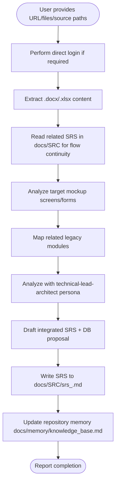
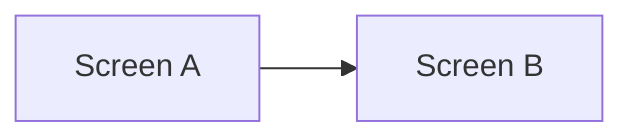
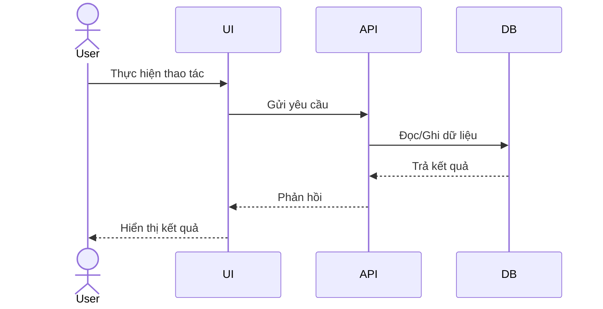
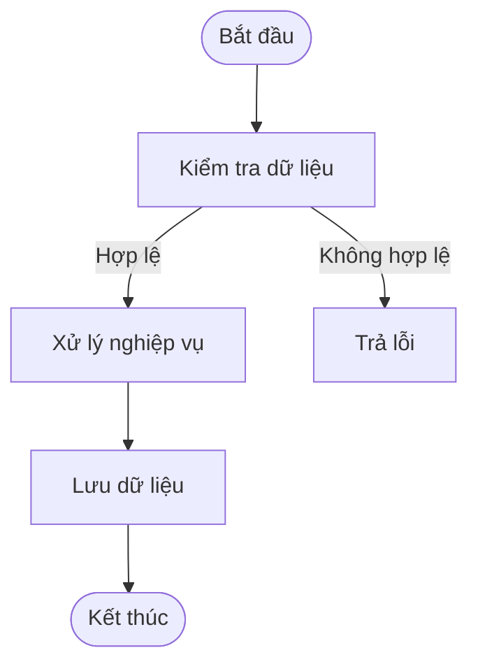

# CM Analyze

## Cursor adaptation

- **Single agent only:** Run steps in order using only `.cursor/skills/stack-personas/technical-lead-architect.md`.
- **No subagents/tools for delegation:** Do **not** use Claude Code Agent tool or TaskOutput.
- **Always inspect target links/files explicitly requested in prompt:** if prompt specifies a mockup URL, analyze that exact URL first.
- **Login execution rule:** If prompt requests login, or the target URL is gated by login, perform direct login first using provided credentials before functional analysis.
- **Language requirement:** All SRS/SRC documents must be written in Vietnamese. Keep technical terms in English only when necessary and provide short Vietnamese explanations.
- **Mandatory memory gate:** Workflow is not complete until `docs/memory/knowledge_base.md`, `docs/memory/index.md`, and (if decisions changed) `docs/memory/decisions.md` are updated.
- **DB documentation rule (canonical file):** The **single** place for table/column/relationship definitions and updates is `docs/databases_docs/db_overview_etc_core_schema.md`. Read this file **before** proposing new tables or columns. **Do not** create a new `db_mapping_<feature>.md` per analysis — merge changes into the overview so everyone can see whether a table already exists and how to extend it. Legacy `db_mapping_*.md` files (if any) are historical reference only.
- **DB change log (mandatory):** Every edit to `db_overview_etc_core_schema.md` must append a new row to the **Nhật ký thay đổi** in that file: **Ngày (YYYY-MM-DD)**, **Người cập nhật** (real name or team), **Nội dung** (feature/SRS, tables/columns added or changed). Ensure **Metadata tài liệu** has **Người tạo** and **Ngày tạo** filled for the baseline when first established.
- **Cross-feature DB consistency (mandatory):** Tables must connect logically (PK/FK or documented relationships). Reuse existing tables and columns from **`db_overview_etc_core_schema.md`** and from **prior analyzed features** (`docs/SRC/srs_*.md`) whenever they represent the same business entity. Do **not** introduce redundant tables that duplicate an existing concept; extend the canonical table or add a proper child/detail table with FK instead.
- **Cross-SRS functional flow (mandatory):** Before and during analysis, **always read** existing SRS documents under `docs/SRC/` (`srs_*.md`) that relate to the same business domain or adjacent screens. Align **terminology**, **roles**, **preconditions/postconditions**, **hand-offs** (dữ liệu/chức năng chuyển tiếp), and **thứ tự bước** so the new SRS connects to prior specs as **one coherent end-to-end functional flow**. In the new SRS, explicitly document where this feature sits (upstream/downstream) and reference the related SRS file names.
- **Depth rule (mandatory):** Screen analysis must be exhaustive: what information is shown, what functions exist, what each function does, and how related data is mapped across screens/tables.
- **Legacy migration mapping rule (mandatory):** Every SRS must include explicit legacy-to-Laravel mapping (screen, function, field, table, and target module/component).

## Overview

Produces a Software Requirements Specification (SRS) for legacy-to-Laravel migration by analyzing:
1) UI mockup screens (web links),
2) customer requirement documents (`.docx` / `.xlsx`),
3) legacy source structure and naming.

**Core principle:** Use one unified technical-lead-architect perspective, but include business intent, field-level rules, cross-screen dependencies, and database implications.

## Customer-facing SRC writing rule (mandatory)

- The final SRC/SRS document must be understandable by non-technical customer stakeholders.
- Remove or avoid sections that are mostly internal-engineering metadata in the customer-facing version (for example: detailed source reference list, repository paths, tool/script execution notes, internal memory process notes).
- Write requirements by business behavior and user outcomes first, then system behavior.
- Keep technical implementation details only when they are necessary for customer validation.
- If needed, keep an internal engineering appendix in a separate file; do not mix it into the main customer-facing SRC body.
- Use clear Vietnamese phrasing, short sentences, and avoid internal jargon.
- Every requirement must be testable by business acceptance scenarios.

## When to Use

Use when:
- User asks to create SRS/functional specs from mockups
- User provides requirement files (`.docx` / `.xlsx`) from customers
- User needs migration analysis from legacy system to Laravel
- User needs field definitions, validation rules, and DB table proposals by screen

Do NOT use when:
- User asks simple questions (just answer directly)
- User requests pure implementation without documentation
- Requirements are already finalized as approved SRS

## Workflow



## Implementation

### Step 1: Collect and parse input artifacts

If user provides customer documents (`.docx` / `.xlsx`), extract text/tables first.
Use script:

```bash
python3 tools/extract_office_text.py "<input-file>" --output "<output-md>"
```

### Project defaults for this repository

- **Mockup base URL:** `https://sankyu.web-demo.work/index.php`
- **Default login credential (when explicitly provided by user):** `admin` / `admin123`
- **Customer requirement source:** `docs/tai_lieu_khach_hang/Ban_yeu_cau_VN_V2.0.docx`
- **Legacy source (optional):** `<legacy_source_path_from_user>`
- **Output folder:** `docs/SRC/` (existing `srs_*.md` here are mandatory cross-reads for end-to-end flow alignment)
- **Repository memory root:** `docs/memory/`

### Step 2: Analyze mockup URL specified in prompt

If login is required for target URL access:
- Perform direct login using credential `admin` / `admin123` (or user-provided credential if overridden).
- Confirm post-login URL/page state before collecting field-level requirements.

When prompt specifies a link, inspect that exact link and capture:
- screen purpose and user flow
- all form fields (name/type/required/default/options)
- form data constraints and validation rules
- button/action behavior
- dependencies to other screens (lookup/master/detail)
- complete visible information inventory (header/filter/grid/modal/status/count/pagination/action area)
- full function catalog with business purpose for each user action

### Step 3: Cross-reference legacy source and customer requirements

Cross-reference with:
- Customer source requirements in `docs/tai_lieu_khach_hang/`
- Legacy source path provided by user (if available)
- **`docs/databases_docs/db_overview_etc_core_schema.md`** (read first; align names, keys, relationships; apply all schema updates here only)
- **Prior SRS in `docs/SRC/`** (reuse the same table/entity names and relationship patterns already proposed for other features; map **luồng chức năng** — điều kiện vào/ra, màn hình trước/sau, hành động kích hoạt — so khớp với tài liệu SRS đã có)

When reading prior SRS, explicitly reconcile:
- **Điểm vào luồng:** chức năng này bắt đầu từ đâu (màn hình/SRS nào, dữ liệu mang theo).
- **Điểm ra luồng:** kết quả chuyển sang bước/SRS nào.
- **Tên khái niệm và ID yêu cầu** (nếu có) để tránh mô tả trùng hoặc mâu thuẫn với SRS khác.

Before proposing any new table, verify:
- the entity does not already exist under another name in `db_overview_etc_core_schema.md` or a previous SRS;
- new tables declare how they **link** to existing tables (FK or documented association);
- shared master data (lookup, user, organization, etc.) references existing tables instead of duplicating them.

Infer:
- business rules not visible in UI
- related screens and shared master data
- domain entities and table candidates
- Legacy artifacts to migrate and Laravel module targets

### Step 4: SRS synthesis (technical-lead-architect persona)

Create `docs/SRC/srs_<feature_name>.md` with:

```markdown
# [Feature Name] - Software Requirements Specification (SRS)

## Overview
[Scope, migration context Legacy -> Laravel]

## Business Context and Goals
[Business problem, expected value, measurable goals]

## User Roles and Access Scope
[Who can use this feature and what each role can do]

## Scope
### In Scope
[Included functions]
### Out of Scope
[Excluded functions]

## Functional Requirements
[Requirement IDs and behavior]

## Screen and User Flow
[Main flow, alternative flow, exception flow in customer language]

## Luồng nghiệp vụ tổng thể và liên kết tài liệu SRC
[Vị trí chức năng trong quy trình end-to-end; bước trước/sau; điều kiện tiên quyết và kết quả chuyển tiếp; liệt kê rõ các file SRS trong `docs/SRC/` có liên quan (ví dụ `srs_xxx.md`)]

## Function Catalog and Business Purpose
| Function ID | User Action | System Behavior | Business Purpose |
|------------|-------------|-----------------|------------------|

## Form Field Specification
| Screen | Field | Type | Required | Default | Validation | Source |
|--------|-------|------|----------|---------|------------|--------|

## Data Rules and Cross-Screen Dependencies
[Lookup/master/detail relationships and constraints]

## Related Data Mapping
| Screen Field/Action | Table | Column | Relationship | Downstream Usage |
|---------------------|-------|--------|--------------|------------------|

## Error Messages and Handling
[Customer-readable error scenarios and expected behavior]

## Acceptance Criteria
[Measurable scenarios]

## Proposed Database Design (Customer Review Level)
| Table | Column | Type | Nullable | Key | Reference | Notes |
|------|--------|------|----------|-----|-----------|-------|

## Mermaid Diagrams
### Screen Flow


### Sequence Diagram (Main Scenario)


### Functional Processing Flow


### ERD (Draft)


## Risks and Mitigations
[Identified risks with solutions]

## Out of Scope
[Explicitly excluded items]
```

When filling **Related Data Mapping** and **Proposed Database Design**: prefer tables already defined in `db_overview_etc_core_schema.md`; reuse names from prior SRS in `docs/SRC/` for the same entity; every new or extended table must show how it **links** to existing tables (FK or documented relationship); avoid parallel redundant tables. **Merge** any schema delta into `db_overview_etc_core_schema.md` and record **Nhật ký thay đổi** (ngày, người cập nhật, mô tả).

Before drafting **Screen and User Flow** and **Luồng nghiệp vụ tổng thể và liên kết tài liệu SRC**: identify which existing `docs/SRC/srs_*.md` documents are upstream/downstream and keep triggers, data hand-offs, and step order consistent with them.

### Mandatory completeness checklist for a full SRC

Before marking done, verify the generated SRC includes all required parts below:

1. Business context, goals, and measurable success criteria.
2. User roles and access boundaries.
3. Clear in-scope/out-of-scope definition.
4. Requirement list with unique IDs and testable statements.
5. Full user flow coverage (main/alternative/exception).
6. Full field-level specification (type/required/default/validation).
7. Business rules and cross-screen dependency mapping.
8. Customer-readable error handling expectations.
9. Acceptance criteria tied to business outcomes.
10. Data mapping and DB proposal at customer review level (avoid deep internal-only schema noise).
11. Risks/constraints/assumptions written in plain language.
12. Vietnamese-first wording, minimal internal technical jargon.
13. Mandatory diagrams included: screen flowchart, sequence diagram for main scenario, and functional processing flow (plus ERD draft when data model is impacted).
14. File name follows normalized slug convention (ASCII only, no Vietnamese diacritics, no spaces, no special characters).
15. Database design is aligned with `db_overview_etc_core_schema.md` and prior `docs/SRC/` SRS: no redundant entities, explicit relationships; schema changes merged into that file with **Nhật ký thay đổi** updated (no new `db_mapping_*.md` for routine feature work).
16. Related SRS under `docs/SRC/` were read and the new document states **end-to-end flow links** (upstream/downstream, hand-offs) consistent with those specs.

## Example

**User input:**
> "Create SRS from https://sankyu.web-demo.work/index.php and customer requirement docs"

**Action:**
1. Extract requirement files (`.docx` / `.xlsx`)
2. Read existing `docs/SRC/srs_*.md` that touch the same process or adjacent features; note flow hand-offs
3. Analyze provided mockup URL and enumerate fields/validations/actions
4. Link with related legacy modules/screens
5. Draft integrated SRS and database proposal into `docs/SRC/srs_<feature_name>.md` (include section linking to other SRS)
6. Persist key findings in repository memory for later sessions

## Common Mistakes

| Mistake | Fix |
|---------|-----|
| Skipping direct login when page is gated | Login first with `admin/admin123` before analyzing feature screen |
| Analyzing generic pages instead of requested URL | Always inspect the exact link from prompt first |
| High-level-only analysis | Include full information inventory, function-by-function purpose, and related data mapping |
| Missing legacy migration mapping | Add explicit legacy-to-Laravel mapping matrix in the SRS |
| Writing SRS in mixed or full English | Write the document in Vietnamese; keep only essential technical terms in English |
| Missing field-level specification | Include type/required/default/validation for each field |
| Ignoring cross-screen data dependencies | Add dependency mapping section explicitly |
| Skipping legacy source cross-check | Reference related modules from the user-provided legacy source path |
| Missing mandatory diagrams | Include screen flowchart, sequence diagram, and functional processing flow (add ERD when data is impacted) |
| Not persisting session knowledge | Update `docs/memory/knowledge_base.md` and `docs/memory/index.md` after each analysis |
| SRC too technical for customers | Rewrite with business-first language and remove internal references/paths/tooling notes from the main document |
| File name is hard to use in tools/CI | Normalize to ASCII slug: lowercase, underscore-separated, no accents/special characters |
| Ignoring overview or inventing duplicate tables | Read `db_overview_etc_core_schema.md` and prior SRS first; reuse tables, add FKs; merge updates into overview + changelog |
| Creating a new `db_mapping_*.md` per feature | Consolidate into `db_overview_etc_core_schema.md` and log date/updater in **Nhật ký thay đổi** |
| Writing SRS in isolation without reading `docs/SRC/` | Scan related `srs_*.md`; align flow, terminology, and hand-offs; add "Luồng nghiệp vụ tổng thể và liên kết tài liệu SRC" |

## File output

- **SRS location:** `docs/SRC/srs_<feature_name>.md`
- **Repository memory location:** `docs/memory/knowledge_base.md`
- **Repository memory index:** `docs/memory/index.md`
- **Extracted docs location:** `docs/SRC/extracted/`
- **Canonical DB schema file:** `docs/databases_docs/db_overview_etc_core_schema.md` (all table/column/relationship updates; **Nhật ký thay đổi** + metadata bắt buộc khi sửa)
- **Language:** Vietnamese for all SRC/SRS deliverables
- **Naming:** Use function-based slug naming for readability.
- **Slug normalization (mandatory):**
  - Lowercase only.
  - ASCII only (remove Vietnamese diacritics).
  - Use underscore `_` as separator.
  - No spaces, no hyphen, no special characters.
  - Prefix must be `srs_`.
- **Examples:**
  - `srs_fuel_member_master.md`
  - `srs_user_role_management.md`
  - `srs_quan_ly_hoi_vien_nhien_lieu.md`
- **Create directory:** If missing, create `docs/SRC/`, `docs/SRC/extracted/`, and `docs/memory/`
- **Completion rule:** Do not report done until mandatory memory update is finished.

## Downstream Pipeline

After completing SRS, continue in this order:
1. `stack-design`
2. `stack-plan`
3. `stack-task`
4. `stack-testcase`
5. `stack-review-branch`
6. `report-writer` (customer-facing release report)
