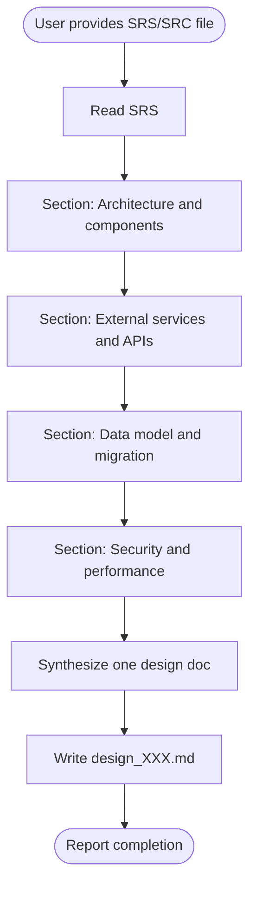

# CM Design

## Cursor adaptation

- **Single agent:** Do **not** use Claude Code Agent tool or parallel subagents.
- **Persona:** Follow `.cursor/skills/stack-personas/technical-lead-architect.md` for all architectural content.
- **Four concerns in one session:** Produce **Architecture & components**, **External services & APIs**, **Data model & migration**, and **Security & performance** as separate drafted sections, then merge into one design file (same content as the original four parallel architects).
- **Language:** Write design documents in Vietnamese (keep technical terms in English only when necessary).
- **Repository memory:** Read and update `docs/memory/knowledge_base.md` and `docs/memory/index.md`.
- **Mandatory memory gate:** Do not mark design complete until memory files are updated (`knowledge_base.md`, `index.md`, and `decisions.md` when decisions are added/changed).
- **DB reference rule:** Always read `docs/databases_docs/db_overview_etc_core_schema.md` first (canonical schema). Other files under `docs/databases_docs/` only if needed (e.g. migration runbooks).

## Overview

Transforms SRS/SRC outputs into a system design by covering architecture, integrations, data, and security/performance, then synthesizing a single `design_[XXX].md`.

**Core principle:** Splitting concerns into explicit sections keeps depth without needing multiple subagents.

## When to Use

Use when:
- User provides SRS/SRC and requests system design
- User asks to "design the system" or "create technical design"
- Moving from requirements to implementation planning
- Architectural decisions must be documented before coding

Do NOT use when:
- User asks simple questions (answer directly)
- User requests code without a design doc
- No SRS exists yet (use `stack-analyze` first)

## Workflow



## Implementation

### Step 1: Read the SRS/SRC

Load the SRS from the path the user gave (typically `docs/SRC/srs_[XXX].md`).
Then read `docs/databases_docs/db_overview_etc_core_schema.md` to align schema/mapping decisions; any new tables/columns belong in that file with **Nhật ký thay đổi** updated.

### Step 2: Draft by concern (technical lead persona)

Using `.cursor/skills/stack-personas/technical-lead-architect.md`, produce internal notes or drafts for:

1. **Architecture & components** — structure, responsibilities, patterns, stack
2. **External services & APIs** — integrations, endpoints, contracts, retries/rate limits
3. **Data model & migration** — schema, relationships, migration and rollback
4. **Security & performance** — auth, data protection, scalability, caching

### Step 3: Determine design file number

List `docs/designs/design_*.md` (if any), pick next three-digit id, or start at `001`.

### Step 4: Write design document

Create `docs/designs/design_[XXX].md` using this structure:

```markdown
# System Design: [Feature Name]

## Document Information
- **Design ID:** D[XXX]
- **Created:** [Date]
- **Status:** Draft
- **Related SRS:** [Link to SRS file]

## 1. Architecture Overview

### 1.1 High-Level Architecture
[ASCII diagram or Mermaid diagram of system architecture]

### 1.2 Design Principles
[Key architectural decisions and rationale]

### 1.3 Technology Stack
| Layer | Technology | Justification |
|-------|------------|---------------|
| [Layer] | [Tech] | [Why] |

## 2. Components

### 2.1 Component Diagram
[Visual representation of components and interactions]

### 2.2 Component Details
| Component | Responsibility | Dependencies | Technology |
|-----------|---------------|--------------|------------|
| [Name] | [Description] | [Deps] | [Tech] |

### 2.3 Communication Patterns
[How components interact: sync/async, protocols]

## 3. External Services

### 3.1 Third-Party Integrations
| Service | Purpose | API Type | Authentication | Rate Limits |
|---------|---------|----------|----------------|-------------|
| [Name] | [Use] | [REST/GraphQL] | [Method] | [Limits] |

### 3.2 API Design
| Method | Endpoint | Description | Auth | Request | Response |
|--------|----------|-------------|------|---------|----------|
| [VERB] | [/path] | [Purpose] | [Required] | [Schema] | [Schema] |

### 3.3 Error Handling & Resilience
[Retry strategies, circuit breakers, fallbacks]

## 4. Data Model

### 4.1 Database Schema Changes
[New tables, columns, indexes with SQL or schema definitions]

### 4.2 Entity Relationships
[ERD diagram or relationship descriptions]

### 4.3 Data Integrity
[Constraints, validations, consistency requirements]

## 5. Migration Strategy

### 5.1 Current State
[Description of existing system]

### 5.2 Target State
[Description of end state after migration]

### 5.3 Migration Steps
| Step | Action | Risk | Rollback |
|------|--------|------|----------|
| 1 | [Action] | [Risk] | [How to revert] |

### 5.4 Rollback Plan
[Detailed rollback procedure]

## 6. Security

### 6.1 Authentication & Authorization
[How users/systems are authenticated and authorized]

### 6.2 Data Protection
[Encryption at rest/transit, PII handling, compliance]

### 6.3 Security Risks & Mitigations
| Risk | Impact | Mitigation |
|------|--------|------------|
| [Risk] | [High/Med/Low] | [Plan] |

## 7. Performance

### 7.1 Scalability
[Horizontal/vertical scaling approach, bottlenecks]

### 7.2 Caching Strategy
| What | Where | TTL | Invalidation |
|------|-------|-----|--------------|
| [Data] | [Layer] | [Time] | [Strategy] |

### 7.3 Optimization Opportunities
[Performance improvements and trade-offs]

## 8. Risks and Mitigations

| Risk | Impact | Likelihood | Mitigation | Owner |
|------|--------|------------|------------|-------|
| [Description] | [H/M/L] | [H/M/L] | [Plan] | [Team] |

## 9. Implementation Phases

### Phase 1: [Name] - [Duration]
**Goal:** [Phase objective]
- [ ] [Task 1]
- [ ] [Task 2]
**Dependencies:** [What must be done first]
**Deliverable:** [What this phase produces]

### Phase 2: [Name] - [Duration]
**Goal:** [Phase objective]
- [ ] [Task 1]
- [ ] [Task 2]

## Appendix

### A. Glossary
[Technical terms and definitions]

### B. References
[Links to documentation, RFCs, external resources]

### C. Decision Log
[Key decisions made during design and rationale]
```

## Example

**User input:**
> "Create a system design from docs/SRC/srs_001.md"

**Action:**
1. Read the SRS
2. Draft all four concern areas using the technical lead persona, then merge
3. Number the next `design_XXX.md`
4. Write `docs/designs/design_001.md`

## Common Mistakes

| Mistake | Fix |
|---------|-----|
| Skipping a concern area | Cover all four before merging |
| Not reading the SRS first | Always load SRS/SRC before designing |
| Concatenating without synthesis | One coherent doc, not four unrelated appendices |
| Wrong file numbering | Check existing `docs/designs/` files |
| Missing rollback in migrations | Every migration section needs rollback |
| Ignoring repository memory | Read/update `docs/memory/*` with key design decisions |

## File output

- **Location:** `docs/designs/design_[XXX].md`
- **Naming:** Three-digit zero-padded incremental number
- **Create directory:** Create `docs/designs/` if missing
- **Reference SRS:** Link source SRS in the header
- **Memory update:** Persist key decisions to `docs/memory/decisions.md` and `docs/memory/index.md`
- **DB output:** Merge schema/linkage updates into `docs/databases_docs/db_overview_etc_core_schema.md` and append **Nhật ký thay đổi** (date, updater, summary). Do not add new `db_mapping_*.md` for routine features.
- **Completion rule:** If memory was not updated, output must be treated as draft/incomplete.
