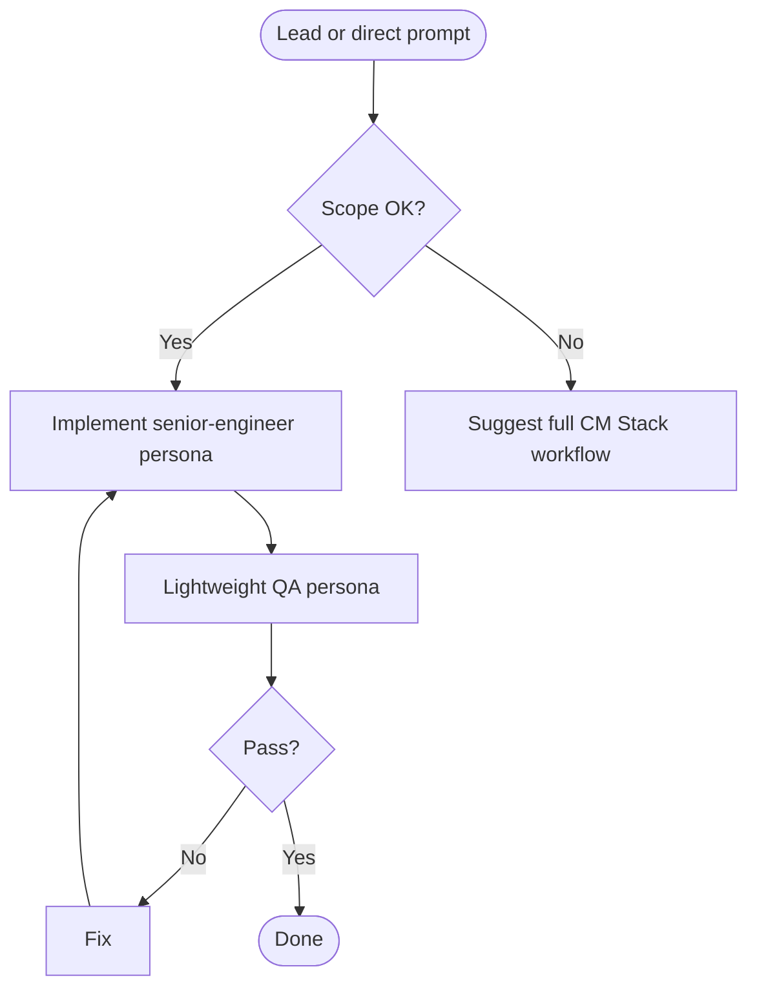

# CM Fast-Track

## Cursor adaptation

- **Single agent:** No Claude Code subagents. Apply `senior-engineer.md` for implementation, then `qa-engineer.md` for a **lightweight** pass (critical issues only).
- Optional summary at `docs/implementation/impl_XXX.md` only if the user asks or complexity warrants it.
- **Implementation standards (mandatory):**
  - PSR-12 for PHP code style
  - Laravel module structure per `README.md`
  - PHPDoc with `@return` for server-side methods where needed
  - Matching Blade templates for web view scope
  - Reuse/extract common logic to avoid duplication
  - Migration + corresponding seeder for DB changes

## Overview

Ships small, clear-scope work with minimal process: implement, quick QA, done.

**Core principle:** Do not create PRD/design/plan unless the user requests a summary.

## When to Use

Use when:
- Lead doc exists and user wants code now
- Well-defined prompt with small scope
- User says "just implement" or "skip the paperwork"
- Roughly 1–3 files or one component

Do NOT use when:
- Requirements unclear (use `stack-brainstorm`)
- Large or cross-cutting (use `stack-analyze` → design → plan → task)
- Pure Q&A

## Workflow

## Implementation

### Step 1: Input

- If `lead_XXX.md`: read and use "Clarified Requirements"
- Else: use the user prompt

### Step 2: Scope gate

If too large (many files, multiple services, unclear risk), suggest `stack-analyze` and full pipeline; only proceed if user confirms fast-track.

### Step 3: Implement

Per `.cursor/skills/stack-personas/senior-engineer.md`: minimal focused change, match project patterns, add tests if appropriate. **Do not** create PRD/design/plan unless asked.

### Step 4: Lightweight QA

Per `.cursor/skills/stack-personas/qa-engineer.md`, limit to: correctness, obvious edge cases, critical security, tests passing. Output **PASSED** or **FAILED** with critical list only.

### Step 5: Optional summary

If requested, write `docs/implementation/impl_[XXX].md` with date, files changed, and short summary.

## Comparison

| Aspect | Fast-track | Full CM Stack |
|--------|------------|----------------|
| Docs | Optional impl note | PRD, design, plan |
| Review | QA light | BA + TLA + QA |
| Best for | Small/clear | Large/complex |

## Common mistakes

| Mistake | Fix |
|---------|-----|
| Fast-tracking vague work | Use `stack-brainstorm` first |
| Full QA depth | Keep QA lightweight per this skill |
| Auto-creating docs | Skip unless user wants them |
