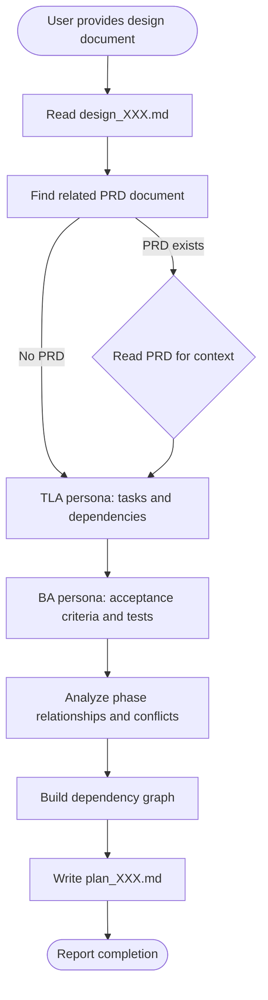

# CM Plan

## Cursor adaptation

- **Single agent:** Do **not** use Claude Code Agent tool or parallel subagents.
- **Persona:** Use only `.cursor/skills/stack-personas/technical-lead-architect.md` to keep alignment with stack-analyze.
- **Language:** Write plan in Vietnamese.
- **Repository memory:** Read and update `docs/memory/knowledge_base.md` and `docs/memory/index.md`.
- **Mandatory memory gate:** Planning is incomplete unless memory files are updated (`docs/memory/knowledge_base.md`, `docs/memory/index.md`, and `docs/memory/decisions.md` when planning decisions are changed).
- **Pipeline contract:** Every plan must explicitly define downstream handoffs to `stack-task`, `stack-testcase`, `stack-review-branch`, and `report-writer`.
- **DB reference rule:** Read `docs/databases_docs/db_overview_etc_core_schema.md` before estimating DB-related tasks/migration steps.

## Overview

Transforms system design documents into detailed implementation plans with actionable tasks. Analyzes design phases, creates task breakdowns, identifies dependencies, and surfaces conflicts before coding starts.

**Core principle:** A well-structured implementation plan prevents wasted effort by identifying dependencies and conflicts upfront, enabling parallel work where possible and ensuring sequential work is properly ordered.

## References (recommended, quality checklist)

- `.cursor/references/testing-patterns.md` → ensure every task has testable acceptance criteria and avoids testing implementation details.
- `.cursor/references/security-checklist.md` and `.cursor/references/performance-checklist.md` → add explicit hardening/index/caching tasks when needed.

## When to Use

Use when:
- User provides a design document and requests implementation planning
- User asks to "plan the implementation" or "break down tasks"
- Moving from design to implementation phase
- Need to identify task dependencies and potential conflicts

Do NOT use when:
- User asks simple questions (just answer directly)
- User requests code changes without planning documentation
- No design document exists yet (use `cm-stack-design` skill first)

## Workflow



## Implementation

### Step 1: Read the Design Document

Use the Read tool to load the design document from the path provided by the user.

### Step 2: Find and Read Related SRS

Extract the related SRS reference from the design document header, then read it for business context:

```
Design document header example:
- **Related SRS:** docs/SRC/srs_001.md
```

### Step 3: Technical planning analysis (same chat)

Using technical lead persona, break the design into granular tasks (2–4 hour chunks), dependencies, parallelizable work, merge/conflict risks, and release ordering.
For DB-related tasks, use `docs/databases_docs/db_overview_etc_core_schema.md` as the baseline; plan tasks should merge future schema work into that file (not new per-feature mapping files).

### Step 4: Analyze phase relationships

Build a comprehensive understanding of how phases relate:

| Relationship Type | Description | Example |
|-------------------|-------------|---------|
| **Sequential** | Phase B cannot start until Phase A completes | Database migration must complete before model updates |
| **Parallel** | Phases can run simultaneously | Frontend and backend work on separate components |
| **Overlapping** | Phases share work but have independent parts | Two phases both modify User model |
| **Blocking** | One phase blocks another's progress | API design blocks frontend integration |

### Step 5: Identify Conflicts

Surface potential conflicts before implementation:

| Conflict Type | Detection | Mitigation |
|---------------|-----------|------------|
| **File conflicts** | Multiple phases modifying same files | Sequential ordering or worktree isolation |
| **Database conflicts** | Concurrent schema changes | Combine migrations or sequence carefully |
| **Interface conflicts** | Changing shared interfaces | Define contracts first, implement later |
| **Resource conflicts** | Shared services/dependencies | Coordinate timing or abstract interfaces |

### Step 6: Build Dependency Graph

Create a visual and textual representation of task dependencies:

```
Phase 1: Foundation
├── [T1.1] Install dependencies ─────────────────┐
├── [T1.2] Configure environment ────────────────┤
└── [T1.3] Create database migrations ───────────┤
                                                 │ (blocks all Phase 2)
Phase 2: Core Implementation                     │
├── [T2.1] Create models ◄───────────────────────┘
├── [T2.2] Create services ◄─── (needs T2.1)
└── [T2.3] Create controllers ◄─ (needs T2.1, T2.2)

Phase 3: Integration (parallel with Phase 4)
├── [T3.1] Frontend components
└── [T3.2] API integration ◄───── (needs T2.3)

Phase 4: Testing
└── [T4.1] Write tests ◄───────── (needs T3.2)
```

### Step 7: Write Implementation Plan

Create the plan file at `docs/plans/plan_[XXX].md`:

```markdown
# Implementation Plan: [Feature Name]

## Document Information
- **Plan ID:** P[XXX]
- **Created:** [Date]
- **Status:** Draft
- **Related Design:** [Link to design document]
- **Related SRS:** [Link to SRS document]

## Executive Summary
[Brief overview of the implementation approach, key phases, and timeline estimate]

## Phase Overview

| Phase | Name | Tasks | Dependencies | Can Parallel With |
|-------|------|-------|--------------|-------------------|
| 1 | Foundation | 5 | None | - |
| 2 | Core | 8 | Phase 1 | - |
| 3 | Integration | 6 | Phase 2 | Phase 4 |
| 4 | Testing | 4 | Phase 3 | - |

## Dependency Graph

    ```
    [ASCII dependency graph showing task relationships]
    ```

---

## Phase 1: [Name]

**Goal:** [Phase objective]
**Duration Estimate:** [X days]
**Dependencies:** None / [List dependencies]
**Parallel With:** [Other phases or "None"]

### Tasks

#### [T1.1] Task Name
- **Description:** [What needs to be done]
- **Acceptance Criteria:**
  - [ ] [Criterion 1]
  - [ ] [Criterion 2]
- **Files Affected:**
  - `path/to/file1`
  - `path/to/file2`
- **Dependencies:** None
- **Blocks:** [T1.2], [T2.1]
- **Test Scenarios:**
  - [Scenario 1]
  - [Scenario 2]

#### [T1.2] Task Name
- **Description:** [What needs to be done]
- **Acceptance Criteria:**
  - [ ] [Criterion 1]
- **Files Affected:**
  - `path/to/file`
- **Dependencies:** [T1.1]
- **Blocks:** [T2.1]

---

## Phase 2: [Name]

**Goal:** [Phase objective]
**Duration Estimate:** [X days]
**Dependencies:** Phase 1 complete
**Parallel With:** None

### Tasks

[Same structure as Phase 1]

---

## Conflict Analysis

### Identified Conflicts

| Conflict ID | Type | Description | Affected Phases | Resolution |
|-------------|------|-------------|-----------------|------------|
| C1 | File | Both Phase 2 and 3 modify User model | 2, 3 | Sequence: P2 before P3 |
| C2 | Database | Concurrent migrations on users table | 1, 2 | Combine into single migration |

### Conflict Resolution Strategy

1. **File Conflicts:** [Strategy for handling]
2. **Database Conflicts:** [Strategy for handling]
3. **Interface Conflicts:** [Strategy for handling]

---

## Parallelization Opportunities

### Can Run Simultaneously

| Group | Phases/Tasks | Condition |
|-------|--------------|-----------|
| A | Phase 3 Frontend + Phase 4 Tests | After Phase 2 complete |
| B | [T2.2] + [T2.3] | After [T2.1] complete |

### Must Be Sequential

1. Phase 1 → Phase 2 (foundation required)
2. [T2.1] → [T2.2] (models needed for services)

---

## Risk Register

| Risk ID | Description | Likelihood | Impact | Mitigation |
|---------|-------------|------------|--------|------------|
| R1 | [Risk description] | H/M/L | H/M/L | [How to mitigate] |

---

## Testing Strategy

### Unit Tests
- [Test category 1]
- [Test category 2]

### Feature Tests
- [Test scenario 1]
- [Test scenario 2]

### Integration Tests
- [Test scenario 1]

### QC Test-case Handoff
- Output target: `docs/test-cases/testcase_[XXX].md`
- Source: SRS + plan tasks
- Owner skill: `stack-testcase`

---

## Rollback Strategy

### Per-Phase Rollback

| Phase | Rollback Steps |
|-------|----------------|
| 1 | [Steps to revert Phase 1] |
| 2 | [Steps to revert Phase 2] |

---

## Checklist

### Before Starting Implementation
- [ ] All design questions resolved
- [ ] Environment variables configured
- [ ] Dependencies installed
- [ ] Branch strategy agreed

### Phase Completion Checklist
- [ ] All tasks in phase complete
- [ ] All tests passing
- [ ] Code review complete
- [ ] Documentation updated

---

## Appendix

### A. File Impact Summary

| File | Phases Modifying | Type of Change |
|------|------------------|----------------|
| `src/models/User` | 1, 2 | Add fields, add methods |
| `src/routes` | 2, 3 | Add routes |

### B. Task Quick Reference

| Task ID | Name | Phase | Dependencies | Est. Hours |
|---------|------|-------|--------------|------------|
| T1.1 | [Name] | 1 | None | 2 |
| T1.2 | [Name] | 1 | T1.1 | 4 |
```

## Example

**User input:**
> "Create an implementation plan from docs/designs/design_001.md"

**Action:**
1. Read `docs/designs/design_001.md`
2. Extract related SRS: `docs/SRC/srs_001.md`
3. Read the SRS for functional context
4. Apply technical lead persona -> task breakdown, dependencies, conflicts
5. Analyze phase relationships, build dependency graph
6. Add handoff sections for `stack-task`, `stack-testcase`, `stack-review-branch`, `report-writer`
7. Create `docs/plans/plan_001.md` with comprehensive implementation plan

## Common Mistakes

| Mistake | Fix |
|---------|-----|
| Not reading related SRS | Always read the SRS for functional context and acceptance criteria |
| Tasks too large | Break tasks into 2-4 hour chunks with clear deliverables |
| Missing dependencies | Trace every task's inputs and outputs to find hidden dependencies |
| Ignoring conflicts | Surface all potential file/resource conflicts upfront |
| Vague acceptance criteria | Each task must have testable acceptance criteria |
| Skipping dependency graph | Visual graph helps identify parallelization opportunities |
| Creating docs/plans if missing | Create the directory if it doesn't exist |
| Missing downstream handoff | Include explicit sections for task execution, QC test-case, review, and release report |

## File Output

- **Location:** `docs/plans/plan_[XXX].md`
- **Naming:** Match the design document number (e.g., `design_001.md` → `plan_001.md`)
- **Create directory:** If `docs/plans/` doesn't exist, create it
- **Reference documents:** Always include links to source design and SRS in document header
- **Memory update:** Persist planning decisions to `docs/memory/decisions.md` and `docs/memory/index.md`
- **DB references:** Link `docs/databases_docs/db_overview_etc_core_schema.md` (and `docs/databases_docs/README.md` if needed) when plan includes schema/data migration tasks
- **Completion rule:** Never report plan completed before mandatory memory update.
