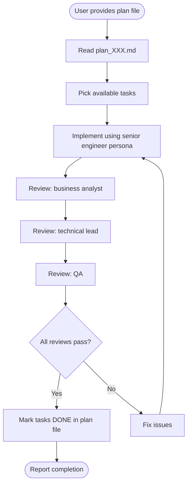

# CM Task

## Cursor adaptation

- **Single agent:** Do **not** use Claude Code Agent tool, TaskOutput, or background subagents.
- **Implementation:** Follow `.cursor/skills/stack-personas/senior-engineer.md`.
- **Reviews:** Run three passes in order (or one message with three clear subsections): **business** (`business-analyst.md`), **technical** (`technical-lead-architect.md`), **QA** (`qa-engineer.md`). All must pass before marking tasks DONE.
- **Parallel work:** If the plan has independent tasks, still implement in one chat sequentially unless the user opens multiple sessions—do not assume parallel OS processes.
- **Language:** Update plan notes/review notes in Vietnamese.
- **Repository memory:** Read and update `docs/memory/knowledge_base.md`, `docs/memory/index.md`, and `docs/memory/decisions.md`.
- **Mandatory memory gate:** Task execution cannot be marked DONE unless memory updates are completed.
- **Release contract:** Before closing a task batch, prepare handoff inputs for `stack-testcase`, `stack-review-branch`, and `report-writer`.
- **DB reference rule:** For any DB-related implementation, read `docs/databases_docs/db_overview_etc_core_schema.md` first; after implementation, merge schema/mapping changes into that file and update **Nhật ký thay đổi** (date, updater, summary).
- **UI design rule (mandatory):** For any Blade/UI work, read `docs/design/DESIGN.md` and `.cursor/references/ui-design-standards.md` first; implement UI strictly following the design system (colors, spacing, typography, components). During QA pass, explicitly check UI alignment.
- **Implementation standards (mandatory):**
  - Follow PSR-12 for PHP code style.
  - Follow Laravel module structure in `README.md` for new feature modules.
  - Add PHPDoc/`@return` for server-side methods where contracts need clarity.
  - Provide matching Blade view templates for web-side scope.
  - Prefer shared/common components for reusable logic to avoid duplication.
  - Create/update migration and corresponding seeder when DB schema/data setup changes.

## Overview

Executes implementation plans: pick ready tasks, implement, review from multiple perspectives, update `plan_[XXX].md`.

**Core principle:** Quality gates (BA + TLA + QA) before marking work complete.

## References (optional, fast self-check)

Use these during the Technical/QA review passes when relevant:
- `.cursor/references/security-checklist.md` for auth/authz, input validation, secrets, and dependency audit.
- `.cursor/references/performance-checklist.md` for query-heavy changes and list screens (N+1, pagination, indexes).
- `.cursor/references/accessibility-checklist.md` for any Blade/UI changes.
- `.cursor/references/ui-design-standards.md` (and `docs/design/DESIGN.md`) for any UI generation/update.
- `.cursor/references/testing-patterns.md` when writing or reviewing tests (requirement-centric).

**One-line prompt add-on (optional):**
Add this to your execution prompt when you want an explicit checklist pass:
> "Trong review Technical/QA, đối chiếu thêm `.cursor/references/security-checklist.md` + `performance-checklist.md` (và `accessibility-checklist.md` nếu có UI)."

## When to Use

Use when:
- User provides a plan file and wants execution
- User asks to "work on the plan" or "execute tasks"
- User wants progress on an existing plan

Do NOT use when:
- Simple questions without a plan
- No plan exists (use `stack-plan` first)
- Code changes unrelated to the plan (unless user explicitly widens scope)

## Workflow



## Implementation

### Step 1: Read the plan

Load `docs/plans/plan_[XXX].md` from the user path.

### Step 2: Task status

Identify DONE, in progress, PENDING, blocked (dependencies).

### Step 3: Select work

Choose tasks that are PENDING, dependencies satisfied, and not blocked.

### Step 4: Implement

Using `senior-engineer.md`, implement selected tasks. Run tests and linters per project norms. Summarize:

- What changed
- Files touched
- Tests run
- DB mapping/schema docs updated (if DB touched)
- PSR-12 and module-structure compliance notes

### Step 5: Triple review (same chat)

1. **Business** (`business-analyst.md`): Acceptance criteria, business rules, user stories vs implementation.
2. **Technical** (`technical-lead-architect.md`): Alignment with design, architecture, security, performance.
3. **QA** (`qa-engineer.md`): Code review, defects, tests, QA report format if issues exist.

If any review fails, fix and re-run reviews until resolved or escalate to the user.

### Step 6: Mark tasks DONE

Update the plan file:

```markdown
#### [T1.1] Task Name ✅ DONE
- **Acceptance Criteria:**
  - [x] ...
- **Completed:** [Date]
```

### Step 7: Report

Summarize completed task IDs, review outcomes, and next recommended tasks.

### Step 8: Prepare downstream handoff artifacts

After implementation:
1. Trigger/prepare `stack-testcase` inputs (implemented scope + acceptance criteria).
2. Trigger/prepare `stack-review-branch` inputs (target branch + risk areas).
3. Trigger/prepare release summary inputs for `report-writer`.

### Step 9: Mandatory memory update

Before final report:
1. Update `docs/memory/knowledge_base.md` with new implementation facts.
2. Update `docs/memory/index.md` with artifact links and timestamps.
3. Update `docs/memory/decisions.md` for any implementation/review decision changes.

### Step 10: DB documentation sync (when applicable)

If DB/schema/mapping changed:
1. Update `docs/databases_docs/db_overview_etc_core_schema.md` (append **Nhật ký thay đổi**). Do not create new `db_mapping_*.md` per feature.
2. Add links to the overview (and section anchors if useful) in plan notes and memory index.

## Checking progress

When asked for progress only:

1. Read the plan
2. Count DONE vs total tasks and note blockers
3. Report phase, percentage, and suggested next task IDs

## Task status indicators

| Indicator | Meaning |
|-----------|---------|
| (none) | PENDING |
| ⏳ | In progress |
| ✅ DONE | Completed and reviewed |
| 🚫 | Blocked |

## File operations

- **Read:** `docs/plans/plan_[XXX].md`, linked PRD/design from header
- **Update:** Mark DONE, check acceptance boxes, add completion date

## Common mistakes

| Mistake | Fix |
|---------|-----|
| Marking DONE without all three reviews | BA, TLA, QA must pass |
| Skipping tests | Run project tests before reviews |
| Ignoring dependencies | Respect task order in the plan |
| Editing unrelated files | Stay within plan scope unless agreed |
| Finishing implementation without QC handoff | Provide test-case, review, and release-report handoff package |
| Marking DONE without memory update | Treat task as incomplete until memory files are updated |
