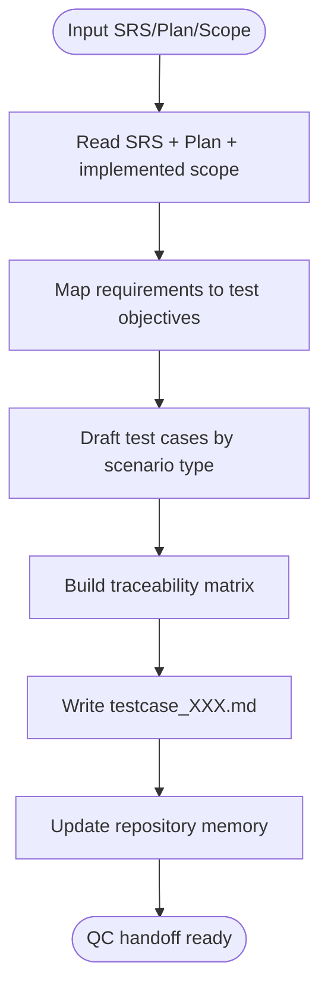

# CM Testcase

## Cursor adaptation

- **Single agent:** Do **not** use Claude Code Agent tool or parallel subagents.
- **Persona source:** Use `.cursor/skills/stack-personas/qa-engineer.md`.
- **Language:** Write all test-case deliverables in Vietnamese.
- **Repository memory:** Read and update `docs/memory/knowledge_base.md` and `docs/memory/index.md`.
- **Mandatory memory gate:** Test-case generation is incomplete until memory updates are done.
- **DB reference rule:** If test scope includes data validations/DB constraints, read `docs/databases_docs/db_overview_etc_core_schema.md` first.

## Overview

Creates QC-ready test-case specifications from SRS (`docs/SRC/srs_*.md`), design (`docs/designs/design_*.md`), plan (`docs/plans/plan_*.md`), and implemented scope.

**Core principle:** Test by requirement and business behavior, not by internal code structure.

## References (recommended)

- `.cursor/references/testing-patterns.md` (primary) — structure, naming, anti-patterns; keep tests requirement-centric.
- `.cursor/references/security-checklist.md` — derive security/permission test cases when feature touches auth/authz or sensitive data.
- `.cursor/references/performance-checklist.md` — add performance checks for list/import/billing flows when relevant.

## When to Use

Use when:
- User needs QC test cases for upcoming testing cycles
- `stack-task` implementation is done (or partially done) and needs QA handoff
- User asks for UAT/SIT test case sheets for specific screens/features

Do NOT use when:
- Requirements are not documented yet (run `stack-analyze` first)
- Plan is missing and scope is unclear (run `stack-plan` first)

## Workflow



## Implementation

### Step 1: Gather sources

Read:
- `docs/SRC/srs_[XXX].md`
- `docs/plans/plan_[XXX].md`
- `docs/databases_docs/db_overview_etc_core_schema.md` (when DB scope applies)
- optional implementation diff or changed-file list

### Step 2: Build requirement traceability

Map each requirement/acceptance criterion to at least one test case.

### Step 3: Draft test cases

Include:
- Happy path
- Validation and negative path
- Cross-screen dependency scenarios
- Data integrity and permission scenarios
- Regression smoke set

### Step 4: Write test-case document

Create `docs/test-cases/testcase_[XXX].md`:

```markdown
# Test Case Specification: [Feature Name]

## Document Information
- **Testcase ID:** TC[XXX]
- **Related SRS:** [Path]
- **Related Plan:** [Path]
- **Status:** Draft

## Scope
[In-scope / out-of-scope]

## Preconditions
- [Environment]
- [Master/Test data setup]

## Test Cases
| TC ID | Requirement Ref | Screen/Module | Scenario | Steps | Test Data | Expected Result | Priority |
|------|------------------|---------------|----------|-------|-----------|-----------------|----------|
| TC-001 | FR-001 | Login | Đăng nhập thành công | ... | ... | ... | High |

## Validation Matrix
| Screen | Field | Rule | Valid Case | Invalid Case | Error Message |
|--------|-------|------|------------|--------------|---------------|

## Traceability Matrix
| Requirement | Covered By | Status |
|------------|------------|--------|

## Execution Notes for QC
- [Run order]
- [Dependencies]
- [Known constraints]
```

## File output

- **Location:** `docs/test-cases/testcase_[XXX].md`
- **Naming:** Three-digit zero-padded incremental number
- **Create directory:** Create `docs/test-cases/` if missing
- **Memory update:** Add summary to `docs/memory/index.md`
- **DB reference:** include linked DB docs used for validation/data integrity test cases
- **Completion rule:** Do not mark QC handoff ready unless `docs/memory/knowledge_base.md` and `docs/memory/index.md` are updated.
