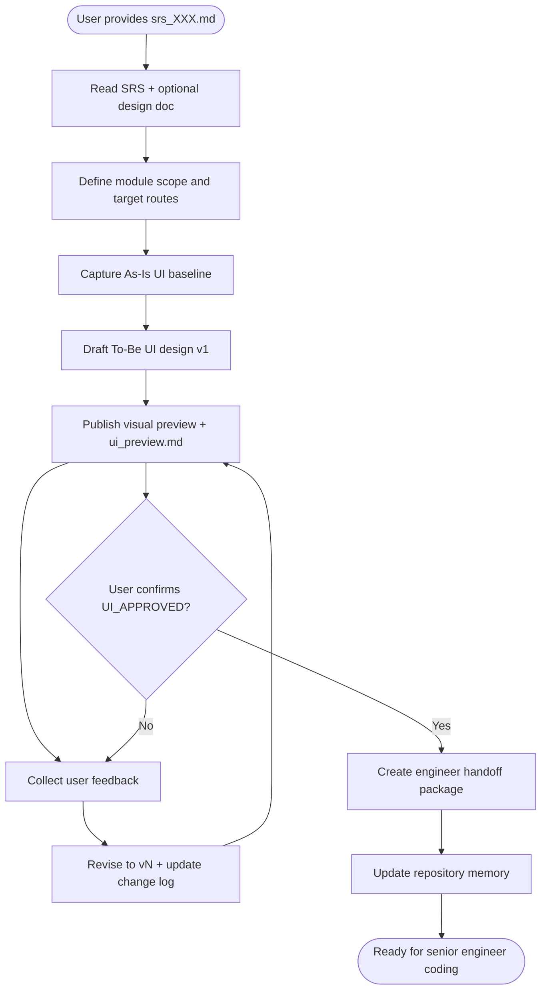

# CM UI Design Gate

## Cursor adaptation

- **Single agent:** Do **not** use Claude Code Agent tool or parallel subagents.
- **Language:** Write all UI design deliverables in Vietnamese.
- **MCP browser capture:** Prefer MCP browser tools to collect current UI evidence (screenshots + snapshots).
- **Stitch MCP (optional):** When `stitch` MCP is enabled, follow **Stitch alignment rules** below — never replace the whole page with an unrelated visual theme.
- **Mandatory visual preview:** Every design version (`v1`, `vN`) must ship at least one preview the user can open in Cursor (Canvas and/or preview manifest links). Text-only specs are incomplete.
- **Canvas preview:** Read `.cursor/skills-cursor/canvas/SKILL.md` (or `~/.cursor/skills-cursor/canvas/SKILL.md`) when creating `.canvas.tsx` wireframe previews beside chat.
- **Mandatory approval gate:** Do not hand off to `.cursor/skills/stack-personas/senior-engineer.md` unless user explicitly confirms `UI_APPROVED`.
- **No implicit approval:** Phrases like "ok", "looks good", "tạm ổn" are not approval tokens; ask for explicit `UI_APPROVED`.
- **Versioned iteration:** Every feedback cycle must create a new design version (`v1`, `v2`, `v3`, ... ) with clear change log.
- **Repository memory:** Read and update `docs/memory/knowledge_base.md` and `docs/memory/index.md`.
- **Mandatory memory gate:** UI design delivery is incomplete until memory updates are done.

## Overview

Runs a UI-first workflow for module delivery: capture current screens, define target UI, iterate with user feedback, then gate implementation until explicit approval.

**Core principle:** No coding handoff without explicit UI approval token.

**Preview principle:** The user must be able to *see* the proposed UI (Canvas panel, image gallery, Stitch link, or local HTML preview) before approving.

## Prerequisites

**Mandatory before starting:** An existing SRS from `stack-analyze`.

| Requirement | Path / rule |
|-------------|-------------|
| **SRS (required)** | `docs/SRC/srs_[XXX].md` — user must provide path or feature id |
| **Recommended** | `docs/designs/design_[XXX].md` from `stack-design` (API, data, security constraints for UI) |
| **Optional** | `docs/plans/plan_[XXX].md`, domain reports under `docs/reports/`, `docs/design/DESIGN.md` |

If no `srs_*.md` exists:

1. **Stop** — do not draft UI design deliverables.
2. Tell the user to run `stack-analyze` first and link the resulting SRS.
3. Resume this skill only after `docs/SRC/srs_[XXX].md` is available.

**SRS usage rule:** UI flows, fields, validations, roles, and cross-screen dependencies in `ui_design_vN.md` must trace to SRS sections (reference SRS id/section in design doc).

## CM Stack position

```text
stack-analyze  →  srs_*.md
stack-design   →  design_*.md     (system / technical design — not screen mockups)
stack-ui-design-gate → ui_design_* + preview  (screen UX/UI — requires SRS)
stack-plan     →  plan_*.md
stack-task     →  implementation (after UI_APPROVED + plan as applicable)
```

## When to Use

Use when:
- User provides `docs/SRC/srs_[XXX].md` and asks to design or extend screens for that feature/module
- User wants to review and revise UI before coding
- User requires a formal UI sign-off step before engineering handoff
- Module scope impacts user-facing flows/components

Do NOT use when:
- No SRS exists yet (use `stack-analyze` first)
- Task is backend-only with no UI impact
- User explicitly asks to skip design and implement immediately
- Existing approved UI specification already exists and user requests only coding

## Workflow



## Implementation

### Step 1: Read SRS and define scope

1. Load the SRS from the path the user gave (typically `docs/SRC/srs_[XXX].md`).
2. Optionally read linked `docs/designs/design_[XXX].md` if present (constraints for UI behavior).
3. Derive scope from SRS (do not invent scope outside SRS without user approval):

Collect minimum scope:
- Module name and objective (from SRS)
- Routes/screens in scope (from SRS screen list / user journeys)
- Primary user roles/personas (from SRS)
- Business outcomes required from UI (from SRS acceptance criteria)

If SRS is missing or essential scope is unclear in SRS, clarify with user first; do not proceed without SRS.

### Step 2: Capture As-Is UI baseline

Prefer MCP browser tools to capture current UI:
- Navigate to target routes/screens
- Take screenshots
- Take structural snapshots (important sections/components)
- Capture key UI states when available: loading, empty, error, success, permission-denied

If live app access is unavailable, fallback to:
1. Existing FE source/routes/components
2. User-provided mockups/screenshots
3. User textual description (mark lower confidence)

Create `ui_baseline.md`.

### Step 3: Draft To-Be UI design (v1)

Create `ui_design_v1.md` with:
- **As-Is vs To-Be delta table** (shell preserved / regions changed / new blocks)
- Screen flow and navigation behavior
- Layout and component-level specifications
- UI validation rules and interaction behavior
- Role/permission-driven visibility
- State handling (loading/empty/error/success)
- Responsive behavior notes

Create `ui_change_log.md` (initialize `v1` section).

### Step 3b: Publish visual preview (mandatory)

After each `ui_design_vN.md`, deliver preview artifacts and update `ui_preview.md`.

**Preview priority (use all that apply):**

| Priority | Channel | When to use | User action in Cursor |
|----------|---------|-------------|------------------------|
| 1 | **Cursor Canvas** | Always for To-Be wireframe / screen layout | Open `canvases/<module-slug>-ui-vN.canvas.tsx` from chat link or file tree → opens beside chat |
| 2 | **Stitch MCP** | `stitch` server connected | Save exported images under `assets/`; add Stitch project/screen URL in `ui_preview.md` |
| 3 | **Screenshot gallery** | As-Is capture or Stitch `fetch_screen_image` | Embedded paths in `ui_preview.md`; open PNG from workspace |
| 4 | **Static HTML preview** | Need pixel-close mock without Canvas | `preview/vN/index.html` — open with *Simple Browser: Show* or system browser |

**Canvas rules (summary):**

- Path: `canvases/<module-slug>-ui-vN.canvas.tsx` under the Cursor project folder for this workspace (same pattern as other stack canvases).
- One file per version; wireframe-level layout (sections, tables, filters, actions) aligned with `ui_design_vN.md`.
- Follow the canvas skill: single default export, `cursor/canvas` imports only, no fetch/network.
- In the final chat message for the step, include an explicit line: **"Mở preview: `canvases/<module-slug>-ui-vN.canvas.tsx`"** so the user can click/open the Canvas.

**Stitch MCP rules (when available):**

- Prefer: `generate_screen_from_text` for To-Be iterations, `fetch_screen_image` for exports; use `extract_design_context` when available to capture Design DNA from an existing screen.
- Persist files to `docs/ui-designs/<module-slug>/assets/vN/`.
- Record any external Stitch URLs in `ui_preview.md` under *External links*.

**Stitch alignment rules (mandatory when using Stitch on existing screens):**

Stitch often produces a **new standalone mock** (e.g. full dark theme, no site chrome) if the prompt only describes business intent. For migration or extend-existing UI, **align to As-Is first, delta second**.

| Rule | Requirement |
|------|-------------|
| **As-Is attachment** | Attach or reference the baseline screenshot in `ui_baseline.md` / `assets/baseline/` in every Stitch prompt |
| **FE source** | Read the target page component under `bks-system-fe` (e.g. `src/pages/...`) and list layout regions to preserve |
| **Design system** | Read `docs/design/DESIGN.md` and `.cursor/references/ui-design-standards.md` when present |
| **Preserve shell** | Keep existing chrome unless SRS explicitly removes it: header, footer, breadcrumb, page background, typography scale |
| **Delta-only prompt** | State what to **add/change** inside an existing region; forbid redesigning the whole page theme |
| **Copy fidelity** | Use production Vietnamese labels from As-Is/SRS; do not invent alternate CTA wording unless SRS requests it |
| **Reject on mismatch** | If Stitch output changes theme (e.g. light BKS → full dark), wrong chrome, or drops header/footer → treat as failed iteration; re-prompt with alignment template; do not present as vN for approval |
| **Compare before preview** | Side-by-side checklist in `ui_design_vN.md`: Shell preserved? Delta only? Copy match? |

**Forbidden unless SRS + user approve:**

- Full-page dark mode when As-Is is light marketing layout
- Removing `PublicHeader` / `PublicFooter` / breadcrumb on public EndUser pages
- Inventing payment/QR/timer blocks not in SRS or `design_*.md`
- Replacing brand primary button style with unrelated palette (e.g. neon green on navy BKS)

**Stitch prompt template (extend-existing screen):**

```text
Redesign IN PLACE the existing BKS screen: <screen name> (<route>).
Reference (mandatory): attach As-Is screenshot from ui_baseline.md / assets/baseline/.
Preserve exactly: <list regions from FE — e.g. PublicHeader, hero band, breadcrumb, white card shell, PublicFooter>.
Only ADD or MODIFY inside <specific region>: <delta from SRS/design — e.g. deposit countdown + VietQR inside white card below booking code>.
Do NOT: change global theme, remove site chrome, switch to full-page dark UI, rename CTAs unless listed below.
Match copy: <bullet list of Vietnamese strings from As-Is>.
FE reference file: bks-system-fe/src/pages/<path>.tsx
```

**Static HTML preview (fallback):**

- Create self-contained `docs/ui-designs/<module-slug>/preview/vN/index.html` (inline CSS, no backend).
- Link from `ui_preview.md` using workspace-relative path.

**Always create/update `ui_preview.md`** (manifest for the current version) — see template below.

### Step 4: Run review loop (vN)

For each user feedback cycle:
1. Create next version file `ui_design_vN.md`
2. **Republish visual preview** (Canvas `vN`, assets, `preview/vN/` if used)
3. Update `ui_preview.md` with *Open preview* links for the new version
4. Add delta in `ui_change_log.md` (Added/Updated/Removed/Rationale)
5. List unresolved decisions in "Open Points"
6. Ask for explicit approval token `UI_APPROVED`

**End-of-iteration message format (required):**

```markdown
## UI Preview vN — <Module Name>
- **Canvas (khuyến nghị):** `canvases/<module-slug>-ui-vN.canvas.tsx`
- **Manifest:** `docs/ui-designs/<module-slug>/ui_preview.md`
- **Ảnh / HTML:** (list paths or Stitch links)
- **Trạng thái gate:** PENDING_UI_APPROVAL

Vui lòng xem preview và phản hồi chỉnh sửa, hoặc gửi `UI_APPROVED` khi chốt.
```

Repeat until approved.

### Step 5: Approval gate (mandatory)

Only proceed when user message includes exact token:
`UI_APPROVED`

If token is missing:
- Keep status as `PENDING_UI_APPROVAL`
- Do not prepare implementation tasks for senior engineer

### Step 6: Prepare coding handoff

After `UI_APPROVED`, create:
`ui_handoff_for_engineer.md`

Include:
- Final approved scope/screens
- Component create/update worklist
- Finalized UI behaviors and validation rules
- FE acceptance criteria
- Explicit out-of-scope list

Only then hand off to `.cursor/skills/stack-personas/senior-engineer.md`.

## File output

- **Location:** `docs/ui-designs/<module-slug>/`
- **Required files:** `ui_baseline.md`, `ui_design_v1.md` (and `ui_design_vN.md`), `ui_change_log.md`, `ui_preview.md`
- **Preview artifacts:** `canvases/<module-slug>-ui-vN.canvas.tsx` (required per version), optional `assets/vN/*`, optional `preview/vN/index.html`
- **Approval output:** `ui_handoff_for_engineer.md` (create only after `UI_APPROVED`)
- **Memory update:** Add summary/links to `docs/memory/index.md` and key learnings to `docs/memory/knowledge_base.md`
- **Completion rule:** Do not mark UI phase complete unless approval gate passed and memory files updated.

## Custom Trigger Phrases (Lệnh kích hoạt đặc thù)

Khi người dùng nhập câu lệnh chính xác:
`Bắt đầu thiết kế To-Be cho màn hình Màn hình Chi tiết đơn đặt phòng của Khách (/bks-stay/bookings/:id)`

Agent **PHẢI** lập tức hiểu và áp dụng các thông tin cấu hình cố định sau đây mà không được tự ý thay đổi hoặc hỏi lại người dùng:

1. **Hình ảnh hiện trạng (As-Is Baseline Reference):**
   - Đường dẫn ảnh gốc: [stay-booking-detail-as-is.png](file:///d:/ASUS/intern/bks-datn/bks-system-be/docs/ui-designs/booking-deposit-financial/assets/baseline/stay-booking-detail-as-is.png)
   - Đường dẫn mã nguồn FE: [BookingDetail.tsx](file:///d:/ASUS/intern/bks-datn/bks-system-fe/src/pages/EndUser/BksStay/BookingDetail.tsx)

2. **Cấu trúc khung giao diện bắt buộc giữ nguyên (Preserve Shell):**
   - **Giao diện sáng (Light Theme):** Nền sáng xám nhạt (`#f8fafc`), các thẻ thông tin dạng Card trắng (`#ffffff`) bo góc tròn, tuyệt đối không chuyển sang Dark Mode.
   - **Thanh menu trái (Sidebar):** Giữ nguyên avatar/tên người dùng "Ngọc Hổ" ở **phía trên cùng** và danh sách đủ **7 mục menu** Việt hóa: *Tổng quan, Lịch sử đặt phòng, Tài khoản của tôi, Dịch vụ phòng, Hồ sơ lưu trú & Hợp đồng, Hướng dẫn lưu trú, Hỗ trợ*.
   - **Thanh đầu trang (Header/Top bar):** Giữ nguyên chữ "Portal Hub", nút chọn ngôn ngữ "Tiếng Việt" góc trên phải.
   - **Banner ảnh phòng:** Giữ nguyên ảnh gốc của homestay kèm chữ chèn đè "Phòng Sang Trọng 494" và đồng hồ countdown giữ phòng.
   - **Các card cột phải:** Giữ nguyên các khối *Chi phí lưu trú, Hỗ trợ khẩn cấp, Nội quy & Chính sách, Quy tắc hủy phòng* bên cột phải.

3. **Nội dung cải tiến thiết kế (Delta-only To-Be):**
   - **Thanh tiến trình (Step Tracker):** Đặt nằm ngang ngay dưới Banner phòng và trên khối mã đơn hàng, hiển thị 4 bước: *ĐÃ ĐẶT (Tick xanh) -> KÝ HỢP ĐỒNG (Tick xanh) -> THANH TOÁN CỌC (Đang thực hiện - Active) -> SẴN SÀNG CHECK-IN (Khóa)*.
   - **Khối VietQR cọc:** Lồng ghép vào trong lòng Card trắng chính (ở giữa trang, dưới mã đơn đặt phòng `#576`), hiển thị QR code bên trái và thông tin chuyển khoản (Số tiền cọc 50%: 10,800,000 VND, Ngân hàng, Nội dung chuyển khoản) bên phải.
   - **Khung upload biên lai (Receipt Dropzone):** Đặt ngay bên dưới thông tin chuyển khoản để khách hàng tải ảnh chụp màn hình bill chuyển khoản.
   - **Nút hành động:** Bổ sung nút "Tải Voucher (PNG)" và "In phiếu xác nhận" (cạnh nút chia sẻ).

4. **Cách thức gọi Stitch MCP:**
   - Đính kèm trực tiếp ảnh [stay-booking-detail-as-is.png](file:///d:/ASUS/intern/bks-datn/bks-system-be/docs/ui-designs/booking-deposit-financial/assets/baseline/stay-booking-detail-as-is.png).
   - Truyền tham số design system dạng Light Mode.
   - Cấm thay đổi cấu trúc Sidebar và Header của BKS System.

## Templates

### Template: `ui_baseline.md`

```markdown
# UI Baseline: <Module Name>

## Document Information
- **Module:** <module-name>
- **Status:** Draft
- **Related SRS:** docs/SRC/srs_[XXX].md
- **Related Routes:** <route-list>
- **Roles:** <roles>

## 1. As-Is Screens
| Screen | Route | Purpose | Main Components | Observed Gaps |
|--------|-------|---------|-----------------|---------------|
| ... | ... | ... | ... | ... |

## 2. Evidence
- Screenshot(s): <path-or-link>
- Snapshot notes: <notes>

## 3. Gap Summary
- Gap 1: ...
- Gap 2: ...

## 4. Assumptions
- ...
```

### Template: `ui_design_vN.md`

```markdown
# UI Design vN: <Module Name>

## Document Information
- **Version:** vN
- **Status:** Draft / Review / Approved
- **Related SRS:** docs/SRC/srs_[XXX].md
- **Based on:** ui_baseline.md

## 1. Design Goals
- Goal 1
- Goal 2

## 1b. As-Is vs To-Be (alignment)
| Region | As-Is (preserve?) | To-Be change | SRS ref |
|--------|-------------------|--------------|---------|
| Header / footer | Preserve | — | ... |
| Main card | Preserve | Add deposit block | ... |

## 2. User Flows
1. Flow A: ...
2. Flow B: ...

## 3. Screen Specifications
### 3.1 <Screen Name>
- Route:
- Layout:
- Components:
  - Filter:
  - Form/Table:
  - Action controls:
- Validation behavior:
- UI states:
  - Loading:
  - Empty:
  - Error:
  - Success:
- Role/permission behavior:
- Responsive notes:

## 4. UX Rules
- Search/filter/sort:
- Pagination:
- Confirmations/dialogs:
- Notifications/toasts:

## 5. As-Is to To-Be Mapping
| As-Is Screen | To-Be Change | Type (reuse/new/replace) |
|--------------|--------------|---------------------------|
| ... | ... | ... |

## 6. Open Points
- [ ] ...
```

### Template: `ui_preview.md`

```markdown
# UI Preview Manifest: <Module Name>

## Document Information
- **Current version:** vN
- **Status:** PENDING_UI_APPROVAL / UI_APPROVED
- **Updated:** <datetime>

## Open preview (start here)

| Type | Path / link | Notes |
|------|-------------|-------|
| Canvas | `canvases/<module-slug>-ui-vN.canvas.tsx` | Mở trong Cursor → hiển thị cạnh chat |
| Design spec | `docs/ui-designs/<module-slug>/ui_design_vN.md` | Chi tiết behavior/validation |
| HTML mock | `docs/ui-designs/<module-slug>/preview/vN/index.html` | Mở Simple Browser hoặc trình duyệt |
| Stitch | <url-or-empty> | Link project/screen trên Stitch (nếu có) |

## Screenshots & assets

| Screen | File | Source |
|--------|------|--------|
| As-Is ... | `assets/baseline/....png` | Playwright capture |
| To-Be ... | `assets/vN/....png` | Stitch / Canvas export |

## How to review in Cursor

1. Click/open **Canvas** path above (recommended).
2. Or open `ui_preview.md` → follow image/HTML links.
3. Comment changes in chat; agent will produce `vN+1` preview.

## Previous versions

| Version | Canvas | Spec |
|---------|--------|------|
| v1 | `canvases/<module-slug>-ui-v1.canvas.tsx` | `ui_design_v1.md` |
```

### Template: `ui_change_log.md`

```markdown
# UI Change Log: <Module Name>

## v1
- Added:
- Updated:
- Removed:
- Rationale:

## v2
- Added:
- Updated:
- Removed:
- Rationale:
```

### Template: `ui_handoff_for_engineer.md`

```markdown
# UI Handoff for Senior Engineer: <Module Name>

## 1. Approval
- **Status:** UI_APPROVED
- **Approved by:** <name>
- **Approved at:** <datetime>

## 2. Final In-Scope Screens
- Screen A:
- Screen B:

## 3. Component Worklist
| Component | Action (create/update) | Priority | Notes |
|-----------|-------------------------|----------|-------|
| ... | ... | ... | ... |

## 4. Finalized Behavioral Requirements
- Validation:
- State handling:
- Permission-based rendering:

## 5. Acceptance Criteria
- [ ] Criterion 1
- [ ] Criterion 2

## 6. Out of Scope
- ...
```

## Operating checklist

```markdown
UI Design Gate Progress:
- [ ] Scope clarified
- [ ] As-Is baseline captured (screenshot + FE path)
- [ ] Stitch/Canvas aligned to As-Is (delta-only, not full redesign)
- [ ] ui_design_v1.md drafted
- [ ] Visual preview published (Canvas v1 + ui_preview.md)
- [ ] ui_change_log.md created
- [ ] Feedback iterations completed
- [ ] Explicit token UI_APPROVED received
- [ ] ui_handoff_for_engineer.md created
- [ ] Memory files updated
- [ ] Handoff to senior engineer started
```

## Common mistakes

| Mistake | Fix |
|---------|-----|
| Running without SRS | Require `docs/SRC/srs_[XXX].md`; run `stack-analyze` first |
| UI spec not traced to SRS | Link screens/fields/validations to SRS sections |
| Starting coding before approval token | Require explicit `UI_APPROVED` first |
| Treating casual confirmation as approval | Ask user to send `UI_APPROVED` |
| No version tracking across revisions | Create `ui_design_vN.md` + update change log each loop |
| Missing As-Is evidence | Capture screenshots/snapshots before proposing To-Be |
| Stitch output unrelated to As-Is | Re-prompt with Stitch alignment template; attach baseline image |
| Full-page theme swap without approval | Preserve BKS shell; delta-only inside agreed region |
| Text-only design without preview | Always ship Canvas and/or `ui_preview.md` links |
| User cannot find preview | End message must list Canvas path + `ui_preview.md` explicitly |
| Unclear scope handoff | Add explicit in-scope/out-of-scope in handoff document |
| Marking completion without memory updates | Update `knowledge_base.md` and `index.md` before close |
