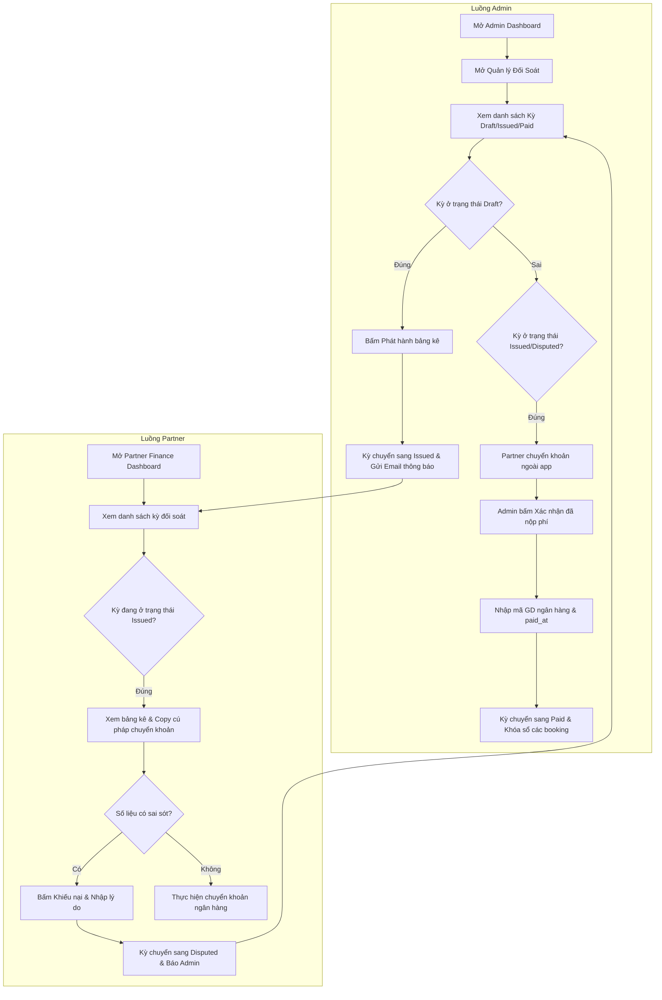
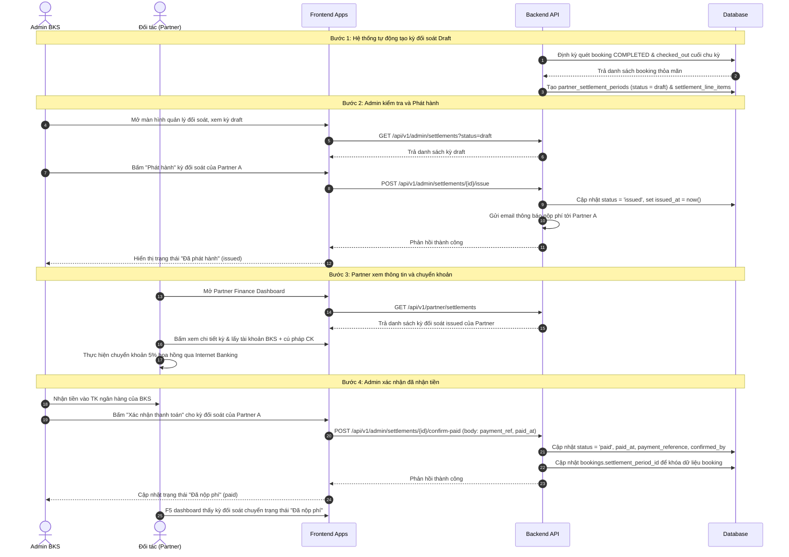
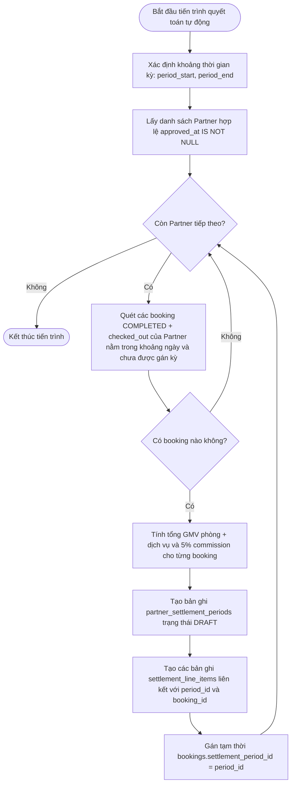
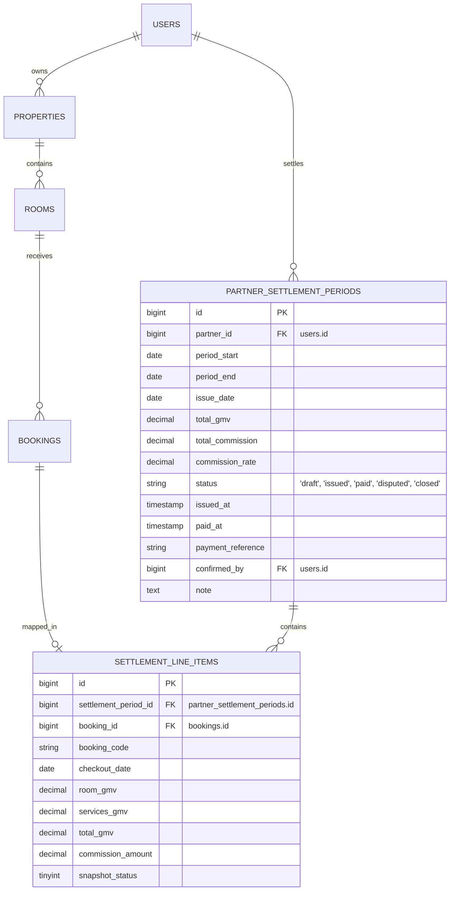

# SRS: Đối soát doanh thu Admin

## 1. Thông tin tài liệu
- **Mã tài liệu:** SRS-REC-001
- **Tên chức năng:** Đối soát doanh thu Admin (Admin Revenue Reconciliation)
- **Ngày tạo:** 2026-05-31
- **Nguồn đầu vào:** [docs/reports/domain/domain_review_admin_revenue_reconciliation.md](../reports/domain/domain_review_admin_revenue_reconciliation.md)
- **Màn hình liên quan:** Admin Dashboard, Admin Đối Soát Đối Tác, Chi Tiết Đối Soát Đối Tác, Partner Finance Dashboard
- **Trạng thái:** Draft cho phân tích / sẵn sàng sang design

---

## 2. Bối cảnh và mục tiêu

Hệ thống BKS đã có nền tảng dữ liệu để tính GMV và hoa hồng 5% theo mô hình hoa hồng thuần túy (commission-only) trong đó khách hàng thanh toán tại quầy trực tiếp cho đối tác (Partner), còn đối tác giữ tiền phòng và nộp lại phí nền tảng cho BKS. 

Tuy nhiên, hệ thống hiện chưa có luồng đối soát tài chính thực tế:
- Admin chỉ có biểu đồ GMV toàn hệ thống, chưa tách biệt doanh thu thực tế của nền tảng (Platform Commission).
- Chưa có khái niệm kỳ quyết toán, sổ ghi nhận công nợ của từng Partner, và trạng thái thanh toán phí ("đã nộp phí").
- Có sự không đồng nhất về thông tin tỉ lệ phí hoa hồng trên các giao diện (FAQ ghi 10%, onboarding hợp đồng ghi 12% trong khi code tính 5%).

### 2.1. Mục tiêu
- **Quản lý công nợ chặt chẽ:** Đảm bảo Admin theo dõi được chính xác Partner nào đã thanh toán phí nền tảng 5% định kỳ và số tiền còn nợ.
- **Tách biệt dòng tiền:** Làm rõ số tiền GMV của hệ thống (tiền phòng khách trả Partner) và doanh thu thực của BKS (Platform Commission 5%).
- **Đồng bộ hóa quy trình:** Triển khai quy trình đối soát định kỳ theo chu kỳ (ngày 05 và 20 hàng tháng) dựa trên các booking đã hoàn thành (`COMPLETED`) và khách đã rời đi (`checked_out`).
- **Đồng nhất thông tin:** Đồng bộ tỷ lệ phí hoa hồng nền tảng là 5% trên toàn hệ thống (FAQ, Onboarding Wizard, Hợp đồng, KPI, Đối soát).

---

## 3. Phạm vi

### 3.1. In scope
- **Đối soát định kỳ (Model A):** Admin lập bảng kê đối soát theo hai kỳ mỗi tháng (Kỳ 1: từ ngày 01 đến 15, phát hành ngày 05 tháng sau; Kỳ 2: từ ngày 16 đến cuối tháng, phát hành ngày 20 tháng sau).
- **Tính toán Platform Commission 5%:** Tính trên tổng GMV của booking bao gồm tiền phòng và tiền dịch vụ kèm theo (`booking_services`), chỉ áp dụng với các booking đã hoàn thành (`COMPLETED`) và khách đã check-out thực tế (`checked_out`), loại trừ no-show và hủy đơn.
- **Màn hình Admin Đối Soát Đối Tác:** Admin xem danh sách các kỳ đối soát, trạng thái thanh toán của từng Partner.
- **Màn hình Chi Tiết Kỳ Đối Soát:** Drill-down xem danh sách các booking trong kỳ đối soát, tổng GMV, chi tiết tiền phòng, tiền dịch vụ, và số tiền hoa hồng BKS thu.
- **Thao tác Admin:** Phát hành bảng kê đối soát (`issued`), Đánh dấu đã nộp phí (`paid`) kèm mã tham chiếu chuyển khoản ngân hàng của Partner, Xử lý khiếu nại (`disputed`), và Khóa sổ kỳ đối soát (`closed`).
- **Partner Finance Dashboard:** Đối tác xem các kỳ đối soát của mình, tải bảng kê đối soát (PDF/Excel), xem hướng dẫn chuyển khoản, và gửi yêu cầu khiếu nại nếu có sai lệch.
- **Đồng bộ tỷ lệ 5%:** Chỉnh sửa copy trên giao diện FAQ và Hợp đồng Onboarding thành 5% để thống nhất với code.

### 3.2. Out of scope
- **Cổng thanh toán trực tuyến (Payment Gateway):** Khách hàng chưa thể thanh toán trực tuyến trên app.
- **Tự động khấu trừ (Payout/Split Payment):** Hệ thống không tự động thu hộ hay khấu trừ vì dòng tiền phòng đi trực tiếp từ Khách hàng đến Partner tại quầy.
- **Ví điện tử nội bộ Partner (Internal Wallet):** Chưa xây dựng hệ thống ví điện tử nạp/rút tiền của Partner.

---

## 4. Đối tượng sử dụng và Phân quyền

- **Admin (Quản trị viên hệ thống):**
  - Xem Dashboard Revenue hệ thống với Platform Commission.
  - Quản lý, phê duyệt, phát hành, đánh dấu thanh toán, khóa sổ các kỳ đối soát.
  - Xem chi tiết từng booking và timeline audit để giải quyết tranh chấp.
- **Partner (Đối tác lưu trú / Chủ nhà):**
  - Xem lịch sử công nợ và các bảng kê đối soát của mình.
  - Tải file đối soát chi tiết.
  - Gửi khiếu nại (`disputed`) về các booking trong kỳ.
  - Xem thông tin tài khoản ngân hàng của BKS để chuyển khoản phí.

---

## 5. Luồng nghiệp vụ tổng thể và liên kết tài liệu SRC

### 5.1. Vị trí trong luồng nghiệp vụ
Chức năng đối soát nằm ở cuối chu kỳ vận hành của một booking. Sau khi khách hàng đã hoàn tất kỳ nghỉ (`COMPLETED` + `checked_out`), booking đó sẽ được gom vào kỳ đối soát tương ứng để tính phí hoa hồng.

```
[Khách đặt phòng (Pending)] 
     ↓
[Đối tác xác nhận (Confirmed)]
     ↓
[Khách check-in (Checked In)]
     ↓
[Khách check-out (Completed)] ──> [Gom vào Kỳ đối soát ngày 05/20] ──> [Đối tác chuyển khoản 5%] ──> [Admin khóa kỳ]
```

### 5.2. Liên kết tài liệu SRC
- [srs_partner_portal_360.md](srs_partner_portal_360.md): Kế thừa định nghĩa trạng thái booking (`status`), stay status (`stay_status`), và timeline events để tra cứu thông tin audit khi có tranh chấp.
- [srs_booking_cancellation_policy.md](srs_booking_cancellation_policy.md): Đồng bộ logic xử lý trạng thái hủy `pending_cancellation` (status 4) và hủy hoàn toàn (status 2) — các đơn này không được đưa vào kỳ đối soát.
- [db_overview_etc_core_schema.md](../databases_docs/db_overview_etc_core_schema.md): Schema cơ sở dữ liệu canonical lưu trữ thông tin bookings, room_prices, users, partner_info.

---

## 6. Yêu cầu chức năng

### FR-REC-01. Phân tách Doanh thu hệ thống (GMV) và Phí nền tảng (Commission)
- **Hệ thống** phải tính toán Platform Commission = GMV × 5% cho mỗi booking đủ điều kiện.
- **GMV của booking** = Tiền phòng (`room_prices.price` × số đêm proration) + Tiền dịch vụ kèm theo (`booking_services` × `services.price`).
- **Dashboard Admin** phải hiển thị rõ hai chỉ số: Tổng GMV hệ thống (tổng tiền phòng/dịch vụ giao dịch) và Doanh thu thực tế BKS (tổng hoa hồng 5%).

### FR-REC-02. Gom kỳ đối soát tự động
- **Hệ thống** định kỳ quét toàn bộ booking đủ điều kiện để tạo bản nháp (`draft`) kỳ đối soát cho từng Partner:
  - **Kỳ 1 (01 - 15 hàng tháng):** Quét các booking có ngày check-out (`end_date`) từ ngày 01 đến ngày 15. Tạo bản nháp vào ngày 16, phát hành (`issued`) vào ngày 05 tháng sau.
  - **Kỳ 2 (16 - cuối tháng):** Quét các booking có ngày check-out (`end_date`) từ ngày 16 đến ngày cuối cùng của tháng. Tạo bản nháp vào ngày 01 tháng sau, phát hành (`issued`) vào ngày 20 tháng sau.
- **Điều kiện booking vào kỳ đối soát:**
  - `bookings.status = 3` (COMPLETED).
  - `bookings.stay_status = 'checked_out'`.
  - `bookings.no_show_at IS NULL`.
  - `bookings.settlement_period_id IS NULL` (chưa thuộc kỳ đối soát nào khác để tránh trùng lặp).
  - Đối tác sở hữu phòng phải hợp lệ (`partner_info.approved_at IS NOT NULL`).

### FR-REC-03. Quản lý trạng thái kỳ đối soát
- Kỳ đối soát phải tuân thủ nghiêm ngặt vòng đời trạng thái:
  - **`draft` (Bản nháp):** Hệ thống tự động gom dữ liệu cuối kỳ. Admin có thể xem trước, kiểm tra chênh lệch.
  - **`issued` (Đã phát hành):** Admin gửi bảng kê cho Partner. Hệ thống gửi email thông báo và hiển thị trên Partner UI. Hạn thanh toán mặc định là +7 ngày làm việc kể từ ngày phát hành.
  - **`paid` (Đã nộp phí):** Admin xác nhận đã nhận chuyển khoản của Partner, điền mã tham chiếu giao dịch.
  - **`disputed` (Tranh chấp):** Partner khiếu nại sai số liệu. Kỳ đối soát bị tạm ngưng chuyển sang `paid` cho đến khi Admin giải quyết xong và re-issue hoặc điều chỉnh thủ công.
  - **`closed` (Khóa sổ):** Kỳ đối soát đã hoàn tất thanh toán và đóng lại, không cho phép sửa đổi dữ liệu booking trong kỳ này nữa.

### FR-REC-04. Chi tiết kỳ đối soát & Drill-down
- Admin và Partner có thể xem chi tiết kỳ đối soát gồm danh sách các dòng dữ liệu (`settlement_line_items`).
- Mỗi dòng dữ liệu hiển thị: Mã đơn đặt phòng (`booking_code`), Ngày check-out (`checkout_date`), Tiền phòng (`room_gmv`), Tiền dịch vụ (`services_gmv`), Tổng tiền (`total_gmv`), và Phí hoa hồng (`commission_amount`).
- Cho phép Admin click vào `booking_code` để chuyển hướng sang màn hình xem chi tiết lịch sử audit timeline (`booking_timeline_events`) của đơn đó.

### FR-REC-05. Ghi nhận thanh toán và Đối chiếu công nợ
- Khi Partner chuyển khoản, Admin đối chiếu tài khoản ngân hàng và thực hiện hành động **"Xác nhận đã nộp phí"** trên hệ thống.
- Bắt buộc nhập các trường thông tin: Mã tham chiếu ngân hàng (`payment_reference`), Ngày thanh toán (`paid_at`), Ghi chú (`note`). Hệ thống tự động ghi nhận Admin thực hiện (`confirmed_by`).
- Trường hợp Partner chuyển khoản thiếu tiền, hệ thống không cho chuyển sang trạng thái `paid` mà yêu cầu giữ ở trạng thái `issued` hoặc `disputed`, ghi nhận số tiền thiếu vào phần Ghi chú.

### FR-REC-06. Giải quyết tranh chấp và Điều chỉnh thủ công
- Nếu Partner gửi khiếu nại (ví dụ: khách thực tế no-show nhưng quên bấm nút trên app nên đơn bị tính COMPLETED), kỳ đối soát chuyển sang `disputed`.
- Admin giải quyết bằng các cách:
  - Sửa lại trạng thái booking về đúng thực tế (nếu kỳ chưa khóa).
  - Hoặc nhập **dòng điều chỉnh (Adjustment Entry)** có giá trị âm hoặc dương vào kỳ đối soát hiện tại hoặc kỳ tiếp theo để bù trừ công nợ. Bắt buộc nhập lý do điều chỉnh.

### FR-REC-07. Đồng bộ copy 5% trên UI
- Thay đổi toàn bộ các câu thông tin tĩnh, FAQ, và mẫu hợp đồng trên giao diện:
  - Trang đăng ký đối tác (`BecomeAPartner/index.tsx`): Sửa FAQ từ "trừ 10%" thành "phí nền tảng 5%".
  - Trang mẫu hợp đồng (`PartnerOnboardingWizard.tsx`): Sửa điều khoản "chiết khấu 12%" thành "phí dịch vụ nền tảng 5%".

---

## 7. Danh mục chức năng và mục đích nghiệp vụ

| Function ID | Hành động người dùng | Hành vi hệ thống | Mục đích nghiệp vụ |
|---|---|---|---|
| F-REC-01 | Admin xem Dashboard | Hiển thị biểu đồ Platform Commission MTD/YTD song song với GMV hệ thống | Giúp Admin nắm rõ doanh thu thực tế của nền tảng BKS |
| F-REC-02 | Admin xem danh sách đối soát | Hiển thị danh sách các kỳ đối soát theo Partner, lọc theo trạng thái (`draft`, `issued`, `paid`, `disputed`) | Theo dõi tình hình công nợ của toàn bộ đối tác |
| F-REC-03 | Admin phát hành đối soát | Chuyển kỳ đối soát từ `draft` sang `issued`, gửi email thông báo kèm link bảng kê cho Partner | Gửi thông báo yêu cầu Partner nộp phí đúng hạn |
| F-REC-04 | Partner xem trang Tài chính | Hiển thị danh sách các kỳ đối soát `issued`/`paid`, thông tin tài khoản ngân hàng của BKS, và hướng dẫn cú pháp chuyển khoản | Giúp Partner nộp phí đúng kỳ và đúng cú pháp |
| F-REC-05 | Partner gửi khiếu nại | Cho phép Partner bấm "Khiếu nại", nhập lý do khiếu nại, chuyển trạng thái kỳ sang `disputed` | Ghi nhận phản hồi sai sót số liệu từ Partner |
| F-REC-06 | Admin xác nhận thanh toán | Admin nhập mã GD ngân hàng, chuyển trạng thái kỳ sang `paid`, hệ thống khóa các booking liên quan | Xác nhận đã thu tiền phí, cập nhật giảm trừ công nợ |
| F-REC-07 | Admin điều chỉnh kỳ | Cho phép Admin thêm dòng điều chỉnh công nợ (+/- tiền) kèm lý do chi tiết | Xử lý các sai lệch nghiệp vụ thực tế hoặc làm tròn tiền |
| F-REC-08 | Đối tác xuất file đối soát | Cho phép xuất danh sách line items dưới dạng Excel / PDF | Phục vụ lưu trữ chứng từ nội bộ của đối tác |

---

## 8. Đặc tả dữ liệu và Hiển thị UI

### 8.1. Màn hình Admin Đối Soát Đối Tác (Bảng chính)
Hiển thị danh sách kỳ đối soát của các đối tác:
- **Bộ lọc:** Tên Partner, Kỳ đối soát (Tháng/Năm), Trạng thái (`draft`, `issued`, `paid`, `disputed`, `closed`).
- **Các cột hiển thị:**
  - Mã đối soát (`period_code`: vd. `BKS-SETTLE-P12-202605-P1`)
  - Đối tác (`partner_name`)
  - Khoảng thời gian (`period_start` - `period_end`)
  - Ngày phát hành (`issue_date`)
  - Tổng GMV phòng (`total_room_gmv`)
  - Tổng GMV dịch vụ (`total_services_gmv`)
  - Tổng GMV kỳ (`total_gmv`)
  - Phí hoa hồng cần thu (`total_commission` = 5% tổng GMV)
  - Trạng thái (`status`)
  - Ngày thanh toán (`paid_at` - nullable)
  - Hành động: `Chi tiết`, `Phát hành` (nếu là draft), `Xác nhận thanh toán` (nếu là issued/disputed).

### 8.2. Màn hình Chi Tiết Kỳ Đối Soát (Admin & Partner dùng chung)
Hiển thị chi tiết các booking trong kỳ đối soát:
- **Thông tin chung:** Mã đối soát, Tên đối tác, Thông tin ngân hàng đối tác, Trạng thái, Ngày thanh toán, Người xác nhận, Ghi chú điều chỉnh.
- **Bảng danh sách booking (Line Items):**
  - Mã booking (`booking_code` - click để sang màn hình chi tiết booking)
  - Phòng (`room_number` - `room_title`)
  - Ngày check-out (`checkout_date` = `bookings.end_date`)
  - Tiền phòng (`room_gmv` = `price` × `nights` proration)
  - Tiền dịch vụ (`services_gmv` = tổng tiền các dịch vụ đã dùng)
  - Tổng doanh thu booking (`total_gmv` = phòng + dịch vụ)
  - Phí hoa hồng BKS (5%) (`commission_amount`)
  - Trạng thái booking tại thời điểm chốt (`snapshot_status` = COMPLETED)
- **Khu vực Adjustment (Điều chỉnh thủ công):**
  - Bảng ghi nhận các dòng điều chỉnh do Admin nhập tay: Số tiền tăng/giảm (+/-), Lý do điều chỉnh, Admin thực hiện, Ngày thực hiện.
- **Tổng cộng cuối trang:**
  - Tổng GMV Booking
  - Tổng Phí hoa hồng theo đơn
  - Tổng điều chỉnh lũy kế
  - **Thực thu cuối cùng (Net Commission to Pay)** = Tổng phí hoa hồng + Tổng điều chỉnh.

### 8.3. Màn hình Partner Finance Dashboard
Màn hình nằm trong Partner Portal:
- **Khối thông tin công nợ:**
  - Số dư nợ hiện tại (chưa thanh toán của các kỳ đã phát hành).
  - Ước tính phí kỳ này (MTD - Realtime forecast từ các đơn COMPLETED chưa vào kỳ).
- **Thông tin tài khoản nhận tiền của BKS:**
  - Ngân hàng: Ngân hàng TMCP Ngoại thương Việt Nam (Vietcombank)
  - Số tài khoản: 999888777666
  - Chủ tài khoản: CONG TY CO PHAN CONG NGHE BKS STAY
  - Cú pháp chuyển khoản bắt buộc: `BKS-SETTLE-{partner_id}-{period_code}` (Hệ thống tự động sinh nút copy cú pháp này).
- **Danh sách bảng kê đối soát:** Partner xem danh sách kỳ của mình, trạng thái, nút "Khiếu nại" (chỉ hiển thị khi trạng thái là `issued`), nút "Tải PDF/Excel".

---

## 9. Quy tắc dữ liệu và Ràng buộc validation

### 9.1. Quy tắc gom đơn và chốt kỳ
- Chỉ các đơn thỏa mãn **quy tắc chốt đơn** mới được đưa vào kỳ:
  ```sql
  status = 3 (COMPLETED)
  AND stay_status = 'checked_out'
  AND no_show_at IS NULL
  AND settlement_period_id IS NULL
  AND end_date BETWEEN period_start AND period_end
  AND partner_info.approved_at IS NOT NULL
  ```
- **Ranh giới thời gian:** Ngày check-out (`end_date`) được tính theo múi giờ Việt Nam (`Asia/Ho_Chi_Minh`). Booking check-out đúng 23:59:59 ngày 15/05 sẽ vào Kỳ 1. Booking check-out lúc 00:00:00 ngày 16/05 sẽ vào Kỳ 2.
- **Tránh tính trùng (Double-counting):** Khi booking được gán vào một kỳ đối soát (`settlement_line_items`), hệ thống phải cập nhật cột `bookings.settlement_period_id = partner_settlement_periods.id` để khóa đơn này khỏi các kỳ chạy quét tự động tiếp theo.

### 9.2. Quy tắc thay đổi dữ liệu sau phát hành
- Khi kỳ đối soát ở trạng thái `issued`, `paid`, hoặc `closed`, hệ thống **khóa không cho phép đối tác hoặc admin sửa đổi** thông tin liên quan đến giá phòng, giá dịch vụ hoặc trạng thái của các booking thuộc kỳ đó.
- Mọi điều chỉnh tài chính bắt buộc phải đi qua cơ chế nhập dòng điều chỉnh (Adjustment) hoặc bổ sung vào kỳ sau.

### 9.3. Ràng buộc khi xác nhận thanh toán (Mark Paid)
- Admin bắt buộc phải nhập `payment_reference` (mã giao dịch ngân hàng thực tế, độ dài từ 5 đến 100 ký tự).
- `paid_at` phải nhỏ hơn hoặc bằng thời gian hiện tại.
- Số tiền thanh toán thực nhận phải khớp với số tiền hoa hồng cần thu (sau điều chỉnh). Nếu lệch thiếu, Admin ghi nhận vào `note` và giữ kỳ ở trạng thái `issued` hoặc `disputed` chứ không chuyển sang `paid`.

---

## 10. Luồng màn hình (Screen Flow)



---

## 11. Sequence Diagram (Main Scenario - Luồng phát hành & nộp phí thành công)



---

## 12. Flow xử lý chức năng (Functional Processing Flow - Chạy quyết toán kỳ)



---

## 13. ERD Draft (Mô hình thực thể đối soát)



---

## 14. Thiết kế Cơ sở dữ liệu đề xuất (Cấp độ xem xét khách hàng)

Dựa trên baseline [db_overview_etc_core_schema.md](../databases_docs/db_overview_etc_core_schema.md), đề xuất bổ sung 2 bảng mới và 2 cột vào bảng `bookings`.

### 14.1. Bảng mới: `partner_settlement_periods`
Lưu trữ thông tin tổng hợp của một kỳ đối soát của đối tác.

| Tên cột | Kiểu dữ liệu | Cho phép Null | Khóa | Liên kết | Mô tả / Ràng buộc |
|---|---|---|---|---|---|
| `id` | bigint | Không | PK | - | Khóa chính tự tăng |
| `partner_id` | bigint | Không | FK | `users.id` | ID của đối tác được đối soát |
| `period_start` | date | Không | - | - | Ngày bắt đầu kỳ đối soát (vd: 2026-05-01) |
| `period_end` | date | Không | - | - | Ngày kết thúc kỳ đối soát (vd: 2026-05-15) |
| `issue_date` | date | Không | - | - | Ngày phát hành bảng kê (vd: 2026-06-05) |
| `total_gmv` | decimal(15,2) | Không | - | - | Tổng GMV của kỳ (phòng + dịch vụ) |
| `total_commission` | decimal(15,2) | Không | - | - | Tổng phí hoa hồng BKS cần thu (GMV × rate) |
| `commission_rate` | decimal(5,4) | Không | - | - | Tỷ lệ hoa hồng áp dụng, mặc định `0.0500` (5%) |
| `status` | varchar(20) | Không | - | - | Trạng thái: `draft`, `issued`, `paid`, `disputed`, `closed` |
| `issued_at` | timestamp | Có | - | - | Thời điểm Admin bấm phát hành |
| `paid_at` | timestamp | Có | - | - | Thời điểm đối tác nộp tiền và Admin xác nhận |
| `payment_reference` | varchar(100) | Có | - | - | Mã giao dịch ngân hàng đối tác chuyển khoản |
| `confirmed_by` | bigint | Có | FK | `users.id` | Admin xác nhận đã nhận tiền |
| `note` | text | Có | - | - | Ghi chú hoặc lý do điều chỉnh |
| `created_at` | timestamp | Có | - | - | Thời điểm tạo bản ghi |
| `updated_at` | timestamp | Có | - | - | Thời điểm cập nhật bản ghi |

- **Ràng buộc duy nhất (Unique Constraint):** `(partner_id, period_start, period_end)` để tránh tạo trùng kỳ đối soát cho cùng một đối tác trong cùng một khoảng thời gian.

### 14.2. Bảng mới: `settlement_line_items`
Lưu trữ chi tiết các đơn đặt phòng thuộc kỳ đối soát.

| Tên cột | Kiểu dữ liệu | Cho phép Null | Khóa | Liên kết | Mô tả / Ràng buộc |
|---|---|---|---|---|---|
| `id` | bigint | Không | PK | - | Khóa chính tự tăng |
| `settlement_period_id` | bigint | Không | FK | `partner_settlement_periods.id` | Liên kết với kỳ đối soát chính (ON DELETE CASCADE) |
| `booking_id` | bigint | Không | FK | `bookings.id` | Liên kết với booking được đối soát |
| `booking_code` | varchar(32) | Không | - | - | Denormalize mã booking để tra cứu nhanh |
| `checkout_date` | date | Không | - | - | Ngày check-out thực tế của khách |
| `room_gmv` | decimal(15,2) | Không | - | - | Tiền phòng của booking tại thời điểm chốt kỳ |
| `services_gmv` | decimal(15,2) | Không | - | - | Tiền dịch vụ kèm theo của booking tại thời điểm chốt kỳ |
| `total_gmv` | decimal(15,2) | Không | - | - | Tổng tiền booking (`room_gmv` + `services_gmv`) |
| `commission_amount` | decimal(15,2) | Không | - | - | Tiền hoa hồng của booking đó (`total_gmv` × `commission_rate`) |
| `snapshot_status` | tinyint | Không | - | - | Trạng thái booking tại thời điểm đối soát (mặc định `3` - Completed) |
| `created_at` | timestamp | Có | - | - | Thời điểm tạo bản ghi |
| `updated_at` | timestamp | Có | - | - | Thời điểm cập nhật |

### 14.3. Mở rộng bảng hiện có: `bookings`
Thêm các cột tùy chọn phục vụ liên kết đối soát.

| Tên cột | Kiểu dữ liệu | Cho phép Null | Khóa | Liên kết | Mô tả |
|---|---|---|---|---|---|
| `payment_collected_at` | timestamp | Có | - | - | Thời điểm Partner xác nhận "đã thu tiền khách tại quầy" |
| `settlement_period_id` | bigint | Có | FK | `partner_settlement_periods.id` | Liên kết kỳ đối soát đang chứa booking này (giúp chặn double-count và khóa đơn) |

---

## 15. Ánh xạ dữ liệu và Di trú hệ thống cũ (Legacy Mapping)

| VB6 Legacy Screen / Function | Laravel Module tương ứng | Bảng cơ sở dữ liệu Laravel | Ghi chú di trú |
|---|---|---|---|
| Không có chức năng đối soát | Admin Revenue Reconciliation (Mới) | `partner_settlement_periods`, `settlement_line_items` | Đây là module phát triển mới hoàn toàn, không có dữ liệu cũ cần migrate. |
| Dashboard báo cáo GMV hệ thống | Admin Dashboard (Cải tiến) | `bookings` join `room_prices` | Sửa query để tách biệt **GMV hệ thống** và **Platform Commission BKS** (GMV × 5%). |
| Màn hình đăng ký Partner / FAQ | Partner Onboarding & FAQ (Cập nhật copy) | Tĩnh (Frontend code) | Đồng bộ toàn bộ mô tả hoa hồng về **5%** cố định. |

---

## 16. Tiêu chí nghiệm thu (Acceptance Criteria)

### UAT-REC-01: Kiểm tra tính đúng đắn của kỳ đối soát tự động
- **Kịch bản:** Partner A có 3 booking COMPLETED check-out trong nửa đầu tháng 5 (từ 01/05 đến 15/05), 1 booking CONFIRMED nhưng chưa check-out, và 1 booking no-show. Hệ thống tự động tạo kỳ đối soát nháp cho Partner A vào ngày 16/05.
- **Kết quả mong đợi:** Kỳ đối soát nháp chỉ chứa đúng **3 line items** tương ứng với 3 booking COMPLETED và checked_out. Booking CONFIRMED và no-show không được xuất hiện. Tổng GMV và commission tính chính xác theo tỷ lệ 5%.

### UAT-REC-02: Tính toán bao gồm dịch vụ kèm theo
- **Kịch bản:** Booking B có tiền phòng là 2,000,000đ và có sử dụng dịch vụ giặt ủi + đưa đón sân bay trị giá 500,000đ. Đơn này check-out thành công và đưa vào kỳ đối soát.
- **Kết quả mong đợi:** Dòng dữ liệu hiển thị `room_gmv = 2,000,000đ`, `services_gmv = 500,000đ`, `total_gmv = 2,500,000đ`. Hoa hồng 5% tính trên tổng GMV là `125,000đ` (thay vì chỉ tính trên tiền phòng là 100,000đ).

### UAT-REC-03: Khóa dữ liệu sau khi chốt kỳ
- **Kịch bản:** Kỳ đối soát của Partner A đã được Admin xác nhận thanh toán và chuyển trạng thái sang `paid` (hoặc `closed`). Admin hoặc Partner tìm cách sửa giá phòng hoặc chuyển trạng thái của một booking thuộc kỳ đó về `cancelled`.
- **Kết quả mong đợi:** Hệ thống từ chối sửa đổi, trả về mã lỗi 403 Forbidden hoặc lỗi Validation cảnh báo booking đã được chốt đối soát.

### UAT-REC-04: Xử lý khiếu nại (Disputed Flow)
- **Kịch bản:** Partner nhận bảng kê thấy sai số liệu, bấm nút "Khiếu nại" trên dashboard và nhập nội dung.
- **Kết quả mong đợi:** Trạng thái kỳ chuyển sang `disputed`. Phía Admin nhận được cảnh báo kỳ đối soát của Partner đang bị tranh chấp. Hệ thống cho phép Admin xem audit timeline để đối chiếu thông tin và nhập dòng điều chỉnh giảm trừ tiền hoa hồng.

### UAT-REC-05: Đồng bộ copy tỷ lệ hoa hồng
- **Kịch bản:** Kiểm thử giao diện đăng ký đối tác mới và xem hợp đồng mẫu trên wizard onboarding.
- **Kết quả mong đợi:** Tất cả các vị trí hiển thị con số hoa hồng đều ghi rõ **5%**, không còn xuất hiện con số 10% hay 12%.

---

## 17. Rủi ro và Giải pháp giảm thiểu

### Rủi ro 1: Trì hoãn công nợ (Partner cố tình không check-out)
- **Chi tiết:** Partner cố tình giữ đơn ở trạng thái `CONFIRMED` quá ngày check-out thực tế để hoãn việc đơn bị gom vào kỳ đối soát nộp phí.
- **Giải pháp:** Hệ thống chạy Job quét hàng ngày: Nếu booking có ngày `end_date` đã quá 3 ngày so với hiện tại nhưng status vẫn là `CONFIRMED` thì tự động gửi cảnh báo (Alert/Email) yêu cầu Partner cập nhật trạng thái. Đồng thời cho phép Admin force close hoặc tự động chuyển sang COMPLETED để đối soát nếu quá hạn phản hồi.

### Rủi ro 2: Giao dịch ngoài sàn (Hủy đơn để trốn phí)
- **Chi tiết:** Khách hàng đến ở thực tế, Partner thu tiền mặt tại quầy nhưng bấm nút Hủy (Cancel) hoặc No-show trên hệ thống để tránh bị tính 5% hoa hồng.
- **Giải pháp:** BKS áp dụng điều khoản phạt trong hợp đồng onboarding nếu phát hiện giao dịch ngoài sàn. Admin thực hiện kiểm tra ngẫu nhiên (Audit) bằng cách gọi điện cho khách hàng xác minh. Flag các đối tác có tỷ lệ hủy đơn hoặc báo no-show cao bất thường (> 20% tổng đơn) để Admin theo dõi đặc biệt.

### Rủi ro 3: Tranh chấp ranh giới múi giờ (Timezone boundary check-out)
- **Chi tiết:** Đơn check-out sát nút ranh giới (ví dụ 15/05 lúc 23:59:00 theo múi giờ server UTC nhưng là 06:59:00 ngày 16/05 giờ Việt Nam).
- **Giải pháp:** Toàn bộ logic lọc và so sánh ngày của Job đối soát bắt buộc ép múi giờ `Asia/Ho_Chi_Minh` để đồng bộ với hoạt động thực tế tại Việt Nam.

---

## 18. Kết luận
Tài liệu SRS này đặc tả chi tiết yêu cầu của Module Đối Soát Doanh Thu Admin (Model A). Bằng cách bổ sung các bảng lưu trữ kỳ đối soát và chi tiết dòng dữ liệu, phân tách rõ GMV hệ thống và Platform Commission, đồng thời chuẩn hóa quy trình thanh toán thủ công qua tài khoản ngân hàng của BKS, hệ thống BKS Stay sẽ đảm bảo tính minh bạch, hạn chế thất thoát phí nền tảng và sẵn sàng nâng cấp lên luồng thu hộ tự động (Model B) khi tích hợp cổng thanh toán ở các giai đoạn sau.
