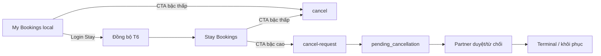
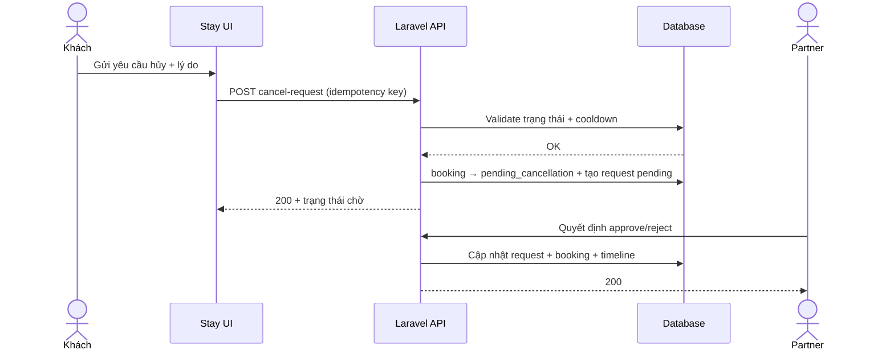
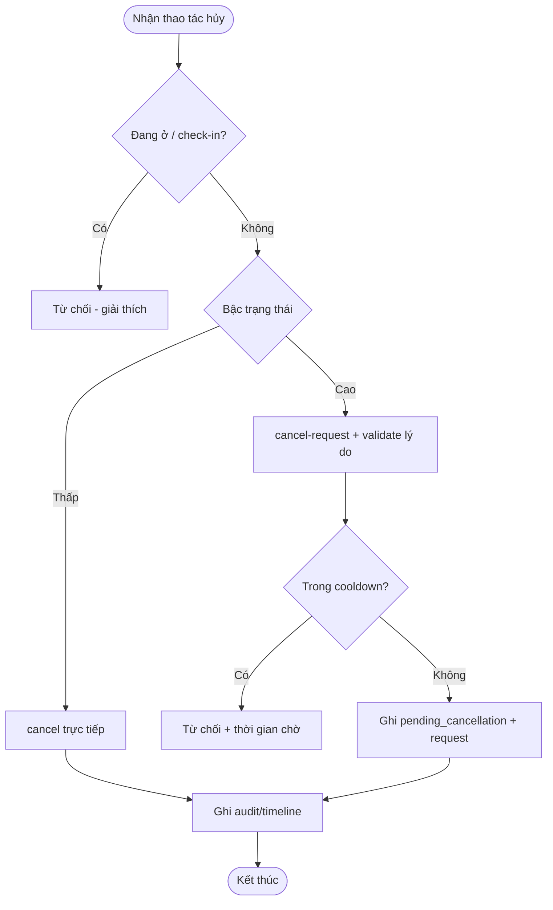
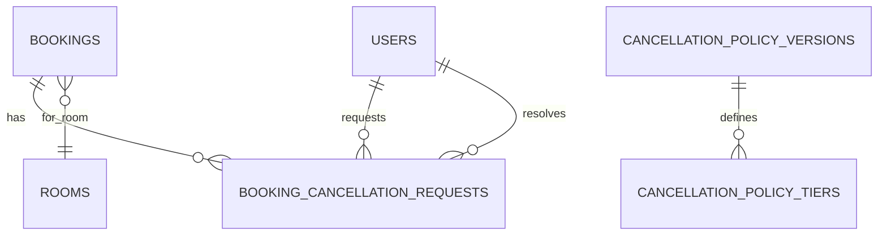

# Chính sách yêu cầu hủy phòng (khách & Partner) — Software Requirements Specification (SRS)

## Overview

Tài liệu đặc tả nghiệp vụ và hành vi hệ thống cho **yêu cầu hủy đặt phòng** theo **thời gian** (mốc so với ngày nhận phòng) và **trạng thái đơn**, áp dụng đồng thời cho:

- **My Bookings** (kênh công khai, có đơn lưu cục bộ trên trình duyệt trước khi đồng bộ).
- **BKS Stay** (kênh đã đăng nhập, nguồn sự thật ưu tiên **server**; đồng bộ với tích hợp ngoài khi có).

Phạm vi migration: chuẩn hóa từ mô hình **demo/local-only** sang **Laravel API + DB + audit + metric**, đồng bộ với Partner Portal đã có luồng Partner hủy/từ chối booking (`srs_partner_portal_360.md`).

## Business Context and Goals

### Vấn đề nghiệp vụ

Khách và Partner cần **cùng một ngôn ngữ trạng thái**: khi nào khách **hủy ngay được**, khi nào phải **gửi yêu cầu hủy** và chờ Partner duyệt; tránh hiểu nhầm “đã bấm hủy trên web là đã chấm dứt hợp đồng với chỗ nghỉ”.

### Mục tiêu kinh doanh

| Mục tiêu | Ý nghĩa |
|---|---|
| Minh bạch trách nhiệm | Partner là bên **phê duyệt** sau khi khách gửi yêu cầu hủy ở các trạng thái “cao”. |
| Giảm tranh chấp | Trạng thái trung gian **`pending_cancellation`** + thông báo rõ “đang chờ Partner”. |
| Đo lường vận hành | SLA xử lý yêu cầu, tỷ lệ yêu cầu **không bị treo** quá ngưỡng, xu hướng giảm hotline (tham chiếu benchmark OTA). |

### Chỉ số thành công (B7 — đo từ DB)

| KPI | Cách đo (gợi ý) | Ghi chú |
|---|---|---|
| SLA Partner | `resolved_at - requested_at` trên bản ghi yêu cầu hủy | Báo cáo p50/p90 nội bộ |
| % không treo | % yêu cầu có thời gian ở trạng thái chờ < ngưỡng vận hành hoặc đã kết thúc | Ngưỡng giờ chốt ở design |
| Hotline | Đếm ticket/cuộc gọi gắn tag “hủy” theo quý | So sánh trước/sau go-live |

## User Roles and Access Scope

| Vai trò | Quyền liên quan hủy |
|---|---|
| **Khách (End User / Stay)** | Xem đơn của mình; **hủy trực tiếp** khi đơn ở **bậc trạng thái thấp**; **gửi yêu cầu hủy** khi đơn ở **bậc cao**; nhập **lý do bắt buộc** theo quy định từng luồng. |
| **Partner** | Xem đơn thuộc tài sản mình; **duyệt / từ chối** yêu cầu hủy của khách khi đơn đang **`pending_cancellation`**; vẫn có luồng **hủy/từ chối** chủ động từ Partner Portal (đã mô tả ở SRS Partner). |
| **Admin BKS** | Xem/điều phối khi có quy trình vận hành (ngoài phạm vi chi tiết UI trong SRS này nếu chưa có màn hình). |

**Lưu ý kênh My Bookings (chưa đăng nhập):** dữ liệu có thể chỉ tồn tại trên thiết bị cho đến khi **đồng bộ lên server** sau khi khách đăng nhập Stay; khách cần được cảnh báo rõ phạm vi “chỉ trên thiết bị”.

## Scope

### In Scope

1. Phân **hai lộ thao tác** theo bậc trạng thái: **`cancel`** (hủy trực tiếp trong phạm vi cho phép) và **`cancel-request`** (yêu cầu hủy → `pending_cancellation` → Partner xử lý).
2. Trạng thái trung gian **`pending_cancellation`** trên booking (hoặc tương đương hiển thị đồng bộ với DB).
3. **Lý do hủy bắt buộc** (danh mục mã lý do + ô ghi chú khi cần).
4. **Cooldown** giữa các lần **gửi lại** `cancel-request` trên cùng một booking (tham số cấu hình, số cụ thể chốt ở design).
5. **Đồng bộ đơn local → server** sau đăng nhập Stay (chống trùng bằng fingerprint/không dùng local id làm PK server).
6. **Audit** thao tác hủy/yêu cầu hủy/duyệt (actor, thời điểm, phiên bản chính sách phí nếu áp dụng).
7. **Bảng phí–hoàn tiền** theo **mốc thời gian**, tách **đơn ngắn hạn** và **đơn dài hạn** (cấu trúc + placeholder %; số % điền sau research OTA + pháp lý VN).
8. **Metric B7** như bảng KPI ở trên.

### Out of Scope

- **Tự động hoàn tiền** qua cổng thanh toán cho đến khi có nguồn tiền và hợp đồng đối soát rõ.
- **Trả phòng sớm / no-show** xử lý như “hủy đặt” (các case này giữ tách biệt; có thể mở SRS riêng sau).
- **Phân biệt phí theo từng Partner hoặc từng loại phòng** trong giai đoạn đầu (đã chốt tạm thời không tách).

## Functional Requirements

| ID | Yêu cầu | Mức ưu tiên | Tín hiệu chấp nhận (kiểm thử nghiệp vụ) |
|---|---|---|---|
| BCP-001 | Hệ thống phải **chặn hủy đặt** (theo nghĩa business) khi khách **đang ở** hoặc **đã check-in** (`stay_status` tương ứng). | Must | Khách không thấy CTA hủy / API trả lỗi dễ hiểu. |
| BCP-002 | Với đơn ở **bậc trạng thái thấp** (Partner **chưa** xác nhận hoặc tương đương nghiệp vụ đã chốt), khách được **`cancel`** — kết thúc đơn **không** cần `pending_cancellation`. | Must | Sau thao tác, đơn ở trạng thái terminal hủy phù hợp policy; có audit. |
| BCP-003 | Với đơn ở **bậc cao** (Partner **đã** xác nhận trở đi), khách chỉ được **`cancel-request`**; booking chuyển **`pending_cancellation`** cho đến khi Partner xử lý. | Must | UI/API hiển thị “chờ Partner”; Partner thấy việc cần làm. |
| BCP-004 | Đơn **chờ thanh toán / chờ xác nhận** (theo enum nội bộ): **Partner xem xét** — không tự động chấm dứt chỉ vì rule thời gian nếu chưa có quy tắc khác. | Must | Luồng khớp ma trận trạng thái đã chốt trong lead; không có “auto-cancel” trái policy. |
| BCP-005 | Mọi **`cancel-request`** phải có **lý do**: **mã lý do** + **ghi chú** khi rule yêu cầu. | Must | Thiếu lý do → 422 + thông báo thân thiện. |
| BCP-006 | Hệ thống phải áp dụng **cooldown** giữa các lần **gửi lại** `cancel-request` trên **cùng** `booking_id` (server-side; client có thể mirror để UX). | Should | Gửi lại quá sớm → 429 hoặc mã lỗi riêng + thời gian chờ còn lại. |
| BCP-007 | **Idempotency**: lặp lại cùng một yêu cầu hợp lệ không tạo trùng bản ghi yêu cầu / không làm sai lệch trạng thái. | Should | Gọi lại với cùng khóa client → kết quả ổn định. |
| BCP-008 | Sau **đăng nhập Stay thành công**, client có thể gọi API **đồng bộ đơn local**; server **ghép/trùng** theo **fingerprint** và trả `server_booking_id`. | Must | Không tạo đơn trùng cho cùng một nghiệp vụ; local được cập nhật map id. |
| BCP-009 | Partner có thể **chấp nhận** hoặc **từ chối** yêu cầu hủy; mọi thay đổi ghi **audit** và (khuyến nghị) **timeline** booking. | Must | Lịch sử hiển thị cho Partner và (phù hợp) cho khách ở mức tóm tắt. |
| BCP-010 | Hệ thống phải tính **phân loại đơn ngắn hạn / dài hạn** theo **số đêm** (ngưỡng do nghiệp vụ chốt; **mặc định phân tích đề xuất căn chỉnh với quy ước Partner Portal: ≥ 30 đêm = dài hạn**). | Must | Cùng mốc thời gian T-7d/T-3d/… áp dụng **bảng % đúng hàng** (ngắn vs dài). |
| BCP-011 | Mọi lần áp dụng bảng phí phải ghi nhận **`policy_version`** (và loại đơn ngắn/dài) để đối soát sau này. | Should | Audit có thể truy vết phiên bản chính sách. |

## Screen and User Flow

### Luồng chính — Khách hủy trên Stay (server là nguồn sự thật)

1. Khách mở chi tiết đơn.
2. Hệ thống kiểm tra `stay_status` và bậc trạng thái.
3. Nếu **đang ở / đã check-in** → không cho hủy đặt; hiển thị giải thích.
4. Nếu **bậc thấp** → hiển thị CTA **Hủy đặt** → xác nhận → gọi **`cancel`** → đơn kết thúc theo policy.
5. Nếu **bậc cao** → hiển thị CTA **Gửi yêu cầu hủy** → form **lý do bắt buộc** → gọi **`cancel-request`** → trạng thái **`pending_cancellation`** → thông báo chờ Partner.
6. Partner xử lý → **chấp nhận** (đơn chuyển trạng thái terminal hủy) hoặc **từ chối** (đơn quay về trạng thái nghiệp vụ trước yêu cầu — chi tiết chốt ở design).
7. Ghi audit + cập nhật metric thời điểm request/resolve.

### Luồng thay thế — My Bookings (local + đồng bộ)

1. Khách xem danh sách đơn từ `localStorage`.
2. Với đơn **chưa** có `server_booking_id`, thao tác hủy **trên máy** theo rule demo/đồng bộ sau; hiển thị cảnh báo phạm vi thiết bị.
3. Sau khi khách **đăng nhập Stay**, chạy **đồng bộ**: server trả map id; các thao tác tiếp theo dùng API server.
4. Trùng nghiệp vụ: server trả id hiện có, **không** nhân đôi đơn.

### Luồng ngoại lệ — Cooldown / spam

1. Khách gửi `cancel-request` thành công.
2. Trong khoảng **N** (cấu hình), gửi lại → hệ thống từ chối với thông báo thời gian chờ.

## Luồng nghiệp vụ tổng thể và liên kết tài liệu SRC

### Vị trí trong end-to-end

- **Upstream:** Khách tạo booking (web công khai hoặc Stay). Tham chiếu luồng tổng quát trong `srs_partner_portal_360.md` (End User tạo booking → Partner xác nhận).
- **Feature hiện tại:** Sau khi đơn tồn tại, khách có thể **hủy** hoặc **yêu cầu hủy** theo bậc trạng thái; Partner xử lý yêu cầu ở bậc cao.
- **Downstream:** Dashboard Partner / thông báo realtime (đã có nền tảng) cần hiển thị thêm **việc cần làm** loại “yêu cầu hủy chờ duyệt”; báo cáo SLA nội bộ.

### Tài liệu SRC liên quan (bắt buộc đọc chéo)

| File | Mối liên hệ |
|---|---|
| `docs/SRC/srs_partner_portal_360.md` | Trạng thái booking cơ bản (`pending/confirmed/cancelled/completed`), `stay_status`, Partner **hủy** có lý do, timeline `booking_timeline_events`, quy ước **đơn dài hạn ≥ 30 đêm**. |
| `docs/leads/lead_260513_booking-cancellation-policy.md` | Lead đã chốt hướng T6/T7/T8, B7, ma trận trạng thái và metric. |

## Function Catalog and Business Purpose

| Function ID | Hành động người dùng | Hành vi hệ thống | Mục đích kinh doanh |
|---|---|---|---|
| F-BCP-01 | Khách bấm **Hủy đặt** (bậc thấp) | `cancel` idempotent, cập nhật trạng thái, audit | Giảm ma sát khi Partner chưa chốt đơn |
| F-BCP-02 | Khách bấm **Gửi yêu cầu hủy** (bậc cao) | Tạo bản ghi yêu cầu, `pending_cancellation`, cooldown | Bảo vệ cam kết sau khi đã xác nhận |
| F-BCP-03 | Khách nhập **lý do** | Validate mã + text | Minh bạch & đối soát |
| F-BCP-04 | Khách đăng nhập Stay | `sync-local` ghép fingerprint | Một sự thật dữ liệu sau login |
| F-BCP-05 | Partner **duyệt** yêu cầu | Đóng yêu cầu, booking terminal | Chốt trách nhiệm chủ nhà |
| F-BCP-06 | Partner **từ chối** yêu cầu | Đóng yêu cầu, khôi phục trạng thái booking | Tránh “kẹt” vô thời hạn |
| F-BCP-07 | Vận hành xem báo cáo | Truy vấn SLA / % treo | Cải thiện dịch vụ |

## Form Field Specification

| Màn hình / bước | Trường | Kiểu | Bắt buộc | Mặc định | Kiểm tra | Nguồn dữ liệu |
|---|---|---|---|---|---|---|
| Dialog hủy (bậc thấp) | Xác nhận | Checkbox/Button | Có | — | Người dùng phải xác nhận | UI |
| Dialog hủy (bậc thấp) | Lý do | Select + Text | Có theo policy | Rỗng | Mã trong danh mục; text giới hạn độ dài | `cancellation_reason_codes` |
| Form yêu cầu hủy (bậc cao) | Mã lý do | Select | Có | — | Phải thuộc danh mục đang hiệu lực | DB |
| Form yêu cầu hủy (bậc cao) | Ghi chú | Textarea | Theo mã | Rỗng | Tối đa độ dài chốt design | UI |
| Form yêu cầu hủy (bậc cao) | Idempotency key | Hidden/Text | Khuyến nghị | UUID client | Trùng key → cùng kết quả | Client |
| Đồng bộ local | Mảng đơn local | JSON | Có | — | Schema version + fingerprint | `publicMyBookings` |
| Partner duyệt | Quyết định | Enum | Có | — | approve / reject | UI |

## Data Rules and Cross-Screen Dependencies

1. **Bậc trạng thái “thấp”** = tập trạng thái **chưa** cần Partner xác nhận theo nghĩa nghiệp vụ đã chốt (map chính xác sang `bookings.status` / workflow thanh toán ở bước design); **“cao”** = **đã confirmed** trở đi (trừ các terminal/không được hủy).
2. **`stay_status`** tách biệt: `checked_in` (và các trạng thái “đang ở”) **không** cho `cancel` / `cancel-request` theo nghĩa hủy đặt.
3. **Phân loại ngắn/dài hạn** dùng **số đêm** = `end_date - start_date` (theo quy ước ngày đã dùng ở Partner Portal); **ngưỡng đêm** là tham số cấu hình (đề xuất mặc định **30** để **khớp** SRS Partner: đơn dài hạn ≥ 30 đêm).
4. **Cooldown** chỉ áp dụng rõ ràng cho **`cancel-request`** trên cùng booking (theo lead).
5. **Đồng bộ T6:** local id chỉ là tham chiếu client; khóa ghép là **fingerprint** (ví dụ hash từ email + `room_id` + `start_date` + `end_date` theo lead) + `user_id` sau login.
6. **Partner** chỉ xử lý yêu cầu thuộc phòng/tài sản mình (cùng quy tắc ownership `properties.user_id` như SRS Partner).

## Related Data Mapping

| Trường / hành động UI | Bảng | Cột / thực thể | Quan hệ | Sử dụng downstream |
|---|---|---|---|---|
| Trạng thái đơn hiển thị | `bookings` | `status`, `stay_status`, `confirmed_at`, `cancelled_at` | FK `room_id` → `rooms` | My Bookings, Stay, Partner |
| Yêu cầu hủy | `booking_cancellation_requests` | `booking_id`, `requester_user_id`, `reason_code`, `reason_text`, `status`, `requested_at`, `resolved_at` | FK → `bookings`, `users` | SLA, Partner inbox |
| Audit | `booking_timeline_events` | `event_type`, `metadata` | FK → `bookings` | Timeline khách/Partner |
| Chính sách phí | `cancellation_policy_versions` + `cancellation_policy_tiers` | `version`, `stay_kind`, `hours_before_checkin`, `fee_percent`, `refund_percent` | Không FK booking | Áp dụng lúc resolve / hiển thị ước tính |
| Map local | `bookings.client_local_id`, `bookings.client_fingerprint` (hoặc bảng map riêng) | nullable | 1-1 sau sync | T6 |

## Error Messages and Handling

| Tình huống | Thông báo gợi ý (khách/Partner) |
|---|---|
| Đang ở / đã check-in | “Bạn không thể hủy đặt phòng trong kỳ lưu trú này. Vui lòng liên hệ chỗ nghỉ.” |
| Bậc cao nhưng gửi `cancel` | “Đơn đã được xác nhận. Vui lòng gửi yêu cầu hủy.” |
| Bậc thấp nhưng gửi `cancel-request` | “Đơn chưa cần yêu cầu hủy. Bạn có thể hủy trực tiếp.” |
| Thiếu lý do | “Vui lòng chọn lý do hủy.” |
| Trùng yêu cầu / idempotent | “Yêu cầu đã được ghi nhận trước đó.” |
| Cooldown | “Bạn đã gửi yêu cầu gần đây. Vui lòng thử lại sau [X] phút.” |
| Đồng bộ thiếu dữ liệu | “Không thể đồng bộ đơn này. Vui lòng kiểm tra thông tin phòng và ngày.” |
| Partner không thuộc quyền sở hữu | “Bạn không có quyền xử lý yêu cầu này.” |

## Acceptance Criteria

1. Khách ở trạng thái **bậc thấp** có thể **`cancel`** và thấy đơn kết thúc hủy mà **không** qua `pending_cancellation`.
2. Khách ở trạng thái **bậc cao** chỉ **`cancel-request`**; sau đó đơn hiển thị **chờ Partner** cho đến khi có quyết định.
3. Khách **đang ở** không thực hiện được hủy đặt theo nghĩa business.
4. Mỗi `cancel-request` hợp lệ đều có **mã lý do** (và ghi chú khi bắt buộc).
5. Gửi lại `cancel-request` trong thời gian cooldown bị từ chối với thông báo có **thời gian chờ còn lại**.
6. Đồng bộ local sau login **không** tạo hai booking server cho cùng một fingerprint.
7. Partner chấp nhận/từ chối cập nhật đúng booking + đóng yêu cầu + có dòng audit/timeline.
8. Báo cáo nội bộ có thể tính **SLA** và **tỷ lệ treo** từ dữ liệu request (định nghĩa “treo” theo ngưỡng giờ do design chốt).

## Proposed Database Design (Customer Review Level)

> Ghi chú: các bảng/cột dưới đây là **đề xuất phân tích**; khi triển khai cần migration riêng và giữ tên thống nhất với `db_overview_etc_core_schema.md`.

### Mở rộng `bookings`

| Cột | Kiểu | Nullable | Khóa | Tham chiếu | Ghi chú |
|---|---|---|---|---|---|
| `status` | tinyint / enum mở rộng | No | Index | — | Thêm mã **`pending_cancellation`** (ví dụ giá trị **4**) tách biệt `cancelled` (**2**) để UI/BC phân biệt “đang chờ hủy” vs “đã hủy”. |
| `pending_cancellation_since` | timestamp | Yes | Index | — | (Tuỳ chọn) mốc bắt đầu chờ Partner |
| `cancellation_policy_version` | string(32) | Yes | - | `cancellation_policy_versions.version` | Snapshot phiên bản áp dụng khi resolve |
| `client_local_id` | string(64) | Yes | Index | - | Id phía client trước sync |
| `client_fingerprint` | string(64) | Yes | Unique (theo user) | - | Chống trùng T6 |

### Bảng mới `booking_cancellation_requests`

| Cột | Kiểu | Nullable | Khóa | Tham chiếu | Ghi chú |
|---|---|---|---|---|---|
| `id` | bigint | No | PK | - | |
| `booking_id` | bigint | No | FK, Index | `bookings.id` | |
| `requester_user_id` | bigint | No | FK | `users.id` | Khách gửi |
| `reason_code` | string(50) | No | Index | - | |
| `reason_text` | text | Yes | - | - | |
| `status` | string(20) | No | Index | - | `pending`, `approved`, `rejected`, `withdrawn` |
| `idempotency_key` | string(64) | Yes | Unique (booking_id, key) | - | |
| `requested_at` | timestamp | No | Index | - | |
| `resolved_at` | timestamp | Yes | Index | - | |
| `resolved_by_user_id` | bigint | Yes | FK | `users.id` | Partner xử lý |
| `partner_decision_note` | text | Yes | - | - | |

### Bảng chính sách phí (placeholder %)

| Bảng | Cột chính | Ghi chú |
|---|---|---|
| `cancellation_policy_versions` | `version` (PK), `effective_from`, `effective_to` | Quản lý phiên bản chính sách |
| `cancellation_policy_tiers` | `version`, `stay_kind` (`short`/`long`), `hours_before_checkin_min`, `hours_before_checkin_max`, `fee_percent`, `refund_percent` | **Số %** điền sau benchmark OTA + pháp lý VN |

## Legacy-to-Laravel Mapping

| Khu vực | Màn hình / module hiện trạng | Hành vi / API hiện trạng | Mục tiêu Laravel / React | Khoảng trống cần làm |
|---|---|---|---|---|
| My Bookings | `MyBookings` (FE), `localStorage` `publicMyBookings` | Hủy cục bộ, rule demo thời gian | API `cancel` / `cancel-request` sau khi có `server_booking_id`; fallback copy rõ ràng trước sync | Endpoint + đồng bộ T6 |
| Stay portal | Bookings authenticated | Cần `cancel-request` + pending | Service `BookingCancellationService`, controller Stay | Trạng thái + policy + cooldown |
| Partner Portal | Partner Bookings | `PUT …/cancel` (Partner chủ động) | Bổ sung inbox **duyệt yêu cầu hủy khách** | UI + API Partner approve/reject |
| Audit | Timeline Partner | `booking_timeline_events` | Ghi thêm event types cho request/approve/reject | Enum `event_type` |
| BC / báo cáo | N/A | — | View/query trên `booking_cancellation_requests` | Dashboard SLA |

## Mermaid Diagrams

### Screen Flow

### Sequence Diagram (Main Scenario — bậc cao)

### Functional Processing Flow

### ERD (Draft)

## Risks and Mitigations

| Rủi ro | Mức độ | Giảm thiểu |
|---|---|---|
| Khách tưởng “hủy web” = chốt với chỗ nghỉ | Cao | Email/push + nhãn trạng thái “chờ Partner” + SLA nội bộ |
| Yêu cầu kẹt `pending_c` | Trung bình | Nhắc Partner, báo cáo % treo, escalation vận hành |
| Lệch trạng thái với OTA/calendar ngoài | Cao | Outbox/retry + đối soát audit; nguồn sự thật ngoài khi có |

## Assumptions (để stack-design chốt số)

1. **Cooldown T7:** giá trị mặc định đề xuất **3600 giây (60 phút)** trên môi trường dev; prod điều chỉnh bằng cấu hình.
2. **Ngưỡng đêm ngắn/dài:** mặc định đề xuất **≤ 29 đêm = ngắn**, **≥ 30 đêm = dài** để **thẳng hàng** với quy ước đơn dài hạn trong `srs_partner_portal_360.md`.
3. **Bảng % phí/hoàn:** cấu trúc bảng sẵn sàng; **ô số** để trống đến khi có kết quả research OTA + pháp lý VN.

## Out of Scope

- Tự động hoàn tiền payment gateway.
- Đổi case “trả phòng sớm” thành hủy đặt.
- RBAC nhân viên nội bộ Partner (giữ như SRS Partner phase hiện tại).
