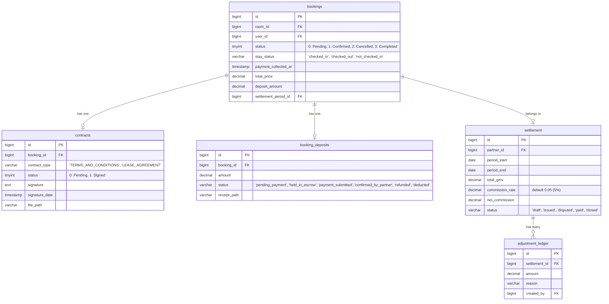

# 📖 Software Requirements Specification (SRS)
## Hệ thống BKS Stay - Đặc Tả Nghiệp Vụ Tài Chính, Đặt Cọc & Vận Hành Lưu Trú

Tài liệu này là Đặc tả yêu cầu phần mềm (SRS) chính thức, tích hợp góc nhìn chuyên môn của **Business Analyst (BA)**, **Hospitality Domain Expert**, và **Technical Lead Architect**. Tài liệu quy định chi tiết các quy tắc nghiệp vụ tài chính, cách tính toán doanh thu (GMV), xử lý hủy phòng, phạt cọc, quy trình đối soát công nợ, và chính sách đặt cọc linh hoạt giữa hệ thống BKS Stay (Admin) và Đối tác (Partner - Chủ nhà).

---

## 1. Thông Tin Tài Liệu (Document Information)
*   **Mã tài liệu:** BKS-SRS-FIN-01
*   **Phiên bản:** 2.0 (Chuyển đổi từ Quy tắc miền sang SRS)
*   **Trạng thái:** Chờ duyệt (Review)
*   **Tác giả:** 
    *   Senior Business Analyst
    *   Senior Hospitality & Accommodation Domain Expert
    *   Technical Lead Architect
*   **Ngày cập nhật:** 2026-06-01

---

## 2. Tổng Quan Hệ Thống & Tác Nhân (System Overview & Actors)

### 2.1 Phạm vi hệ thống (Scope)
Hệ thống BKS Stay hỗ trợ hai phân khúc lưu trú chính:
1.  **Đặt phòng ngắn hạn (Short-term stays):** Đơn vị tính theo đêm (Khách sạn, nhà nghỉ, homestay). Hỗ trợ thanh toán online hoặc thanh toán tại quầy.
2.  **Thuê trung & dài hạn (Long-term rentals):** Đơn vị tính theo tháng (Căn hộ dịch vụ, căn hộ). Yêu cầu hợp đồng thuê nhà pháp lý và ký quỹ đặt cọc bắt buộc.

### 2.2 Các tác nhân hệ thống (System Actors)
*   **Khách hàng (Guest / End-User):** Người tìm kiếm, đặt phòng, ký hợp đồng điện tử, thực hiện thanh toán/đặt cọc trực tiếp hoặc trực tuyến.
*   **Đối tác (Partner / Host):** Chủ cơ sở lưu trú, người quản lý phòng, thực hiện xác nhận phòng trống, check-in, check-out, và đối soát công nợ với Admin.
*   **Quản trị viên (Admin):** Đại diện nền tảng BKS Stay, duyệt đối soát, tạo điều chỉnh công nợ, xử lý khiếu nại của đối tác.
*   **Hệ thống tự động (System Engine):** Bộ quét tự động (Cron job/Scheduler) chốt kỳ đối soát, tự động hủy đơn quá hạn cọc, đồng bộ quỹ phòng lên các sàn OTA qua Channel Manager.

---

## 3. Yêu Cầu Chức Năng (Functional Requirements)

### 3.1 Phân hệ Tính toán Doanh thu & Hoa hồng (GMV & Commission Engine)

| ID Yêu cầu | Mô tả chi tiết chức năng | Độ ưu tiên | Trạng thái |
| :--- | :--- | :--- | :--- |
| **REQ-FIN-001** | **Tính toán Tổng giá trị giao dịch (GMV)** $$\text{GMV} = \text{Tổng tiền phòng gốc} + \text{Tổng tiền dịch vụ đặt trước}$$ - *Tổng tiền phòng gốc:* Đơn giá phòng theo ngày (đã gồm phụ thu lễ/tết/cuối tuần) $\times$ số đêm. - *Tiền dịch vụ:* Các dịch vụ bổ trợ chọn trước (ăn sáng, đưa đón...). - *Mã giảm giá:* GMV tính trước khi trừ mã giảm giá (nếu hệ thống tài trợ) hoặc sau khi trừ (nếu Partner tài trợ). | **Must** | Approved |
| **REQ-FIN-002** | **Ghi nhận Doanh thu vào Kỳ đối soát** - Hệ thống chỉ ghi nhận doanh thu đối soát khi đơn đặt phòng có trạng thái lưu trú `stay_status = 'checked_out'` và trạng thái booking `status = 3` (Completed). - Ngày ghi nhận đối soát căn cứ vào **Ngày Check-out thực tế**, không căn cứ vào ngày tạo booking. | **Must** | Approved |
| **REQ-FIN-003** | **Xử lý Hủy phòng Miễn phí (Free Cancellation)** - Khi booking bị hủy trước thời hạn quy định (ví dụ: trước check-in 7 ngày): Khách được hoàn 100% tiền cọc. GMV ghi nhận của đơn này = **0đ**. Hoa hồng Admin nợ từ Host = **0đ**. | **Must** | Approved |
| **REQ-FIN-004** | **Xử lý Phạt hủy phòng muộn (Late Cancellation Penalty)** - Khi hủy muộn sau thời hạn quy định: Khách bị phạt tiền cọc (thường là 50% - 100% cọc hoặc 1 đêm đầu tiên). Partner được hưởng khoản phạt này. - Hệ thống ghi nhận GMV của đơn này **bằng đúng số tiền phạt thực tế thu được** và tính phí hoa hồng Admin **5% trên số tiền phạt này**. | **Must** | Approved |

---

### 3.2 Phân hệ Đối soát & Công nợ (Settlement & Debt Engine)

| ID Yêu cầu | Mô tả chi tiết chức năng | Độ ưu tiên | Trạng thái |
| :--- | :--- | :--- | :--- |
| **REQ-SET-001** | **Tự động Chốt kỳ Đối soát** Mỗi tháng hệ thống tự động gom bookings đã hoàn thành và chốt sổ làm 2 kỳ: - *Kỳ 1:* Từ ngày 01 đến 15, chốt và phát hành hóa đơn nợ vào ngày **16**. - *Kỳ 2:* Từ ngày 16 đến ngày cuối tháng, chốt và phát hành hóa đơn nợ vào ngày **01** tháng kế tiếp. | **Must** | Approved |
| **REQ-SET-002** | **Vòng đời trạng thái Kỳ đối soát (Settlement Lifecycle)** Hệ thống chuyển đổi trạng thái của kỳ đối soát theo sơ đồ: `draft` (Hệ thống gom nháp) $\rightarrow$ `issued` (Admin duyệt & phát hành bảng kê nợ, gửi email yêu cầu thanh toán) $\rightarrow$ `disputed` (Đối tác khiếu nại lệch tiền) $\rightarrow$ `paid` (Đối tác chuyển khoản & Admin xác nhận) $\rightarrow$ `closed` (Khóa kỳ đối soát, đóng băng dữ liệu booking liên quan). | **Must** | Approved |
| **REQ-SET-003** | **Điều chỉnh công nợ (Adjustment Ledger)** - Cho phép Admin tạo các dòng điều chỉnh tăng/giảm công nợ (phụ phí hoặc giảm trừ hoa hồng) mà không chỉnh sửa dữ liệu gốc của booking. - Công thức tính Net Commission cuối cùng: $$\text{Net Commission phải nộp} = (\text{Tổng GMV kỳ} \times 5\%) + \text{Tổng các dòng điều chỉnh công nợ}$$ | **Must** | Approved |

---

### 3.3 Phân hệ Đặt cọc & Ký quỹ Thuê dài hạn (Long-term Escrow & Deposit Domain)

| ID Yêu cầu | Mô tả chi tiết chức năng | Độ ưu tiên | Trạng thái |
| :--- | :--- | :--- | :--- |
| **REQ-DEP-001** | **Hình thức nộp cọc dài hạn** Hỗ trợ 2 hình thức thanh toán ký quỹ: 1. *Online Escrow:* Thanh toán qua cổng liên kết, hệ thống giữ tiền ở trạng thái `held_in_escrow`. Bảo vệ tránh bùng cọc hoặc tranh chấp. 2. *Chuyển khoản trực tiếp (Direct Transfer):* Khách chuyển cho Host ngoài hệ thống $\rightarrow$ Upload biên lai (`payment_submitted`) $\rightarrow$ Host xác nhận thực nhận tiền (`confirmed_by_partner`). | **Must** | Approved |
| **REQ-DEP-002** | **Kiểm tra Điều kiện Check-in Cứng (Check-in Gate Verification)** Hệ thống chặn thao tác Check-in của Host nếu đơn đặt phòng dài hạn chưa thỏa mãn đồng thời 2 điều kiện: 1. Trạng thái cọc là `held_in_escrow` hoặc `confirmed_by_partner`.  2. Hợp đồng thuê nhà liên quan ở trạng thái đã ký (`Signed` / `Hiệu lực`). | **Must** | Approved |
| **REQ-DEP-003** | **Khấu trừ và Hoàn cọc khi Check-out** Khi trả phòng, Host nhập biên bản nghiệm thu và khấu trừ hao tổn tài sản (nếu có). Số tiền cọc còn lại sẽ được: - Tự động hoàn lại qua cổng thanh toán (đối với Escrow online). - Hoặc Host tự hoàn ngoài hệ thống và xác nhận hoàn cọc thành công. | **Must** | Approved |

---

### 3.4 Phân hệ Đặt cọc Linh hoạt đặt ngắn hạn (Short-term Dynamic Deposit Policy)

| ID Yêu cầu | Mô tả chi tiết chức năng | Độ ưu tiên | Trạng thái |
| :--- | :--- | :--- | :--- |
| **REQ-SDEP-001** | **Đặt cọc động theo thời điểm (Mùa vụ & Ngày trong tuần)** - *Ngày thường / Mùa thấp điểm:* Áp dụng chính sách **Không cần cọc trước**. Giữ phòng tạm thời đến khung giờ quy định (mặc định: 14:00 hoặc 18:00 ngày nhận phòng). - *Cuối tuần / Mùa cao điểm / Ngày Lễ:* Bắt buộc cọc tối thiểu **50% đến 100%** tổng tiền phòng. | **Should** | Approved |
| **REQ-SDEP-002** | **Đặt cọc theo thời gian tạo đơn hàng (Lead Time)** - *Đặt phòng xa ngày (>30 ngày):* Chỉ cần cọc trước 30% - 50% để giữ chỗ, phần còn lại thanh toán trước ngày check-in 3 - 7 ngày. - *Đặt phòng sát giờ (Last-minute booking - trong vòng 24h trước check-in):* Yêu cầu đặt cọc/thanh toán **100%** tại thời điểm tạo đơn. | **Should** | Approved |
| **REQ-SDEP-003** | **Thời hạn giữ phòng chờ cọc (Deposit Grace Period)** Sau khi đặt phòng tạm thời, khách hàng có thời hạn hoàn tất cọc: - *Đặt sát ngày:* **2 tiếng** kể từ khi tạo đơn. - *Đặt xa ngày:* **12 - 24 tiếng** kể từ khi tạo đơn. Nếu quá thời hạn này hệ thống tự động chuyển trạng thái booking sang `cancelled` để mở lại quỹ phòng trống. | **Must** | Approved |
| **REQ-SDEP-004** | **Đồng bộ quỹ phòng tức thời & Deal giờ chót (Inventory Sync & Last-Minute Sales)** - Khi phòng không cọc bị hủy tự động (ví dụ lúc 18:00), PMS đồng bộ ngay lập tức trạng thái phòng trống lên các sàn OTA (Agoda, Booking, Airbnb...) qua Channel Manager trong vòng **3 - 5 giây**. - Cho phép đối tác cấu hình quy tắc giảm giá tự động (ví dụ: giảm 20% - 30% cho các phòng trống được giải phóng sau 16:00 hoặc 18:00 cùng ngày) để lập tức kích cầu tệp khách săn phòng sát giờ trực tuyến. | **Should** | Approved |
| **REQ-SDEP-005** | **Quy trình vận hành chuẩn của Lễ tân (Front Desk SOP)** Hỗ trợ quy trình nghiệp vụ cho lễ tân thực hiện: 1. *11:30 - 12:00:* Lễ tân xuất danh sách phòng không cọc và liên hệ xác nhận (Reconfirm). 2. *Gửi tối hậu thư:* Nếu không liên lạc được, hệ thống tự động gửi thông báo hủy phòng nếu khách không phản hồi trước 15:00/18:00. 3. *Giải phóng:* Thực hiện hủy trên hệ thống để tái mở bán online nếu hết hạn phản hồi. | **Should** | Approved |
| **REQ-SDEP-006** | **Chính sách Hoàn tiền cho Booking Last-Minute (<24h trước check-in)** Khi khách đặt phòng trong vòng 24 giờ trước giờ check-in và đã thanh toán 100%, hệ thống áp dụng chính sách hoàn tiền theo loại giá (Rate Type) mà Partner cấu hình: - *`non_refundable_rate` (Giá không hoàn tiền):* **Không hoàn bất kỳ khoản tiền nào** sau khi thanh toán thành công. Áp dụng với tất cả lý do hủy kể cả lý do cá nhân khẩn cấp. Toàn bộ tiền thanh toán chuyển cho Partner, BKS Stay thu hoa hồng 5%. - *`refundable_rate` (Giá có thể hoàn tiền):* Cho phép hoàn tiền một phần nếu hủy trước ngưỡng thời gian Partner quy định (tối thiểu 4 tiếng trước check-in). Hoàn tối đa 50% số tiền đã thanh toán. Phần còn lại chuyển cho Partner và BKS Stay thu 5% hoa hồng trên phần không hoàn. - Partner **bắt buộc phải khai báo loại giá** khi đăng phòng. Nếu chưa khai báo, hệ thống mặc định áp dụng `non_refundable_rate`. ⚠️ **GAP — Thông báo bắt buộc cho End User:** Hệ thống **phải hiển thị cảnh báo rõ ràng** trên màn hình thanh toán trước khi khách xác nhận, xem chi tiết tại **REQ-COM-003**. | **Must** | 🆕 Draft |

---

### 3.5 Đặc tả Tài liệu Pháp lý (Stay Voucher vs. Lease Agreement)

| ID Yêu cầu | Mô tả chi tiết chức năng | Độ ưu tiên | Trạng thái |
| :--- | :--- | :--- | :--- |
| **REQ-DOC-001** | **Đặc tả Phiếu xác nhận lưu trú (Stay Confirmation Voucher) - Ngắn hạn** - Hệ thống tự động xác nhận đơn phòng (`Auto-signed`) ngay khi đơn chuyển sang `CONFIRMED`. Khu vực chữ ký của Guest hiển thị: *"Đã xác nhận tự động - Hệ thống khớp mã đặt phòng"*. - **Loại bỏ nút tải PDF trực tiếp** (tránh lỗi font/lệch khung client-side). Thay thế bằng 2 tính năng: 1. *Tải ảnh (PNG):* Chuyển đổi giao diện sang hình ảnh chất lượng cao để lưu trữ trên điện thoại thông minh (sử dụng `html2canvas`). 2. *In phiếu / Xem trước:* Sử dụng chức năng in mặc định của trình duyệt (`window.print()`). Tối ưu hóa CSS Print Media (`@media print`) để ẩn các thành phần giao diện không liên quan (sidebar, header, các nút hành động) khi in hoặc chọn "Lưu dưới dạng PDF" bằng trình duyệt. | **Must** | Approved |
| **REQ-DOC-002** | **Đặc tả Hợp đồng thuê nhà (Lease Agreement) - Dài hạn** - Yêu cầu khách ký tay hoặc upload chữ ký số trước khi check-in. - Tương tự, thay thế nút tải PDF trực tiếp bằng nút **"In hợp đồng / Xem trước"** kết hợp với `window.print()` để đảm bảo chất lượng hiển thị xuất sắc, sắc nét 100% nhờ engine in ấn của trình duyệt. | **Must** | Approved |

---

### 3.6 Quy trình Giao tiếp & Onboarding sau đặt phòng (Post-Booking Onboarding Flow)

| ID Yêu cầu | Mô tả chi tiết chức năng | Độ ưu tiên | Trạng thái |
| :--- | :--- | :--- | :--- |
| **REQ-COM-001** | **Tối ưu hóa Giao diện Đặt phòng thành công (`BookingSuccess`)** - Loại bỏ bảng chi tiết giá tạm tính và các nút phụ để tránh nhiễu thông tin. - Hiển thị **Checklist Hướng dẫn 3 bước trực quan (Checklist Wizard)**:   1. *Bước 1: Mở hộp thư điện tử* (kiểm tra cả hộp thư rác).   2. *Bước 2: Thiết lập mật khẩu và Đăng nhập* (đối với khách mới).   3. *Bước 3: Tải phiếu xác nhận lưu trú (PNG) hoặc Ký hợp đồng*. - Sử dụng mã màu xanh lá cây `#10b981` cho thông điệp **"Thành công"** để tạo sự tin tưởng. | **Should** | Approved |
| **REQ-COM-002** | **Nội dung Email Đặt phòng Cá nhân hóa (`room-booking.blade.php`)** - *Khách hàng mới:* Cung cấp 2 nút hành động riêng biệt:   1. *"Kích hoạt tài khoản & Thiết lập mật khẩu"* dẫn đến `/set-password/{token}`.   2. *"Xem chi tiết đặt phòng của bạn"* dẫn đến `/bookings/{id}`. - *Khách hàng cũ:* Chỉ hiển thị duy nhất một nút *"Xem chi tiết đặt phòng của bạn"*. Route ở Frontend có cơ chế bảo vệ (`StayPrivateRoute`), tự động chuyển hướng khách đăng nhập nếu phiên làm việc hết hạn trước khi trả về đúng trang chi tiết đơn hàng. - Che giấu toàn bộ URL trần trong email để tránh bị đánh dấu Spam bởi bộ lọc bảo mật. | **Must** | Approved |
| **REQ-COM-003** | **⚠️ GAP — Cảnh báo Chính sách Không hoàn tiền cho Booking Last-Minute (Last-Minute Non-Refundable Warning)** Khi khách hàng đặt phòng trong vòng **24 giờ trước giờ check-in** và phòng áp dụng `non_refundable_rate`, hệ thống **bắt buộc** phải hiển thị cảnh báo nổi bật trước bước xác nhận thanh toán:  **Nội dung cảnh báo (UI Component):** - 🟠 Banner/Alert nền cam hoặc vàng, icon ⚠️, nằm ngay phía trên nút "Xác nhận đặt phòng". - Nội dung: *"Đây là đặt phòng sát giờ (trong vòng 24 giờ trước check-in). Theo chính sách của chỗ ở, **thanh toán này không được hoàn lại** trong bất kỳ trường hợp nào kể cả lý do cá nhân khẩn cấp. Vui lòng xác nhận bạn đã đọc và đồng ý trước khi tiếp tục."* - Checkbox bắt buộc: *"Tôi hiểu và đồng ý với chính sách không hoàn tiền này"* — khách phải tích chọn thì nút "Xác nhận đặt phòng" mới được kích hoạt (`enabled`).  **Kênh bổ sung:** - Email xác nhận đặt phòng gửi cho khách phải nhắc lại chính sách này ở phần đầu nội dung email với font in đậm. - Stay Voucher (PNG/Print) cũng hiển thị dòng: *"⚠️ Đặt phòng này không được hoàn tiền"* ở khu vực ghi chú. | **Must** | 🆕 Draft |

---

## 4. Thiết Kế Cơ Sở Dữ Liệu & Ràng Buộc Kỹ Thuật (Technical Grounding & Database Schema)

### 4.1 Ánh xạ Bảng Cơ sở dữ liệu (Database Mapping)

### 4.2 Cơ chế Kiểm soát Đồng thời & Phòng ngừa Tranh chấp (Concurrency & Lock Control)
*   **ConflictChecker và lockForUpdate:** Khi Partner xác nhận booking trống (`confirm` phòng) hoặc khi Hệ thống tự động hủy đơn do quá hạn cọc, Backend Laravel phải sử dụng khóa dòng cơ sở dữ liệu (`select ... for update`) đối với bản ghi phòng trong giao dịch (Transaction) để đảm bảo không xảy ra xung đột lấp phòng (Double-booking) hoặc race conditions tại cùng một thời điểm.

---

## 5. Yêu Cầu Phi Chức Năng (Non-Functional Requirements)

*   **Hiệu năng (Performance):** Quá trình đồng bộ trạng thái phòng trống (+1 phòng khả dụng) từ BKS PMS lên hệ thống Channel Manager sang các OTA phải hoàn tất trong tối đa **5 giây** kể từ khi hệ thống cập nhật trạng thái đơn đặt phòng sang `cancelled`.
*   **Bảo mật (Security):** 
    *   Tất cả các route truy cập chi tiết đặt phòng (`/bookings/{id}`) phải được bảo vệ bởi middleware xác thực (`StayPrivateRoute`).
    *   Không để lộ các URL chứa thông tin nhạy cảm ở dạng thô trong Email. Liên kết kích hoạt tài khoản phải mã hóa token và có thời hạn sử dụng tối đa **24 giờ**.
*   **Tính Tin cậy (Reliability):** Việc kiểm tra điều kiện Check-in cứng (Hợp đồng đã ký + Cọc đã đóng) phải được thực hiện bằng Transaction ở tầng Database, đảm bảo không thể bỏ qua bất kỳ kiểm tra nào do độ trễ mạng hoặc click đúp từ giao diện của Host.

---

## 6. Phụ Lục & Câu Hỏi Nghiệp Vụ Thường Gặp (Appendix & Q&A)

#### Q1: "Doanh thu GMV này tính dựa trên thời điểm khách đặt phòng thành công hay khách hoàn thành check-out?"
> **A1:** Doanh thu GMV đối soát được tính hoàn toàn dựa trên thời điểm khách **hoàn thành check-out thực tế** (`checked_out`). Việc đặt phòng thành công (`confirmed`) chỉ mang tính chất giữ phòng trên lịch bận chứ chưa được tính vào doanh thu đối soát để tránh trường hợp khách đặt trước rồi hủy phòng sát ngày.

#### Q2: "Nếu khách đặt phòng có đặt cọc trước, sau đó hủy phòng trước 7 ngày (hủy miễn phí) thì tiền cọc xử lý thế nào?"
> **A2:** Theo chính sách hủy miễn phí, khách hàng được hoàn trả 100% tiền cọc. GMV ghi nhận bằng 0đ và BKS Stay không thu bất kỳ khoản phí hoa hồng nào từ giao dịch này.

#### Q3: "Nếu khách đặt cọc trước và hủy phòng sát giờ (hủy mất phí phạt 100% cọc) thì tiền cọc xử lý thế nào?"
> **A3:** Số tiền đặt cọc bị phạt sẽ do Partner (Chủ nhà) hưởng trọn vẹn. BKS Stay sẽ ghi nhận doanh thu đối soát của đơn này bằng đúng số tiền phạt cọc đó, và tính phí hoa hồng 5% trên số tiền phạt này. Khoản phí hoa hồng 5% của tiền phạt cọc sẽ được gom vào kỳ đối soát gần nhất để thu từ chủ nhà.

#### Q4: "Làm thế nào để xử lý các sai sót khi đối tác khiếu nại lệch số liệu dịch vụ hoặc tiền phòng?"
> **A4:** Admin không trực tiếp sửa đổi dữ liệu của các booking đã hoàn thành để giữ tính toàn vẹn của lịch sử đặt phòng. Thay vào đó, Admin sẽ đối chiếu thông tin và nhập một dòng **Điều chỉnh công nợ (Adjustment)** với số tiền âm (ví dụ `-150,000đ`) tương ứng với phần chênh lệch bị tính thừa. Số tiền này sẽ được trừ trực tiếp vào tổng hóa đơn Net Commission của đối tác kỳ này.

---
**Chữ ký Duyệt Tài Liệu (Sign-off Signature):**
*   *Senior Business Analyst:* **Đã duyệt**
*   *Senior Hospitality Domain Expert:* **Đã duyệt**
*   *Technical Lead Architect:* **Đã duyệt**
