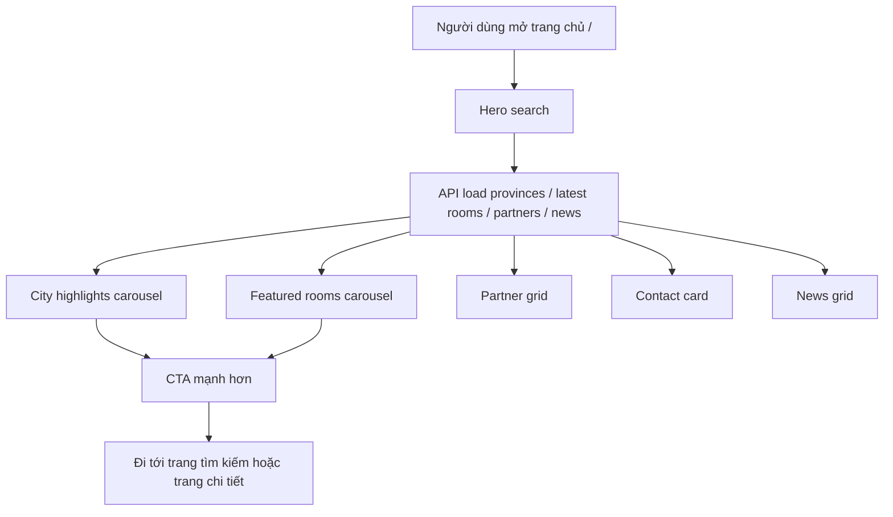
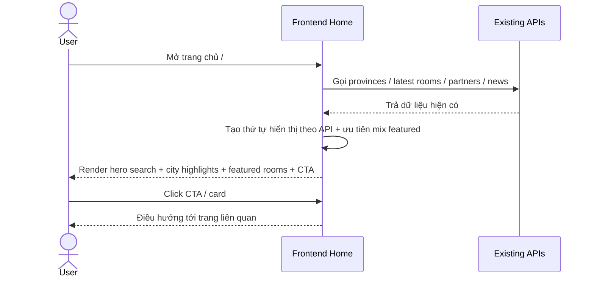
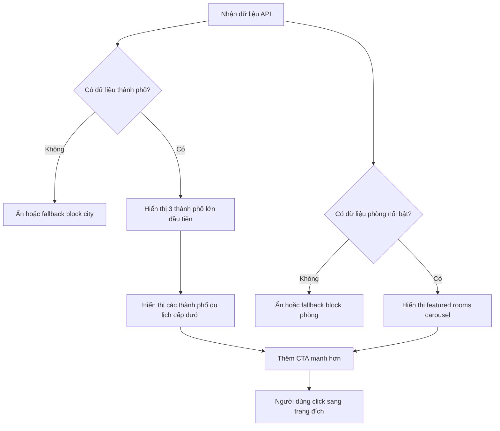
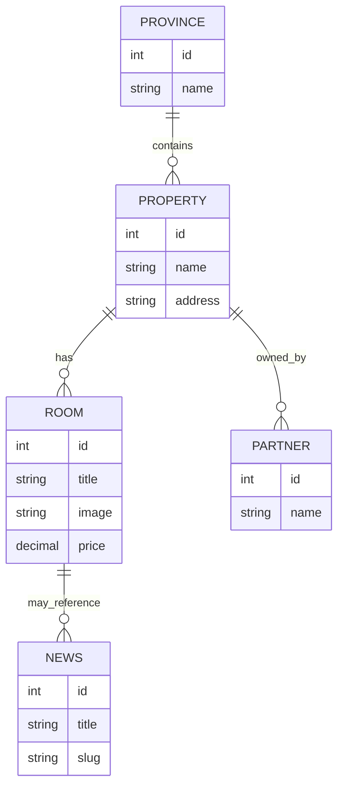

# SRS: Tối ưu hiển thị thông tin nổi bật trên landing page

## 1. Thông tin tài liệu
- **Mã tài liệu:** SRS-LP-001
- **Tên chức năng:** Tối ưu hiển thị thông tin nổi bật trên trang landing page
- **Ngày tạo:** 2026-05-21
- **Nguồn đầu vào:** [docs/leads/lead_260521_landing-page-prominence.md](../leads/lead_260521_landing-page-prominence.md)
- **Màn hình liên quan:** Trang chủ public `/`
- **Trạng thái:** Draft cho phân tích / sẵn sàng sang design

---

## 2. Bối cảnh và mục tiêu
Trang landing page hiện đã có hero tìm kiếm, carousel tỉnh/thành, carousel phòng nổi bật, khối đối tác, contact và tin tức. Tuy nhiên, mức độ nhấn mạnh của các nội dung nổi bật chưa đủ rõ để người dùng nhận ra ngay các lựa chọn giá trị cao như thành phố lớn và phòng nổi bật.

Mục tiêu của chức năng này là làm cho landing page có tính chọn lọc và định hướng chuyển đổi hơn, nhưng vẫn giữ nguyên luồng tìm kiếm hiện tại, giữ nguyên thứ tự section, không đổi route và không thêm backend contract mới nếu không thật cần thiết.

### 2.1. Timeline triển khai
1. Discovery ban đầu chỉ nhắm tới việc tăng độ nổi bật cho homepage bằng dữ liệu sẵn có.
2. Khi bài toán chuyển sang “gợi ý phòng theo điểm đến”, một contract grouped-by-province đã được bổ sung để FE không phải tự curation dữ liệu phòng.
3. Sau đó FE tinh chỉnh thêm ưu tiên 3 thành phố lớn, với Đà Nẵng đứng đầu nhóm gợi ý và có fallback để tránh section rỗng.

---

## 3. Phạm vi

### 3.1. In scope
- Tăng mức độ nổi bật của khối nội dung featured trên landing page.
- Hiển thị theo chiến lược mix giữa phòng nổi bật và city highlights.
- Ưu tiên 3 thành phố lớn trước, sau đó mới tới các thành phố du lịch cấp dưới.
- Bổ sung CTA mạnh hơn cho khối featured.
- Giữ nguyên form tìm kiếm hiện tại.
- Giữ nguyên thứ tự section hiện tại.
- Giữ nguyên điều hướng hiện có.
- Khi cần, cho phép bổ sung contract grouped suggestions để FE render theo điểm đến thay vì chỉ dựa vào latest rooms.

### 3.2. Out of scope
- Không thiết kế lại toàn bộ landing page từ đầu.
- Không thay đổi flow đặt phòng.
- Không tạo bảng/cột DB mới.
- Không chuyển ngôn ngữ UI sang ngôn ngữ khác.

---

## 4. Đối tượng sử dụng
- **Người dùng cuối:** muốn tìm nhanh điểm đến nổi bật hoặc phòng nổi bật.
- **Người dùng có ý định cao:** cần CTA rõ để đi vào trang danh sách hoặc trang chi tiết.
- **SEO / marketing / vận hành nội dung:** cần landing page thể hiện đúng thứ tự ưu tiên kinh doanh.

---

## 5. Luồng nghiệp vụ tổng thể và liên kết tài liệu SRC

### 5.1. Vị trí trong luồng
Chức năng này nằm ở đầu phễu công khai, tại trang chủ public `/`. Nó không thay thế search, mà tăng khả năng người dùng đi từ trang chủ tới các điểm đến / phòng có giá trị cao hơn.

### 5.2. Liên kết tài liệu SRC
- Tài liệu SRS chính hiện tại là [docs/SRC/srs_landing_page_prominence.md](../SRC/srs_landing_page_prominence.md).
- Nếu bài toán tiếp tục mở rộng sang các màn search rooms, room detail hoặc booking flow, các SRS đó sẽ được liên kết bổ sung sau.

### 5.3. Luồng tổng quát
1. Người dùng mở trang chủ.
2. Hệ thống tải dữ liệu API sẵn có cho provinces, latest rooms, partners và news.
3. Hero search vẫn là hành động chính.
4. Khối nổi bật ban đầu hiển thị theo mix giữa city highlights và featured rooms.
5. Khi contract grouped-by-province được thêm vào, FE dùng block gợi ý theo điểm đến để render các nhóm phòng theo city.
6. 3 thành phố lớn được ưu tiên xuất hiện trước trong phần gợi ý; Đà Nẵng được đặt lên đầu nhóm ưu tiên.
7. Nếu một nhóm trả dữ liệu rỗng, FE dùng fallback từ dữ liệu home để section vẫn còn nội dung.
8. CTA mạnh hơn dẫn người dùng vào hành động khám phá rõ ràng hơn.

---

## 6. Yêu cầu chức năng

### FR-01. Giữ nguyên search form chính
- Hero search form phải tiếp tục là hành động chính ở phần đầu trang.
- Không đổi validation hiện có của form tìm kiếm.

### FR-02. Tăng độ nổi bật cho khối featured
- Landing page phải có một khối nổi bật dễ nhận biết hơn so với trạng thái browse list hiện tại.
- Khối này phải kết hợp giữa city highlights và featured rooms.

### FR-03. Ưu tiên city highlights theo mức độ quan trọng
- Trong phần city highlights, 3 thành phố lớn phải được đặt ở nhóm ưu tiên đầu tiên.
- Các thành phố du lịch cấp dưới sẽ đứng sau nhóm 3 thành phố lớn.
- Không dùng trật tự thủ công từ frontend để phá vỡ thứ tự API.
- Với block gợi ý theo điểm đến, Đà Nẵng phải đứng đầu danh sách ưu tiên.

### FR-04. Giữ featured rooms trong mix
- Khối featured rooms phải vẫn xuất hiện trên landing page.
- Featured rooms không được bị loại bỏ khi tối ưu ưu tiên city highlights.

### FR-05. CTA mạnh hơn cho featured block
- Khối nổi bật phải có CTA hành động rõ ràng, mang tính thúc đẩy hơn trạng thái hiện tại.
- CTA phải dùng tiếng Việt tự nhiên, phù hợp tone công khai của site.

### FR-06. Giữ nguyên thứ tự section
- Hero search, province/city carousel, featured rooms carousel, partner grid, contact card, news grid vẫn là thứ tự chính.
- Chỉ điều chỉnh mức độ nổi bật / nội dung ưu tiên bên trong các section này.

### FR-07. Tuân thủ dữ liệu từ API hiện có
- Dữ liệu hiển thị phải lấy từ các API / hooks hiện có.
- Nếu cần đảm bảo nhóm gợi ý theo điểm đến ổn định, có thể bổ sung contract grouped rooms by province thay vì tự curation toàn bộ ở FE.

### FR-08. Tối ưu mobile first
- Card, carousel, CTA và khoảng cách phải hoạt động tốt trên màn nhỏ.
- CTA và nội dung nổi bật không được làm vỡ layout trên mobile.

### FR-09. Nội dung UI bằng tiếng Việt
- Tất cả label, CTA, heading mới phải dùng tiếng Việt.
- Không thêm thuật ngữ tiếng Anh nếu không cần thiết.

---

## 7. Bảng field / hiển thị

| Thành phần | Dữ liệu đầu vào | Quy tắc hiển thị | Bắt buộc |
| --- | --- | --- | --- |
| Hero search form | province, ward, property type | Giữ nguyên UI và hành vi hiện tại | Có |
| City highlights carousel | provinces API | Ưu tiên 3 thành phố lớn trước, sau đó các thành phố du lịch cấp dưới theo thứ tự API | Có |
| Featured rooms carousel | latest rooms API | Giữ mix phòng nổi bật; hiển thị ảnh, tên, giá, diện tích, số giường | Có |
| CTA block | text CTA + route đích | Nút CTA phải dễ thấy hơn trạng thái hiện tại | Có |
| Partner grid | random partners API | Không đổi luồng, chỉ giữ mức hiển thị hiện tại | Có |
| News grid | latest news API | Giữ vai trò nội dung bổ trợ | Có |

---

## 8. Quy tắc dữ liệu và validation
- Nếu API trả về danh sách trống, section tương ứng phải ẩn hoặc hiển thị fallback nhẹ nhàng.
- Không tự ý tạo danh sách featured bằng curation thủ công ở frontend nếu trái với ranking API.
- Nếu API không có dữ liệu phân loại rõ cho 3 thành phố lớn, frontend cần tôn trọng thứ tự trả về từ API và chỉ thay đổi mức độ nhấn mạnh hiển thị.
- Với block gợi ý theo điểm đến, nếu contract grouped trả rỗng cho một city thì FE có thể fallback từ latest rooms nhưng vẫn phải giữ heading và thứ tự ưu tiên đã chốt.
- CTA phải luôn dẫn người dùng tới một route hợp lệ, không tạo dead-end.

---

## 9. Luồng màn hình

---

## 10. Sequence luồng chính

---

## 11. Flow xử lý chức năng

---

## 12. ERD draft tham chiếu dữ liệu hiện có
> Ghi chú: phần này chỉ mô tả các entity đang được page tiêu thụ. Không có thay đổi schema trong scope này.

---

## 13. Mapping field / module đích
| Nguồn hiện tại | Module / màn hình đích | Ghi chú |
| --- | --- | --- |
| Provinces API | Landing page city highlights | Giữ API-driven ordering |
| Latest rooms API | Landing page featured rooms | Mix với city highlights |
| Partners API | Partner grid | Không đổi nghiệp vụ |
| News API | News grid | Không đổi nghiệp vụ |
| Hero search state | Search rooms page | Giữ nguyên flow |

---

## 14. Mapping VB6 -> Laravel
| VB6 legacy screen / function | Laravel / hiện đại tương ứng | Trạng thái |
| --- | --- | --- |
| Public landing page featured highlights | Frontend home page `/` | Chưa có tài liệu VB6 tương ứng trong scope hiện tại |
| Search landing to room list | Search rooms page | Chưa có mapping legacy chi tiết để đối chiếu |

Ghi chú: scope này đang phân tích landing page FE hiện đại, không có nguồn VB6 được cung cấp cho màn này. Khi có tài liệu legacy tương ứng, mapping sẽ được bổ sung ở SRS liên quan.

---

## 15. Tiêu chí nghiệm thu
- Trang chủ vẫn hiển thị hero search như cũ.
- Phần nổi bật có thể nhận ra rõ hơn ở lần nhìn đầu tiên.
- City highlights ưu tiên 3 thành phố lớn trước, sau đó tới các thành phố du lịch cấp dưới theo dữ liệu API.
- Featured rooms vẫn xuất hiện và không bị mất khỏi landing page.
- CTA của khối nổi bật mạnh hơn nhưng vẫn nhất quán tiếng Việt.
- Không thay đổi route hoặc luồng điều hướng hiện có.
- Layout vẫn ổn trên mobile.

---

## 16. Rủi ro và giả định

### Rủi ro
- Nếu API không cung cấp đủ tín hiệu để phân biệt 3 thành phố lớn, việc nhấn mạnh có thể chỉ dừng ở mức hiển thị.
- Nếu CTA quá mạnh, homepage có thể lệch khỏi vai trò search-first.

### Giả định
- API hiện có đủ dữ liệu để hiển thị city highlights và featured rooms.
- Không cần thêm backend contract mới cho scope hiện tại.

---

## 17. Kết luận
Đây là một bài toán tối ưu ưu tiên hiển thị trên landing page, không phải redesign toàn bộ trang. Phương án đúng là giữ nguyên search-first flow, tăng mức độ nổi bật cho khối mix city + room, và bám theo dữ liệu API hiện có.
