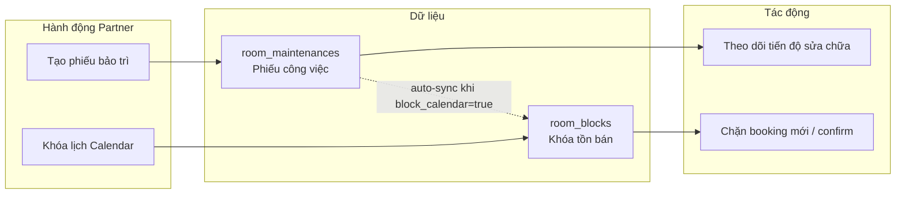
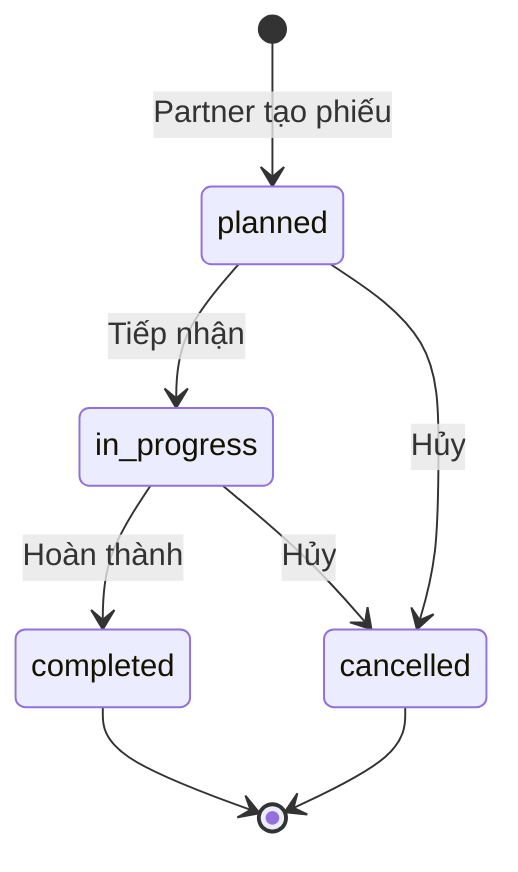

# Quản lý Bảo trì phòng (Partner) — Software Requirements Specification (SRS)

## Document Information

| Thuộc tính | Giá trị |
|---|---|
| **Version** | 1.0 |
| **Status** | Draft |
| **Author** | Business Analyst |
| **Date** | 2026-06-18 |
| **Phạm vi** | Partner Portal (`/partner/maintenances`, Room Detail, Dashboard, Calendar) |
| **Tham chiếu** | `srs_partner_portal_360.md`, `docs/architecture/data-dictionary.md` §2.3.5, `room_blocks` |

## Overview

Tài liệu đặc tả yêu cầu nghiệp vụ cho module **Quản lý bảo trì & sự cố phòng** trong phân hệ Partner của BKS System.

Partner cần quản lý **phiếu bảo trì/sự cố phòng** (sửa chữa định kỳ, khẩn cấp) và **đồng bộ khóa lịch** để tránh đặt phòng khi phòng không khả dụng. Hệ thống đã có nền tảng (`room_maintenances`, API list/create, màn `Maintenances.tsx`, tab bảo trì trong `RoomDetail.tsx`, widget Dashboard) nhưng **chưa hoàn chỉnh vòng đời**, **chưa liên kết `room_blocks`**, **cập nhật trạng thái chỉ ở FE**, và **thiếu phân quyền theo Partner**.

SRS này định nghĩa module bảo trì end-to-end cho Partner: tạo → xử lý → hoàn thành/hủy, tích hợp Calendar/Dashboard, và quy tắc conflict với booking.

## Business Context and Goals

### Bối cảnh nghiệp vụ

Partner vận hành nhiều phòng/cơ sở cần ghi nhận sự cố (điều hòa hỏng, sửa ống nước, bảo dưỡng định kỳ) và đồng thời **chặn tồn bán** trong thời gian phòng không sử dụng được. Hiện tại hệ thống có hai khái niệm tách rời:

- **`room_maintenances`**: phiếu công việc bảo trì (tiêu đề, mô tả, lifecycle).
- **`room_blocks`**: khóa lịch trên Calendar (đã mature ở Partner Portal 360 Phase 3).

Partner đang phải thao tác ở hai nơi hoặc tạo phiếu mà lịch vẫn mở bán.

### Mục tiêu kinh doanh

| Mục tiêu | Ý nghĩa |
|---|---|
| Giảm overbooking do bảo trì | Không confirm/booking mới trong khoảng phòng đang sửa |
| Tăng occupancy hiệu dụng | Phòng sửa xong được mở bán đúng lúc |
| Vận hành minh bạch | Theo dõi tiến độ sự cố từ planned → completed |
| Dashboard actionable | Partner thấy và xử lý sự cố khẩn cấp ngay |

### Chỉ số thành công

| KPI | Tiêu chí đề xuất | Ghi chú |
|---|---|---|
| Thời gian xử lý sự cố khẩn cấp | ≤ 24h (`planned` → `in_progress`) | `in_progress_at - created_at` |
| Overbooking do bảo trì | 0 case/tháng | Booking confirm trong khoảng maintenance active |
| Tỷ lệ phiếu có block đồng bộ | ≥ 95% phiếu có `room_block_id` | Khi `block_calendar = true` |
| Partner dùng module | ≥ 60% Partner active có ≥1 phiếu/quý | Analytics |

## User Roles and Access Scope

| Role | Phạm vi sử dụng |
|---|---|
| **Partner owner** | CRUD phiếu bảo trì phòng thuộc property của mình; đổi status; upload ảnh minh chứng |
| **Admin BKS** | Xem toàn hệ thống qua API admin hiện có (`/api/v1/admin/room-maintenances`); audit (không bắt buộc UI phase 1) |
| **End User** | Out of scope phase 1 (báo sự cố từ My Bookings — phase 2) |

Ràng buộc scope: mỗi Partner là **single owner**, chưa có phân quyền nhân viên nội bộ.

## Scope

### In Scope

- Hoàn thiện vòng đời phiếu bảo trì: `planned` → `in_progress` → `completed` | `cancelled`.
- API Partner: list, create, detail, update status, cancel.
- Phân quyền theo ownership (`properties.user_id = auth.id`).
- Đồng bộ tùy chọn với `room_blocks` (auto-create khi tạo phiếu, auto-gỡ khi hoàn thành/hủy).
- Kiểm tra conflict với booking/room_block khi tạo phiếu + khóa lịch.
- Màn danh sách bảo trì (`/partner/maintenances`) với filter và pagination chuẩn.
- Tab bảo trì trong Room Detail; widget Dashboard sự cố khẩn cấp.
- Hiển thị block bảo trì trên Calendar (qua `room_blocks` đồng bộ).
- Migration bổ sung cột audit và liên kết `room_block_id`.

### Out of Scope

- Phân công nhân viên sửa chữa / vendor management.
- Tích hợp IoT (cảm biến hỏng hóc).
- End User tự báo sự cố qua app (phase 2).
- Admin duyệt phiếu bảo trì.
- Bảo trì định kỳ tự lặp lại (recurring maintenance).
- Realtime WebSocket event (Could-have, phase sau).

## Phân biệt nghiệp vụ cốt lõi

| Khái niệm | Bảng | Mục đích | Ai tạo |
|---|---|---|---|
| **Phiếu bảo trì** | `room_maintenances` | Ghi nhận sự cố, loại, mô tả, ảnh, lifecycle | Partner (phase 1) |
| **Khóa lịch** | `room_blocks` | Chặn slot trên Calendar, chặn confirm booking | Partner / auto từ phiếu bảo trì |

**Quyết định thiết kế:** Khi Partner tạo phiếu bảo trì có `start_time`/`end_time`, hệ thống **tự động tạo `room_block` loại `maintenance`** nếu `block_calendar = true` (mặc định). Khi phiếu `completed`/`cancelled`, **tự gỡ block** tương ứng (nếu do hệ thống tạo).



## Hiện trạng hệ thống (As-Is)

| Thành phần | Trạng thái | Vấn đề |
|---|---|---|
| Bảng `room_maintenances` | Có schema đầy đủ | Chưa có `room_block_id` liên kết |
| BE API Partner | `GET /`, `POST /` only | Thiếu `PATCH`, `GET /{id}`, cancel |
| Phân quyền | Không kiểm tra ownership | Partner có thể thao tác phòng không thuộc sở hữu |
| Pagination | BE dùng `pagination`, FE gửi `page`/`per_page` | Danh sách không phân trang đúng |
| `Maintenances.tsx` | Nút "Tiếp nhận"/"Xong" | Chỉ cập nhật state local, không gọi API |
| `room_blocks` | Hoàn chỉnh (Calendar Phase 3) | Tách rời `room_maintenances` |
| `ConflictChecker` | Chỉ check booking + room_block | Không check khoảng `room_maintenances` active |
| Dashboard | `urgent-maintenances` | Chỉ hiển thị, chưa có CTA xử lý |
| End User báo sự cố | Mô tả trong domain doc | Chưa có API/luồng |

## Functional Requirements

### Quản lý phiếu bảo trì

| ID | Yêu cầu | Mức ưu tiên | Tín hiệu chấp nhận |
|---|---|---|---|
| MNT-001 | Partner chỉ truy cập phiếu thuộc property `user_id = auth.id` | Must | Partner A không thấy/sửa phiếu Partner B |
| MNT-002 | `GET /partner/room-maintenances` hỗ trợ filter: `property_id`, `room_id`, `status`, `maintenance_type`, `from_date`, `to_date`, `page`, `per_page` | Must | Kết quả đúng filter; phân trang Laravel chuẩn |
| MNT-003 | `POST /partner/room-maintenances` tạo phiếu với validate đầy đủ | Must | Phiếu tạo với `status = planned` |
| MNT-004 | `GET /partner/room-maintenances/{id}` trả chi tiết phiếu | Must | Đủ field + `room_name`, `property_name` |
| MNT-005 | `PATCH /partner/room-maintenances/{id}` cập nhật `status`, `end_time`, `images`, `description` | Must | Transition hợp lệ; ghi audit timestamp |
| MNT-006 | Hủy phiếu qua `PATCH` (`status = cancelled`) kèm `cancellation_reason` bắt buộc | Must | Phiếu `completed` không hủy được |
| MNT-007 | Tùy chọn `block_calendar` (boolean, default `true`) khi tạo phiếu | Must | `false` → chỉ ghi nhận, không tạo block |
| MNT-008 | Lưu `room_block_id` trên phiếu khi auto-sync block | Must | Liên kết 1-1 (nullable) |
| MNT-009 | Khi `completed`/`cancelled`, auto xóa block liên kết (nếu do hệ thống tạo) | Must | Calendar mở lại slot |
| MNT-010 | Kiểm tra conflict booking/block khi tạo phiếu + `block_calendar = true` | Must | Trả 409 + danh sách conflict |
| MNT-011 | Upload ảnh minh chứng qua Cloudinary (`images` JSON array) | Should | Tối đa 5 URL/phiếu |
| MNT-012 | Response list enrich: `room_name`, `property_name`, label tiếng Việt | Should | FE không normalize thủ công |
| MNT-013 | Trạng thái phòng reflect maintenance khi có phiếu active | Should | Hiển thị "Đang bảo trì" trên Properties/Room list |
| MNT-014 | Dashboard `urgent-maintenances` ưu tiên `emergency` trước `scheduled` | Should | Sort: type desc, `created_at` desc |
| MNT-015 | Realtime event `maintenance.changed` trên channel partner | Could | Tái dùng pattern `room_block.changed` |
| MNT-016 | End User báo sự cố → phiếu `source = guest_report` | Won't (phase 1) | Ghi nhận phase 2 |

### State Machine



| Transition | Hành động hệ thống |
|---|---|
| → `planned` | Tạo `room_block` nếu `block_calendar = true` |
| → `in_progress` | Ghi `started_at`; block vẫn active |
| → `completed` | Ghi `completed_at`; gỡ block; cập nhật `end_time` nếu trống |
| → `cancelled` | Ghi `cancelled_at`, `cancellation_reason`; gỡ block |

## User Stories

### US-01 — Tạo phiếu bảo trì từ Room Detail

> Là Partner, tôi muốn đăng ký bảo trì cho một phòng cụ thể, để ghi nhận sự cố và tạm ngừng nhận đặt phòng.

**Acceptance Criteria:**

- [ ] Given Partner đang xem Room Detail, when nhập tiêu đề + loại + thời gian bắt đầu, then phiếu được tạo với `status = planned`.
- [ ] Given checkbox "Khóa lịch trong thời gian bảo trì" bật (mặc định), when tạo phiếu, then `room_block` type `maintenance` được tạo và link qua `room_block_id`.
- [ ] Given khoảng thời gian trùng booking đang active, when tạo phiếu + khóa lịch, then trả lỗi 409 kèm danh sách conflict.
- [ ] Given `maintenance_type = emergency`, when tạo thành công, then phiếu xuất hiện trong Dashboard "Sự cố khẩn cấp".

### US-02 — Quản lý danh sách bảo trì

> Là Partner, tôi muốn xem và lọc tất cả phiếu bảo trì theo cơ sở/trạng thái/loại, để ưu tiên xử lý.

**Acceptance Criteria:**

- [ ] Given Partner mở `/partner/maintenances`, when tải trang, then chỉ thấy phiếu thuộc property của Partner.
- [ ] Given filter theo `property_id`, `status`, `maintenance_type`, `from_date`/`to_date`, then kết quả đúng và phân trang chuẩn.
- [ ] Given phiếu `planned`, when bấm "Tiếp nhận", then `status → in_progress`, ghi `started_at`.
- [ ] Given phiếu `in_progress`, when bấm "Hoàn thành", then `status → completed`, ghi `completed_at`, gỡ `room_block` liên kết.

### US-03 — Cảnh báo trên Dashboard

> Là Partner, tôi muốn thấy sự cố khẩn cấp ngay trên Dashboard, để xử lý trước booking thường.

**Acceptance Criteria:**

- [ ] Given có phiếu `emergency` + (`planned`|`in_progress`), when mở Dashboard, then hiển thị tối đa 5 phiếu.
- [ ] Given click card sự cố, when navigate, then mở detail phiếu hoặc Room Detail tab bảo trì.
- [ ] Given không có sự cố, when mở Dashboard, then hiển thị "Không có sự cố khẩn cấp".

### US-04 — Hiển thị trên Calendar

> Là Partner, tôi muốn thấy khoảng bảo trì trên Calendar, để nhìn tổng quan cùng booking và block.

**Acceptance Criteria:**

- [ ] Given phiếu có `room_block` đồng bộ, when xem Calendar, then ô lịch hiển thị block màu cam "Bảo trì".
- [ ] Given phiếu `completed`, when xem Calendar, then block đã gỡ, phòng available trở lại.

### US-05 — Hủy phiếu bảo trì

> Là Partner, tôi muốn hủy phiếu bảo trì khi không cần sửa nữa, để mở lại phòng.

**Acceptance Criteria:**

- [ ] Given phiếu `planned` hoặc `in_progress`, when hủy + nhập lý do, then `status → cancelled`, gỡ block liên kết.
- [ ] Given phiếu `completed`, when cố hủy, then từ chối với thông báo rõ ràng.

## Form Field Specification

### Tạo phiếu bảo trì (`POST /partner/room-maintenances`)

| Field | Type | Required | Validation | UI Label (VI) |
|---|---|---|---|---|
| `room_id` | integer | Yes | Thuộc property của Partner | Phòng |
| `property_id` | integer | Auto | Lấy từ `room.property_id` | Cơ sở |
| `title` | string(255) | Yes | Không rỗng | Tiêu đề |
| `description` | text | No | ≤ 2000 ký tự | Mô tả chi tiết |
| `maintenance_type` | enum | Yes | `scheduled` \| `emergency` | Loại: Định kỳ / Khẩn cấp |
| `start_time` | datetime | Yes | Cho phép backdate tối đa 1 ngày | Bắt đầu |
| `end_time` | datetime | Conditional | ≥ `start_time`; bắt buộc nếu `block_calendar = true` | Kết thúc dự kiến |
| `block_calendar` | boolean | No | Default `true` | Khóa lịch trong thời gian bảo trì |
| `images` | string[] | No | URL Cloudinary, max 5 ảnh | Ảnh minh chứng |

**Label mapping `maintenance_type`:**

| Enum | Tiếng Việt |
|---|---|
| `scheduled` | Bảo trì định kỳ |
| `emergency` | Sự cố khẩn cấp |

**Label mapping `status`:**

| Enum | Tiếng Việt |
|---|---|
| `planned` | Chờ xử lý |
| `in_progress` | Đang xử lý |
| `completed` | Đã hoàn thành |
| `cancelled` | Đã hủy |

### Cập nhật phiếu (`PATCH /partner/room-maintenances/{id}`)

| Field | Type | Required | Ghi chú |
|---|---|---|---|
| `status` | enum | Yes (khi đổi trạng thái) | `in_progress` \| `completed` \| `cancelled` |
| `cancellation_reason` | string(500) | Yes if `cancelled` | Lý do hủy |
| `end_time` | datetime | No | Cập nhật khi hoàn thành sớm/muộn |
| `description` | text | No | Bổ sung mô tả |
| `images` | string[] | No | Ảnh sau sửa chữa |

## Screen and User Flow

### Màn hình

| Màn | Route | Thay đổi đề xuất |
|---|---|---|
| **Danh sách bảo trì** | `/partner/maintenances` | Filter status/loại/ngày; nút tạo mới; gọi API PATCH thật |
| **Room Detail — tab Bảo trì** | `/partner/rooms/:id` | Giữ dialog tạo; thêm xem detail, upload ảnh |
| **Dashboard** | `/partner/dashboard` | CTA "Tiếp nhận" nhanh trên card khẩn cấp |
| **Calendar** | `/partner/calendar` | Block bảo trì qua `room_blocks` đồng bộ |

### Main Flow — Sự cố khẩn cấp

1. Partner phát hiện hỏng điều hòa → mở Room Detail → "Đăng ký bảo trì".
2. Chọn loại **Khẩn cấp**, nhập mô tả, thời gian bắt đầu ngay, kết thúc dự kiến 2 ngày.
3. Hệ thống kiểm tra conflict booking → nếu OK, tạo phiếu + block lịch.
4. Dashboard hiển thị card "Khẩn cấp".
5. Partner bấm "Tiếp nhận" → `in_progress`.
6. Sau khi sửa xong → "Hoàn thành" → block gỡ, phòng "Trống".

### Alternative Flow — Conflict booking

1. Partner tạo bảo trì trùng booking `confirmed` đang ở.
2. Hệ thống trả `409 MAINTENANCE_CALENDAR_CONFLICT` + danh sách booking/block.
3. Partner chọn: điều chỉnh ngày bảo trì, hoặc xử lý booking trước (link sang Bookings).

### Exception Flow — Hủy phiếu đã hoàn thành

1. Partner cố hủy phiếu `completed`.
2. Hệ thống trả `422` với message: "Không thể hủy phiếu đã hoàn thành."

## API Contract (Partner)

| Method | Endpoint | Mô tả |
|---|---|---|
| GET | `/api/v1/partner/room-maintenances` | List + filter + pagination |
| POST | `/api/v1/partner/room-maintenances` | Tạo phiếu (+ optional block) |
| GET | `/api/v1/partner/room-maintenances/{id}` | Chi tiết |
| PATCH | `/api/v1/partner/room-maintenances/{id}` | Cập nhật status / metadata |

**Query params (GET list):**

| Param | Type | Mô tả |
|---|---|---|
| `property_id` | integer | Lọc theo cơ sở |
| `room_id` | integer | Lọc theo phòng |
| `status` | enum | `planned`, `in_progress`, `completed`, `cancelled` |
| `maintenance_type` | enum | `scheduled`, `emergency` |
| `from_date` | date | `start_time >= from_date` |
| `to_date` | date | `end_time <= to_date` |
| `page` | integer | Trang hiện tại (default 1) |
| `per_page` | integer | Số bản ghi/trang (default 15) |

**Error codes:**

| Code | HTTP | Mô tả |
|---|---|---|
| `MAINTENANCE_CALENDAR_CONFLICT` | 409 | Trùng booking/block khi khóa lịch |
| `MAINTENANCE_NOT_FOUND` | 404 | Phiếu không tồn tại hoặc không thuộc Partner |
| `MAINTENANCE_INVALID_TRANSITION` | 422 | Chuyển trạng thái không hợp lệ |
| `MAINTENANCE_UNAUTHORIZED` | 403 | Phòng không thuộc Partner |

## Database Schema

### Bảng hiện có: `room_maintenances`

Tham chiếu `docs/architecture/data-dictionary.md` §2.3.5.

### Migration bổ sung đề xuất

```sql
ALTER TABLE room_maintenances
  ADD COLUMN room_block_id BIGINT UNSIGNED NULL,
  ADD COLUMN block_calendar BOOLEAN NOT NULL DEFAULT TRUE,
  ADD COLUMN source VARCHAR(30) NOT NULL DEFAULT 'partner',
  ADD COLUMN cancellation_reason VARCHAR(500) NULL,
  ADD COLUMN started_at TIMESTAMP NULL,
  ADD COLUMN completed_at TIMESTAMP NULL,
  ADD COLUMN cancelled_at TIMESTAMP NULL,
  ADD FOREIGN KEY (room_block_id) REFERENCES room_blocks(id) ON DELETE SET NULL;

CREATE INDEX idx_room_maintenances_partner_scope
  ON room_maintenances (property_id, status, maintenance_type, start_time);
```

| Cột mới | Kiểu | Mô tả |
|---|---|---|
| `room_block_id` | FK nullable | Liên kết block Calendar tự tạo |
| `block_calendar` | boolean | Partner có chọn khóa lịch khi tạo |
| `source` | varchar(30) | `partner` (phase 1), `guest_report` (phase 2) |
| `cancellation_reason` | varchar(500) | Lý do hủy |
| `started_at` | timestamp | Thời điểm tiếp nhận |
| `completed_at` | timestamp | Thời điểm hoàn thành |
| `cancelled_at` | timestamp | Thời điểm hủy |

## Non-Functional Requirements

| Hạng mục | Yêu cầu |
|---|---|
| **Performance** | List API ≤ 500ms với 500 phiếu/Partner |
| **Security** | JWT Partner; mọi query scope `properties.user_id`; không leak dữ liệu Partner khác |
| **Consistency** | Tạo phiếu + block trong DB transaction; rollback nếu block fail |
| **Audit** | Ghi `created_by`, `started_at`, `completed_at`, `cancelled_at` |
| **Accessibility** | Nút action có `aria-label`; badge status có text |

## Technical Considerations

### Dependencies

| Hệ thống | Vai trò |
|---|---|
| `RoomBlockService` + `ConflictChecker` | Tái sử dụng khi sync block |
| `PartnerDashboardController::getUrgentMaintenances` | Cập nhật sort/filter |
| `partnerService.ts` (FE) | Thêm `updateMaintenance`, `getMaintenanceById` |
| Cloudinary upload | Pattern từ `PartnerImageManager` |

### Risks

| Risk | Mitigation |
|---|---|
| Partner tạo block trùng block thủ công | Dedup: nếu đã có block `maintenance` overlap, link thay vì tạo mới |
| `end_time` null + block vô hạn | Bắt buộc `end_time` khi `block_calendar = true`; hoặc default +7 ngày |
| FE/BE label status không khớp | API trả enum EN; FE map qua i18n |

### Liên kết tài liệu SRC

| Artifact | Vai trò |
|---|---|
| `docs/SRC/srs_partner_portal_360.md` | Calendar block (`PP360-CAL-004`), Dashboard cảnh báo |
| `docs/leads/lead_260510_partner-portal-360.md` | Maintenance out-of-scope phase 1 — SRS này mở scope riêng |
| `docs/architecture/data-dictionary.md` | Schema `room_maintenances`, `room_blocks` |
| `docs/plans/plan_012_partner_dashboard_redesign.md` | Widget urgent maintenances |

## MoSCoW Tổng hợp

| Must | Should | Could | Won't (phase 1) |
|---|---|---|---|
| CRUD lifecycle + authorize | Upload ảnh | Realtime event | End User report |
| Auto-sync room_block | Dashboard CTA nhanh | Bulk complete | Vendor assignment |
| Fix pagination contract | Enriched API response | Export CSV | Admin workflow |
| Conflict check khi tạo | Index DB | SLA notification | IoT integration |

## Timeline & Milestones (đề xuất)

| Phase | Deliverable | Effort ước tính |
|---|---|---|
| **M1 — Backend core** | Migration, authorize, PATCH status, sync block | 3–4 ngày |
| **M2 — FE list + detail** | Sửa `Maintenances.tsx`, API thật, filter | 2–3 ngày |
| **M3 — Integration** | Room Detail, Dashboard CTA, Calendar verify | 2 ngày |
| **M4 — QA** | Test case conflict, lifecycle, regression Calendar | 1–2 ngày |

## Open Questions

- [ ] **OQ1:** Khi bảo trì trùng booking đang ở (`checked_in`), có cho phép tạo phiếu không khóa lịch (chỉ ghi nhận) hay bắt buộc từ chối?
- [ ] **OQ2:** `end_time` null có nghĩa bảo trì mở-ended — Calendar block đến khi nào? (Đề xuất: bắt buộc `end_time` khi khóa lịch.)
- [ ] **OQ3:** Phase 2 có cần End User báo sự cố từ My Bookings không?
- [ ] **OQ4:** Phiếu `scheduled` định kỳ có cần **lặp lại tự động** không?
- [ ] **OQ5:** Admin có cần màn riêng audit bảo trì toàn nền tảng trong phase 1 không?

## Appendix

### File code tham chiếu (hiện trạng)

| Layer | File |
|---|---|
| BE Controller | `app/Http/Controllers/RoomMaintenanceController.php` |
| BE Service | `app/Services/RoomMaintenanceService.php` |
| BE Repository | `app/Repositories/RoomMaintenanceRepository/RoomMaintenanceRepository.php` |
| BE Model | `app/Models/RoomMaintenance.php` |
| BE Routes | `routes/api.php` — prefix `partner/room-maintenances` |
| FE List | `src/pages/Partner/Maintenances.tsx` |
| FE Room Detail | `src/pages/Partner/RoomDetail.tsx` |
| FE Dashboard | `src/pages/Partner/components/MaintenanceSection.tsx` |
| FE API | `src/services/partnerService.ts` — `getMaintenances`, `createMaintenance` |
