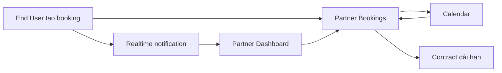
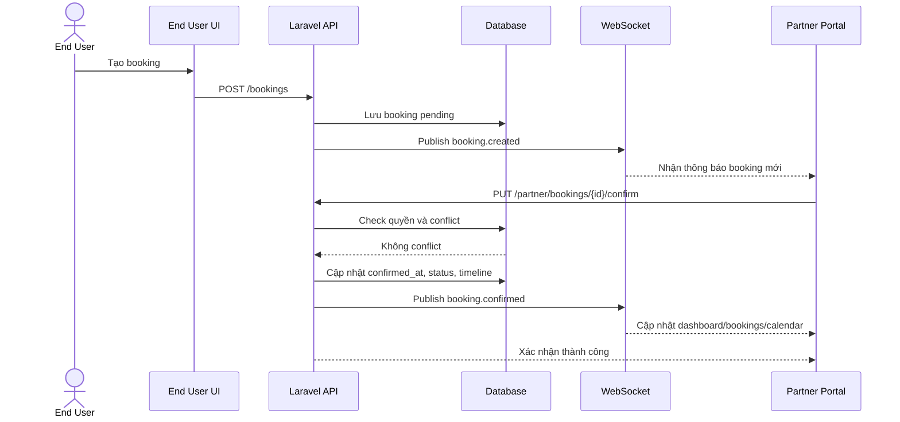
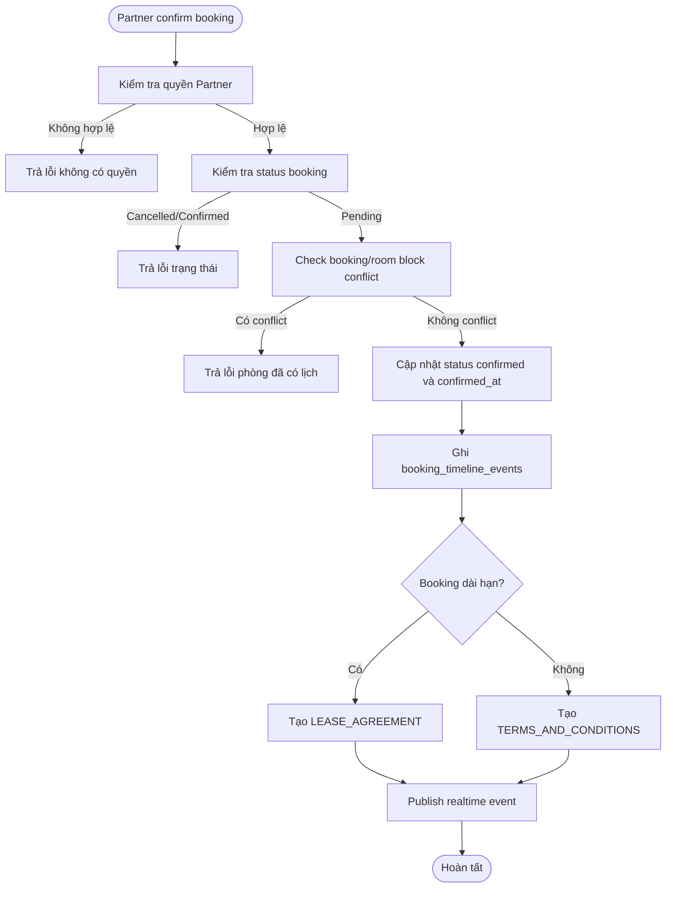
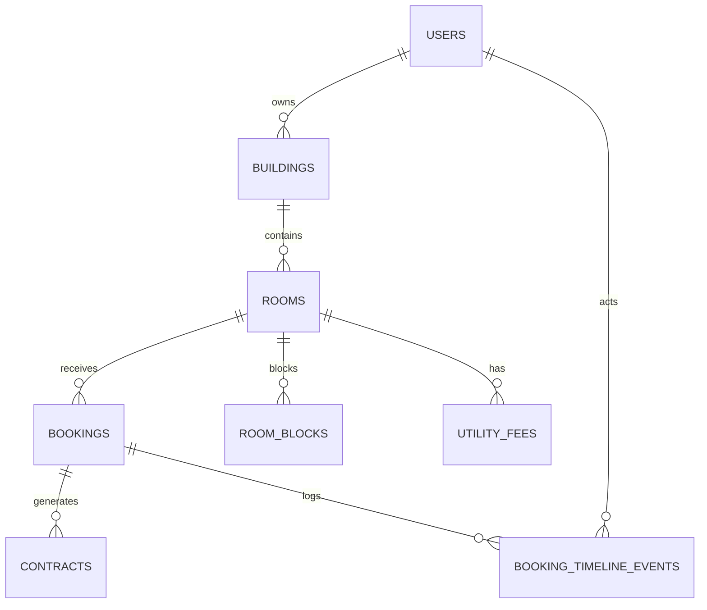

# Partner Portal 360 - Software Requirements Specification (SRS)

## Overview

Tài liệu này đặc tả yêu cầu cải tiến Partner Portal của BKS System, tập trung vào 3 màn hình trọng yếu: **Dashboard**, **Bookings** và **Calendar**. Phạm vi ưu tiên cho phase này là Partner vận hành **căn hộ dịch vụ** và **homestay linh hoạt**, theo mô hình một chủ Partner tự quản lý nhiều tòa/phòng qua web.

BKS System hiện định vị là nền tảng kết hợp OTA, PMS và Connected Stay Portal. Với vai trò Partner, hệ thống cần giúp chủ tài sản quản lý phòng, giá, lịch trống, booking và doanh thu một cách rõ ràng hơn. Lead đầu vào đã chốt rằng pain point lớn nhất là xác nhận booking chậm, calendar khó nhìn đa tài sản, hợp đồng dài hạn còn rườm rà và dashboard chưa thể hiện đúng KPI vận hành.

## Business Context and Goals

### Bối cảnh nghiệp vụ

Partner cần xử lý booking mới nhanh, tránh overbooking, biết phòng nào còn trống và theo dõi hiệu quả vận hành theo ngày/tháng. Các đối thủ tham chiếu là Booking.com Extranet và MRB, trong đó điểm quan trọng là luồng quản trị booking rõ, lịch dễ đọc và dashboard cho chủ tài sản thấy việc cần làm ngay.

### Mục tiêu kinh doanh

| Mục tiêu | Ý nghĩa |
|---|---|
| Tăng Occupancy Rate | Tăng tỷ lệ lấp phòng nhờ lịch chính xác và xử lý đơn nhanh |
| Tăng GMV | Tăng tổng giá trị booking của Partner |
| Giảm time-to-confirm | Giảm thời gian từ lúc khách đặt đến lúc Partner xác nhận |
| Tăng Partner retention | Giảm churn Partner bằng trải nghiệm vận hành gọn hơn |

### Chỉ số thành công đề xuất

| KPI | Tiêu chí đề xuất | Ghi chú |
|---|---|---|
| Time-to-confirm trung bình | <= 5 phút | Cần baseline trước khi triển khai |
| Booking được xác nhận trong 15 phút | >= 80% booking pending | Tính trên booking tạo từ End User |
| Overbooking | 0 case/tháng | Với các booking cùng phòng, trùng ngày, còn hiệu lực |
| Occupancy của Apartment/Homestay | Tăng >= 10% sau 1 quý | So với baseline trước rollout |
| Partner D30 retention | >= 70% | Partner còn active sau 30 ngày |

## User Roles and Access Scope

| Role | Phạm vi sử dụng |
|---|---|
| Partner owner | Xem Dashboard, quản lý booking, xác nhận/hủy/check-in/check-out, xem lịch, block lịch, quản lý hợp đồng dài hạn của tài sản thuộc sở hữu |
| End User | Tạo booking ở luồng upstream; nhận kết quả xác nhận/hủy từ Partner |
| Admin BKS | Không thao tác chính trong scope này; có thể audit dữ liệu nếu cần ở phase sau |

Ràng buộc scope đã chốt: mỗi Partner là **single owner**, chưa có phân quyền nhân viên nội bộ hoặc RBAC theo property/room.

## Scope

### In Scope

- Cải tiến Dashboard Partner với KPI vận hành, pending booking và cảnh báo cần xử lý.
- Cải tiến Bookings với realtime notification, quick confirm, bộ lọc nâng cao, hủy có lý do, no-show, timeline/audit log.
- Cải tiến Calendar với multi-property view, block lịch, cảnh báo overbooking, hiển thị hợp đồng dài hạn.
- Thiết lập realtime foundation bằng WebSocket (Laravel Reverb hoặc Pusher) có fallback polling.
- Liên kết lifecycle hợp đồng dài hạn cho Apartment/Homestay thuê >= 30 ngày ở mức yêu cầu nghiệp vụ.
- Đề xuất schema tối thiểu để đo time-to-confirm, audit timeline và block lịch.

### Out of Scope

- Channel Manager với Booking.com/Agoda/Traveloka.
- Mobile native app; phase này giữ web responsive.
- Tích hợp payment gateway, payout ngân hàng, đối soát tài chính thật.
- AI pricing, AI chatbot, OCR, AI listing.
- Chat module.
- Multi-user/RBAC nội bộ Partner.
- Onboarding/KYC Partner mới.
- News, Marketing, Maintenance, Stay Services, Amenities/Services.

## Functional Requirements

### Dashboard

| ID | Requirement | Priority | Acceptance signal |
|---|---|---|---|
| PP360-DASH-001 | Dashboard phải hiển thị số booking mới/chờ duyệt trong ngày và cho phép đi nhanh sang danh sách booking chờ xử lý. | Must | Partner thấy số pending và click mở danh sách tương ứng |
| PP360-DASH-002 | Dashboard phải hiển thị time-to-confirm trung bình trong kỳ đã chọn. | Must | Giá trị tính từ `bookings.created_at` đến `bookings.confirmed_at` |
| PP360-DASH-003 | Dashboard phải hiển thị Occupancy Rate theo toàn bộ tài sản của Partner và theo property khi chọn filter. | Must | Khi chọn property, số liệu thay đổi đúng theo property |
| PP360-DASH-004 | Dashboard phải hiển thị GMV tháng và Net Revenue sau commission. | Must | Net Revenue = Gross booking completed - commission - refund placeholder |
| PP360-DASH-005 | Dashboard phải có khu vực "Cần xử lý ngay" gồm booking chờ duyệt, cảnh báo overbooking, hợp đồng sắp hết hạn. | Should | Các item có CTA dẫn đến màn hình xử lý |
| PP360-DASH-006 | Dashboard phải có biểu đồ Occupancy và GMV 30 ngày gần nhất. | Should | Có thể lọc theo all/property |

### Bookings

| ID | Requirement | Priority | Acceptance signal |
|---|---|---|---|
| PP360-BOOK-001 | Partner phải nhận realtime notification khi có booking mới thuộc tài sản của mình. | Must | Có toast/badge/sound khi booking mới được tạo |
| PP360-BOOK-002 | Booking mới phải xuất hiện trong danh sách mà không bắt Partner reload thủ công. | Must | WebSocket cập nhật list; fallback polling sau 30 giây nếu mất kết nối |
| PP360-BOOK-003 | Partner có thể quick confirm booking chờ duyệt bằng một thao tác. | Must | Status đổi từ pending sang confirmed, ghi `confirmed_at`, thêm timeline event |
| PP360-BOOK-004 | Khi confirm, hệ thống phải kiểm tra conflict phòng/ngày và không cho confirm nếu có overbooking. | Must | Trùng phòng + giao ngày + status còn hiệu lực trả lỗi dễ hiểu |
| PP360-BOOK-005 | Partner có thể hủy booking với lý do bắt buộc. | Must | Status đổi cancelled, lưu `cancelled_at`, `cancellation_reason` |
| PP360-BOOK-006 | Partner có thể đánh dấu no-show đối với booking đã được xác nhận nhưng khách không đến. | Should | `stay_status = no_show`, booking không được tính vào completed revenue |
| PP360-BOOK-007 | Danh sách booking phải lọc theo property, phòng, status, stay status, ngày check-in/check-out và keyword khách. | Must | Kết quả trả về đúng filter và phân trang |
| PP360-BOOK-008 | Booking detail phải có timeline lịch sử thao tác. | Should | Timeline hiển thị tạo đơn, confirm, cancel, check-in, check-out, no-show |
| PP360-BOOK-009 | Bulk confirm/cancel tối đa 20 booking/lần. | Could | Nếu vượt giới hạn, hệ thống yêu cầu chia nhỏ thao tác |

### Calendar

| ID | Requirement | Priority | Acceptance signal |
|---|---|---|---|
| PP360-CAL-001 | Calendar phải hỗ trợ filter "Tất cả tài sản" và từng property cụ thể. | Must | Partner không phải chuyển từng tòa để xem tổng quan |
| PP360-CAL-002 | Calendar phải hỗ trợ filter theo phòng trong property. | Must | Khi chọn phòng, chỉ hiển thị booking/block của phòng đó |
| PP360-CAL-003 | Calendar phải hiển thị booking theo màu trạng thái: pending, confirmed, checked-in, completed, cancelled/no-show. | Must | Màu và label thống nhất với Bookings |
| PP360-CAL-004 | Partner có thể tạo room block cho maintenance, owner-use hoặc off-market. | Must | Ngày bị block không cho booking mới/confirm conflict |
| PP360-CAL-005 | Calendar phải cảnh báo overbooking trực tiếp trên ô lịch. | Must | Event conflict có badge/cảnh báo và link tới booking liên quan |
| PP360-CAL-006 | Calendar phải hiển thị contract span cho booking dài hạn. | Should | Booking/hợp đồng >= 30 ngày có badge Contract |
| PP360-CAL-007 | Drag-and-drop đổi ngày/đổi phòng booking chỉ được thực hiện nếu không conflict. | Should | Nếu conflict, revert event và hiển thị lỗi |

### Contract dài hạn

| ID | Requirement | Priority | Acceptance signal |
|---|---|---|---|
| PP360-CON-001 | Khi Partner confirm booking dài hạn, hệ thống phải sinh hợp đồng loại `LEASE_AGREEMENT`. | Must | Contract được tạo và ở trạng thái chờ ký |
| PP360-CON-002 | Booking ngắn hạn vẫn sinh phiếu xác nhận lưu trú hoặc terms confirmation, không bắt ký hợp đồng thuê dài hạn. | Must | Contract type = `TERMS_AND_CONDITIONS` và có thể auto-signed |
| PP360-CON-003 | Hợp đồng dài hạn phải hiển thị ngày bắt đầu, ngày kết thúc, trạng thái ký và nhắc gia hạn. | Should | Dashboard/Calendar có cảnh báo hợp đồng sắp hết hạn |
| PP360-CON-004 | Utility fee của phòng phải được tham chiếu vào hợp đồng dài hạn ở mức hiển thị/phụ lục. | Should | Hợp đồng detail thấy điện/nước/phí quản lý tương ứng |

### Realtime

| ID | Requirement | Priority | Acceptance signal |
|---|---|---|---|
| PP360-RT-001 | Hệ thống phải publish event khi có booking mới, booking đổi trạng thái hoặc calendar bị block/unblock. | Must | Partner đang online nhận event đúng tài sản của mình |
| PP360-RT-002 | WebSocket channel phải giới hạn theo Partner hoặc property để tránh lộ dữ liệu. | Must | Partner A không nhận event của Partner B |
| PP360-RT-003 | Khi WebSocket mất kết nối, FE phải fallback polling 30 giây/lần. | Must | Dữ liệu vẫn tự cập nhật sau khi mất socket |

## Screen and User Flow

### Main Flow: End User tạo booking, Partner xác nhận nhanh

1. End User chọn phòng và tạo booking.
2. Hệ thống tạo booking trạng thái `pending`.
3. Hệ thống publish realtime event tới Partner sở hữu phòng.
4. Partner thấy badge/toast trên Dashboard và Bookings.
5. Partner mở pending booking hoặc bấm quick confirm.
6. Hệ thống kiểm tra quyền Partner, trạng thái booking và conflict ngày/phòng.
7. Nếu hợp lệ, booking chuyển sang `confirmed`, ghi `confirmed_at`, thêm timeline event.
8. Nếu booking dài hạn, hệ thống sinh hợp đồng `LEASE_AGREEMENT`.
9. Dashboard cập nhật KPI pending count, time-to-confirm và GMV dự kiến.
10. Calendar hiển thị booking confirmed theo màu tương ứng.

### Alternative Flow: Partner hủy booking

1. Partner chọn booking pending/confirmed.
2. Partner chọn "Hủy/Từ chối" và nhập lý do.
3. Hệ thống kiểm tra quyền sở hữu booking.
4. Hệ thống chuyển booking sang `cancelled`, ghi `cancelled_at`, `cancellation_reason`.
5. Hệ thống thêm timeline event và publish realtime event.
6. Calendar loại booking khỏi trạng thái giữ chỗ hoặc hiển thị dạng cancelled tùy filter.

### Alternative Flow: Partner block lịch

1. Partner mở Calendar và chọn phòng/khoảng ngày.
2. Partner chọn loại block: maintenance, owner-use hoặc off-market.
3. Hệ thống kiểm tra khoảng ngày không trùng booking còn hiệu lực.
4. Hệ thống tạo `room_blocks`.
5. Calendar hiển thị block trên ô lịch.
6. Booking mới/confirm trong khoảng này bị chặn bằng thông báo dễ hiểu.

### Exception Flow: Phát hiện overbooking khi confirm

1. Partner bấm confirm booking pending.
2. Hệ thống phát hiện có booking/block khác trùng phòng và giao ngày.
3. Hệ thống không đổi trạng thái booking.
4. Hệ thống hiển thị lỗi: "Phòng đã có lịch trong khoảng ngày này. Vui lòng chọn phòng khác hoặc điều chỉnh ngày."
5. Timeline ghi nhận thao tác confirm thất bại nếu cần audit.

## Luồng nghiệp vụ tổng thể và liên kết tài liệu SRC

### Vị trí trong end-to-end flow

- **Upstream:** End User tìm kiếm phòng, xem chi tiết phòng và tạo booking. Tài liệu tham chiếu hiện có trong repo là `business-script/E2E_BOOKING_PARTNER_USER_SCRIPT.md`.
- **Current feature:** Partner xử lý booking, theo dõi KPI và quản lý lịch khả dụng trên Dashboard/Bookings/Calendar.
- **Downstream:** Sau khi confirm, booking có thể chuyển sang hợp đồng dài hạn, check-in, check-out và Connected Stay Portal.

### Liên kết với SRS/SRC hiện có

Tại thời điểm phân tích, thư mục canonical `docs/SRC/` chưa có file `srs_*.md` liên quan trực tiếp đến booking/partner. Vì vậy SRS này dùng các tài liệu nguồn sau để đảm bảo flow thống nhất:

| Artifact | Vai trò liên kết |
|---|---|
| `docs/leads/lead_260510_partner-portal-360.md` | Lead discovery đầu vào |
| `business-script/bks_srs_overview.md` | Vai trò Partner và phạm vi PMS/OTA/Connected Stay |
| `business-script/PRICING_RESTRUCTURE_PLAN.md` | Quy tắc ngắn hạn/dài hạn/homestay >= 30 ngày |
| `business-script/E2E_BOOKING_PARTNER_USER_SCRIPT.md` | Luồng User đặt phòng -> Partner xác nhận -> check-in/out |

## Function Catalog and Business Purpose

| Function ID | User Action | System Behavior | Business Purpose |
|---|---|---|---|
| F-DASH-01 | Mở Dashboard | Tải KPI, pending bookings, cảnh báo và biểu đồ | Cho Partner biết cần xử lý gì trước |
| F-DASH-02 | Chọn property filter | Tính lại KPI theo property | Hỗ trợ Partner multi-property |
| F-DASH-03 | Bấm quick action pending booking | Điều hướng hoặc confirm theo quyền | Giảm time-to-confirm |
| F-BOOK-01 | Xem danh sách booking | Trả booking theo filter, phân trang | Theo dõi toàn bộ đơn |
| F-BOOK-02 | Confirm booking | Kiểm tra quyền/conflict, cập nhật status, ghi timeline | Chốt đơn nhanh và an toàn |
| F-BOOK-03 | Cancel booking | Bắt nhập lý do, cập nhật status, ghi timeline | Minh bạch khi từ chối/hủy |
| F-BOOK-04 | Check-in/Check-out | Cập nhật `stay_status` và trạng thái phòng | Quản lý vận hành lưu trú |
| F-BOOK-05 | Mark no-show | Cập nhật `stay_status = no_show` | Tách khách không đến khỏi doanh thu hoàn tất |
| F-CAL-01 | Mở Calendar all properties | Tải booking/block theo date range và owner | Xem tổng quan đa tài sản |
| F-CAL-02 | Block lịch | Tạo room block sau khi check conflict | Chặn bán phòng khi không khả dụng |
| F-CAL-03 | Drag booking | Kiểm tra conflict, cập nhật ngày/phòng | Điều chỉnh lịch linh hoạt |
| F-RT-01 | Nhận realtime event | FE cập nhật badge/list/calendar | Giảm reload thủ công |

## Form Field Specification

| Screen | Field | Type | Required | Default | Validation | Source |
|---|---|---|---|---|---|---|
| Dashboard | Property filter | Select | No | All properties | Chỉ gồm property thuộc Partner | `buildings.user_id` |
| Dashboard | Date range | Date range | No | 30 ngày gần nhất | `start_date <= end_date`, tối đa 12 tháng | UI |
| Bookings | Keyword | Text | No | Empty | Tìm theo tên khách, số điện thoại, phòng, tòa | API query |
| Bookings | Status | Select | No | All | pending/confirmed/cancelled/completed | `bookings.status` |
| Bookings | Stay status | Select | No | All | pending/checked_in/checked_out/no_show | `bookings.stay_status` |
| Bookings | Property | Select | No | All | Thuộc Partner hiện tại | `buildings.id` |
| Bookings | Room | Select | No | All | Thuộc property đã chọn | `rooms.id` |
| Bookings | Check-in date range | Date range | No | Empty | Ngày hợp lệ | `bookings.start_date` |
| Bookings | Cancellation reason | Textarea | Yes khi cancel | Empty | 5-500 ký tự | `bookings.cancellation_reason` |
| Calendar | Property view | Select | No | All properties | All hoặc property thuộc Partner | `buildings.id` |
| Calendar | Room filter | Select | No | All rooms | Thuộc property/Partner | `rooms.id` |
| Calendar | View mode | Select/Tabs | No | Month | month/week/timeline | UI state |
| Calendar | Block type | Select | Yes khi block | maintenance | maintenance/owner_use/off_market | `room_blocks.block_type` |
| Calendar | Block date range | Date range | Yes khi block | Empty | Không giao với booking còn hiệu lực | `room_blocks.start_date/end_date` |
| Calendar | Block reason | Text | Yes | Empty | 3-255 ký tự | `room_blocks.reason` |

## Data Rules and Cross-Screen Dependencies

1. Partner chỉ được xem và xử lý booking thuộc các phòng trong `buildings.user_id = Auth::id()`.
2. Booking status dùng quy ước: `0 = pending`, `1 = confirmed`, `2 = cancelled`, `3 = completed`.
3. Stay status dùng quy ước: `pending`, `checked_in`, `checked_out`, `no_show`.
4. Time-to-confirm = `bookings.confirmed_at - bookings.created_at`; chỉ tính booking có `confirmed_at`.
5. Net Revenue trong phase này tính theo công thức đơn giản: Gross booking completed - commission. Refund thật đang out-of-scope.
6. Booking dài hạn là booking thuộc Apartment hoặc Homestay có thời gian thuê >= 30 ngày hoặc price package unit = month.
7. Confirm booking phải check conflict với booking khác cùng phòng và `room_blocks` trong cùng khoảng ngày.
8. Calendar lấy dữ liệu từ booking và room block, không tạo booking giả để block lịch.
9. Dashboard pending booking và Bookings list phải dùng cùng nguồn dữ liệu để tránh lệch số.
10. Realtime event chỉ đóng vai trò thông báo/cập nhật UI; database vẫn là nguồn sự thật.

## Related Data Mapping

| Screen Field/Action | Table | Column | Relationship | Downstream Usage |
|---|---|---|---|---|
| Property filter | buildings | id, name, user_id | buildings.user_id -> users.id | Dashboard/Bookings/Calendar filter |
| Room filter | rooms | id, building_id, room_number/title | rooms.building_id -> buildings.id | Calendar events, booking assignment |
| Booking row | bookings | id, user_id, room_id, start_date, end_date, status, stay_status | bookings.room_id -> rooms.id | Bookings list, Calendar event |
| Booking price | room_prices | id, price, unit, deposit_amount, minimum_stay | bookings.price_id -> room_prices.id | GMV/Net revenue, long-term detection |
| Quick confirm | bookings | status, confirmed_at | booking belongs to room/building | Dashboard KPI, Calendar update |
| Cancel booking | bookings | status, cancelled_at, cancellation_reason | booking belongs to Partner-owned room | Audit, customer communication |
| Timeline | booking_timeline_events | booking_id, event_type, actor_id | timeline belongs to booking | Booking detail audit |
| Room block | room_blocks | room_id, start_date, end_date, block_type | block belongs to room | Calendar availability, conflict check |
| Long-term contract | contracts | booking_id, contract_type, status, signature_date | contracts.booking_id -> bookings.id | Stay Portal, renewal alerts |
| Utility fee | utility_fees | room_id, fee_type, calc_method, unit_price | utility_fees.room_id -> rooms.id | Contract appendix |

## Legacy-to-Laravel Mapping

Không có legacy source path riêng được cung cấp trong yêu cầu này. Mapping dưới đây dùng hiện trạng Laravel/React đang có để định vị mục tiêu migration/cải tiến.

| Area | Current Module/Screen | Current API/Service | Target Laravel/React Module | Required Gap |
|---|---|---|---|---|
| Dashboard KPI | Partner Dashboard | PartnerDashboardController, DashboardService | Partner Dashboard enhanced | Thêm time-to-confirm, net revenue, alert center |
| Pending bookings | Partner Dashboard + Bookings | BookingService, BookingRepository | Shared pending booking source | Quick confirm thật, không chỉ toast |
| Booking list | Partner Bookings | `/api/v1/partner/bookings` | Bookings enhanced | Filter nâng cao, cancellation reason, timeline |
| Calendar | Partner Calendar | Dùng `/api/v1/partner/bookings` với date range | Calendar enhanced | All properties view, room block, conflict warnings |
| Contract | Partner Contracts | PartnerContractController, ContractService | Contract lifecycle subset | Renewal reminder, utility fee appendix |
| Realtime | Chưa có trong scope hiện tại | N/A | Broadcast events + frontend subscription | WebSocket channel và fallback polling |

## Error Messages and Handling

| Scenario | Customer-readable message |
|---|---|
| Partner mở booking không thuộc tài sản của mình | Bạn không có quyền xử lý booking này. |
| Confirm booking đã bị hủy | Booking đã bị hủy, không thể xác nhận. |
| Confirm booking đã xác nhận | Booking đã được xác nhận trước đó. |
| Confirm gặp conflict booking khác | Phòng đã có lịch trong khoảng ngày này. Vui lòng chọn phòng khác hoặc điều chỉnh ngày. |
| Tạo room block trùng booking | Không thể block lịch vì phòng đang có booking trong khoảng ngày đã chọn. |
| Hủy booking thiếu lý do | Vui lòng nhập lý do hủy booking. |
| WebSocket mất kết nối | Mất kết nối realtime, hệ thống sẽ tự cập nhật định kỳ. |
| Tải calendar thất bại | Không thể tải lịch đặt phòng. Vui lòng thử lại. |
| Bulk action quá giới hạn | Chỉ được xử lý tối đa 20 booking mỗi lần. |

## Acceptance Criteria

1. Khi End User tạo booking mới, Partner đang mở portal nhận thông báo realtime và thấy booking xuất hiện trong danh sách pending.
2. Khi Partner bấm quick confirm cho booking pending không conflict, status chuyển sang confirmed, `confirmed_at` được ghi và timeline có event confirm.
3. Khi booking trùng phòng/ngày với booking đã confirmed hoặc room block, hệ thống không cho confirm và hiển thị lỗi dễ hiểu.
4. Dashboard hiển thị đúng pending count, occupancy, GMV tháng, net revenue và time-to-confirm theo toàn bộ tài sản.
5. Khi chọn một property trên Dashboard/Calendar/Bookings, dữ liệu chỉ còn trong property đó.
6. Calendar có view all properties, hiển thị booking và room block trong date range đang xem.
7. Partner có thể tạo room block với loại block và lý do bắt buộc; booking mới/confirm trùng block bị chặn.
8. Booking dài hạn sau confirm sinh contract `LEASE_AGREEMENT`; booking ngắn hạn sinh `TERMS_AND_CONDITIONS`.
9. Khi mất WebSocket, dữ liệu vẫn cập nhật qua polling tối đa 30 giây/lần.
10. Không có dữ liệu Partner A xuất hiện trong WebSocket event, API response hoặc calendar của Partner B.

## Proposed Database Design (Customer Review Level)

| Table | Column | Type | Nullable | Key | Reference | Notes |
|---|---|---|---|---|---|---|
| bookings | confirmed_at | timestamp | Yes | Index | - | Dùng đo time-to-confirm |
| bookings | cancelled_at | timestamp | Yes | Index | - | Dùng audit hủy |
| bookings | cancellation_reason | text | Yes | - | - | Bắt buộc khi cancel |
| bookings | no_show_at | timestamp | Yes | - | - | Dùng khi mark no-show |
| bookings | source | string(50) | Yes | Index | - | web, partner_portal, future OTA |
| booking_timeline_events | id | big integer | No | PK | - | Bảng mới |
| booking_timeline_events | booking_id | big integer | No | FK | bookings.id | Timeline mỗi booking |
| booking_timeline_events | actor_id | big integer | Yes | FK | users.id | Người thao tác |
| booking_timeline_events | event_type | string(50) | No | Index | - | created, confirmed, cancelled, checked_in |
| booking_timeline_events | from_status | string(50) | Yes | - | - | Trạng thái trước |
| booking_timeline_events | to_status | string(50) | Yes | - | - | Trạng thái sau |
| booking_timeline_events | note | text | Yes | - | - | Lý do hủy/no-show |
| booking_timeline_events | metadata | json | Yes | - | - | Dữ liệu phụ |
| room_blocks | id | big integer | No | PK | - | Bảng mới |
| room_blocks | room_id | big integer | No | FK, Index | rooms.id | Phòng bị block |
| room_blocks | start_date | date | No | Index | - | Ngày bắt đầu |
| room_blocks | end_date | date | No | Index | - | Ngày kết thúc |
| room_blocks | block_type | string(30) | No | Index | - | maintenance/owner_use/off_market |
| room_blocks | reason | string(255) | No | - | - | Lý do block |
| room_blocks | note | text | Yes | - | - | Ghi chú |
| room_blocks | created_by | big integer | Yes | FK | users.id | Partner tạo |
| contracts | renewal_reminder_at | timestamp | Yes | Index | - | Cảnh báo sắp hết hạn |
| contracts | terminated_at | timestamp | Yes | - | - | Thanh lý hợp đồng |
| contracts | termination_reason | text | Yes | - | - | Lý do thanh lý |

### Index đề xuất

| Table | Index | Purpose |
|---|---|---|
| buildings | `(user_id)` | Lọc property theo Partner |
| bookings | `(room_id, start_date, end_date, status)` | Check conflict và tải calendar |
| bookings | `(status, created_at)` | Pending list và time-to-confirm |
| bookings | `(confirmed_at)` | KPI time-to-confirm |
| room_blocks | `(room_id, start_date, end_date)` | Check conflict lịch block |
| booking_timeline_events | `(booking_id, created_at)` | Timeline booking detail |

## Mermaid Diagrams

### Screen Flow

### Sequence Diagram (Main Scenario)

### Functional Processing Flow

### ERD (Draft)

## Risks and Mitigations

| Risk | Impact | Mitigation |
|---|---|---|
| Chưa có baseline time-to-confirm | Khó chứng minh KPI cải thiện | Thêm `confirmed_at` và timeline trước khi tối ưu UI |
| WebSocket tăng độ phức tạp vận hành | Có thể quá sức với scale nhỏ | Thiết kế fallback polling; stack-design so sánh Reverb vs Pusher |
| Multi-property all view chậm khi nhiều phòng | Calendar tải nặng | Giới hạn date range, lazy load theo viewport, filter mặc định |
| Conflict check sai ngày biên | Dẫn đến overbooking | Chuẩn hóa date theo Asia/Ho_Chi_Minh, test đầu/cuối ngày |
| Commission rule chưa ổn định | Net Revenue sai | Tạm dùng commission-only cố định; chốt rule ở design/plan |
| Contract dài hạn phình scope | Trễ delivery | Phase này chỉ lifecycle tối thiểu + renewal reminder |

## Open Questions

| ID | Question | Owner đề xuất |
|---|---|---|
| OQ1 | Baseline time-to-confirm hiện tại là bao nhiêu? | Product/BA |
| OQ2 | Dashboard mặc định all properties hay property gần nhất Partner thao tác? | Product/UX |
| OQ3 | Overbooking nên block tuyệt đối hay có override bởi Admin? | Product/Operations |
| OQ4 | Room block có cần Admin audit không? | Operations |
| OQ5 | Hợp đồng dài hạn dùng chữ ký số/OTP/signature image loại nào? | Legal/BA |
| OQ6 | Drag-and-drop đổi phòng/ngày có cần email cho khách không? | Product |
| OQ7 | Net Revenue cần chia theo Apartment/Homestay hay tổng hợp trước? | Product |
| OQ8 | SLA <= 5 phút có được stakeholder chấp nhận không? | Product |
| OQ9 | Chọn Reverb hay Pusher? | Technical Lead |
| OQ10 | Bulk confirm/cancel tối đa 20 booking/lần đã phù hợp chưa? | Product/Tech |

## Out of Scope

Các hạng mục sau không thuộc SRS này và chỉ nên mở lại sau khi Dashboard/Bookings/Calendar phase đầu ổn định:

- Channel Manager.
- Native mobile app.
- Payment/payout/finance reconciliation.
- AI features.
- Chat.
- RBAC nội bộ Partner.
- Partner onboarding/KYC.
- Maintenance/Stay Services/Amenities/Marketing.
