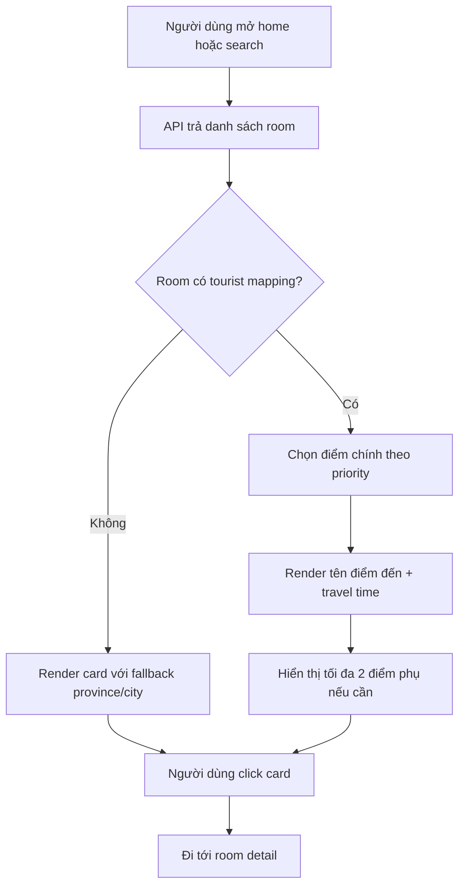
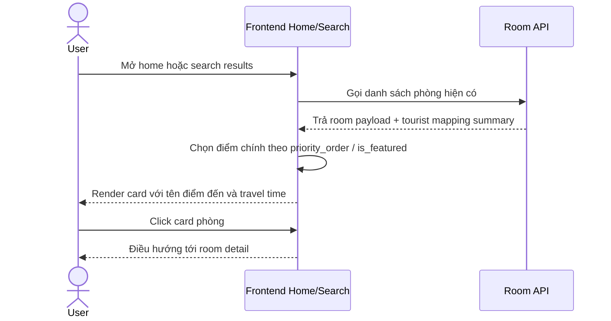
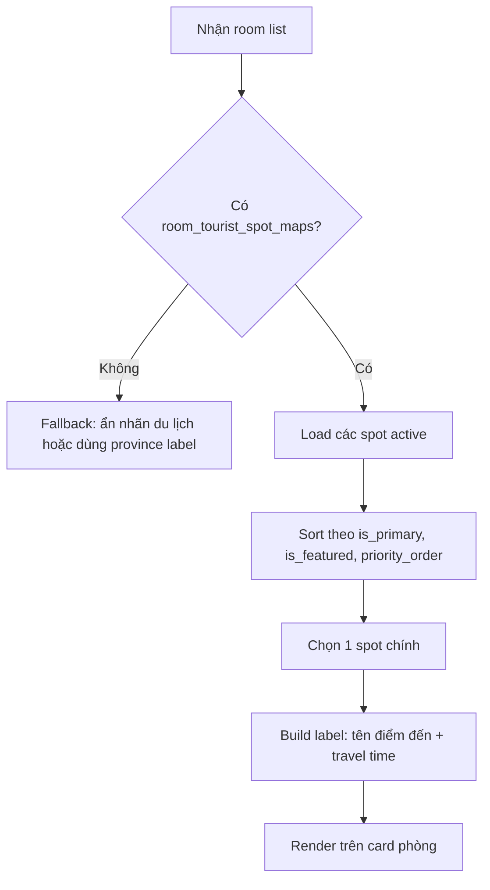
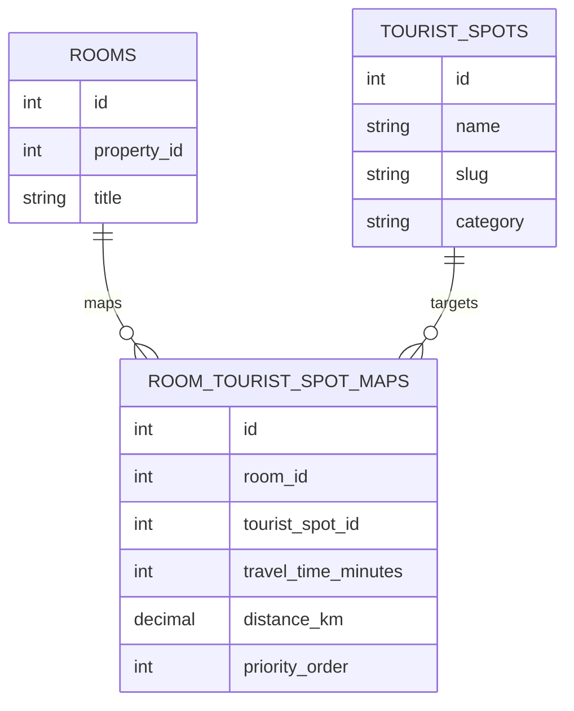

# SRS: Gợi ý phòng theo điểm du lịch

## 1. Thông tin tài liệu
- **Mã tài liệu:** SRS-RTM-001
- **Tên chức năng:** Gợi ý phòng theo điểm du lịch
- **Ngày tạo:** 2026-05-21
- **Nguồn đầu vào:** [docs/leads/lead_260521_room-tourist-mapping.md](../leads/lead_260521_room-tourist-mapping.md)
- **Màn hình liên quan:** Trang chủ public `/`, trang kết quả tìm kiếm phòng, card phòng nổi bật
- **Trạng thái:** Draft cho phân tích / sẵn sàng sang design

---

## 2. Bối cảnh và mục tiêu
Trang chủ hiện có hero search, điểm đến nổi bật và phòng nổi bật. Tuy nhiên, người dùng vẫn phải tự suy luận phòng nào phù hợp với chuyến du lịch nào. Chức năng này bổ sung lớp ngữ nghĩa du lịch cho phòng nổi bật: phòng nào gần điểm nào, mất bao lâu để đến, và điểm du lịch nào nên được ưu tiên hiển thị.

Mục tiêu của chức năng là giúp người dùng hiểu nhanh giá trị vị trí của phòng, tăng khả năng click từ homepage / search results vào room detail, nhưng không phá search-first flow hiện có.

### 2.1. Định hướng trải nghiệm
- Giữ các route hiện có.
- Không đổi logic đặt phòng.
- Chỉ bổ sung thông tin điểm du lịch và thời gian di chuyển ở mức card / list item / summary block.
- Ưu tiên các điểm đến nổi tiếng hơn các điểm phụ.

---

## 3. Phạm vi

### 3.1. In scope
- Hiển thị gợi ý phòng theo điểm du lịch trên trang chủ và trang kết quả tìm kiếm.
- Gắn mỗi phòng với một hoặc nhiều điểm du lịch nổi tiếng.
- Hiển thị tên điểm đến và thời gian di chuyển ước tính.
- Cho phép ưu tiên một điểm đến chính trên card phòng.
- Bổ sung master data và mapping data để lưu danh mục điểm du lịch.
- Cho phép fallback khi phòng chưa đủ dữ liệu.

### 3.2. Out of scope
- Không xây dựng bản đồ tương tác full-screen.
- Không tích hợp live routing / directions service trong scope này.
- Không thay đổi flow booking.
- Không redesign toàn bộ landing page.
- Không xóa hoặc hợp nhất các bảng hiện có.

---

## 4. Đối tượng sử dụng
- **Người dùng cuối:** muốn chọn phòng theo điểm du lịch họ sắp đi.
- **Người dùng có nhu cầu so sánh:** muốn biết phòng nào gần Bà Nà Hill, Hội An, v.v.
- **Vận hành / nội dung:** cần gắn và ưu tiên điểm du lịch nổi bật.

---

## 5. Luồng nghiệp vụ tổng thể và liên kết tài liệu SRC

### 5.1. Vị trí trong luồng
Chức năng nằm trên public homepage và public room search result. Nó là lớp hiển thị bổ sung cho các block phòng nổi bật đã có, không thay thế search form hay thứ tự section hiện tại.

### 5.2. Liên kết tài liệu SRC
- Tài liệu liên quan trực tiếp: [docs/SRC/srs_landing_page_prominence.md](srs_landing_page_prominence.md)
- Các màn search rooms / room detail hiện chưa có SRS riêng trong repo này; khi mở rộng scope, tài liệu đó sẽ liên kết bổ sung.

### 5.3. Luồng tổng quát
1. Người dùng mở trang chủ hoặc trang kết quả tìm kiếm.
2. Hệ thống tải danh sách phòng / phòng nổi bật từ API hiện có.
3. API trả thêm summary về điểm du lịch cho từng phòng đủ dữ liệu.
4. FE render nhãn du lịch trên card phòng: tên điểm đến + thời gian di chuyển.
5. Nếu một phòng có nhiều điểm du lịch, FE hiển thị điểm chính trước, các điểm còn lại ở mức mở rộng / tooltip / detail.
6. Nếu phòng không có mapping, FE fallback sang nhãn tỉnh/thành hoặc ẩn nhãn du lịch.

---

## 6. Yêu cầu chức năng

### FR-01. Gắn phòng với điểm du lịch
- Hệ thống phải lưu được quan hệ giữa phòng và một hoặc nhiều điểm du lịch.
- Mỗi phòng phải có thể có một điểm chính và nhiều điểm phụ.

### FR-02. Hiển thị nhãn du lịch trên card phòng
- Card phòng trên home / search phải hiển thị ít nhất một nhãn du lịch nếu dữ liệu hợp lệ.
- Nhãn gồm tên điểm đến và thời gian di chuyển ước tính.

### FR-03. Ưu tiên điểm nổi tiếng
- Khi một phòng có nhiều mapping, hệ thống phải ưu tiên điểm du lịch nổi tiếng nhất trước.
- Thứ tự ưu tiên không được phụ thuộc vào sắp xếp ngẫu nhiên của frontend.

### FR-04. Hỗ trợ nhiều điểm đến cho một phòng
- Một phòng có thể map với nhiều điểm đến, nhưng card public chỉ nên hiển thị số lượng giới hạn để tránh rối UI.
- Danh sách mở rộng có thể hiển thị trong room detail hoặc popover nếu FE cần.

### FR-05. Fallback khi thiếu dữ liệu
- Nếu phòng chưa có mapping, hệ thống phải cho phép ẩn nhãn du lịch mà không làm vỡ layout.
- Có thể fallback sang nhãn tỉnh / thành hoặc vùng địa lý nếu dữ liệu mapping chưa đầy đủ.

### FR-06. Cho phép quản trị danh mục điểm du lịch
- Cần có master data cho các điểm du lịch nổi tiếng.
- Cần có mapping data để gắn điểm du lịch vào phòng.

### FR-07. Dữ liệu phải tái sử dụng cho nhiều màn hình
- Payload room list ở homepage và search result phải dùng cùng một cấu trúc summary để tránh logic phân mảnh.

### FR-08. Không làm hỏng search-first flow
- Nhãn du lịch chỉ là thông tin bổ trợ.
- Search form và luồng điều hướng hiện có phải giữ nguyên.

---

## 7. Danh mục chức năng và mục đích nghiệp vụ

| Function ID | Hành động người dùng | Hành vi hệ thống | Mục đích nghiệp vụ |
|---|---|---|---|
| F-RTM-01 | Mở trang chủ | Trả summary du lịch cho card phòng nổi bật | Tăng khả năng hiểu nhanh giá trị vị trí |
| F-RTM-02 | Xem danh sách phòng search | Gắn nhãn du lịch vào room card nếu có mapping | Hỗ trợ so sánh phòng theo điểm đến |
| F-RTM-03 | Mở card / detail phòng | Hiển thị điểm chính và các điểm phụ nếu có | Làm rõ phòng phù hợp với chuyến đi nào |
| F-RTM-04 | Quản trị mapping | Lưu master spot và mapping data | Đảm bảo dữ liệu bền vững, không hardcode |

---

## 8. Bảng field / hiển thị

### 8.1. Master data: tourist_spots

| Field | Type | Required | Default | Validation | Notes |
|---|---|---|---|---|---|
| id | bigint | Có | - | PK | Khóa chính |
| name | string(255) | Có | - | 2-255 ký tự | Tên điểm du lịch, ví dụ Bà Nà Hill |
| slug | string(255) | Có | - | unique | Phục vụ định danh nội bộ / SEO |
| category | string(50) | Có | attraction | Chỉ nhận attraction, beach, mountain, culture, entertainment, other | Loại điểm đến |
| region_label | string(255) | Không | null | 0-255 ký tự | Tên vùng / khu vực hiển thị |
| is_featured | boolean | Có | false | 0/1 | Đánh dấu điểm nổi tiếng |
| sort_order | integer | Có | 0 | >= 0 | Thứ tự ưu tiên |
| is_active | boolean | Có | true | 0/1 | Bật / tắt hiển thị |
| created_at / updated_at | timestamp | Có | - | - | Laravel timestamps |

### 8.2. Mapping data: room_tourist_spot_maps

| Field | Type | Required | Default | Validation | Notes |
|---|---|---|---|---|---|
| id | bigint | Có | - | PK | Khóa chính |
| room_id | bigint | Có | - | FK -> rooms.id | Phòng được map |
| tourist_spot_id | bigint | Có | - | FK -> tourist_spots.id | Điểm du lịch |
| distance_km | decimal(8,2) | Không | null | >= 0 | Khoảng cách ước tính |
| travel_time_minutes | integer | Có | - | 1-999 | Thời gian di chuyển ước tính |
| priority_order | integer | Có | 0 | >= 0 | Thứ tự ưu tiên hiển thị |
| is_primary | boolean | Có | false | 0/1 | Điểm chính của phòng |
| source_type | string(30) | Có | estimated | manual, estimated, imported | Nguồn dữ liệu |
| note | text | Không | null | - | Ghi chú nghiệp vụ |
| created_at / updated_at | timestamp | Có | - | - | Laravel timestamps |

### 8.3. DTO / response fields

| Field | Type | Required | Notes |
|---|---|---|---|
| tourist_spot_name | string | Có khi có mapping | Tên điểm du lịch chính |
| travel_time_label | string | Có khi có mapping | Ví dụ `15 phút di chuyển` |
| distance_label | string | Không | Hiển thị khi cần bổ sung |
| tourist_spots | array | Không | Danh sách điểm phụ giới hạn |
| has_tourist_mapping | boolean | Có | Dùng cho FE fallback |

---

## 9. Quy tắc dữ liệu và validation
- `tourist_spots.slug` phải unique.
- `tourist_spots.is_featured = true` mới được ưu tiên lên đầu.
- `room_tourist_spot_maps.travel_time_minutes` là bắt buộc nếu record đã active.
- `distance_km` là optional, nhưng nếu có thì phải >= 0.
- Mỗi phòng chỉ nên có tối đa một mapping `is_primary = true` tại cùng một thời điểm hiển thị.
- FE chỉ render tối đa 1 điểm chính và 2 điểm phụ trên card để tránh rối UI.
- Nếu không có mapping hợp lệ, hệ thống phải fallback mà không làm lỗi response.
- Travel time là giá trị ước tính / quản trị, không phải route live.

---

## 10. Luồng màn hình

---

## 11. Sequence luồng chính

---

## 12. Flow xử lý chức năng

---

## 13. ERD draft

---

## 14. Mapping field / module đích

| Nguồn hiện tại | Module / màn hình đích | Ghi chú |
|---|---|---|
| Room list API | Homepage featured rooms | Enrich card bằng tourist summary |
| Search rooms API | Search result room cards | Dùng cùng DTO với homepage |
| Tourist spot master | Admin / seed data | Lưu danh mục điểm du lịch nổi tiếng |
| Room-tourist mapping | Room detail / card summary | Hiển thị điểm chính và điểm phụ |

---

## 15. Mapping VB6 -> Laravel

| VB6 legacy screen / function | Laravel / hiện đại tương ứng | Trạng thái |
|---|---|---|
| Không có tài liệu VB6 trực tiếp cho room-tourist mapping | Home / Search room card summary | Chưa có đối sánh legacy trong input hiện tại |

Ghi chú: scope này đang phân tích public room discovery hiện đại; khi có legacy screen tương ứng, mapping sẽ được bổ sung ở SRS liên quan.

---

## 16. Tiêu chí nghiệm thu
- Card phòng trên home và search có thể hiển thị điểm du lịch chính nếu có dữ liệu.
- Nội dung hiển thị gồm tên điểm đến và thời gian di chuyển.
- Phòng có nhiều mapping vẫn render gọn, không vỡ layout.
- Phòng không có mapping vẫn hiển thị bình thường với fallback.
- Dữ liệu ưu tiên theo `is_primary` / `is_featured` / `priority_order`.
- Không làm thay đổi route hay luồng booking hiện có.
- Dữ liệu dùng chung được cho cả homepage và search result.

---

## 17. Rủi ro và giả định

### Rủi ro
- Dữ liệu khu vực hiện có có thể chưa đủ chi tiết để suy ra travel time chính xác.
- Nếu quá nhiều điểm du lịch được map cho một phòng, card sẽ rối và khó đọc.
- Nếu không có master data chuẩn, thứ tự ưu tiên có thể không nhất quán.

### Giả định
- Travel time là giá trị ước tính hoặc quản trị được lưu trong mapping.
- Tên điểm du lịch nổi tiếng có thể được seed trước từ danh sách cố định.
- FE chỉ cần một payload summary thống nhất để render home và search result.

---

## 18. Kết luận
Đây là bài toán enrich phòng bằng ngữ nghĩa du lịch, không phải redesign toàn bộ trang. Phương án phù hợp là thêm master data + mapping data, đẩy summary này vào payload room list, và giữ search-first flow hiện tại.