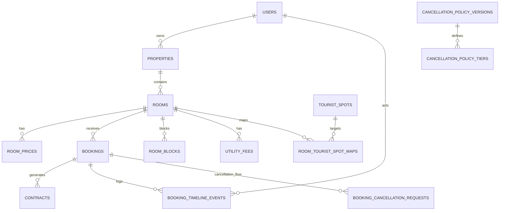

# BKS System - Database Overview & Core Schema

## Metadata tài liệu

| Trường | Giá trị |
|---|---|
| Người tạo | Cursor Agent |
| Ngày tạo | 2026-05-10 |
| Phạm vi baseline | Các bảng lõi liên quan Partner Portal 360: **properties**, rooms, room_prices, bookings, contracts, utility_fees và delta đề xuất |
| Quy ước | File này là canonical schema overview cho các phân tích DB trong repository |

## Nhật ký thay đổi

| Ngày | Người cập nhật | Nội dung |
|---|---|---|
| 2026-05-10 | Cursor Agent | Tạo baseline canonical theo `srs_partner_portal_360.md`; ghi nhận bảng hiện có và delta đề xuất cho Dashboard/Bookings/Calendar Partner Portal |
| 2026-05-10 | Cursor Agent | Đồng bộ với `docs/designs/design_001.md`: chốt CHECK constraint cho `room_blocks` (`end_date >= start_date`, `block_type` thuộc enum `maintenance/owner_use/off_market`); chốt chiến lược pessimistic lock theo `room_id` cho confirm booking; bổ sung quy ước backfill `bookings.confirmed_at = updated_at` cho status confirmed; không thay đổi cấu trúc bảng so với baseline |
| 2026-05-10 | Cursor Agent (stack-task Phase 1) | Phase 1 đã ship migration thực tế. (1) `bookings`: thêm `confirmed_at`, `cancelled_at`, `cancellation_reason`, `no_show_at`, `source` (đều nullable) + 5 index `idx_bookings_confirmed_at`, `idx_bookings_cancelled_at`, `idx_bookings_status_created_at`, `idx_bookings_room_dates_status`, `idx_bookings_source`. (2) `contracts`: thêm `renewal_reminder_at`, `terminated_at`, `termination_reason` (đều nullable) + index `idx_contracts_renewal_reminder`. (3) Tạo bảng mới `booking_timeline_events` với schema: `id`, `booking_id` (FK CASCADE→bookings.id), `actor_id` (FK SET NULL→users.id), `event_type VARCHAR(50)`, `from_status/to_status VARCHAR(50)` nullable, `note TEXT` nullable, `metadata JSON` nullable, `timestamps`. Index `(booking_id, created_at)`, `event_type`, `actor_id`. Migration files: `2026_05_10_120001_add_partner_portal_360_columns_to_bookings_table.php`, `2026_05_10_120002_add_renewal_fields_to_contracts_table.php`, `2026_05_10_120003_create_booking_timeline_events_table.php`. Tất cả migration kèm `down()` rollback hoàn chỉnh. |
| 2026-05-10 | Cursor Agent (stack-task Phase 2) | Phase 2 KHÔNG thay đổi schema. Bổ sung runtime semantics cho `booking_timeline_events`: thêm giá trị `event_type='broadcast_dispatched'` (do listener `App\Listeners\RecordBookingTimeline` ghi sau khi events `BookingCreated|BookingConfirmed|BookingCancelled` được dispatch). `metadata` chứa `partner_id`, `property_id`, `actor_id`, `source` (tên event gốc). Đây là marker phụ trợ cho audit realtime, không thay timeline transition đồng bộ Phase 1. Phase 2 cũng đăng ký channel auth `private-partner.{user_id}` và `private-property.{property_id}` ở `routes/channels.php` — không có bảng/cột mới. |
| 2026-05-10 | Cursor Agent (stack-task Phase 3) | Phase 3 ship migration thực tế cho `room_blocks` (file `2026_05_10_120004_create_room_blocks_table.php`). Cấu trúc: `id`, `room_id` (FK CASCADE→rooms.id), `start_date DATE`, `end_date DATE`, `block_type VARCHAR(30)` ∈ {`maintenance`, `owner_use`, `off_market`}, `reason VARCHAR(255)`, `note TEXT?`, `created_by/updated_by` (FK SET NULL→users.id), `timestamps`. Index `idx_rb_room_dates(room_id, start_date, end_date)`, `idx_rb_block_type`. CHECK constraint qua raw SQL: `chk_rb_dates(end_date >= start_date)` và `chk_rb_block_type(block_type IN (...))`. Bổ sung runtime: timeline event `event_type='conflict_detected'` (ghi từ `BookingTimelineService::recordConflictDetected` khi `BookingService::handleConfirmBooking|handleMove` phát hiện conflict). Không thay đổi schema `bookings/contracts`. |
| 2026-05-12 | Cursor Agent (stack-task Phase 4) | Phase 4 KHÔNG thay đổi schema. Bổ sung runtime/API semantics: dashboard chart occupancy đọc `bookings/rooms/properties` theo interval `[start_date,end_date)` và status `CONFIRMED|COMPLETED`; dashboard chart GMV group theo `bookings.start_date`, loại `CANCELLED`, join `room_prices.price`; KPI cache keys gồm `partner:{id}:kpi:dashboard`, `partner:{id}:kpi:charts:occupancy`, `partner:{id}:kpi:charts:gmv`. Bulk action endpoint dùng existing `bookings` schema và mỗi item gọi single confirm/cancel để giữ lock/timeline/broadcast. |
| 2026-05-12 | Cursor Agent (stack-task Phase 5) | Phase 5 KHÔNG thay đổi schema (các cột `contracts.renewal_reminder_at/terminated_at/termination_reason` đã ship ở Phase 1 + migration `2026_05_05_111229_add_contract_type_to_contracts_table.php` cho `contract_type`). Bổ sung runtime/API semantics: scheduler `partner:send-contract-renewal-reminders` chạy daily 06:00 Asia/Ho_Chi_Minh, query `contracts` với điều kiện `contract_type='LEASE_AGREEMENT'` + `renewal_reminder_at IS NULL` + `terminated_at IS NULL` + join `bookings.end_date BETWEEN today AND today+30d`; khi tag thì set `renewal_reminder_at = now()` và dispatch `ContractRenewalReminderQueued` (channels `private-partner.{user_id}` + `private-property.{property_id}`, alias `.contract.renewal_reminder`). Endpoint `GET /partner/contracts/expiring-soon` đọc `renewal_reminder_at IS NOT NULL AND terminated_at IS NULL`. Endpoint `POST /partner/contracts/:id/terminate` set `terminated_at=now()` + `termination_reason` (≥5 chars, idempotent). `ContractDetail` API trả thêm `bookings.room.utility_fees` (bảng đã có từ migration `2026_05_05_141930_create_utility_fees_table.php`). Không thêm cột/bảng mới. |
| 2026-05-13 | Cursor Agent | Đồng bộ tài liệu schema: bảng lõi `properties` → `properties`, `rooms.property_id` → `rooms.property_id`; cập nhật ER diagram và quy tắc ownership Partner. |
| 2026-05-13 | Cursor Agent | `bookings`: thêm cột `booking_code` VARCHAR(32) nullable UNIQUE (backfill theo `RM-{YYYY}-{id zero-pad}` từ `created_at` + `id`); dùng cho email/API công khai và tra cứu `POST /api/v1/bookings/lookup`. Migration: `2026_05_13_100000_add_booking_code_to_bookings_table.php`. |
| 2026-05-14 | Cursor Agent | SRS `srs_booking_cancellation_policy.md` (từ lead `lead_260513_booking-cancellation-policy.md`): đề xuất mở rộng `bookings.status` thêm trạng thái logic **`pending_cancellation`** (ví dụ mã số **4**); cột tuỳ chọn `pending_cancellation_since`, `cancellation_policy_version`, `client_local_id`, `client_fingerprint` (T6 sync); bảng mới `booking_cancellation_requests`, `cancellation_policy_versions`, `cancellation_policy_tiers` (placeholder % phí/hoàn theo phiên bản chính sách + phân nhánh ngắn/dài hạn). Cập nhật ER diagram tổng quan. |
| 2026-05-14 | Cursor Agent (stack-task Phase B1) | **BCP foundation:** migration files `2026_05_14_100001_create_cancellation_reason_codes_table.php`, `2026_05_14_100002_create_cancellation_policy_versions_table.php`, `2026_05_14_100003_create_cancellation_policy_tiers_table.php`, `2026_05_14_100004_add_bcp_columns_to_bookings_table.php`, `2026_05_14_100005_create_booking_cancellation_requests_table.php`. Seeders: `CancellationReasonCodesSeeder`, `CancellationPolicyBaselineSeeder` (version `2026-baseline-v1`). Runtime: `BookingStatus::PENDING_CANCELLATION=4`, `config/bcp.php`, middleware `EnsureBcpCancellationEnabled` (`bcp.cancellation`), `ConflictChecker` doc + tests (status 4 conflict-active), `PartnerKpiService::computeOccupancyChart` tính thêm status 4, `RoomsRepository`/`BookingRepository` availability coi 4 như giữ chỗ, `BookingService::handleConfirmBooking` chặn confirm khi status 4. |
| 2026-05-14 | Cursor Agent (stack-task Phase B3 BE) | **Partner BCP inbox (runtime, không đổi schema):** API `GET/POST /api/v1/partner/cancellation-requests` (middleware `bcp.cancellation`), service approve/reject (transaction + `lockForUpdate`, khôi phục `previous_booking_status` khi reject, `BookingCancelled` sau commit khi approve), policy `BookingCancellationRequestPolicy`, broadcast `CancellationRequestUpdated` (alias `.cancellation_request.updated`, payload không PII) + listener `RecordCancellationRequestBroadcastMarker` (marker timeline `broadcast_dispatched`); guest `cancel-request` cũng dispatch event trạng thái `pending`. Contract snippet: `api-doc/partner-cancellation-requests.js`. |
| 2026-05-14 | Cursor Agent (stack-task Phase B5) | **Policy tier + B7 metrics (không migration mới):** `CancellationPolicyBaselineSeeder` seed 6 dòng `cancellation_policy_tiers` (version `2026-baseline-v1`, % placeholder BA). Runtime: `CancellationPolicyResolver` + `CancellationPolicyTierMatcher` (tính `stay_kind`, giờ trước check-in, chọn tier); `GuestCancellationService::requestCancellation` ghi `policy_version_snapshot` + metadata timeline (`policy_tier_id`, % ước tính). `BookingCancellationMetricsService` (SLA p50/p90 giây trên request đã resolve; % pending “treo” theo `bcp.stale_request_hours`; raw duration hỗ trợ MySQL + SQLite). Admin: `GET /api/v1/admin/booking-cancellation-metrics`. Unit test thuần: `tests/Unit/Support/Bcp/CancellationPolicyTierMatcherTest.php`. |
| 2026-05-21 | Cursor Agent (stack-task RTM) | Room-tourist mapping implemented: migration `2026_05_21_120001_create_tourist_spots_table.php`, migration `2026_05_21_120002_create_room_tourist_spot_maps_table.php`, model relations `Room::touristSpotMaps()`, `TouristSpot::roomTouristSpotMaps()`, `RoomTouristSpotMap`, public summary enrichment via `RoomTouristSummaryService` for home/search/detail, admin CRUD routes/controllers for `tourist-spots` and `room-tourist-spot-maps`. Travel time kept as estimated/managed value; no live routing schema added. |

## Nguyên tắc dùng chung

- File này là nơi duy nhất ghi định nghĩa bảng/cột/quan hệ ở mức tài liệu phân tích.
- Không tạo thêm `db_mapping_<feature>.md` cho feature mới nếu có thể merge vào overview này.
- Khi thêm bảng/cột ở SRS hoặc design, phải cập nhật section tương ứng và thêm row vào **Nhật ký thay đổi**.
- Các cột đề xuất trong SRS chưa đồng nghĩa đã có migration; khi triển khai phải tạo migration riêng và giữ tên thống nhất với file này.

## Bảng hiện có liên quan Partner Portal

### users

| Column | Type | Key | Notes |
|---|---|---|---|
| id | bigint | PK | Người dùng hệ thống, gồm admin/user/partner |
| role | string/enum | Index đề xuất | Role dùng bởi middleware `role:partner` |
| name | string | - | Tên hiển thị |
| phone | string | - | Số điện thoại khách/partner |
| email | string | Unique | Email đăng nhập |

### properties

| Column | Type | Key | Notes |
|---|---|---|---|
| id | bigint | PK | Bất động sản / tài sản cho thuê (logical “property”) |
| user_id | bigint | FK -> users.id | Partner sở hữu |
| province_id | bigint | FK -> provinces.id | Tỉnh/thành |
| ward_id | bigint | FK -> wards.id | Phường/xã |
| name | string(255) | Index | Tên hiển thị |
| address_detail | string(255) | - | Địa chỉ chi tiết |
| number_of_floors | integer | - | Số tầng |
| number_of_units | integer | - | Số đơn vị/phòng |
| property_type_id | bigint | FK -> property_types.id | Loại hình lưu trú |
| rent_category | tinyint | - | 1 whole_unit, 2 room, 3 bed |
| area | decimal(10,2) | - | Diện tích |
| description | text | - | Mô tả |

**Index cần đảm bảo cho Partner Portal 360:** `properties(user_id)`.

### rooms

| Column | Type | Key | Notes |
|---|---|---|---|
| id | bigint | PK | Phòng/đơn vị cho thuê |
| property_id | bigint | FK -> properties.id | Property chứa phòng |
| title | string(255) | - | Tên phòng |
| room_number | string(50) | - | Mã/số phòng |
| deposit | decimal(12,2) | - | Tiền cọc ở mức room nếu có |
| area | decimal(10,2) | - | Diện tích |
| floor_number | integer | - | Tầng |
| people | integer | - | Sức chứa |
| room_type | tinyint | - | Loại phòng |
| status | boolean | Index | Trạng thái khả dụng hiện tại |
| description | text | - | Mô tả |

### room_prices

| Column | Type | Key | Notes |
|---|---|---|---|
| id | bigint | PK | Gói giá |
| room_id | bigint | FK -> rooms.id | Phòng áp dụng |
| price | decimal | - | Giá |
| unit | string/enum | Index đề xuất | day/month |
| deposit_amount | decimal(15,2) | - | Tiền cọc theo gói giá |
| minimum_stay | integer | - | Thời gian ở tối thiểu |

### bookings

| Column | Type | Key | Notes |
|---|---|---|---|
| id | bigint | PK | Booking |
| booking_code | varchar(32) | Unique, nullable | Mã hiển thị công khai (RM-YYYY-XXXXXX), tra cứu + email |
| user_id | bigint | FK -> users.id | Khách đặt |
| room_id | bigint | FK -> rooms.id | Phòng được đặt |
| price_id | bigint | FK -> room_prices.id | Gói giá áp dụng |
| start_date | date | Index | Ngày nhận phòng |
| end_date | date | Index | Ngày trả phòng |
| status | tinyint | Index | 0 pending, 1 confirmed, 2 cancelled, 3 completed, **4 pending_cancellation** (BCP — chờ Partner xử lý yêu cầu hủy khách) |
| stay_status | enum | Index đề xuất | pending, checked_in, checked_out, no_show |
| note | text | - | Ghi chú |
| created_by | bigint | FK -> users.id | Người tạo |
| updated_by | bigint | FK -> users.id | Người cập nhật |
| created_at | timestamp | Index đề xuất | Dùng đo time-to-confirm |
| updated_at | timestamp | - | Thời điểm cập nhật |
| pending_cancellation_since | timestamp | Yes | idx | BCP: mốc vào trạng thái 4 |
| cancellation_policy_version | string(32) | Yes | - | BCP: phiên bản chính sách |
| client_local_id | string(64) | Yes | idx | BCP/T6: id client trước sync |
| client_fingerprint | string(64) | Yes | idx | BCP/T6: fingerprint chống trùng |

#### Delta đề xuất cho `srs_partner_portal_360.md`

| Column | Type | Nullable | Key | Notes |
|---|---|---|---|---|
| confirmed_at | timestamp | Yes | Index | Ghi khi Partner xác nhận booking |
| cancelled_at | timestamp | Yes | Index | Ghi khi Partner hủy/từ chối booking |
| cancellation_reason | text | Yes | - | Lý do hủy, bắt buộc khi cancel ở UI |
| no_show_at | timestamp | Yes | - | Ghi khi Partner đánh dấu no-show |
| source | string(50) | Yes | Index | web, partner_portal, future_ota |

**Index cần đảm bảo:** `bookings(room_id, start_date, end_date, status)`, `bookings(status, created_at)`, `bookings(confirmed_at)`.

### booking_cancellation_requests (BCP — shipped Phase B1)

Mục đích: lưu **yêu cầu hủy** của khách ở bậc trạng thái cao; phục vụ SLA, idempotency và cooldown.

| Column | Type | Nullable | Key | Reference | Notes |
|---|---|---|---|---|---|
| id | bigint | No | PK | - | |
| booking_id | bigint | No | FK, Index | bookings.id | ON DELETE CASCADE (đề xuất) |
| requester_user_id | bigint | No | FK, Index | users.id | Khách gửi yêu cầu |
| reason_code | string(50) | No | Index | - | Danh mục lý do |
| reason_text | text | Yes | - | - | Ghi chú bổ sung |
| status | string(20) | No | (status, requested_at) | pending, approved, rejected, withdrawn |
| idempotency_key | string(64) | Yes | (booking_id, idempotency_key) | Không UNIQUE DB khi NULL; enforce ở service B2 |
| previous_booking_status | tinyint | No | - | - | Snapshot `bookings.status` trước khi chuyển sang `pending_cancellation`; dùng khi reject |
| policy_version_snapshot | string(32) | Yes | - | - | Phiên bản chính sách phí ước tính tại thời điểm request |
| requested_at | timestamp | No | (status, requested_at), (booking_id, status, requested_at) | Đo SLA |
| resolved_at | timestamp | Yes | Index | - | |
| resolved_by_user_id | bigint | Yes | FK | users.id | Partner xử lý |
| partner_decision_note | text | Yes | - | - | |
| created_at / updated_at | timestamp | Yes | - | - | Laravel timestamps |

**Index:** `(booking_id, idempotency_key)`, `(booking_id, status, requested_at)`, `(status, requested_at)`, `resolved_at`.

### cancellation_reason_codes (đề xuất design D002)

Master danh mục lý do hủy (khách/Partner dùng chung mã).

| Column | Type | Nullable | Key | Notes |
|---|---|---|---|---|
| code | varchar(50) | No | PK | Ví dụ `change_of_plans` |
| label_vi | varchar(255) | No | - | Hiển thị UI |
| requires_note | tinyint(1) | No | - | default 0 |
| sort_order | int | No | - | default 0 |
| is_active | tinyint(1) | No | Index | default 1 |

### cancellation_policy_versions (đề xuất SRS)

| Column | Type | Nullable | Key | Notes |
|---|---|---|---|---|
| version | string(32) | No | PK | Ví dụ `2026.05.14-v1` |
| effective_from | date | No | Index | |
| effective_to | date | Yes | Index | null = đang hiệu lực |
| note | text | Yes | - | Mô tả nguồn benchmark / pháp lý |

### cancellation_policy_tiers (đề xuất SRS)

| Column | Type | Nullable | Key | Reference | Notes |
|---|---|---|---|---|---|
| id | bigint | No | PK | - | |
| version | string(32) | No | FK, Index | cancellation_policy_versions.version | |
| stay_kind | string(10) | No | Index | - | `short` hoặc `long` (theo ngưỡng đêm cấu hình) |
| hours_before_checkin_min | int | No | - | - | Khoảng mốc thời gian (giờ trước check-in) |
| hours_before_checkin_max | int | Yes | - | - | null = không giới hạn trên |
| fee_percent | decimal(5,2) | Yes | - | - | **Placeholder** đến khi research OTA + VN |
| refund_percent | decimal(5,2) | Yes | - | - | **Placeholder** |

### contracts

| Column | Type | Key | Notes |
|---|---|---|---|
| id | bigint | PK | Hợp đồng/phiếu xác nhận |
| booking_id | bigint | FK -> bookings.id | Booking sinh hợp đồng |
| title | string | - | Tiêu đề |
| content | longText | - | Nội dung |
| status | tinyint | Index đề xuất | 0 pending, 1 signed, 2 completed |
| type | string | - | Rental |
| contract_type | string | Index đề xuất | LEASE_AGREEMENT hoặc TERMS_AND_CONDITIONS |
| signature | longText | - | Chữ ký dạng nội dung/base64 nếu dùng |
| signature_date | timestamp | - | Ngày ký |
| created_by | bigint | FK -> users.id | Người tạo |
| updated_by | bigint | FK -> users.id | Người cập nhật |

#### Delta đề xuất cho `srs_partner_portal_360.md`

| Column | Type | Nullable | Key | Notes |
|---|---|---|---|---|
| renewal_reminder_at | timestamp | Yes | Index | Mốc nhắc gia hạn hợp đồng dài hạn |
| terminated_at | timestamp | Yes | - | Ngày thanh lý |
| termination_reason | text | Yes | - | Lý do thanh lý |

### utility_fees

| Column | Type | Key | Notes |
|---|---|---|---|
| id | bigint | PK | Phí tiện ích định kỳ |
| room_id | bigint | FK -> rooms.id | Phòng áp dụng |
| fee_type | string | Index đề xuất | electricity, water, internet, parking, management, other |
| calc_method | enum | - | index, fixed, person |
| unit_price | decimal(15,2) | - | Đơn giá |
| is_included | boolean | - | Đã bao gồm trong tiền thuê hay chưa |

## Bảng đề xuất mới

### booking_timeline_events

Mục đích: lưu timeline/audit log cho từng booking để Partner và Admin hiểu lịch sử thao tác.

| Column | Type | Nullable | Key | Reference | Notes |
|---|---|---|---|---|---|
| id | bigint | No | PK | - | Event ID |
| booking_id | bigint | No | FK, Index | bookings.id | Booking liên quan |
| actor_id | bigint | Yes | FK, Index | users.id | Người thao tác |
| event_type | string(50) | No | Index | - | created, confirmed, cancelled, checked_in, checked_out, no_show, conflict_detected |
| from_status | string(50) | Yes | - | - | Trạng thái trước |
| to_status | string(50) | Yes | - | - | Trạng thái sau |
| note | text | Yes | - | - | Lý do/ghi chú |
| metadata | json | Yes | - | - | Payload phụ |
| created_at | timestamp | No | Index | - | Thời điểm event |
| updated_at | timestamp | Yes | - | - | Laravel timestamps |

### room_blocks

Mục đích: cho Partner chặn lịch phòng vì bảo trì, owner-use hoặc off-market mà không tạo booking giả.

| Column | Type | Nullable | Key | Reference | Notes |
|---|---|---|---|---|---|
| id | bigint | No | PK | - | Block ID |
| room_id | bigint | No | FK, Index | rooms.id | Phòng bị block |
| start_date | date | No | Index | - | Ngày bắt đầu |
| end_date | date | No | Index | - | Ngày kết thúc |
| block_type | string(30) | No | Index | - | maintenance, owner_use, off_market |
| reason | string(255) | No | - | - | Lý do block |
| note | text | Yes | - | - | Ghi chú |
| created_by | bigint | Yes | FK | users.id | Partner tạo |
| updated_by | bigint | Yes | FK | users.id | Người cập nhật |
| created_at | timestamp | No | - | - | Laravel timestamps |
| updated_at | timestamp | No | - | - | Laravel timestamps |

**Index cần đảm bảo:** `room_blocks(room_id, start_date, end_date)`.

**Ràng buộc bổ sung (theo `design_001.md`):**

- CHECK `end_date >= start_date`.
- CHECK `block_type IN ('maintenance','owner_use','off_market')`.
- Foreign key `created_by` ON DELETE SET NULL về `users.id`.

### tourist_spots

Mục đích: master danh mục các điểm du lịch / khu tham quan nổi bật để gắn với phòng và hiển thị trên home/search.

| Column | Type | Key | Notes |
|---|---|---|---|
| id | bigint | PK | Điểm du lịch |
| name | string(255) | Index | Tên hiển thị, ví dụ Bà Nà Hill |
| slug | string(255) | Unique | Định danh nội bộ / SEO |
| category | string(50) | Index đề xuất | attraction, beach, mountain, culture, entertainment, other |
| region_label | string(255) | - | Khu vực / vùng liên quan |
| is_featured | boolean | Index | Điểm nổi tiếng cần ưu tiên |
| sort_order | integer | - | Thứ tự hiển thị |
| is_active | boolean | Index | Bật / tắt hiển thị |

### room_tourist_spot_maps

Mục đích: lưu mapping giữa phòng và điểm du lịch, kèm thời gian di chuyển ước tính.

| Column | Type | Key | Notes |
|---|---|---|---|
| id | bigint | PK | Mapping ID |
| room_id | bigint | FK -> rooms.id | Phòng được gắn |
| tourist_spot_id | bigint | FK -> tourist_spots.id | Điểm du lịch |
| distance_km | decimal(8,2) | - | Khoảng cách ước tính, nullable |
| travel_time_minutes | integer | Index | Thời gian di chuyển ước tính |
| priority_order | integer | - | Thứ tự ưu tiên trên card |
| is_primary | boolean | Index | Điểm chính của phòng |
| source_type | string(30) | Index | manual, estimated, imported |
| note | text | - | Ghi chú nghiệp vụ |
| created_at / updated_at | timestamp | - | Laravel timestamps |

**Index cần đảm bảo:** `room_tourist_spot_maps(room_id, tourist_spot_id)`, `room_tourist_spot_maps(room_id, is_primary, priority_order)`.

## Quan hệ nghiệp vụ chính

## Quy tắc dữ liệu liên quan Partner Portal 360

1. Partner chỉ xem/sửa dữ liệu có đường liên kết `properties.user_id = users.id` của chính Partner đó.
2. Booking conflict được xác định theo cùng `room_id`, khoảng ngày giao nhau, và booking status chưa cancelled/completed.
3. `room_blocks` cũng tham gia conflict check như booking thật.
4. `confirmed_at` là nguồn tính time-to-confirm.
5. `booking_timeline_events` là nguồn hiển thị timeline trên Booking detail.
6. Dashboard Partner ở scale nhỏ có thể tính realtime/live query từ bảng hiện có, chưa cần bảng snapshot KPI.
7. Khi confirm/move booking phải dùng pessimistic lock `SELECT ... FOR UPDATE` theo `room_id` để tránh race condition (theo `design_001.md`).
8. Dashboard Phase 4 chart occupancy/GMV dùng live query từ bảng hiện có + cache 60s, chưa cần bảng snapshot theo ngày.
8. Backfill `bookings.confirmed_at = updated_at` cho booking đang ở `status = 1` để có baseline KPI; ghi `metadata.backfilled = true` ở timeline để phân biệt với event thật.
9. Trạng thái **`pending_cancellation`** (khi đã triển khai) tham gia conflict/availability như booking **chưa hủy hoàn toàn** cho đến khi Partner từ chối yêu cầu hoặc chấp nhận hủy; chi tiết rule nghiệp vụ xem `docs/SRC/srs_booking_cancellation_policy.md` và **`docs/designs/design_002.md`** (ConflictChecker không loại status 4 khỏi tập “đang giữ chỗ”).
10. Với room-tourist mapping, `travel_time_minutes` là giá trị ước tính / quản trị; không mặc định suy ra từ routing live trong canonical schema này.

