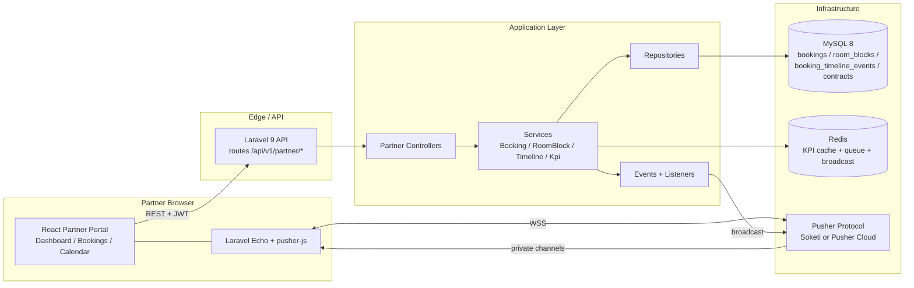
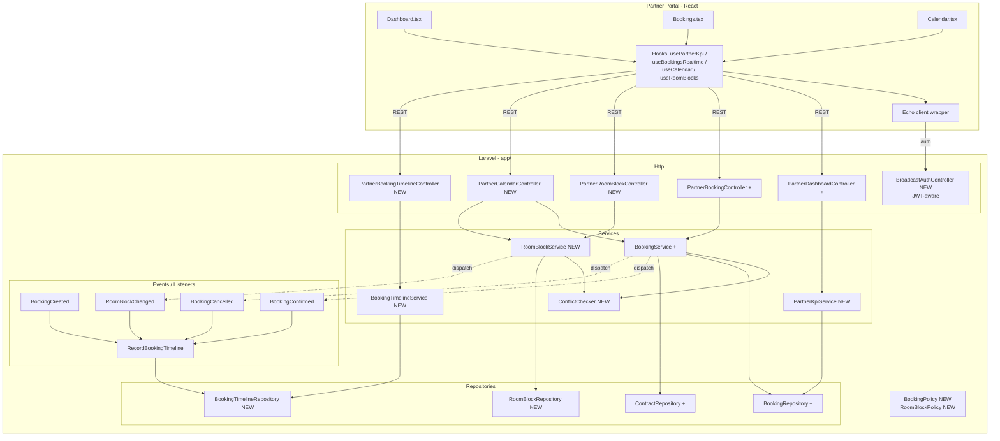
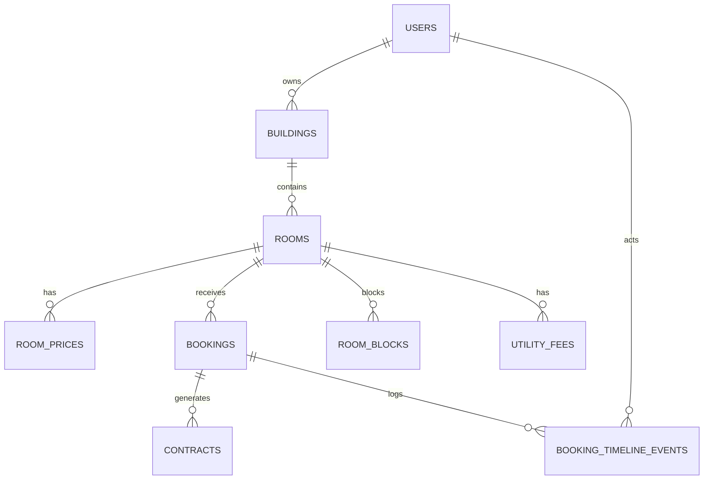

# System Design: Partner Portal 360 (Dashboard / Bookings / Calendar)

## Document Information
- **Design ID:** D001
- **Created:** 2026-05-10
- **Status:** Draft
- **Related SRS:** [docs/SRC/srs_partner_portal_360.md](../SRC/srs_partner_portal_360.md)
- **Related Lead:** [docs/leads/lead_260510_partner-portal-360.md](../leads/lead_260510_partner-portal-360.md)
- **Canonical schema:** [docs/databases_docs/db_overview_etc_core_schema.md](../databases_docs/db_overview_etc_core_schema.md)
- **Persona áp dụng:** `.cursor/skills/stack-personas/technical-lead-architect.md`
- **Áp dụng rule:** `.cursor/rules/php-laravel-rule.mdc`, `.cursor/rules/laravel-implementation-standards.mdc`, `.cursor/rules/karpathy-behavioral-guidelines.mdc`

---

## 1. Architecture Overview

### 1.1 High-Level Architecture



### 1.2 Design Principles

| Nguyên tắc | Lý do |
|---|---|
| Simple-first cho scale nhỏ | Lead chốt < 100 Partner, < 10k booking/tháng. Không cần CQRS, microservice. |
| Reuse hạ tầng đang có | Service/Repository pattern và `BookingService`, `DashboardService` đã tồn tại; chỉ mở rộng. |
| Schema delta tối thiểu | Thêm cột nullable cho `bookings`/`contracts` và 2 bảng mới (timeline, room_blocks). Không phá đối tượng cũ. |
| Realtime là augmentation | DB là nguồn sự thật; mất WebSocket vẫn vận hành được nhờ fallback polling. |
| Single Action Pattern cho mutating | `ConfirmBookingAction`, `CancelBookingAction`, `BlockRoomAction`… để dễ test, dễ phát event. |
| Ownership check tập trung | Một policy duy nhất kiểm `buildings.user_id = Auth::id()` thay vì rải rác trong từng query. |
| Backward-compatible API | Endpoint cũ giữ nguyên hành vi; thêm endpoint mới hoặc query param mới. |

### 1.3 Technology Stack

| Layer | Technology | Justification |
|---|---|---|
| BE Framework | Laravel 9.19 (đang dùng) | Giữ nguyên môi trường; tránh upgrade lớn trong scope này |
| BE Auth | `tymon/jwt-auth` 2.x (đang dùng) | Đang chạy ổn định; cần custom broadcast auth tương thích |
| Realtime server | Soketi (dev/staging) hoặc Pusher Cloud (prod) | Pusher protocol; FE đã có `pusher-js`; **Reverb yêu cầu Laravel 11**, không khả dụng |
| Realtime BE driver | `pusher/pusher-php-server` (mới) | Dùng broadcast driver `pusher` của Laravel |
| Cache + Queue + Broadcast | Redis | Cache KPI dashboard, hàng đợi `broadcast` queue |
| DB | MySQL 8 | Đang dùng; hỗ trợ JSON cho timeline metadata |
| FE Framework | React + Vite (đang dùng) | Giữ nguyên |
| FE Realtime | `laravel-echo` 2.x + `pusher-js` 8.x | Đã có trong `package.json`; private channel hỗ trợ sẵn |
| FE Calendar | FullCalendar (đang dùng) | Đã có drag-drop + view month/week/timeline |
| FE State | TanStack Query (đang dùng) | Cache + invalidate tương thích với realtime event |

### 1.4 Architectural Decisions (chốt trong design này)

| Decision | Lý do |
|---|---|
| **DEC-PP360-D001:** Chọn **Pusher protocol** (Soketi tự host trước, Pusher Cloud khi cần) | Laravel 9 không hỗ trợ Reverb; FE đã có sẵn `pusher-js` |
| **DEC-PP360-D002:** Cache KPI dashboard 60s qua Redis, invalidate theo event | Bỏ tải DB khi nhiều Partner cùng F5; vẫn đủ tươi cho vận hành |
| **DEC-PP360-D003:** Không tạo bảng KPI snapshot ở scale nhỏ | Live query từ `bookings` + index đủ nhanh |
| **DEC-PP360-D004:** Conflict check ở mức app + DB index thay vì exclusion constraint | MySQL không hỗ trợ exclusion constraint; bù bằng pessimistic lock theo `room_id` khi confirm/move |
| **DEC-PP360-D005:** Lifecycle hợp đồng dài hạn dùng `contracts` hiện có, không tách bảng `lease_agreements` | Chi phí thay đổi nhỏ; đủ cho phase này |
| **DEC-PP360-D006:** API mới đi qua route `/api/v1/partner` đã có middleware `jwt.auth + role:partner` | Đồng nhất với current routes |
| **DEC-PP360-D007:** SLA time-to-confirm chốt **5 phút** (giải OQ8 ở SRS) | Phù hợp benchmark Booking.com Extranet/MRB |
| **DEC-PP360-D008:** Overbooking dùng cơ chế **block tuyệt đối** (giải OQ3) | Hành vi an toàn nhất; nếu cần override sẽ bổ sung admin tool ở phase sau |
| **DEC-PP360-D009:** Bulk confirm/cancel giới hạn **20 booking/lần** (giải OQ10) | Vừa đủ cho UX; tránh khóa DB lâu |

---

## 2. Components

### 2.1 Component Diagram



Ghi chú: dấu `+` nghĩa là class hiện có, sẽ mở rộng. `NEW` là tạo mới.

### 2.2 Component Details

| Component | Trách nhiệm | Dependencies | Notes |
|---|---|---|---|
| `PartnerDashboardController` | Trả KPI, pending list, alert center, biểu đồ | `PartnerKpiService`, `BookingService` | Bổ sung endpoint `/dashboard/kpis` mới |
| `PartnerBookingController` | List + filter, confirm, cancel, no-show, bulk, timeline | `BookingService`, `BookingTimelineService` | Thêm các action ngoài check-in/check-out |
| `PartnerRoomBlockController` | CRUD room block | `RoomBlockService` | Mới |
| `PartnerCalendarController` | Trả booking + room_block trong date range cho 1 hoặc nhiều property | `BookingService`, `RoomBlockService` | Mới, thay vì dùng `/bookings?per_page=100` |
| `PartnerBookingTimelineController` | Trả timeline cho 1 booking | `BookingTimelineService` | Mới |
| `BroadcastAuthController` | Xác thực JWT cho private channel | `tymon/jwt-auth`, channel registry | Mới |
| `BookingService` | Confirm/Cancel/NoShow/Bulk + sinh contract dài hạn | `BookingRepository`, `ConflictChecker`, `ContractRepository`, dispatcher | Mở rộng class hiện có |
| `RoomBlockService` | Create/Delete block + check conflict | `RoomBlockRepository`, `ConflictChecker` | Mới |
| `BookingTimelineService` | Append event timeline | `BookingTimelineRepository` | Mới, dùng cả từ Service và Listener |
| `PartnerKpiService` | Tính `time_to_confirm`, occupancy, GMV, net revenue, alerts | `BookingRepository`, Cache | Cache 60s/key |
| `ConflictChecker` | Hàm thuần kiểm tra giao ngày giữa booking + room_block | `BookingRepository`, `RoomBlockRepository` | Một nguồn cho cả confirm và create-block |
| `BookingPolicy` | `view`, `confirm`, `cancel`, `no_show`, `update` | `Auth`, `Booking`, `Building` | Kiểm `buildings.user_id = Auth::id()` |
| `RoomBlockPolicy` | `view`, `create`, `delete` | `Auth`, `Room`, `Building` | Tương tự |
| `Events::BookingConfirmed` | Phát realtime + ghi timeline | `Booking`, `actor` | Đẩy lên 2 channel: partner + property |
| `Listener::RecordBookingTimeline` | Insert vào `booking_timeline_events` | `BookingTimelineService` | Async qua queue |

### 2.3 Communication Patterns

| Loại | Cách dùng | Ghi chú |
|---|---|---|
| REST đồng bộ | FE → BE qua `/api/v1/partner/*` | JWT trong header `Authorization: Bearer` |
| Broadcast | BE → FE qua Pusher private channel | Channel `private-partner.{partnerId}` và `private-property.{propertyId}` |
| Async queue | Listener ghi timeline + fan-out broadcast | Connection `redis`, queue `broadcast` |
| Polling fallback | FE polling 30s khi mất Echo connection | Dùng cùng endpoint `/calendar` và `/dashboard/kpis` |

---

## 3. External Services

### 3.1 Third-Party Integrations

| Service | Mục đích | API Type | Authentication | Rate Limits |
|---|---|---|---|---|
| Soketi (self-host) | WebSocket server cho dev/staging | Pusher protocol (WSS) | App key + secret + cluster | Tự cấu hình; tham khảo `MAX_CLIENT_EVENT_RATE_PER_MIN` |
| Pusher Cloud | WebSocket server cho prod | Pusher protocol | Same Pusher app credentials | Theo gói (ví dụ Free: 200k msg/day, 100 conn đồng thời) |
| Cloudinary | Lưu ảnh phòng (đã dùng) | REST | Signed upload | Theo gói hiện có |

Không tích hợp Channel Manager / Payment / SMS / AI trong phase này.

### 3.2 API Design

Tất cả endpoint mới đặt trong nhóm `Route::prefix('partner')->middleware(['jwt.auth','role:partner'])` hiện có trong `routes/api.php`.

| Method | Endpoint | Mục đích | Auth | Request | Response |
|---|---|---|---|---|---|
| GET | `/api/v1/partner/dashboard/kpis` | Tổng hợp KPI Dashboard | JWT | `?property_id=&from=YYYY-MM-DD&to=YYYY-MM-DD` | `{ pendingCount, todayCheckInCount, todayCheckOutCount, occupancyRate, avgTimeToConfirmSec, gmv, netRevenue, alerts: [{type,count,deepLink}] }` |
| GET | `/api/v1/partner/dashboard/charts/occupancy` | Biểu đồ Occupancy 30 ngày | JWT | `?property_id=` | `[{ date, occupancyRate }]` |
| GET | `/api/v1/partner/dashboard/charts/gmv` | Biểu đồ GMV 30 ngày | JWT | `?property_id=` | `[{ date, gmv, netRevenue }]` |
| GET | `/api/v1/partner/bookings` (mở rộng) | List + filter nâng cao | JWT | `?status=&stay_status=&property_id=&room_id=&keyword=&date_from=&date_to=&page=&per_page=` | Paginated list (như hiện tại) |
| PUT | `/api/v1/partner/bookings/{id}/confirm` | Quick confirm | JWT + `BookingPolicy@confirm` | `{}` | `{ booking, contract? }` |
| PUT | `/api/v1/partner/bookings/{id}/cancel` | Hủy có lý do | JWT + `BookingPolicy@cancel` | `{ reason: string(5..500) }` | `{ booking }` |
| PUT | `/api/v1/partner/bookings/{id}/no-show` | Đánh dấu no-show | JWT + `BookingPolicy@no_show` | `{}` | `{ booking }` |
| GET | `/api/v1/partner/bookings/{id}/timeline` | Timeline cho 1 booking | JWT + `BookingPolicy@view` | - | `[{ id, event_type, from_status, to_status, actor, note, metadata, created_at }]` |
| POST | `/api/v1/partner/bookings/bulk-confirm` | Bulk confirm tối đa 20 | JWT | `{ booking_ids: number[] }` | `{ succeeded: number[], failed: [{id,reason}] }` |
| POST | `/api/v1/partner/bookings/bulk-cancel` | Bulk cancel tối đa 20 | JWT | `{ booking_ids: number[], reason: string }` | Same |
| GET | `/api/v1/partner/calendar` | Booking + room_block trong khoảng | JWT | `?property_id=&room_id=&from=&to=` (max 31 ngày) | `{ bookings: [...], blocks: [...] }` |
| POST | `/api/v1/partner/room-blocks` | Tạo room block | JWT + `RoomBlockPolicy@create` | `{ room_id, start_date, end_date, block_type, reason, note? }` | `{ block }` |
| DELETE | `/api/v1/partner/room-blocks/{id}` | Xoá block | JWT + `RoomBlockPolicy@delete` | - | `{ id }` |
| GET | `/api/v1/partner/room-blocks` | List block của Partner | JWT | `?property_id=&room_id=&from=&to=` | `[{ block }]` |
| POST | `/broadcasting/auth` | Authorize Echo channel | JWT (custom) | Pusher payload | `{ auth }` |

Standard API response giữ format hiện tại (`successResponse / errorResponse / validateError`) trong `Controller` base.

### 3.3 Error Handling & Resilience

| Tình huống | Phía BE | Phía FE |
|---|---|---|
| Conflict khi confirm | 409 + body `{ code: 'BOOKING_CONFLICT', conflicts: [{booking_id|block_id, range}] }` | Toast + highlight ô lịch liên quan |
| Lý do hủy thiếu | 422 + field error | Hiển thị field error trong dialog |
| WS mất kết nối | Không lỗi; Echo tự retry | Fallback `setInterval` polling 30s; banner thông báo dễ hiểu |
| Pusher quá rate limit | Listener log + retry exponential (3 lần) | Không ảnh hưởng UX cốt lõi do polling vẫn chạy |
| Bulk action vượt 20 | 422 | Yêu cầu chia nhỏ |
| Timeline ghi lỗi | Listener queue retry 3 lần, sau đó vào `failed_jobs` | Booking status vẫn đúng vì timeline là async augmentation |

---

## 4. Data Model

### 4.1 Database Schema Changes

Tham chiếu canonical đầy đủ tại `docs/databases_docs/db_overview_etc_core_schema.md`. Các thay đổi cụ thể trong phase này:

#### 4.1.1 Mở rộng `bookings`

```sql
ALTER TABLE bookings
    ADD COLUMN confirmed_at TIMESTAMP NULL AFTER status,
    ADD COLUMN cancelled_at TIMESTAMP NULL AFTER confirmed_at,
    ADD COLUMN cancellation_reason TEXT NULL AFTER cancelled_at,
    ADD COLUMN no_show_at TIMESTAMP NULL AFTER cancellation_reason,
    ADD COLUMN source VARCHAR(50) NULL AFTER no_show_at;

CREATE INDEX idx_bookings_confirmed_at ON bookings(confirmed_at);
CREATE INDEX idx_bookings_cancelled_at ON bookings(cancelled_at);
CREATE INDEX idx_bookings_status_created_at ON bookings(status, created_at);
CREATE INDEX idx_bookings_room_dates_status
    ON bookings(room_id, start_date, end_date, status);
```

#### 4.1.2 Mở rộng `contracts`

```sql
ALTER TABLE contracts
    ADD COLUMN renewal_reminder_at TIMESTAMP NULL AFTER signature_date,
    ADD COLUMN terminated_at TIMESTAMP NULL AFTER renewal_reminder_at,
    ADD COLUMN termination_reason TEXT NULL AFTER terminated_at;

CREATE INDEX idx_contracts_renewal_reminder ON contracts(renewal_reminder_at);
```

#### 4.1.3 Bảng mới `booking_timeline_events`

```sql
CREATE TABLE booking_timeline_events (
    id BIGINT UNSIGNED AUTO_INCREMENT PRIMARY KEY,
    booking_id BIGINT UNSIGNED NOT NULL,
    actor_id BIGINT UNSIGNED NULL,
    event_type VARCHAR(50) NOT NULL,
    from_status VARCHAR(50) NULL,
    to_status VARCHAR(50) NULL,
    note TEXT NULL,
    metadata JSON NULL,
    created_at TIMESTAMP NOT NULL DEFAULT CURRENT_TIMESTAMP,
    updated_at TIMESTAMP NULL,
    INDEX idx_btl_booking_created (booking_id, created_at),
    INDEX idx_btl_event_type (event_type),
    CONSTRAINT fk_btl_booking FOREIGN KEY (booking_id)
        REFERENCES bookings(id) ON DELETE CASCADE,
    CONSTRAINT fk_btl_actor FOREIGN KEY (actor_id)
        REFERENCES users(id) ON DELETE SET NULL
);
```

#### 4.1.4 Bảng mới `room_blocks`

```sql
CREATE TABLE room_blocks (
    id BIGINT UNSIGNED AUTO_INCREMENT PRIMARY KEY,
    room_id BIGINT UNSIGNED NOT NULL,
    start_date DATE NOT NULL,
    end_date DATE NOT NULL,
    block_type VARCHAR(30) NOT NULL,
    reason VARCHAR(255) NOT NULL,
    note TEXT NULL,
    created_by BIGINT UNSIGNED NULL,
    updated_by BIGINT UNSIGNED NULL,
    created_at TIMESTAMP NOT NULL DEFAULT CURRENT_TIMESTAMP,
    updated_at TIMESTAMP NOT NULL DEFAULT CURRENT_TIMESTAMP
        ON UPDATE CURRENT_TIMESTAMP,
    INDEX idx_rb_room_dates (room_id, start_date, end_date),
    INDEX idx_rb_block_type (block_type),
    CONSTRAINT fk_rb_room FOREIGN KEY (room_id)
        REFERENCES rooms(id) ON DELETE CASCADE,
    CONSTRAINT fk_rb_creator FOREIGN KEY (created_by)
        REFERENCES users(id) ON DELETE SET NULL,
    CONSTRAINT chk_rb_dates CHECK (end_date >= start_date),
    CONSTRAINT chk_rb_block_type
        CHECK (block_type IN ('maintenance','owner_use','off_market'))
);
```

### 4.2 Entity Relationships



### 4.3 Data Integrity

| Yêu cầu | Cách thực thi |
|---|---|
| Booking trong khoảng ngày hợp lệ | `bookings.end_date >= start_date` (validate ở Service); ở `room_blocks` đã có CHECK |
| Conflict check | Pessimistic lock `SELECT ... FOR UPDATE` theo `room_id` trong transaction confirm/move + query union (`bookings` + `room_blocks`) |
| Ownership Partner | Policy + scope query `whereHas('room.building', fn($q)=>$q->where('user_id', Auth::id()))` |
| Timeline append-only | Không expose UPDATE/DELETE qua API; soft-correction qua event mới |
| Net Revenue ổn định | Chỉ tính khi `bookings.status = completed` và có `confirmed_at`; cancelled/no-show loại |
| Cancellation reason bắt buộc | FormRequest validate `required|min:5|max:500` khi action cancel |
| Bulk action giới hạn 20 | FormRequest `array|max:20` |

---

## 5. Migration Strategy

### 5.1 Current State

- BE đã có `bookings`, `rooms`, `buildings`, `contracts`, `utility_fees` (xem migration 2025/2026 hiện có).
- BE đã có `BookingService::handleConfirmBooking`, `handleCancelBooking`, `handleCheckIn/Out`, sinh contract `LEASE_AGREEMENT/TERMS_AND_CONDITIONS` theo property type.
- FE đang dùng `partnerService.confirmBooking/cancelBooking/checkIn/checkOut`, `Calendar` lấy data từ `/bookings?per_page=100`, `Finance.tsx` còn dùng mock.
- Chưa có realtime channel, chưa có `confirmed_at`, `room_blocks`, `booking_timeline_events`.

### 5.2 Target State

- Bộ endpoint Partner mở rộng theo bảng API ở mục 3.2.
- Schema thêm 5 cột `bookings`, 3 cột `contracts`, 2 bảng mới.
- Listener async ghi timeline. Broadcast event 3 loại: `booking.created`, `booking.status_changed`, `room_block.changed`.
- FE Dashboard/Bookings/Calendar đọc từ endpoint mới + Echo realtime + polling fallback 30s.

### 5.3 Migration Steps

| Step | Action | Risk | Rollback |
|---|---|---|---|
| 1 | Thêm migration `add_partner_portal_360_columns_to_bookings` | Thấp; cột nullable | `php artisan migrate:rollback --step=1` |
| 2 | Migration `add_renewal_fields_to_contracts` | Thấp | Như trên |
| 3 | Migration `create_booking_timeline_events_table` | Thấp; bảng mới | Drop bảng |
| 4 | Migration `create_room_blocks_table` | Thấp; bảng mới | Drop bảng |
| 5 | Backfill `bookings.confirmed_at = updated_at` cho `status=confirmed` để có baseline KPI | Trung bình; chỉ chạy 1 lần | Cập nhật `confirmed_at = NULL` cho các record đã backfill (đánh dấu bằng cờ `metadata` lưu `backfilled=true`) |
| 6 | Cài `pusher/pusher-php-server` và config `BROADCAST_DRIVER=pusher` | Trung bình; ENV mới | Đổi lại `BROADCAST_DRIVER=log` |
| 7 | Bật Soketi container cho dev; config Pusher Cloud key cho prod | Trung bình | Tắt service realtime; FE tự fallback polling |
| 8 | Triển khai `BookingPolicy`, `RoomBlockPolicy` và register | Thấp | Disable policies, fallback `Gate::before(fn=>true)` chỉ trong rollback emergency |
| 9 | Triển khai endpoint mới (Calendar/RoomBlock/BulkAction/Timeline/Kpi) phía sau feature flag `PARTNER_360_ENABLED` | Trung bình | Tắt flag; FE bypass route mới |
| 10 | Bật event broadcasting + listener `RecordBookingTimeline` | Thấp; queue async | Tắt config `broadcast` channel (về `null`); listener vẫn dùng để ghi timeline đồng bộ |
| 11 | FE: bật Echo connection + fallback polling | Thấp | Build FE với flag `VITE_PARTNER_REALTIME=false` |
| 12 | Bật feature flag `PARTNER_360_ENABLED` từng nhóm Partner pilot | Trung bình | Tắt flag, quay về UI cũ |

### 5.4 Rollback Plan

- Mỗi migration đều có hàm `down()` chuẩn Laravel; backfill ở step 5 chỉ chạm cột nullable nên rollback an toàn.
- ENV/feature flag (`PARTNER_360_ENABLED`, `BROADCAST_DRIVER`, `VITE_PARTNER_REALTIME`) cho phép tắt nhanh từng phần.
- Endpoint cũ (`PUT /partner/bookings/{id}/check-in|check-out`, `PUT /partner/bookings/{id}/confirm`, `PUT /partner/bookings/{id}/cancel`) giữ nguyên hành vi: nếu rollback thì FE chỉ dừng dùng endpoint mới.

---

## 6. Security

### 6.1 Authentication & Authorization

| Chủ đề | Quyết định |
|---|---|
| Xác thực API | JWT `tymon/jwt-auth` qua middleware `jwt.auth` (đang dùng) |
| Xác thực vai trò | Middleware `role:partner` (đang dùng) |
| Authorization theo bản ghi | `BookingPolicy` và `RoomBlockPolicy` kiểm `Building::user_id === Auth::id()` qua quan hệ `room.building` |
| Authorization broadcast | Custom `BroadcastAuthController` lấy JWT từ header, parse user, đối chiếu channel name: `private-partner.{partnerId}` chỉ pass nếu `Auth::id() === partnerId`; `private-property.{propertyId}` chỉ pass nếu Partner sở hữu building |
| Đăng ký channel | `routes/channels.php` định nghĩa 2 channel kèm closure authorize |
| Rate limit | `throttle:60,1` cho mutating, `throttle:120,1` cho GET KPI; per-user theo JWT subject |

### 6.2 Data Protection

| Chủ đề | Quyết định |
|---|---|
| Mã hoá kênh | TLS 1.2+ end-to-end (REST + WSS) |
| PII | Số điện thoại / email khách chỉ trả cho Partner sở hữu booking; log/audit tránh ghi PII trừ trường hợp cần thiết |
| Cancellation reason | Có thể chứa thông tin nhạy cảm, không broadcast nội dung; chỉ broadcast id + status |
| Timeline metadata | Không lưu plaintext nhạy cảm (mã thẻ, OTP); chỉ trạng thái + actor + lý do |
| Lưu trữ | Không cần mã hoá trường mới ở DB; tận dụng MySQL at-rest encryption hạ tầng (nếu có) |

### 6.3 Security Risks & Mitigations

| Risk | Impact | Mitigation |
|---|---|---|
| Lộ booking giữa các Partner qua WebSocket | Cao | Private channel + authorize closure; test E2E partner A không nhận event partner B |
| Lộ dữ liệu qua endpoint Calendar khi pass `property_id` không thuộc Partner | Cao | Policy ở Service layer + scope query bằng `Auth::id()` |
| Quick confirm bị lạm dụng | Trung bình | Audit timeline; rate-limit; xác nhận double-click idempotent (kiểm trạng thái trước khi update) |
| JWT bị replay sau logout | Trung bình | Vẫn dựa vào TTL JWT hiện có; phase này không thay đổi auth nền |
| DOS broadcast (spam status change) | Thấp | Throttle event publish phía Service; chỉ publish khi state thay đổi thật |
| SQL injection ở filter keyword | Thấp | Eloquent + parameter binding; FormRequest validate |

---

## 7. Performance

### 7.1 Scalability

| Khu vực | Phương án |
|---|---|
| Calendar query | Index `bookings(room_id, start_date, end_date, status)` + `room_blocks(room_id, start_date, end_date)`; giới hạn date range tối đa 31 ngày trên endpoint `/calendar` |
| Bookings list | Đã có index `bookings(status)`, thêm `bookings(status, created_at)` cho pending list; tránh JOIN dư bằng resource API |
| Dashboard KPI | Cache Redis 60s, key `partner:{id}:kpi:{from}:{to}`; invalidate khi nhận `BookingConfirmed/Cancelled/NoShow` cho chính `partner_id` |
| Realtime fan-out | Broadcast trên queue `redis:broadcast`, tránh chiếm request cycle |
| Bulk action | Chunk 20, transaction theo từng booking; nếu lỗi 1 booking thì các booking khác vẫn được xử lý, trả `failed[]` |
| Frontend Calendar | Lazy load theo viewport (FullCalendar `datesSet`), virtualization sự kiện > 200 |

### 7.2 Caching Strategy

| What | Where | TTL | Invalidation |
|---|---|---|---|
| Dashboard KPI per partner | Redis | 60s | Khi event `BookingConfirmed/Cancelled/NoShow/RoomBlockChanged` thuộc partner đó |
| Pending bookings count | Redis (cùng key `kpi`) | 60s | Như trên |
| Calendar response (per property + date range) | Redis | 30s | Khi event cùng `property_id` |
| Timeline | Không cache | - | Truy vấn trực tiếp; volume thấp |
| Static (provinces, building types) | Đã cache; không thay đổi | - | - |

### 7.3 Optimization Opportunities

| Tối ưu | Trade-off |
|---|---|
| Redis Lua script cho confirm idempotent | Tăng độ phức tạp; phase này dùng DB transaction là đủ |
| Materialized snapshot KPI hằng giờ | Tăng tươi/độ chính xác nhưng phức tạp; chỉ cần khi >1k Partner |
| Push noti khi Partner đóng tab (Web Push API) | Cần VAPID key; hoãn vì người dùng đã chọn keep portal mở |
| Composite index (`buildings.user_id`, `rooms.id`) | Có thể giảm JOIN cost nhưng cần đo trước |

---

## 8. Risks and Mitigations

| Risk | Impact | Likelihood | Mitigation | Owner |
|---|---|---|---|---|
| Backfill `confirmed_at` không chính xác cho lịch sử | Trung bình | Cao | Đánh dấu `metadata.backfilled=true` ở timeline; KPI time-to-confirm chỉ tính booking sau ngày go-live | TLA |
| Soketi/Pusher Cloud bị mất kết nối | Cao | Thấp | Fallback polling 30s; alert ops | DevOps |
| Conflict check bỏ sót cạnh ngày | Cao | Trung bình | Chuẩn hoá date theo `Asia/Ho_Chi_Minh`; unit test ngày biên (DST, leap, đầu/cuối tháng); integration test confirm song song | BE |
| Pessimistic lock gây deadlock khi bulk | Trung bình | Thấp | Lock theo `room_id` ASC; chunk 20; transaction ngắn | BE |
| Calendar slow khi 1 Partner > 500 phòng | Trung bình | Thấp (scale nhỏ) | Date range cap 31; lazy load; index | FE/BE |
| Listener timeline chậm gây trễ KPI | Thấp | Trung bình | KPI dùng `bookings.confirmed_at` chứ không phụ thuộc timeline; timeline chỉ phục vụ audit | BE |
| Dependency Pusher PHP server xung đột Laravel 9 | Trung bình | Thấp | `pusher/pusher-php-server ^7.x` tương thích Laravel 9; pin version trong PR đầu | BE |
| Channel auth bị bỏ sót | Cao | Thấp | Test E2E partner A không nghe được channel partner B | QA |

---

## 9. Implementation Phases

### Phase 1: Foundation - 1 sprint

**Goal:** Có schema + audit timeline + KPI pipeline cơ bản, chưa bật realtime.

- [ ] Migration: thêm cột `bookings` (`confirmed_at`, `cancelled_at`, `cancellation_reason`, `no_show_at`, `source`)
- [ ] Migration: thêm cột `contracts` (`renewal_reminder_at`, `terminated_at`, `termination_reason`)
- [ ] Migration: tạo bảng `booking_timeline_events`
- [ ] Tạo `BookingTimelineService` + `BookingTimelineRepository`
- [ ] Tạo `BookingPolicy` + register
- [ ] Mở rộng `BookingService::handleConfirmBooking` ghi `confirmed_at` + dispatch `BookingConfirmed` (chưa broadcast)
- [ ] Mở rộng `handleCancelBooking` validate `reason` + ghi `cancelled_at`
- [ ] Backfill `confirmed_at` cho booking đã confirmed (chạy seeder/Artisan command)
- [ ] Endpoint mới `GET /partner/dashboard/kpis` (`PartnerKpiService`) + cache Redis

**Deliverable:** KPI Dashboard hiển thị `time_to_confirm`, audit timeline ghi đủ event sau khi confirm/cancel.

### Phase 2: Realtime + Quick Confirm - 1 sprint

**Goal:** Partner thấy booking mới ngay, quick confirm an toàn.

- [ ] Cài `pusher/pusher-php-server`; config broadcast driver `pusher`
- [ ] Đăng ký channel `private-partner.{partnerId}`, `private-property.{propertyId}` trong `routes/channels.php`
- [ ] Tạo `BroadcastAuthController` xác thực JWT
- [ ] Events: `BookingCreated`, `BookingConfirmed`, `BookingCancelled` implement `ShouldBroadcast`
- [ ] FE: cấu hình Echo client với JWT; component `BookingsRealtimeProvider`; toast/badge khi nhận event
- [ ] FE: Quick confirm 1-click + Undo 30s (trong client) + đếm ngược SLA
- [ ] FE: dialog cancel với reason bắt buộc
- [ ] Soketi container cho dev; ENV cho prod (Pusher Cloud)
- [ ] Polling fallback 30s khi Echo `disconnected`

**Deliverable:** Partner nhận booking mới realtime; quick confirm hoạt động; cancel có lý do.

### Phase 3: Calendar Multi-property + Room Block - 1 sprint

**Goal:** Calendar hiển thị tổng quan đa tài sản, hỗ trợ block lịch.

- [ ] Migration `room_blocks`
- [ ] `RoomBlockService`, `RoomBlockRepository`, `RoomBlockPolicy`
- [ ] Endpoint `POST/GET/DELETE /partner/room-blocks`
- [ ] Endpoint `GET /partner/calendar` gộp booking + block
- [ ] `ConflictChecker` shared cho confirm + create-block
- [ ] FE: filter "Tất cả tài sản"; view month/week/timeline; dialog tạo block; cảnh báo overbooking trên ô lịch
- [ ] FE: drag-and-drop với conflict revert

**Deliverable:** Calendar tổng quan đa tài sản, block lịch end-to-end, cảnh báo overbooking.

### Phase 4: Dashboard KPI nâng cao - 1 sprint

**Goal:** Hoàn thiện UX Dashboard với KPI quyết định kinh doanh.

- [ ] Endpoint `/dashboard/charts/occupancy`, `/dashboard/charts/gmv`
- [ ] Cảnh báo "Cần xử lý ngay" (pending, overbooking, contract sắp hết hạn)
- [ ] FE: KPI cards mới (Net Revenue, Time-to-confirm), biểu đồ 30 ngày
- [ ] Cache invalidation listener
- [ ] Bulk confirm/cancel (BE + FE)

**Deliverable:** Dashboard hiển thị đủ KPI mục tiêu của lead.

### Phase 5: Long-term Contract subset - 1 sprint

**Goal:** Lifecycle hợp đồng dài hạn cho Apartment/Homestay.

- [ ] Mở rộng `ContractService`: `renewal_reminder_at`, `terminated_at`, `termination_reason`
- [ ] Job nhắc gia hạn (>=30 ngày trước hạn) chạy daily
- [ ] FE Contract detail: hiển thị utility_fees + ngày hết hạn + nút gia hạn
- [ ] Liên kết badge "Contract" trên Calendar event dài hạn
- [ ] Cảnh báo "Contract sắp hết hạn" trong Dashboard alerts

**Deliverable:** Hợp đồng dài hạn có lifecycle đủ dùng cho Partner.

---

## Appendix

### A. Glossary

| Thuật ngữ | Nghĩa |
|---|---|
| Time-to-confirm | Khoảng thời gian từ `bookings.created_at` đến `confirmed_at` |
| Net Revenue | GMV booking đã completed trừ commission, không tính cancelled/no-show |
| Conflict | Hai khoảng ngày giao nhau trên cùng `room_id` giữa booking còn hiệu lực và/hoặc room_block |
| Room Block | Bản ghi `room_blocks` chặn khả dụng phòng, không phải booking giả |
| Quick confirm | Hành động xác nhận booking pending bằng 1 thao tác từ Dashboard hoặc Bookings |
| Soketi | WebSocket server open-source tương thích Pusher protocol |

### B. References

- SRS: `docs/SRC/srs_partner_portal_360.md`
- Lead: `docs/leads/lead_260510_partner-portal-360.md`
- DB canonical: `docs/databases_docs/db_overview_etc_core_schema.md`
- Pricing rule: `bks-system-fe/business-script/PRICING_RESTRUCTURE_PLAN.md`
- E2E booking: `bks-system-fe/business-script/E2E_BOOKING_PARTNER_USER_SCRIPT.md`
- Code hiện trạng: `app/Services/BookingService.php`, `app/Http/Controllers/Partner/PartnerBookingController.php`, `app/Http/Controllers/Partner/PartnerDashboardController.php`, `bks-system-fe/src/pages/Partner/{Dashboard,Bookings,Calendar}.tsx`

### C. Decision Log

| ID | Quyết định | Lý do | Liên quan |
|---|---|---|---|
| DEC-PP360-D001 | Realtime dùng Pusher protocol (Soketi/Pusher Cloud) | Laravel 9 không có Reverb; FE đã có sẵn `pusher-js` | OQ9 (đã chốt) |
| DEC-PP360-D002 | Cache KPI 60s qua Redis | Đảm bảo response nhanh; tươi đủ với vận hành | Section 7.2 |
| DEC-PP360-D003 | Không tạo bảng KPI snapshot | Scale nhỏ, live query đủ | Section 7.1 |
| DEC-PP360-D004 | Conflict check ở app + DB index, không exclusion constraint | MySQL không hỗ trợ; pessimistic lock theo `room_id` đủ an toàn | Section 4.3 |
| DEC-PP360-D005 | Hợp đồng dài hạn dùng `contracts` hiện có | Chi phí đổi schema thấp, đủ scope | Section 4.1 |
| DEC-PP360-D006 | Tất cả endpoint mới đặt trong `/api/v1/partner` | Tái sử dụng middleware JWT + role:partner | Section 3.2 |
| DEC-PP360-D007 | SLA time-to-confirm = 5 phút | Phù hợp benchmark | OQ8 (đã chốt) |
| DEC-PP360-D008 | Overbooking block tuyệt đối | An toàn nhất; override sẽ ở phase Admin sau | OQ3 (đã chốt) |
| DEC-PP360-D009 | Bulk action 20 booking/lần | Cân bằng UX và tải DB | OQ10 (đã chốt) |
