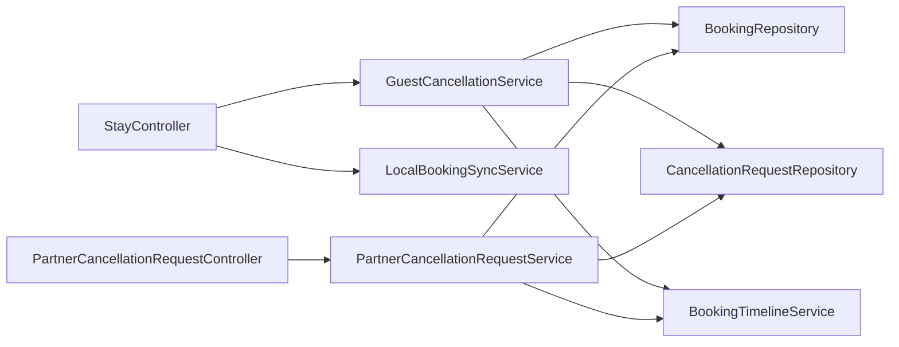
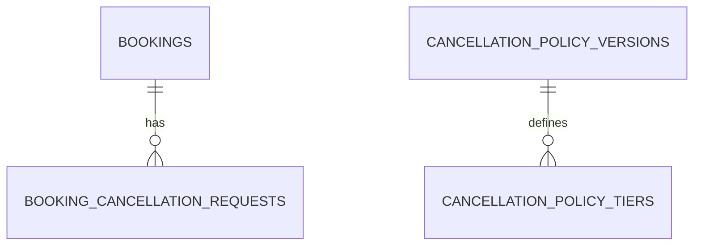

# System Design: Chính sách hủy & yêu cầu hủy đặt phòng (BKS Stay / My Bookings / Partner)

## Document Information

- **Design ID:** D002
- **Created:** 2026-05-14
- **Status:** Draft
- **Related SRS:** [docs/SRC/srs_booking_cancellation_policy.md](../SRC/srs_booking_cancellation_policy.md)
- **Related Lead:** [docs/leads/lead_260513_booking-cancellation-policy.md](../leads/lead_260513_booking-cancellation-policy.md)
- **SRS liên quan:** [docs/SRC/srs_partner_portal_360.md](../SRC/srs_partner_portal_360.md)
- **Canonical schema:** [docs/databases_docs/db_overview_etc_core_schema.md](../databases_docs/db_overview_etc_core_schema.md)
- **Design liên quan:** [docs/designs/design_001.md](design_001.md) (realtime Partner, timeline, conflict)
- **Persona:** `.cursor/skills/stack-personas/technical-lead-architect.md`

---

## 1. Architecture Overview

### 1.1 High-Level Architecture

```mermaid
flowchart TB
  subgraph Public[End User Public]
    FE_EU[React My Bookings / Booking flow<br/>localStorage + API sau sync]
  end

  subgraph Stay[Stay Portal JWT]
    FE_ST[React Stay<br/>Bookings]
  end

  subgraph Partner[Partner Portal JWT]
    FE_PP[React Partner<br/>Bookings + Inbox hủy]
    Echo[Laravel Echo]
  end

  subgraph API[Laravel 9 API /api/v1]
    R_EU[Route group EU public + optional auth]
    R_ST[Route group stay/*]
    R_PT[Route group partner/*]
  end

  subgraph App[Application]
    S_CAN[GuestCancellationService]
    S_SYNC[LocalBookingSyncService]
    S_PART[PartnerCancellationRequestService]
    S_TL[BookingTimelineService]
    S_BC[BookingService hooks]
  end

  subgraph Data[(MySQL)]
    BK[bookings]
    CR[booking_cancellation_requests]
    POL[cancellation_policy_*]
    RC[cancellation_reason_codes]
    TL[booking_timeline_events]
  end

  FE_EU --> R_EU
  FE_ST --> R_ST
  FE_PP --> R_PT
  FE_PP --- Echo
  R_EU --> S_SYNC
  R_ST --> S_CAN
  R_ST --> S_SYNC
  R_PT --> S_PART
  S_CAN --> BK
  S_CAN --> CR
  S_CAN --> TL
  S_PART --> BK
  S_PART --> CR
  S_PART --> TL
  S_SYNC --> BK
  POL -.-> S_CAN
  RC -.-> S_CAN
```

Luồng chính: **khách** (Stay hoặc sau sync) gọi API **`cancel`** hoặc **`cancel-request`**; **Partner** xử lý hàng đợi yêu cầu; mọi chuyển trạng thái quan trọng ghi **`booking_timeline_events`** và có thể phát **broadcast** (reuse nền `design_001`) cho Partner.

### 1.2 Design Principles

1. **Một nguồn sự thật:** `bookings` trên server sau khi T6 sync; local chỉ là bản sao tạm thời.
2. **Tách rõ hai lộ:** `cancel` (atomic, bậc thấp) vs `cancel-request` (multi-step, bậc cao).
3. **Không phá vỡ PP360:** mở rộng `BookingStatus` và `ConflictChecker` có quy tắc rõ cho `pending_cancellation`.
4. **Transaction + lock:** mọi chuyển trạng thái booking + tạo/cập nhật request trong `DB::transaction`; khi cần tránh race với confirm Partner, khóa theo **`bookings.id`** hoặc **`room_id`** tùy thao tác (ưu tiên lock `booking` row trước).
5. **Observability:** SLA và “treo” đo từ `booking_cancellation_requests` + timestamp trên `bookings`.

### 1.3 Technology Stack

| Layer | Technology | Justification |
|-------|------------|---------------|
| API | Laravel 9, REST, `jwt.auth` | Đồng nhất Stay/Partner hiện có |
| FE | React, TanStack Query | Giữ pattern `bks-system-fe` |
| DB | MySQL 8 | Đã dùng; hỗ trợ JSON metadata timeline |
| Cache / config | `config/*.php` + `.env` | Cooldown, ngưỡng đêm, SLA ngưỡng báo cáo |
| Realtime | Pusher/Soketi (design_001) | Thông báo Partner khi có `cancel-request` mới |

---

## 2. Components

### 2.1 Component Diagram



### 2.2 Component Details

| Component | Responsibility | Dependencies | Technology |
|-----------|----------------|--------------|------------|
| `StayBookingCancellationController` (tên gợi ý) | Nhận `POST …/cancel`, `POST …/cancel-request` | Service + Policy | Laravel |
| `StayLocalBookingSyncController` [DECOMMISSIONED] | (Removed) `POST …/bookings/sync-local` | Sync service + validation | Laravel |
| `PartnerCancellationRequestController` | List + approve/reject | Partner auth + ownership | Laravel |
| `GuestCancellationService` | Rule bậc thấp/cao, cooldown, idempotency, ghi policy snapshot | Booking, Request repo, Timeline | PHP |
| `LocalBookingSyncService` [DECOMMISSIONED] | (Removed) Fingerprint dedupe, map `server_booking_id` | Booking create/find | PHP |
| `PartnerCancellationRequestService` | Approve → terminal cancel; Reject → restore `previous_booking_status` | Policy, Timeline, (optional) broadcast | PHP |
| `CancellationPolicyResolver` | Chọn `policy_version` + tier theo `stay_kind` + hours-before-check-in | DB tiers | PHP |
| FE Stay | CTA theo trạng thái + form lý do + hiển thị cooldown | API contract | React |
| FE Partner | Inbox + chi tiết + quyết định | API + Echo | React |

### 2.3 Communication Patterns

- **Sync REST** cho mọi thao tác nghiệp vụ.
- **Async broadcast** (ShouldBroadcast) sau `DB::commit` khi tạo request pending hoặc khi resolve — kênh `private-partner.{id}` + `private-property.{id}` giống booking events (tránh PII trong payload).

---

## 3. External Services

### 3.1 Third-Party Integrations

| Service | Purpose | API Type | Authentication | Rate Limits |
|---------|---------|----------|------------------|-------------|
| (Future) OTA / Channel Manager | Nguồn sự thật đặt phòng ngoài | REST/Webhook | TBD | TBD |
| Pusher / Soketi | Partner realtime | WebSocket | JWT channel auth | Giữ theo design_001 |

**Giai đoạn 1:** không bắt buộc tích hợp OTA; chỉ chuẩn bị **metadata** timeline và cột `source` sẵn có trên `bookings`.

### 3.2 API Design

**Quy ước:** JSON UTF-8; lỗi validation **422**; nghiệp vụ từ chối **409**; cooldown **429** với body `{ "code": "CANCEL_REQUEST_COOLDOWN", "retry_after_seconds": N }`.

#### Stay (JWT), prefix `/api/v1/stay/`

| Method | Endpoint | Description | Auth | Request (tóm tắt) | Response (tóm tắt) |
|--------|----------|-------------|------|-------------------|----------------------|
| POST | `bookings/sync-local` [DECOMMISSIONED] | (Removed) T6: merge đơn local | JWT user | — | — |
| POST | `bookings/{id}/cancel` | Khách **hủy trực tiếp** (bậc thấp) | JWT, owner booking | `{ "reason_code", "reason_text?", "idempotency_key?" }` | Booking resource `status=cancelled` |
| POST | `bookings/{id}/cancel-request` | Khách **yêu cầu hủy** (bậc cao) | JWT, owner | `{ "reason_code", "reason_text?", "idempotency_key" }` | `{ "booking_status": "pending_cancellation", "request_id" }` |
| GET | `cancellation-reasons` | Danh mục mã lý do (cache FE) | JWT hoặc public read-only | — | `[ { "code", "label", "requires_note" } ]` |

#### Partner (JWT + partner role), prefix `/api/v1/partner/`

| Method | Endpoint | Description | Auth | Request | Response |
|--------|----------|-------------|------|---------|----------|
| GET | `cancellation-requests` | Danh sách yêu cầu chờ / đã xử lý | Partner | Query `status`, `property_id`, pagination | List DTO |
| POST | `cancellation-requests/{id}/approve` | Chấp nhận hủy | Partner | `{ "note?" }` | Booking `cancelled` + request `approved` |
| POST | `cancellation-requests/{id}/reject` | Từ chối yêu cầu | Partner | `{ "note": "bắt buộc ≥ 5 ký tự" }` | Booking khôi phục `previous_booking_status` + request `rejected` |

#### Public EU (optional — nếu cho phép hủy qua `booking_code` không login)

| Method | Endpoint | Description | Auth | Notes |
|--------|----------|-------------|------|-------|
| POST | `bookings/lookup` (đã có) | Mở rộng response: cho phép client biết **có thể cancel / cancel-request** hay không | throttle | Chỉ khi product chấp nhận rủi ro; mặc định Phase 1 **không** thêm hủy public không auth |

### 3.3 Error Handling & Resilience

- **Idempotency:** `idempotency_key` unique theo `(booking_id, idempotency_key)`; lặp lại trả **200** với cùng payload outcome (hoặc **409** nếu trạng thái đã đổi — document rõ trong OpenAPI).
- **Cooldown:** tính từ `MAX(requested_at)` của các request `cancel-request` **thành công** gần nhất trên booking (hoặc mọi request trạng thái `pending` — chốt: **mỗi lần POST thành công** mở cooldown). Lần gửi **422** do validation **không** reset cooldown.
- **Retry:** client exponential backoff trên 5xx; server không tự retry partial DB.
- **Outbox (future):** khi có OTA, đẩy sự kiện `booking.cancelled` ra outbox sau commit.

---

## 4. Data Model

### 4.1 Database Schema Changes

#### 4.1.1 Enum / trạng thái `bookings.status`

| Giá trị | Ý nghĩa |
|--------|---------|
| 0 | `PENDING` (giữ nguyên) |
| 1 | `CONFIRMED` |
| 2 | `CANCELLED` |
| 3 | `COMPLETED` |
| **4** | **`PENDING_CANCELLATION`** — đang chờ Partner xử lý yêu cầu hủy khách |

Cập nhật `App\Enums\BookingStatus` thêm case `PENDING_CANCELLATION = 4`.

#### 4.1.2 Cột mới `bookings`

| Cột | Kiểu | Nullable | Ghi chú |
|-----|------|----------|--------|
| `pending_cancellation_since` | timestamp | Yes | Set khi vào status 4 |
| `cancellation_policy_version` | varchar(32) | Yes | Snapshot khi approve hoặc khi tạo request (tuỳ policy) |
| `client_local_id` | varchar(64) | Yes | T6 |
| `client_fingerprint` | varchar(64) | Yes | T6; unique kết hợp `user_id` (xem 4.3) |

#### 4.1.3 Bảng `cancellation_reason_codes` (master)

| Cột | Kiểu | Nullable | Key |
|-----|------|----------|-----|
| `code` | varchar(50) | No | PK |
| `label_vi` | varchar(255) | No | |
| `requires_note` | tinyint(1) | No | default 0 |
| `sort_order` | int | No | default 0 |
| `is_active` | tinyint(1) | No | default 1 |

Seed ban đầu: `change_of_plans`, `found_alternative`, `pricing`, `other`, … (BA bổ sung).

#### 4.1.4 Bảng `booking_cancellation_requests` (bổ sung so với SRS)

Thêm cột **`previous_booking_status`** `tinyint` **NOT NULL** tại thời điểm tạo request — dùng khi **reject** để khôi phục chính xác (ví dụ `PENDING` vs `CONFIRMED`).

Thêm **`policy_version_snapshot`** `varchar(32)` nullable — ghi version chính sách phí ước tính tại thời điểm request (BCP-011).

#### 4.1.5 Bảng `cancellation_policy_versions` / `cancellation_policy_tiers`

Giữ như SRS; **fee_percent / refund_percent** nullable cho đến khi BA/Legal điền.

### 4.2 Entity Relationships

- `bookings` 1 — N `booking_cancellation_requests`.
- `cancellation_reason_codes` — tham chiếu logic (FK không bắt buộc; có thể CHECK `reason_code` tồn tại qua validation layer).
- `cancellation_policy_versions` 1 — N `cancellation_policy_tiers`.



### 4.3 Data Integrity

- **Ownership:** `bookings.user_id === Auth::id()` cho Stay; Partner: `booking.room.property.user_id === Auth::id()`.
- **Unique T6:** `UNIQUE (user_id, client_fingerprint)` WHERE `client_fingerprint IS NOT NULL` (MySQL 8 functional/partial index — nếu engine hạn chế thì unique application-level + lookup trước insert).
- **Một request `pending` duy nhất** trên booking: partial unique `(booking_id)` WHERE `status='pending'` HOẶC enforce trong service (đơn giản hơn cho Laravel): trước khi tạo, `SELECT … FOR UPDATE` booking và kiểm tra không có pending.
- **Conflict / calendar:** `BookingStatus::PENDING_CANCELLATION` được coi là **đặt chỗ vẫn giữ phòng** (giống `PENDING`/`CONFIRMED`) cho đến khi approve cancel hoặc reject (mở lại confirmed). Cập nhật `ConflictChecker` loại trừ chỉ `CANCELLED` và `COMPLETED` như hiện tại — **không** loại `PENDING_CANCELLATION` (tức vẫn chặn overbooking).

---

## 5. Migration Strategy

### 5.1 Current State

- `BookingStatus` tối đa `3`.
- Partner `cancel` đã có; Stay chưa có cancel/cancel-request.
- `booking_timeline_events` đã có.

### 5.2 Target State

- Enum + cột + 3 bảng mới + seed reason codes + (optional) seed policy version rỗng.
- Service + route Stay + Partner inbox.
- FE CTA theo status.

### 5.3 Migration Steps

| Step | Action | Risk | Rollback |
|------|--------|------|----------|
| 1 | Migration thêm cột `bookings.*` nullable | Thấp | `down()` drop columns |
| 2 | Migration tạo bảng `cancellation_reason_codes` + seed | Thấp | drop table |
| 3 | Migration tạo `cancellation_policy_versions/tiers` (nullable %) | Thấp | drop tables |
| 4 | Migration tạo `booking_cancellation_requests` + FK | Trung bình | drop + restore FK order |
| 5 | Deploy code đọc status 4 **sau** DB migrate | Trung bình | Feature flag `BCP_CANCELLATION_V1` |
| 6 | Backfill không bắt buộc (không có status 4 cũ) | — | — |

### 5.4 Rollback Plan

- Tắt flag route mới; rollback migration theo thứ tự ngược (drop child tables trước).
- Dữ liệu: nếu đã có request pending, cần script vận hành chuyển booking về trạng thái an toàn trước khi drop (ngoài scope tự động).

---

## 6. Security

### 6.1 Authentication & Authorization

- Stay endpoints: `jwt.auth`; policy `GuestBookingPolicy@cancel` / `@cancelRequest` kiểm tra owner.
- Partner endpoints: `jwt.auth` + `role:partner` + ownership qua room→property.
- Không lộ PII khách cho Partner ngoài phạm vi cần (tên/SĐT đã có trên booking detail hiện tại).

### 6.2 Data Protection

- Log không ghi full `reason_text` nếu có thể chứa dữ liệu nhạy cảm (hoặc mask).
- Rate limit: `throttle` trên `cancel-request` (ví dụ 10/phút/user) **cộng** cooldown theo booking.

### 6.3 Security Risks & Mitigations

| Risk | Impact | Mitigation |
|------|--------|------------|
| Khách brute-force cancel | Trung bình | JWT + throttle + cooldown |
| Partner A duyệt request của Partner B | Cao | Policy ownership + FK booking |
| Replay idempotency key của user khác | Trung bình | Key scoped theo booking + owner session |

---

## 7. Performance

### 7.1 Scalability

- Inbox Partner: query có index `(status, requested_at)` + filter `property_id` qua join booking→room.
- Không quét full bảng bookings cho inbox; chỉ qua `booking_cancellation_requests`.

### 7.2 Caching Strategy

| What | Where | TTL | Invalidation |
|------|-------|-----|----------------|
| Danh sách `cancellation-reasons` | Redis hoặc HTTP Cache-Control | 1h | Khi admin cập nhật codes (future) |
| Policy tiers theo version | App memory / Redis | 10 phút | Khi deploy version mới |

### 7.3 Optimization Opportunities

- Materialized view SLA (future) nếu báo cáo nặng.
- Cursor-based pagination cho inbox lớn.

---

## 8. Risks and Mitigations

| Risk | Impact | Likelihood | Mitigation | Owner |
|------|--------|------------|------------|-------|
| FE/BE lệch ý nghĩa status 4 | Cao | M | OpenAPI + enum dùng chung codegen / contract test | Tech |
| Calendar hiển thị sai khi pending_c | Trung bình | M | ConflictChecker tests + QA checklist | Tech/QA |
| Đồng bộ T6 tạo duplicate | Cao | M | Fingerprint + transaction + unique | Tech |

---

## 9. Implementation Phases

### Phase 1: Schema + enum + master reasons (ước tính 2–3 ngày dev)

**Goal:** DB sẵn sàng, không bật route production.

- [ ] Migration: `BookingStatus::PENDING_CANCELLATION`, cột `bookings`, bảng requests/policies/reason_codes
- [ ] `ConflictChecker` + test: status 4 vẫn conflict-active
- [ ] Seed `cancellation_reason_codes`

**Deliverable:** migrate fresh + rollback verified.

### Phase 2: Stay API cancel + cancel-request + cooldown (3–5 ngày)

**Goal:** Khách Stay hoàn tất luồng SRS BCP-001…007 (server-side).

- [ ] `GuestCancellationService` + validation + timeline events mới (`guest_cancel_requested`, `guest_cancel_approved`, …)
- [ ] Routes Stay + Postman/OpenAPI
- [ ] Unit tests: state machine, cooldown, idempotency

**Dependencies:** Phase 1.

### Phase 3: Partner inbox approve/reject (2–4 ngày)

**Goal:** Partner xử lý BCP-009.

- [ ] `PartnerCancellationRequestService` + routes
- [ ] Broadcast event (reuse infra design_001)
- [ ] FE Partner: tab/filter “Yêu cầu hủy”

**Dependencies:** Phase 2.

### Phase 4: FE My Bookings / Stay wiring (sync-local Decommissioned)

**Goal:** Hiển thị CTA đúng bậc.

- [ ] FE: gọi API cancel / cancel-request tương ứng
- [ ] FE: hiển thị trạng thái đang xử lý yêu cầu hủy

**Dependencies:** Phase 2 (Stay cancel).

### Phase 5: Policy tiers + snapshot + báo cáo B7 (ongoing)

**Goal:** Điền % sau research; dashboard SLA.

- [ ] Admin seed tiers hoặc migration data
- [ ] Query báo cáo nội bộ

---

## Appendix

### A. Glossary

| Thuật ngữ | Giải thích |
|-----------|------------|
| Bậc thấp | `PENDING` (và các trạng thái “chưa confirmed” khác nếu sau này mở rộng — **v1 chỉ chốt `PENDING`**) |
| Bậc cao | `CONFIRMED` (v1); mở rộng sau cho “chờ thanh toán” nếu tách enum |
| Cooldown | Khoảng thời gian cấm gửi lại `cancel-request` |

### B. References

- `docs/SRC/srs_booking_cancellation_policy.md`
- `docs/designs/design_001.md`
- `app/Enums/BookingStatus.php`
- `app/Services/ConflictChecker.php`

### C. Decision Log (tóm tắt — chi tiết trong `docs/memory/decisions.md`)

| ID | Quyết định |
|----|------------|
| D002-D1 | `pending_cancellation` = status **4** trên DB |
| D002-D2 | Cooldown mặc định **3600s**, env `CANCEL_REQUEST_COOLDOWN_SECONDS` |
| D002-D3 | Reject restore từ `previous_booking_status` trên request row |
| D002-D4 | Ngưỡng đêm dài hạn mặc định **30** (config `BCP_LONG_STAY_MIN_NIGHTS`) |
| D002-D5 | Metric “treo”: `now - requested_at > 48h` và request vẫn `pending` (config `BCP_STALE_REQUEST_HOURS`) |
