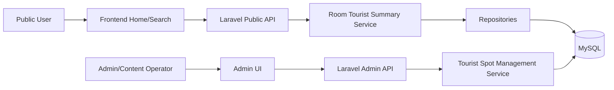
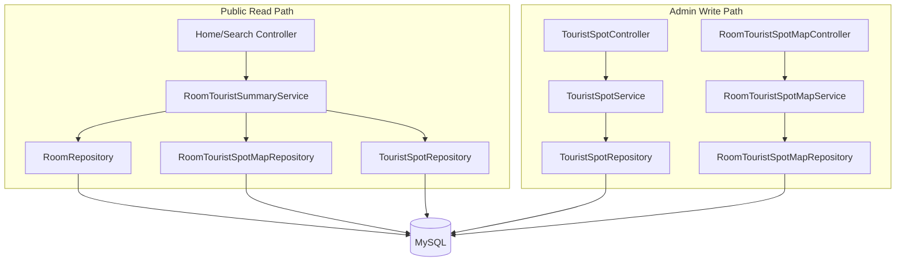
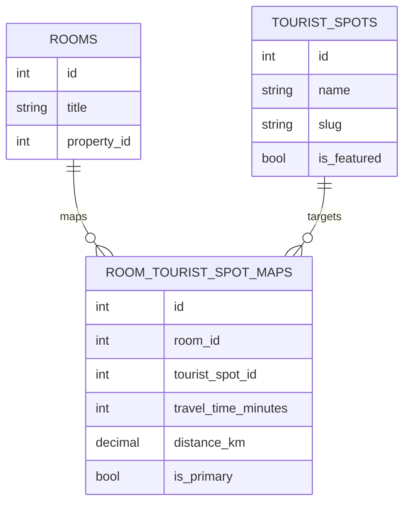

# System Design: Gợi ý phòng theo điểm du lịch

## Document Information
- **Design ID:** D004
- **Created:** 2026-05-21
- **Status:** Draft
- **Related SRS:** [docs/SRC/srs_room_tourist_spot_mapping.md](../SRC/srs_room_tourist_spot_mapping.md)
- **Related Lead:** [docs/leads/lead_260521_room-tourist-mapping.md](../leads/lead_260521_room-tourist-mapping.md)
- **Canonical schema:** [docs/databases_docs/db_overview_etc_core_schema.md](../databases_docs/db_overview_etc_core_schema.md)
- **Persona áp dụng:** `.cursor/skills/stack-personas/technical-lead-architect.md`
- **Áp dụng rule:** `.cursor/rules/php-laravel-rule.mdc`, `.cursor/rules/laravel-implementation-standards.mdc`, `.cursor/rules/karpathy-behavioral-guidelines.mdc`

## 1. Architecture Overview

### 1.1 High-Level Architecture

Chức năng này mở rộng luồng public room discovery hiện có bằng một lớp summary du lịch được enrich tại backend. FE không tự tính ranking hay ghép điểm du lịch; FE chỉ render payload summary đã được chuẩn hoá.

### 1.2 Design Principles
- **API-driven:** Thứ tự hiển thị của phòng và điểm du lịch được quyết định ở backend, FE chỉ render.
- **Single summary DTO:** Home và search dùng chung payload summary để tránh phân mảnh logic.
- **Progressive enhancement:** Nếu room chưa có mapping, response vẫn hợp lệ và FE fallback bình thường.
- **Manual-first, estimated-second:** Travel time là giá trị quản trị / ước tính; không phụ thuộc live routing.
- **Minimal schema delta:** Chỉ thêm master table và mapping table, không mở rộng schema phòng nếu chưa cần.

### 1.3 Technology Stack

| Layer | Technology | Justification |
|-------|------------|---------------|
| Backend | Laravel 9.x | Phù hợp stack hiện tại của repo |
| Database | MySQL | Đồng bộ với canonical schema hiện có |
| Cache | Laravel Cache / Redis | Cache summary public read-heavy |
| API | REST JSON | Tương thích các hook public hiện có |
| Admin UI | Existing FE admin patterns | Quản lý master/mapping cần UI đơn giản, đồng bộ |

## 2. Components

### 2.1 Component Diagram

### 2.2 Component Details

| Component | Responsibility | Dependencies | Technology |
|-----------|---------------|--------------|------------|
| `RoomTouristSummaryService` | Build room-level tourist summary for public home/search responses | Room, mapping, spot repositories | Laravel service |
| `TouristSpotService` | CRUD master tourist spots, validate active/featured rules | Spot repository | Laravel service |
| `RoomTouristSpotMapService` | CRUD mapping between room and tourist spot | Room, spot, map repositories | Laravel service |
| `RoomRepository` | Fetch rooms with eager-loaded public attributes | Room model | Eloquent/repository |
| `TouristSpotRepository` | Read active spot master data | TouristSpot model | Eloquent/repository |
| `RoomTouristSpotMapRepository` | Read/write mappings and ordering | Map model | Eloquent/repository |
| `TouristSpotController` | Admin API for spot master management | `TouristSpotService` | Laravel controller |
| `RoomTouristSpotMapController` | Admin API for mapping management | `RoomTouristSpotMapService` | Laravel controller |

### 2.3 Communication Patterns
- Public read path dùng synchronous REST response.
- Admin CRUD dùng synchronous REST và invalidate cache sau commit.
- Public summary service đọc từ DB/cache, không gọi external service.
- FE chỉ tiêu thụ JSON; không cần socket/realtime cho feature này.

## 3. External Services

### 3.1 Third-Party Integrations

Không có third-party integration bắt buộc trong scope hiện tại.

### 3.2 API Design

#### Public API

| Method | Endpoint | Description | Auth | Request | Response |
|--------|----------|-------------|------|---------|----------|
| GET | `/api/v1/home` | Trả homepage public data kèm tourist summary cho room cards | Public | Query params hiện có | JSON home payload + tourist summary |
| GET | `/api/v1/rooms` | Trả danh sách phòng search kèm tourist summary | Public | Filter/search params hiện có | JSON room list + tourist summary |
| GET | `/api/v1/rooms/{id}` | Trả room detail kèm danh sách điểm du lịch liên quan | Public | `id` | JSON room detail + tourist spots |

#### Admin API

| Method | Endpoint | Description | Auth | Request | Response |
|--------|----------|-------------|------|---------|----------|
| GET | `/api/v1/admin/tourist-spots` | Danh sách điểm du lịch master | Admin | Query filter | Paginated list |
| POST | `/api/v1/admin/tourist-spots` | Tạo điểm du lịch | Admin | `name`, `slug`, `category`, `is_featured`, `sort_order`, `is_active` | Created spot |
| PUT | `/api/v1/admin/tourist-spots/{id}` | Cập nhật điểm du lịch | Admin | Fields editable | Updated spot |
| GET | `/api/v1/admin/room-tourist-spot-maps` | Danh sách mapping theo room/spot | Admin | Filter params | Paginated list |
| POST | `/api/v1/admin/room-tourist-spot-maps` | Tạo mapping phòng-điểm du lịch | Admin | `room_id`, `tourist_spot_id`, `travel_time_minutes`, `distance_km`, `priority_order`, `is_primary`, `source_type` | Created mapping |
| PUT | `/api/v1/admin/room-tourist-spot-maps/{id}` | Cập nhật mapping | Admin | Editable fields | Updated mapping |
| DELETE | `/api/v1/admin/room-tourist-spot-maps/{id}` | Xoá mapping | Admin | `id` | 204 / success |

### 3.3 Error Handling & Resilience
- Public response phải luôn hợp lệ ngay cả khi mapping thiếu.
- Nếu mapping bị lỗi dữ liệu, service bỏ qua record invalid và log warning thay vì làm fail toàn bộ endpoint.
- CRUD admin dùng transaction để tránh trạng thái trung gian.
- Sau thay đổi master/mapping, service invalidate cache bằng key versioning để public endpoint không trả dữ liệu cũ.

## 4. Data Model

### 4.1 Database Schema Changes

#### `tourist_spots`
- `id` bigint PK
- `name` string(255) unique index by business rule
- `slug` string(255) unique
- `category` string(50)
- `region_label` string(255) nullable
- `is_featured` boolean default false
- `sort_order` integer default 0
- `is_active` boolean default true
- timestamps

#### `room_tourist_spot_maps`
- `id` bigint PK
- `room_id` bigint FK -> `rooms.id`
- `tourist_spot_id` bigint FK -> `tourist_spots.id`
- `distance_km` decimal(8,2) nullable
- `travel_time_minutes` integer not null
- `priority_order` integer default 0
- `is_primary` boolean default false
- `source_type` string(30) default `estimated`
- `note` text nullable
- timestamps

Indexes:
- `room_tourist_spot_maps(room_id, tourist_spot_id)`
- `room_tourist_spot_maps(room_id, is_primary, priority_order)`
- `tourist_spots(is_active, is_featured, sort_order)`

### 4.2 Entity Relationships

Quan hệ nghiệp vụ:
- Một room có thể có nhiều mapping.
- Một mapping có một điểm du lịch.
- Chỉ một mapping của room nên là `is_primary = true` tại cùng thời điểm hiển thị.

### 4.3 Data Integrity
- `travel_time_minutes` bắt buộc dương.
- `distance_km` nếu có phải không âm.
- `tourist_spots.slug` unique.
- `room_id` và `tourist_spot_id` phải tồn tại trước khi tạo mapping.
- `is_primary` chỉ cho phép một dòng active chính cho một room trong rule service.
- `sort_order` và `priority_order` dùng để ổn định thứ tự hiển thị, không để FE tự sắp xếp lại.

## 5. Migration Strategy

### 5.1 Current State
Hiện hệ thống có room/property/public home/search, nhưng chưa có master tourist spot hay mapping room-spot. FE chỉ có thể hiển thị tỉnh/thành hoặc room data thuần.

### 5.2 Target State
Sau migration, backend có thể trả room cards với summary du lịch nhất quán, và admin có thể quản lý danh mục điểm du lịch cùng mapping phòng.

### 5.3 Migration Steps

| Step | Action | Risk | Rollback |
|------|--------|------|----------|
| 1 | Tạo migration `tourist_spots` | Tên / slug trùng dữ liệu | Rollback drop table |
| 2 | Tạo migration `room_tourist_spot_maps` | FK sai hoặc dữ liệu mapping rỗng | Rollback drop table |
| 3 | Tạo model/repository/service | Sai relation Eloquent | Xoá class / revert code |
| 4 | Update public resource DTO | Response shape thay đổi | Revert resource mapping |
| 5 | Thêm admin CRUD + cache invalidation | Permission / cache stale | Revert controller/service |

### 5.4 Rollback Plan
1. Disable feature flag hoặc tạm ngưng route admin nếu cần.
2. Revert controller/service sử dụng tourist summary.
3. Drop `room_tourist_spot_maps` và `tourist_spots` nếu rollback schema hoàn toàn.
4. Clear cache version keys sau rollback để public API không trả summary cũ.

## 6. Security

### 6.1 Authentication & Authorization
- Public endpoints không cần auth, chỉ expose dữ liệu công khai đã được lọc.
- Admin endpoints phải dùng middleware hiện có của backend cho role quản trị.
- CRUD mapping chỉ cho phép người có quyền nội dung / admin cập nhật.

### 6.2 Data Protection
- Không lưu PII.
- Dữ liệu travel time và khoảng cách chỉ là metadata công khai.
- Public response không trả về note nội bộ nếu note chứa hướng dẫn vận hành riêng.

### 6.3 Security Risks & Mitigations

| Risk | Impact | Mitigation |
|------|--------|------------|
| Admin API bị lộ | High | Dùng middleware role/admin và policy rõ ràng |
| Public payload trả metadata nội bộ | Medium | Whitelist field khi serialize summary |
| Mapping bị sửa sai gây sai thông tin public | Medium | Transaction + validation + audit log |

## 7. Performance

### 7.1 Scalability
- Public home/search là read-heavy, nên summary được build bằng query tối ưu và cache ngắn hạn.
- Tách đọc master spot và mapping khỏi layer render để tránh N+1.
- Nếu dataset tăng, có thể thêm eager loading và pagination cho admin list.

### 7.2 Caching Strategy

| What | Where | TTL | Invalidation |
|------|-------|-----|--------------|
| Active tourist spots | App cache / Redis | 10 phút | Khi create/update/delete spot |
| Room tourist summary | App cache / Redis | 5 phút | Khi create/update/delete mapping hoặc spot | 
| Public room/home payload | Existing response cache if available | 5 phút | Version bump sau thay đổi mapping |

### 7.3 Optimization Opportunities
- Preload active spot master data bằng một query.
- Chỉ join mapping cần thiết cho rooms xuất hiện trong payload hiện tại.
- Dùng `is_primary` và `priority_order` để tránh sort phức tạp ở FE.
- Nếu cần, đưa summary thành resource transformer thay vì logic trong controller.

## 8. Risks and Mitigations

| Risk | Impact | Likelihood | Mitigation | Owner |
|------|--------|------------|------------|-------|
| Dữ liệu travel time được nhập không nhất quán | H | M | Quy ước format và validation service | BE |
| FE hiển thị quá nhiều điểm cho một room | M | M | Giới hạn 1 primary + 2 secondary | FE |
| Cache stale sau update mapping | M | M | Version-based invalidation | BE |
| Chưa đủ dữ liệu để gắn room với spot | M | H | Fallback province/city summary | BE/FE |

## 9. Implementation Phases

### Phase 1: Schema & Master Data Foundation - 1 sprint
**Goal:** Tạo nền tảng lưu điểm du lịch và mapping phòng.
- [ ] Tạo migration cho `tourist_spots`
- [ ] Tạo migration cho `room_tourist_spot_maps`
- [ ] Tạo model, repository, factory/seed tối thiểu
- [ ] Cập nhật canonical schema và nhật ký thay đổi nếu cần
**Dependencies:** SRS và canonical schema đã chốt.
**Deliverable:** DB schema + model layer sẵn sàng.

### Phase 2: Public Summary API - 1 sprint
**Goal:** Trả summary du lịch cho home/search/room detail.
- [ ] Xây `RoomTouristSummaryService`
- [ ] Enrich resource/DTO cho home/search
- [ ] Thêm room detail payload chứa danh sách spot liên quan
- [ ] Thêm unit/integration test cho fallback và priority
**Dependencies:** Phase 1.
**Deliverable:** API public trả summary ổn định.

### Phase 3: Admin CRUD & Cache - 1 sprint
**Goal:** Cho phép quản trị master data và mapping.
- [ ] Thêm admin controllers/services/policies
- [ ] Thêm validation cho primary/priority/travel time
- [ ] Thêm cache invalidation sau CRUD
- [ ] Audit log thay đổi mapping nếu hệ thống có sẵn pattern
**Dependencies:** Phase 1.
**Deliverable:** Admin quản lý được dữ liệu và cache an toàn.

## Appendix

### A. Glossary
- **Tourist spot:** Điểm du lịch / khu tham quan được hiển thị để gắn ngữ nghĩa vị trí cho phòng.
- **Primary spot:** Điểm du lịch chính được ưu tiên trên card.
- **Travel time:** Thời gian di chuyển ước tính hoặc được quản trị.

### B. References
- [docs/SRC/srs_room_tourist_spot_mapping.md](../SRC/srs_room_tourist_spot_mapping.md)
- [docs/leads/lead_260521_room-tourist-mapping.md](../leads/lead_260521_room-tourist-mapping.md)
- [docs/databases_docs/db_overview_etc_core_schema.md](../databases_docs/db_overview_etc_core_schema.md)

### C. Decision Log
- Chọn mô hình master `tourist_spots` + mapping `room_tourist_spot_maps`.
- Chọn travel time ước tính / quản trị thay vì live routing.
- Chọn public home/search cùng dùng một summary DTO để tránh lệch hiển thị.