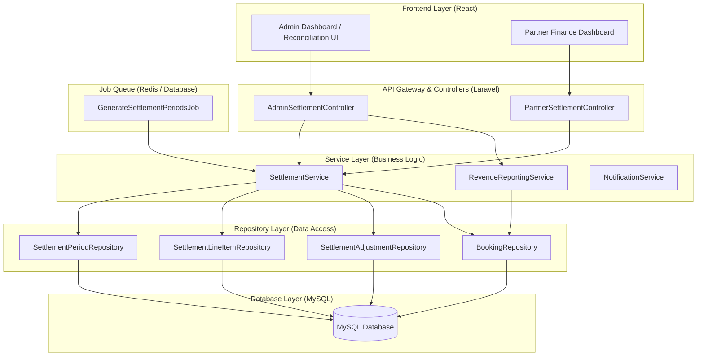
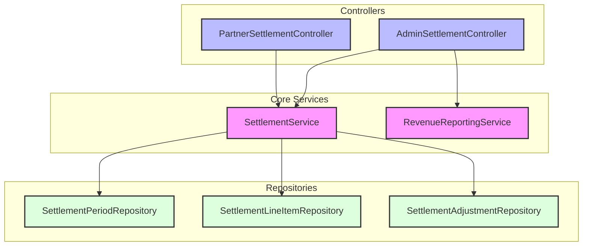
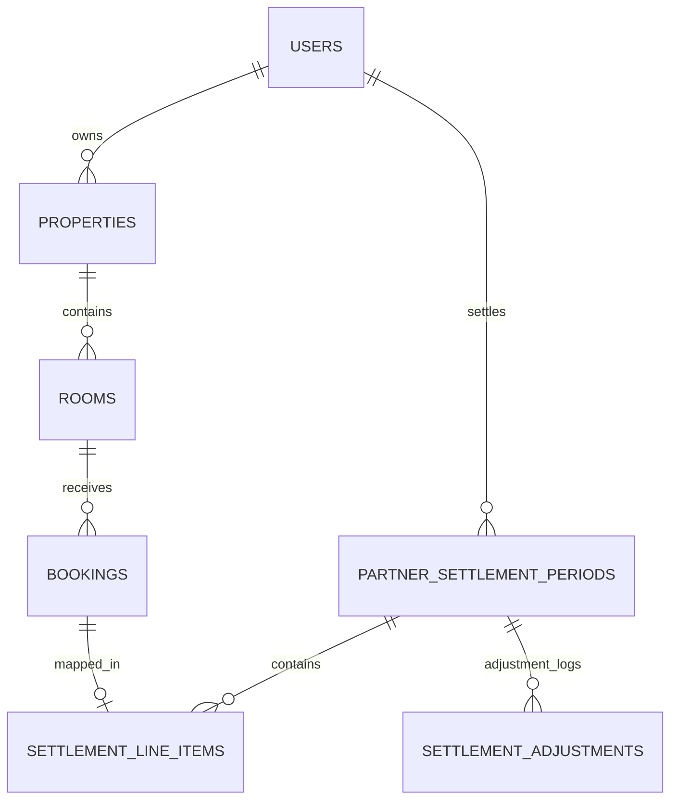

# System Design: Đối soát doanh thu Admin

## Document Information
- **Design ID:** D006
- **Created:** 2026-05-31
- **Status:** Draft
- **Related SRS:** [docs/SRC/srs_admin_revenue_reconciliation.md](../SRC/srs_admin_revenue_reconciliation.md)
- **Canonical schema:** [docs/databases_docs/db_overview_etc_core_schema.md](../databases_docs/db_overview_etc_core_schema.md)
- **Persona áp dụng:** `.cursor/skills/stack-personas/technical-lead-architect.md`
- **Áp dụng rule:** `.cursor/rules/php-laravel-rule.mdc`, `.cursor/rules/laravel-implementation-standards.mdc`

---

## 1. Architecture Overview

### 1.1 High-Level Architecture



Hệ thống đối soát doanh thu Admin vận hành theo kiến trúc Service-Repository kết hợp với Hàng đợi (Queue) để xử lý bất đồng bộ. Quy trình tự động quét đơn để tạo kỳ đối soát nháp (`draft`) được kích hoạt thông qua Scheduler của Laravel và xử lý nền qua Queue Job.

### 1.2 Design Principles
- **Idempotency (Tính độc lập/Không lặp lại):** Tiến trình quét đơn tạo kỳ đối soát không được tạo lặp lại các kỳ trùng lặp cho cùng một đối tác trong cùng một chu kỳ thời gian. Điều này được đảm bảo ở cả tầng ứng dụng (Validation) và tầng cơ sở dữ liệu (Unique Constraint).
- **Audit-ready (Sẵn sàng tra soát):** Mọi hành động của Admin (phát hành, xác nhận thanh toán, thêm điều chỉnh) đều phải ghi nhận cụ thể người thực hiện (`confirmed_by`, `created_by`) và thời điểm thực hiện để phục vụ tra soát.
- **Strict Locking (Khóa dữ liệu chặt chẽ):** Khi booking đã được chốt và gán vào một kỳ đối soát đã thanh toán hoặc đã phát hành, hệ thống phải kích hoạt cơ chế khóa để ngăn chặn bất kỳ thay đổi nào liên quan đến giá phòng, giá dịch vụ hoặc trạng thái của đơn đó.
- **Financial Consistency (Tính nhất quán tài chính):** Mọi sự điều chỉnh công nợ đều phải thông qua các bản ghi điều chỉnh (`settlement_adjustments`) thay vì sửa đổi trực tiếp dữ liệu lịch sử để đảm bảo tính minh bạch về kế toán.

### 1.3 Technology Stack
| Layer | Technology | Justification |
|-------|------------|---------------|
| Backend Framework | Laravel 9.x | Framework hiện tại của dự án |
| Database | MySQL 8.x | Hệ quản trị cơ sở dữ liệu hiện có |
| Cache & Queue | Redis | Quản lý hàng đợi cho Job quét đơn và cache báo cáo |
| PDF/Excel Export | Maatwebsite/Laravel-Excel & barryvdh/laravel-dompdf | Thư viện chuẩn hỗ trợ xuất báo cáo file |
| Frontend | React, TailwindCSS, TanStack Query | Phù hợp với cấu trúc frontend hiện tại |

---

## 2. Components

### 2.1 Component Diagram



### 2.2 Component Details
| Component | Responsibility | Dependencies | Technology |
|-----------|---------------|--------------|------------|
| `AdminSettlementController` | Expose API dành cho quản trị viên: Xem danh sách kỳ đối soát, xem chi tiết, duyệt phát hành, xác nhận thanh toán, tạo dòng điều chỉnh công nợ. | `SettlementService`, `RevenueReportingService` | Laravel Controller |
| `PartnerSettlementController` | Expose API dành cho Partner: Xem danh sách kỳ đối soát cá nhân, xem chi tiết bảng kê, gửi khiếu nại, tải file Excel/PDF. | `SettlementService` | Laravel Controller |
| `SettlementService` | Chứa logic nghiệp vụ lõi: tạo kỳ đối soát nháp, chuyển trạng thái kỳ đối soát, gán booking vào kỳ, thêm dòng điều chỉnh, giải quyết tranh chấp. | `SettlementPeriodRepository`, `SettlementLineItemRepository`, `SettlementAdjustmentRepository`, `BookingRepository` | Laravel Service |
| `RevenueReportingService` | Tổng hợp báo cáo doanh thu, tính toán Platform Commission và GMV phục vụ Dashboard Admin. | `BookingRepository` | Laravel Service |
| `GenerateSettlementPeriodsJob` | Quét các booking đủ điều kiện check-out để tạo bản nháp đối soát cuối kỳ. | `SettlementService` | Laravel Queue Job |
| `SettlementPeriodRepository` | Thực hiện các câu truy vấn và cập nhật dữ liệu bảng `partner_settlement_periods`. | `PartnerSettlementPeriod` Model | Repository Pattern |
| `SettlementLineItemRepository` | Thực hiện ghi nhận và truy vấn chi tiết các booking thuộc kỳ đối soát trong bảng `settlement_line_items`. | `SettlementLineItem` Model | Repository Pattern |
| `SettlementAdjustmentRepository` | Ghi nhận các dòng điều chỉnh công nợ (+/- tiền) do Admin nhập tay. | `SettlementAdjustment` Model | Repository Pattern |

### 2.3 Communication Patterns
- **Đọc ghi đồng bộ (Sync API):** Giao tiếp giữa FE (React) và BE (Laravel API) thông qua giao thức RESTful JSON truyền thống, được bảo vệ bằng JWT Token.
- **Xử lý nền (Async Job):** Việc tạo các kỳ đối soát nháp (`draft`) diễn ra tự động vào nửa đêm các ngày 16 và 01 hàng tháng. Tiến trình này chạy nền thông qua hàng đợi Redis để tránh nghẽn luồng HTTP.
- **Thông báo sự kiện (Events):** Sử dụng Laravel Event và Listener (`SendSettlementNotificationListener`) để tự động gửi email thông báo cho Partner khi kỳ đối soát được phát hành (`issued`) hoặc có tranh chấp được giải quyết.

---

## 3. External Services & APIs

### 3.1 Third-Party Integrations
Do sử dụng **Model A (Đối soát thủ công, Partner tự chuyển khoản)**, hệ thống không tích hợp cổng thanh toán trực tuyến (Stripe, VNPay) hoặc dịch vụ giải ngân tự động trong phase này. Tất cả các giao dịch chuyển khoản tiền phí hoa hồng nền tảng 5% đều được thực hiện trực tiếp ngoài hệ thống thông qua tài khoản ngân hàng của BKS.

### 3.2 API Design

#### 3.2.1 APIs dành cho Admin (Guard: `jwt.auth` + `role:admin`)

##### 1. Lấy danh sách kỳ đối soát
- **Verb & URI:** `GET /api/v1/admin/settlement-periods`
- **Request parameters:** `partner_id` (optional), `status` (optional), `period_date` (optional - YYYY-MM), `page`, `limit`
- **Response schema (200 OK):**
```json
{
  "success": true,
  "data": {
    "items": [
      {
        "id": 1,
        "period_code": "BKS-SETTLE-P1-202605-P1",
        "partner": {
          "id": 2,
          "name": "Nguyen Van A"
        },
        "period_start": "2026-05-01",
        "period_end": "2026-05-15",
        "issue_date": "2026-06-05",
        "total_gmv": 15000000.00,
        "total_commission": 750000.00,
        "commission_rate": 0.0500,
        "status": "draft",
        "issued_at": null,
        "paid_at": null,
        "payment_reference": null
      }
    ],
    "pagination": {
      "total": 12,
      "page": 1,
      "limit": 10
    }
  }
}
```

##### 2. Chi tiết kỳ đối soát
- **Verb & URI:** `GET /api/v1/admin/settlement-periods/{id}`
- **Response schema (200 OK):**
```json
{
  "success": true,
  "data": {
    "id": 1,
    "period_code": "BKS-SETTLE-P1-202605-P1",
    "partner": {
      "id": 2,
      "name": "Nguyen Van A"
    },
    "period_start": "2026-05-01",
    "period_end": "2026-05-15",
    "issue_date": "2026-06-05",
    "total_gmv": 15000000.00,
    "total_commission": 750000.00,
    "status": "draft",
    "line_items": [
      {
        "id": 10,
        "booking_id": 127,
        "booking_code": "RM-2026-000127",
        "checkout_date": "2026-05-12",
        "room_gmv": 14000000.00,
        "services_gmv": 1000000.00,
        "total_gmv": 15000000.00,
        "commission_amount": 750000.00,
        "snapshot_status": 3
      }
    ],
    "adjustments": [],
    "total_adjustments": 0.00,
    "net_commission_to_pay": 750000.00
  }
}
```

##### 3. Phát hành bảng kê đối soát
- **Verb & URI:** `POST /api/v1/admin/settlement-periods/{id}/issue`
- **Response schema (200 OK):**
```json
{
  "success": true,
  "message": "Kỳ đối soát đã được phát hành thành công.",
  "data": {
    "id": 1,
    "status": "issued",
    "issued_at": "2026-05-31T09:05:00Z"
  }
}
```

##### 4. Xác nhận đã nộp phí
- **Verb & URI:** `POST /api/v1/admin/settlement-periods/{id}/confirm-paid`
- **Request body:**
```json
{
  "payment_reference": "VCB-888999111-RECON",
  "paid_at": "2026-05-31 15:30:00",
  "note": "Đối tác đã chuyển khoản đủ phí hoa hồng."
}
```
- **Response schema (200 OK):**
```json
{
  "success": true,
  "message": "Xác nhận thanh toán thành công và khóa dữ liệu liên quan.",
  "data": {
    "id": 1,
    "status": "paid",
    "paid_at": "2026-05-31T15:30:00Z",
    "payment_reference": "VCB-888999111-RECON"
  }
}
```

##### 5. Thêm dòng điều chỉnh công nợ
- **Verb & URI:** `POST /api/v1/admin/settlement-periods/{id}/adjustments`
- **Request body:**
```json
{
  "amount": -50000.00,
  "reason": "Khấu trừ phí giặt ủi do booking RM-2026-000127 bị tính thừa dịch vụ tại quầy."
}
```
- **Response schema (201 Created):**
```json
{
  "success": true,
  "message": "Tạo dòng điều chỉnh thành công.",
  "data": {
    "id": 5,
    "settlement_period_id": 1,
    "amount": -50000.00,
    "reason": "...",
    "created_by": 1
  }
}
```

#### 3.2.2 APIs dành cho Partner (Guard: `jwt.auth` + `role:partner`)

##### 1. Lấy danh sách đối soát cá nhân
- **Verb & URI:** `GET /api/v1/partner/settlement-periods`
- **Request parameters:** `status` (optional), `period_date` (optional), `page`, `limit`
- **Response schema (200 OK):** Giống API Admin nhưng chỉ trả ra các kỳ của Partner đang đăng nhập (được đối chiếu qua `Auth::id()`).

##### 2. Gửi khiếu nại kỳ đối soát
- **Verb & URI:** `POST /api/v1/partner/settlement-periods/{id}/dispute`
- **Request body:**
```json
{
  "reason": "Tôi khiếu nại đơn RM-2026-000127 vì thực tế khách không ở nhưng chưa kịp bấm no-show trên hệ thống."
}
```
- **Response schema (200 OK):**
```json
{
  "success": true,
  "message": "Gửi khiếu nại thành công. Admin sẽ liên hệ tra soát.",
  "data": {
    "id": 1,
    "status": "disputed",
    "note": "Khách khiếu nại: Tôi khiếu nại đơn RM..."
  }
}
```

##### 3. Xuất file đối soát (Excel/PDF)
- **Verb & URI:** `GET /api/v1/partner/settlement-periods/{id}/export`
- **Request parameters:** `format` (`excel` hoặc `pdf`)
- **Response:** File nhị phân (.xlsx hoặc .pdf) để tải về trực tiếp.

### 3.3 Error Handling & Resilience
- **Database Transaction:** Toàn bộ quá trình xác nhận thanh toán (`confirm-paid`) và cập nhật trạng thái `bookings` phải được bọc trong DB Transaction. Bất kỳ lỗi ghi nhận nào đều phải rollback trạng thái DB.
- **Validation Gates:** Chặn thay đổi booking khi đã chốt đối soát:
  - Viết Middleware hoặc xử lý trực tiếp tại `BookingService::update` để ném ra lỗi `HttpStatus::FORBIDDEN` (403) nếu booking có `settlement_period_id` liên kết với một kỳ đối soát không ở trạng thái `draft` hoặc `disputed`.
- **Fail-safe Emailing:** Sự kiện gửi email thông báo cho Partner khi phát hành bảng đối soát phải được chạy bất đồng bộ thông qua Mail Queue. Lỗi gửi email (ví dụ: SMTP quá tải) không được phép làm dừng/hủy bỏ luồng phát hành kỳ đối soát trên HTTP.

---

## 4. Data Model

### 4.1 Database Schema Changes
(Đã đồng bộ trực tiếp vào tài liệu canonical [db_overview_etc_core_schema.md](../databases_docs/db_overview_etc_core_schema.md))

#### 1. Tạo bảng `partner_settlement_periods`
```sql
CREATE TABLE `partner_settlement_periods` (
  `id` bigint unsigned NOT NULL AUTO_INCREMENT,
  `partner_id` bigint unsigned NOT NULL,
  `period_start` date NOT NULL,
  `period_end` date NOT NULL,
  `issue_date` date NOT NULL,
  `total_gmv` decimal(15,2) NOT NULL,
  `total_commission` decimal(15,2) NOT NULL,
  `commission_rate` decimal(5,4) NOT NULL DEFAULT '0.0500',
  `status` varchar(20) COLLATE utf8mb4_unicode_ci NOT NULL DEFAULT 'draft',
  `issued_at` timestamp NULL DEFAULT NULL,
  `paid_at` timestamp NULL DEFAULT NULL,
  `payment_reference` varchar(100) COLLATE utf8mb4_unicode_ci DEFAULT NULL,
  `confirmed_by` bigint unsigned DEFAULT NULL,
  `note` text COLLATE utf8mb4_unicode_ci,
  `created_at` timestamp NULL DEFAULT NULL,
  `updated_at` timestamp NULL DEFAULT NULL,
  PRIMARY KEY (`id`),
  UNIQUE KEY `partner_period_unique` (`partner_id`,`period_start`,`period_end`),
  KEY `idx_settlements_partner_status` (`partner_id`,`status`),
  CONSTRAINT `fk_settlements_partner` FOREIGN KEY (`partner_id`) REFERENCES `users` (`id`) ON DELETE RESTRICT,
  CONSTRAINT `fk_settlements_confirmed_by` FOREIGN KEY (`confirmed_by`) REFERENCES `users` (`id`) ON DELETE SET NULL
) ENGINE=InnoDB DEFAULT CHARSET=utf8mb4 COLLATE=utf8mb4_unicode_ci;
```

#### 2. Tạo bảng `settlement_line_items`
```sql
CREATE TABLE `settlement_line_items` (
  `id` bigint unsigned NOT NULL AUTO_INCREMENT,
  `settlement_period_id` bigint unsigned NOT NULL,
  `booking_id` bigint unsigned NOT NULL,
  `booking_code` varchar(32) COLLATE utf8mb4_unicode_ci NOT NULL,
  `checkout_date` date NOT NULL,
  `room_gmv` decimal(15,2) NOT NULL,
  `services_gmv` decimal(15,2) NOT NULL,
  `total_gmv` decimal(15,2) NOT NULL,
  `commission_amount` decimal(15,2) NOT NULL,
  `snapshot_status` tinyint unsigned NOT NULL DEFAULT '3',
  `created_at` timestamp NULL DEFAULT NULL,
  `updated_at` timestamp NULL DEFAULT NULL,
  PRIMARY KEY (`id`),
  KEY `idx_line_items_period` (`settlement_period_id`),
  KEY `idx_line_items_booking` (`booking_id`),
  CONSTRAINT `fk_line_items_period` FOREIGN KEY (`settlement_period_id`) REFERENCES `partner_settlement_periods` (`id`) ON DELETE CASCADE,
  CONSTRAINT `fk_line_items_booking` FOREIGN KEY (`booking_id`) REFERENCES `bookings` (`id`) ON DELETE RESTRICT
) ENGINE=InnoDB DEFAULT CHARSET=utf8mb4 COLLATE=utf8mb4_unicode_ci;
```

#### 3. Tạo bảng `settlement_adjustments`
```sql
CREATE TABLE `settlement_adjustments` (
  `id` bigint unsigned NOT NULL AUTO_INCREMENT,
  `settlement_period_id` bigint unsigned NOT NULL,
  `amount` decimal(15,2) NOT NULL,
  `reason` text COLLATE utf8mb4_unicode_ci NOT NULL,
  `created_by` bigint unsigned NOT NULL,
  `created_at` timestamp NULL DEFAULT NULL,
  `updated_at` timestamp NULL DEFAULT NULL,
  PRIMARY KEY (`id`),
  KEY `idx_adjustments_period` (`settlement_period_id`),
  CONSTRAINT `fk_adjustments_period` FOREIGN KEY (`settlement_period_id`) REFERENCES `partner_settlement_periods` (`id`) ON DELETE CASCADE,
  CONSTRAINT `fk_adjustments_creator` FOREIGN KEY (`created_by`) REFERENCES `users` (`id`) ON DELETE RESTRICT
) ENGINE=InnoDB DEFAULT CHARSET=utf8mb4 COLLATE=utf8mb4_unicode_ci;
```

#### 4. Cập nhật bảng `bookings`
```sql
ALTER TABLE `bookings` 
ADD COLUMN `payment_collected_at` timestamp NULL DEFAULT NULL AFTER `updated_at`,
ADD COLUMN `settlement_period_id` bigint unsigned NULL DEFAULT NULL AFTER `payment_collected_at`,
ADD CONSTRAINT `fk_bookings_settlement` FOREIGN KEY (`settlement_period_id`) REFERENCES `partner_settlement_periods` (`id`) ON DELETE SET NULL;
```

### 4.2 Entity Relationships



### 4.3 Data Integrity
- **Unique Constraint:** Đảm bảo `(partner_id, period_start, period_end)` của bảng `partner_settlement_periods` để ngăn chặn việc chạy lặp job tạo các kỳ trùng lặp.
- **RESTRICT foreign keys:** Chặn việc xóa `users` (Partner) khi đã có kỳ đối soát phát sinh; Chặn xóa `bookings` khi đã có liên kết trong bảng kê `settlement_line_items` (Constraint `ON DELETE RESTRICT`).
- **Prerequisites check:** Việc gán booking vào `settlement_period_id` tự động qua Job phải kiểm tra điều kiện trạng thái booking là `COMPLETED` và `stay_status` là `checked_out`.

---

## 5. Migration Strategy

### 5.1 Current State
Hiện hệ thống BKS đã có dữ liệu `bookings`, `room_prices`, `booking_services` và `services`. Tuy nhiên, chưa có bất kỳ bảng lưu trữ dữ liệu đối soát tài chính nào. Dữ liệu báo cáo GMV trên Admin Dashboard hiện tại đang được tính trực tiếp từ database realtime (eager-loaded queries) mà không đi qua các bảng snapshot hay ledger.

### 5.2 Target State
Hệ thống có đầy đủ các bảng đối soát và ghi nhận công nợ. Toàn bộ các booking `COMPLETED` cũ đã check-out từ trước đến nay sẽ được giữ nguyên trạng thái chưa đối soát. Khi triển khai hệ thống mới, tiến trình quét tự động sẽ gom các booking này vào kỳ đối soát nháp đầu tiên (Backfill) hoặc chỉ bắt đầu tính từ thời điểm kích hoạt hệ thống tùy theo cấu hình ngày hiệu lực.

### 5.3 Migration Steps
| Step | Action | Risk | Rollback |
|------|--------|------|----------|
| 1 | Tạo file migration tạo bảng `partner_settlement_periods` | Lỗi cú pháp SQL hoặc trùng tên bảng | `php artisan migrate:rollback` |
| 2 | Tạo file migration tạo bảng `settlement_line_items` | Lỗi cú pháp khóa ngoại FK | `php artisan migrate:rollback` |
| 3 | Tạo file migration tạo bảng `settlement_adjustments` | Lỗi cú pháp | `php artisan migrate:rollback` |
| 4 | Tạo file migration bổ sung cột `payment_collected_at`, `settlement_period_id` và FK vào bảng `bookings` | Bị khóa bảng do dữ liệu `bookings` quá lớn | `php artisan migrate:rollback` (sử dụng gh-ost hoặc online-schema-change nếu DB sản xuất quá lớn) |

### 5.4 Rollback Plan
Trong trường hợp gặp sự cố nghiêm trọng trên Production:
1. Chạy lệnh rollback migration của Laravel để khôi phục cấu trúc DB về trạng thái cũ:
   ```bash
   php artisan migrate:rollback --step=4
   ```
2. Revert code backend về commit trước khi tích hợp API đối soát.
3. Xóa các key cache liên quan đến đối soát doanh thu trên Redis.

---

## 6. Security

### 6.1 Authentication & Authorization
- **Role-based Access Control (RBAC):** 
  - Admin Controller sử dụng middleware `role:admin|super_admin` để chặn toàn bộ các request từ người dùng thông thường và đối tác.
  - Partner Controller sử dụng middleware `role:partner`.
- **Ownership Validation:** Tại `PartnerSettlementController`, hệ thống phải thực hiện validate để đảm bảo Partner chỉ truy vấn được kỳ đối soát thuộc về tài khoản của chính mình:
  ```php
  if ($settlementPeriod->partner_id !== Auth::id()) {
      return response()->json(['error' => 'Unauthorized'], 403);
  }
  ```

### 6.2 Data Protection
- **PII Whitelisting:** Các API đối soát hoặc file xuất đối soát không được trả về thông tin thẻ tín dụng hay thông tin nhạy cảm của khách hàng, chỉ cung cấp mã đơn đặt phòng (`booking_code`), tên phòng, ngày check-out và số tiền giao dịch.
- **Audit Logging:** Mọi thay đổi trạng thái của kỳ đối soát từ `draft` -> `issued` -> `paid` đều phải được ghi nhận vào bảng `partner_settlement_periods` và đồng thời ghi nhận log nghiệp vụ trong Laravel log.

### 6.3 Security Risks & Mitigations
| Risk | Impact | Mitigation |
|------|--------|------------|
| Partner truy cập trái phép kỳ đối soát của đối tác khác | High | Thực hiện kiểm tra ownership nghiêm ngặt tại controller level |
| SQL Injection qua bộ lọc kỳ đối soát | Medium | Sử dụng Eloquent Query Builder và ràng buộc kiểu dữ liệu đầu vào thông qua Request Validator |
| Thay đổi giá trị booking đã chốt làm thay đổi báo cáo tài chính | High | Chặn cập nhật `bookings` có `settlement_period_id` đã được chốt (status != draft/disputed) |

---

## 7. Performance

### 7.1 Scalability
- **Batch Processing:** Khi Job quét đơn chạy, hệ thống truy vấn dữ liệu theo từng chunk (mặc định 500 records mỗi chunk) để tránh tràn bộ nhớ RAM (OutOfMemory Exception) trên server Laravel.
- **Eager Loading:** Toàn bộ các API chi tiết kỳ đối soát khi load các line items phải sử dụng Eager Loading để tránh lỗi N+1 Query:
  ```php
  $period = PartnerSettlementPeriod::with(['lineItems.booking.room', 'adjustments'])->find($id);
  ```

### 7.2 Caching Strategy
| What | Where | TTL | Invalidation |
|------|-------|-----|--------------|
| Dashboard Revenue Admin (Platform Commission) | Redis Cache | 600s | Invalidate khi có kỳ đối soát chuyển trạng thái sang `paid` |
| Danh sách kỳ đối soát Partner | Redis Cache | 60s | Invalidate khi trạng thái kỳ đổi hoặc Partner gửi khiếu nại |

### 7.3 Optimization Opportunities
- Sử dụng Index `idx_settlements_partner_status` trên bảng `partner_settlement_periods` để tối ưu hóa tốc độ tải danh sách của Partner.
- Sử dụng Index `idx_line_items_period` trên bảng `settlement_line_items` để tăng tốc độ load chi tiết bảng kê.

---

## 8. Risks and Mitigations

| Risk | Impact | Likelihood | Mitigation | Owner |
|---|---|---|---|---|
| Tranh chấp số liệu do làm tròn số hoặc tỷ giá | Low | Low | Hệ thống tính toán và lưu trữ chính xác kiểu dữ liệu Decimal(15,2). | Dev Team |
| Partner khiếu nại lặp đi lặp lại để trì hoãn nộp phí | Medium | Medium | Thiết lập SLA xử lý khiếu nại (tối đa 5 ngày làm việc). Quá hạn khiếu nại tự động áp dụng quyết định của Admin. | BA / Ops |
| Job quét đơn bị lỗi giữa chừng khiến kỳ đối soát dở dang | Medium | Low | Thực hiện bọc toàn bộ quá trình gom đơn của 1 Partner vào trong 1 database transaction. Nếu lỗi, rollback toàn bộ line items của Partner đó và tiếp tục xử lý Partner tiếp theo. | Dev Team |

---

## 9. Implementation Phases

### Phase 1: Database Foundation & Models - 1 Sprint
**Goal:** Thiết lập cấu trúc cơ sở dữ liệu và lớp truy cập dữ liệu.
- [ ] Viết migration tạo các bảng đối soát và cập nhật bảng `bookings`
- [ ] Tạo các Model `PartnerSettlementPeriod`, `SettlementLineItem`, `SettlementAdjustment`
- [ ] Thiết lập các quan hệ (Relationships) trong Model Laravel
- [ ] Viết Seeder dữ liệu mẫu cho kỳ đối soát để phục vụ dev/test
- [ ] Cập nhật tài liệu canonical database schema

### Phase 2: Scheduler Job & Admin APIs - 1 Sprint
**Goal:** Xây dựng quy trình tự động gom đơn và API quản trị của Admin.
- [ ] Viết `GenerateSettlementPeriodsJob` quét đơn tự động cuối chu kỳ
- [ ] Đăng ký job chạy trong Scheduler của Laravel (`app/Console/Kernel.php`)
- [ ] Viết `SettlementService` xử lý logic lõi của Admin (Phát hành, Xác nhận thanh toán, Thêm dòng điều chỉnh)
- [ ] Xây dựng các API Admin tại `AdminSettlementController` kèm Request Validators tương ứng
- [ ] Viết Unit Test cho Service và API Controller của Admin

### Phase 3: Partner APIs & File Export - 1 Sprint
**Goal:** Xây dựng API cho Partner và tính năng xuất file đối soát.
- [ ] Viết API cho Partner (Xem danh sách, xem chi tiết, gửi khiếu nại) tại `PartnerSettlementController`
- [ ] Tích hợp logic kiểm tra quyền sở hữu kỳ đối soát (Ownership validation)
- [ ] Xây dựng tính năng xuất file Excel bảng kê đối soát (`Maatwebsite/Laravel-Excel`)
- [ ] Xây dựng tính năng xuất file PDF bảng kê đối soát (`barryvdh/laravel-dompdf`)
- [ ] Viết Unit Test cho API Partner và test xuất file

### Phase 4: Frontend Integration - 1 Sprint
**Goal:** Triển khai giao diện Admin UI và Partner Finance Dashboard.
- [ ] Tích hợp API Admin vào màn hình Quản lý đối soát của Admin
- [ ] Thiết kế trang chi tiết kỳ đối soát Admin, hỗ trợ Drill-down và Form nhập Adjustment/Xác nhận thanh toán
- [ ] Thiết kế trang Partner Finance Dashboard: Xem danh sách kỳ, copy cú pháp chuyển khoản, tải file PDF/Excel, gửi khiếu nại
- [ ] Đồng bộ copy tỷ lệ phí 5% trên FAQ trang BecomeAPartner và Onboarding wizard hợp đồng mẫu

---

## Appendix

### A. Glossary
- **GMV (Gross Merchandise Value):** Tổng giá trị giao dịch booking (gồm tiền phòng + tiền dịch vụ kèm theo) mà khách hàng thanh toán cho đối tác.
- **Platform Commission:** Phí dịch vụ nền tảng (5% của GMV) mà BKS thu từ đối tác.
- **Adjustment Entry (Dòng điều chỉnh):** Bản ghi kế toán do Admin tạo thủ công để bù trừ tiền hoa hồng (+/-) trong kỳ đối soát khi có sai sót thực tế xảy ra.

### B. References
- [docs/SRC/srs_admin_revenue_reconciliation.md](../SRC/srs_admin_revenue_reconciliation.md)
- [docs/databases_docs/db_overview_etc_core_schema.md](../databases_docs/db_overview_etc_core_schema.md)

### C. Decision Log
- **DEC-20260531-REC-001:** Quyết định chọn Model A đối soát thủ công và chu kỳ ngày 05 & 20 hàng tháng dựa trên trạng thái `COMPLETED` của booking.
