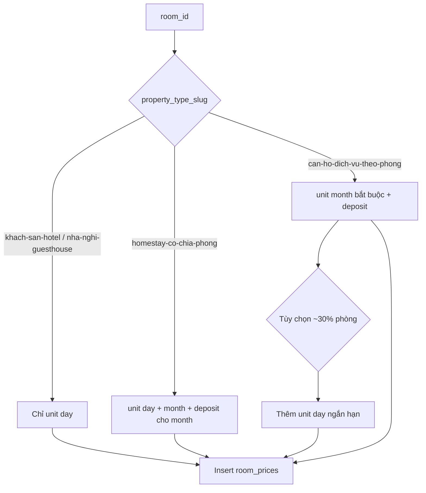

# Implementation Plan: Seeder giá phòng theo loại hình (Property Type)

## 1. Thông tin kế hoạch

| Mục | Nội dung |
|-----|----------|
| **Mã plan** | PLAN-SEED-RP-006 |
| **Tham chiếu nghiệp vụ** | `bks-system-fe/business-script/PRICING_RESTRUCTURE_PLAN.md` |
| **Tài liệu công thức seed** | [`docs/developer/room-price-seeder-formulas.md`](../../../docs/developer/room-price-seeder-formulas.md) (thư mục docs dự án) |
| **Phạm vi** | Backend seed data — chủ yếu `RoomPricesTableSeeder`; kiểm tra tác động `BookingsTableSeeder`, `StayPortalSeeder` |
| **Mục tiêu** | Dữ liệu `room_prices` phản ánh đúng quy tắc giá theo 4 loại hình: Khách sạn, Nhà nghỉ, Homestay (linh hoạt), Căn hộ dịch vụ (thuê dài hạn) |
| **Trạng thái** | Phase 1–2 hoàn thành (2026-05-28) |

---

## 2. Hiện trạng (as-is)

### 2.1. Mapping loại hình (đã chuẩn trong `PropertyTypesSeeder`)

| Loại hình | `slug` |
|-----------|--------|
| Khách sạn | `khach-san-hotel` |
| Nhà nghỉ | `nha-nghi-guesthouse` |
| Căn hộ dịch vụ | `can-ho-dich-vu-theo-phong` |
| Homestay | `homestay-co-chia-phong` |

`PropertiesTableSeeder` đã gán property đúng 4 slug trên. `RoomPricesTableSeeder` join `rooms → properties → property_types` nên **nhận diện loại hình qua DB là đúng**.

### 2.2. Logic `RoomPricesTableSeeder` hiện tại

```php
// database/seeders/RoomPricesTableSeeder.php (tóm tắt)
SHORT_TERM_ONLY_SLUGS = [khach-san-hotel, nha-nghi-guesthouse, homestay-co-chia-phong]
→ unit chỉ 'day'

Còn lại (can-ho-dich-vu-theo-phong) → random 'day' | 'month'
Giá: basePrice = area × 150_000 × hệ số ngẫu nhiên (coi như giá/ngày)
month: price = basePrice × packageMultiplier × 28
Không seed: deposit_amount, minimum_stay
```

### 2.3. Lệch so với quy định giá (to-be)

| Loại hình | Quy định (`PRICING_RESTRUCTURE_PLAN`) | Seeder hiện tại | Lệch |
|-----------|--------------------------------------|-----------------|------|
| Khách sạn | Chỉ thuê đêm (`day`) | `day` only | OK |
| Nhà nghỉ | Chỉ thuê đêm (`day`) | `day` only | OK |
| Homestay | Linh hoạt: `day` + `month`; thuê ≥30 ngày áp dụng nhóm dài hạn (cọc) | Bị gộp vào `SHORT_TERM_ONLY` → **chỉ `day`** | **Sai** |
| Căn hộ dịch vụ | Ưu tiên thuê tháng; có cọc, `minimum_stay` | Random `day`/`month`; không cọc | **Thiếu / yếu** |

### 2.4. Vấn đề phụ (ngoài phạm vi bắt buộc nhưng nên ghi nhận)

- `RoomsTableSeeder` dùng slug cũ (`nha-nghi-motel-guesthouse`, `homestay`, …) — chỉ ảnh hưởng **tên phòng mẫu**, không ảnh hưởng giá.
- `BookingsTableSeeder` luôn booking 5–30 ngày, chọn `price_id` ngẫu nhiên — có thể chọn giá `month` cho khách sạn nếu sau này dữ liệu lẫn; nên chỉnh nhẹ sau khi sửa giá.
- Chưa có test PHPUnit cho seeder.

---

## 3. Quy tắc mục tiêu (to-be)

### 3.1. Ma trận `unit` / cọc / ở tối thiểu

| `property_type_slug` | Đơn vị được phép | Bắt buộc có bản ghi | `deposit_amount` | `minimum_stay` |
|----------------------|------------------|---------------------|------------------|----------------|
| `khach-san-hotel` | `day` | Mỗi package: ≥1 bản ghi `day` | `null` hoặc `0` | `1` (1 đêm) |
| `nha-nghi-guesthouse` | `day` | Tương tự KS, mức giá thấp hơn KS ~15–25% | `null` / `0` | `1` |
| `homestay-co-chia-phong` | `day` **và** `month` | Mỗi phòng: ít nhất 1 `day` + 1 `month` (có thể cùng package hoặc package khác) | `month`: ≈ 1 tháng tiền thuê; `day`: `null` | `day`: `1`; `month`: `1` |
| `can-ho-dich-vu-theo-phong` | `month` (chính); `day` (tùy chọn, tối đa 1 package/phòng) | Mỗi phòng: ≥1 `month`; ~30% phòng có thêm `day` ngắn hạn | `month`: = `price` (1 tháng cọc); `day`: `null` | `month`: `1`; `day`: `1` |

**Ràng buộc DB:** `unique(room_id, price_package_id, unit)` — mỗi cặp (phòng, package, unit) tối đa một dòng.

### 3.2. Công thức giá gợi ý (seed, không phải logic runtime)

Tách hằng số theo loại hình để dữ liệu demo hợp lý hơn `area × 150k` cho mọi loại:

| Nhóm | Cách tính `price` (seed) | Ghi chú |
|------|--------------------------|---------|
| KS / Nhà nghỉ | `nightRate = clamp(area × 80_000–120_000, 300_000, 5_000_000)` × packageMultiplier | Giá/đêm; NN thấp hơn KS ×0.8 |
| Homestay `day` | Tương tự NN ×0.9–1.0 | |
| Homestay `month` | `nightRate × 25` (giảm ~10% so với 30 đêm) | Hiển thị “giá tháng từ” |
| Căn hộ DV `month` | `clamp(area × 180_000, 5_000_000, 50_000_000)` × packageMultiplier | Giá/tháng độc lập, không = `day×28` |
| Căn hộ DV `day` (nếu có) | `monthPrice / 30` làm tham chiếu | Chỉ vài package |

### 3.3. Số lượng bản ghi mỗi phòng (đã chỉnh 2026-05-28)

| Loại hình | Bản ghi / phòng | Ghi chú |
|-----------|-----------------|--------|
| KS, NN | **1** (`day`, package medium) | UI EndUser chỉ hiển thị theo `unit`, không hiện tên gói — tránh 3 thẻ "Thuê ngắn hạn" |
| Homestay | **2** (`day` + `month`, cùng 1 package) | Tối đa 2 thẻ: ngắn hạn + dài hạn |
| Căn hộ DV | **1** `month`; ~30% thêm **1** `day` | |

---

## 4. Phạm vi công việc

### Phase 1 — Refactor `RoomPricesTableSeeder` (bắt buộc)

#### Task 1.1. Tách cấu hình theo property type

- **File:** `database/seeders/RoomPricesTableSeeder.php`
- **Việc làm:**
  - Thay `SHORT_TERM_ONLY_SLUGS` bằng map cấu hình rõ ràng, ví dụ:

```php
private const PRICING_BY_PROPERTY_SLUG = [
    'khach-san-hotel' => ['units' => ['day'], 'group' => 'short_term'],
    'nha-nghi-guesthouse' => ['units' => ['day'], 'group' => 'short_term'],
    'homestay-co-chia-phong' => ['units' => ['day', 'month'], 'group' => 'flexible'],
    'can-ho-dich-vu-theo-phong' => ['units' => ['month', 'day'], 'group' => 'long_term'],
];
```

  - Slug không có trong map → `warn` + fallback an toàn (`day` only) để không crash seed.
- **Acceptance:**
  - [ ] Homestay **không** còn trong nhóm chỉ `day`.
  - [ ] Căn hộ dịch vụ luôn có ít nhất một `month` price mỗi phòng.

#### Task 1.2. Hàm tính giá theo nhóm

- **Việc làm:** Private methods: `resolveNightRate()`, `resolveMonthlyRate()`, `applyPackageMultiplier()`.
- **Acceptance:**
  - [ ] KS giá đêm > NN (trung bình trên mẫu 50 phòng).
  - [ ] Giá `month` căn hộ DV không phụ thuộc cứng `day × 28`.

#### Task 1.3. Seed `deposit_amount` và `minimum_stay`

- **Việc làm:** Điền theo ma trận mục 3.1 khi `insert` vào `room_prices`.
- **Acceptance:**
  - [ ] API/search trả về `deposit_amount` > 0 cho giá `month` (homestay + căn hộ DV).
  - [ ] Khách sạn / nhà nghỉ: `deposit_amount` null hoặc 0.

#### Task 1.4. Tránh vi phạm unique & logic chọn package

- **Việc làm:**
  - Khi loop package: chỉ tạo từng `(room_id, package_id, unit)` một lần.
  - Với homestay: sau khi tạo `day` cho package, tạo thêm `month` cùng package (hoặc package kế).
- **Acceptance:**
  - [ ] `php artisan db:seed --class=RoomPricesTableSeeder` chạy không lỗi duplicate key.
  - [ ] Mỗi phòng homestay có cả `day` và `month` trong DB.

**Dependencies:** `PropertyTypesSeeder`, `PropertiesTableSeeder`, `RoomsTableSeeder`, `PricePackagesTableSeeder` (thứ tự hiện có trong `DatabaseSeeder` — giữ nguyên).

**Blocks:** Task 2.x (booking seed), QA manual.

---

### Phase 2 — Đồng bộ seeder phụ thuộc (khuyến nghị)

#### Task 2.1. `BookingsTableSeeder` — chọn `price_id` phù hợp thời lượng

- **File:** `database/seeders/BookingsTableSeeder.php`
- **Việc làm:**
  - Join `room_prices.unit` khi nhóm giá theo `room_id`.
  - Nếu `end - start` < 30 ngày → ưu tiên `price_id` có `unit = day`.
  - Nếu ≥ 30 ngày → ưu tiên `unit = month` (chỉ phòng homestay / căn hộ DV).
- **Acceptance:**
  - [ ] Không còn booking 7 ngày gắn `price_id` thuộc gói `month` (trừ khi chủ đích test).

#### Task 2.2. `StayPortalSeeder` (kiểm tra nhanh)

- Đảm bảo phòng demo active/upcoming vẫn có `price_id` hợp lệ sau truncate/reseed.

---

### Phase 3 — Kiểm chứng & tài liệu

#### Task 3.1. Script kiểm tra sau seed (tùy chọn, khuyến nghị)

- Artisan command hoặc test feature nhẹ:
  - Đếm `room_prices` theo `property_types.slug` + `unit`.
  - Assert: KS/NN không có `month`; homestay có cả hai; căn hộ DV có `month`.
- **Acceptance:** Chạy một lệnh, exit 0 trên DB seed sạch.

#### Task 3.2. Cập nhật tài liệu DB (nếu cần ví dụ mẫu)

- **File:** `docs/databases_docs/db_overview_etc_core_schema.md` — thêm ghi chú quy ước seed `unit` theo `property_type` (1 đoạn ngắn).

#### Task 3.3. Cập nhật memory (khi merge code)

- `docs/memory/knowledge_base.md`: ghi quy tắc seed giá theo 4 loại hình.
- `docs/memory/decisions.md` (nếu chốt): “Homestay không thuộc nhóm short-term-only trong seed.”

---

### Phase 4 — Dọn slug `RoomsTableSeeder` (tùy chọn, ngoài lõi giá)

| Ưu tiên | Task | Lý do |
|---------|------|-------|
| Thấp | Đồng bộ key `$typeRoomTitles` với 4 slug hiện tại | Cải thiện tên phòng demo, không chặn Task 1 |

---

## 5. Kế hoạch kiểm thử

### 5.1. Lệnh chạy lại seed

```bash
cd bks-system-be
php artisan migrate:fresh --seed
# hoặc chỉ nhánh giá:
php artisan db:seed --class=PropertyTypesSeeder
php artisan db:seed --class=PricePackagesTableSeeder
php artisan db:seed --class=PropertiesTableSeeder
php artisan db:seed --class=RoomsTableSeeder
php artisan db:seed --class=RoomPricesTableSeeder
```

### 5.2. Truy vấn SQL xác minh

```sql
-- Khách sạn / nhà nghỉ: không có month
SELECT pt.slug, rp.unit, COUNT(*) cnt
FROM room_prices rp
JOIN rooms r ON r.id = rp.room_id
JOIN properties p ON p.id = r.property_id
JOIN property_types pt ON pt.id = p.property_type_id
WHERE pt.slug IN ('khach-san-hotel', 'nha-nghi-guesthouse')
GROUP BY pt.slug, rp.unit;

-- Homestay: phải có cả day và month
SELECT r.id AS room_id,
       SUM(rp.unit = 'day') AS has_day,
       SUM(rp.unit = 'month') AS has_month
FROM rooms r
JOIN properties p ON p.id = r.property_id
JOIN property_types pt ON pt.id = p.property_type_id
LEFT JOIN room_prices rp ON rp.room_id = r.id
WHERE pt.slug = 'homestay-co-chia-phong'
GROUP BY r.id
HAVING has_day = 0 OR has_month = 0;  -- kỳ vọng: 0 rows

-- Căn hộ DV: có month + deposit
SELECT AVG(rp.deposit_amount > 0) AS pct_with_deposit
FROM room_prices rp
JOIN rooms r ON r.id = rp.room_id
JOIN properties p ON p.id = r.property_id
JOIN property_types pt ON pt.id = p.property_type_id
WHERE pt.slug = 'can-ho-dich-vu-theo-phong' AND rp.unit = 'month';
```

### 5.3. Kiểm tra UI (manual)

| Màn | Kỳ vọng |
|-----|---------|
| Tìm phòng — lọc Khách sạn | Giá `/ đêm`, không badge thuê dài hạn |
| Tìm phòng — Căn hộ dịch vụ | Giá `/ tháng` nổi bật, có thông tin cọc |
| Tìm phòng — Homestay | Có giá đêm; có dòng hoặc giá tháng khi có `month` |

---

## 6. Rủi ro & giảm thiểu

| Rủi ro | Mức | Giảm thiểu |
|--------|-----|------------|
| `migrate:fresh` xóa dữ liệu local | Cao (dev) | Chỉ chạy trên env dev; thông báo team |
| Booking cũ reference `price_id` không tồn tại | Trung bình | Reseed full hoặc truncate `bookings` sau `room_prices` |
| Giá demo quá cao/thấp | Thấp | Dùng `clamp()` và hằng số có comment |
| Unique constraint | Trung bình | Task 1.4 — kiểm soát tuple (room, package, unit) |

---

## 7. Ước lượng effort

| Phase | Effort |
|-------|--------|
| Phase 1 — `RoomPricesTableSeeder` | ~0.5–1 ngày |
| Phase 2 — Booking/StayPortal | ~0.25 ngày |
| Phase 3 — Verify + docs | ~0.25 ngày |
| Phase 4 — RoomsTableSeeder titles | ~0.1 ngày (optional) |
| **Tổng** | **~1–1.5 ngày** |

---

## 8. Handoff pipeline

| Bước tiếp theo | Skill / hành động |
|----------------|-------------------|
| Triển khai code | `stack-task` hoặc `stack-fast-track` (scope nhỏ, rõ) |
| Test case QC | `stack-testcase` — case lọc theo `propertyTypeId` + hiển thị giá/cọc |
| Review trước merge | `stack-review-branch` |
| Báo cáo UAT | `report-writer` nếu cần cập nhật `uat_report_room_search.md` |

---

## 9. Tiêu chí hoàn thành (Definition of Done)

- [x] `RoomPricesTableSeeder` map đúng 4 slug theo ma trận mục 3.1.
- [x] Homestay có cả giá `day` và `month` trên mọi phòng seed.
- [x] Căn hộ dịch vụ có giá `month` + `deposit_amount` hợp lệ.
- [x] Khách sạn & nhà nghỉ chỉ có `unit = day`.
- [x] `php artisan db:seed --class=RoomPricesTableSeeder` pass không lỗi SQL.
- [x] Truy vấn kiểm tra mục 5.2 pass (hotel avg đêm > guesthouse; 0 homestay thiếu unit).
- [x] `BookingsTableSeeder` / `StayPortalSeeder` chọn `price_id` theo thời lượng (`ResolvesBookingPriceId`) — **Phase 2**.

---

## 10. Sơ đồ luồng seed giá (mục tiêu)


