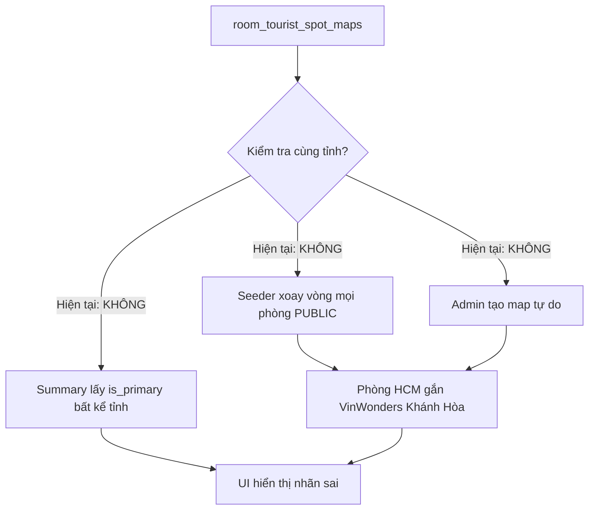

# Kế hoạch: Đồng bộ địa lý phòng ↔ điểm du lịch (tránh mâu thuẫn vị trí)

## 1. Thông tin kế hoạch

| Mục | Nội dung |
|-----|----------|
| **Mã plan** | PLAN-RTM-GEO-008 |
| **Ngày** | 2026-05-29 |
| **Trạng thái** | Implemented (2026-05-29) |
| **Phụ thuộc** | [plan_007](plan_007_homepage_suggested_rooms_by_tourist_spot.md), [plan_004](plan_004.md) |
| **Tài liệu nghiệp vụ** | [tourist-spot-display-and-travel-time.md](../../../docs/features/tourist-spot-display-and-travel-time.md) |

---

## 2. Vấn đề (bug hiện tại)

**Triệu chứng:** Thẻ phòng ghi địa chỉ **Quận 7, TP. Hồ Chí Minh** nhưng nhãn du lịch hiển thị **VinWonders Nha Trang · 14 phút di chuyển** — vô lý về địa lý (~450 km).

**Ảnh hưởng:**

| Màn hình | Hậu quả |
|----------|---------|
| Card phòng (home, search, carousel) | Khách hiểu sai “gần” điểm du lịch |
| Tab homepage theo điểm | Phòng sai tỉnh lọt vào tab Nha Trang, Sa Pa, … |
| Chi tiết phòng | Khối “Khoảng cách tới điểm du lịch” liệt kê điểm không cùng vùng |
| Niềm tin sản phẩm | Giảm độ tin cậy nội dung |

---

## 3. Nguyên nhân gốc



| # | Lớp | Thiếu sót |
|---|-----|-----------|
| 1 | **Dữ liệu** | `tourist_spots` chỉ có `region_label` (text), **không có `province_id`** FK → khó validate máy |
| 2 | **Seeder dev** | `RoomTouristSpotMapsTableSeeder` gán **12 phòng / spot** bằng round-robin toàn bộ phòng PUBLIC, **không lọc `properties.province_id`** |
| 3 | **API hiển thị** | `RoomTouristSummaryService` lấy primary map **không lọc theo tỉnh phòng** |
| 4 | **API homepage** | `getSuggestedRoomsByTouristSpot` join map nhưng **không** `WHERE property.province_id = spot.province_id` |
| 5 | **Admin** | Tạo/sửa map **chưa** reject gắn chéo tỉnh |

---

## 4. Nguyên tắc nghiệp vụ (sau khi sửa)

> **Một phòng chỉ được coi là “gần” một điểm du lịch khi tài sản (property) của phòng thuộc cùng tỉnh/thành với điểm đó.**

| Quy tắc | Chi tiết |
|---------|----------|
| **Ràng buộc chính** | `properties.province_id` = `tourist_spots.province_id` mới được lưu map và hiển thị |
| **Primary** | `is_primary` chỉ chọn trong các map **hợp lệ** cùng tỉnh |
| **Không có map hợp lệ** | `has_tourist_mapping = false` — ẩn nhãn (giống SRS fallback) |
| **Thời gian di chuyển** | Vẫn do Ops nhập; không đổi (không GPS) |
| **Ngoài phạm vi MVP** | Gợi ý “điểm xa nhưng bay tới” (multi-province tour) — phase sau nếu cần |

**Ví dụ hợp lệ sau sửa:**

| Phòng (tỉnh) | Điểm được gắn / hiển thị |
|--------------|---------------------------|
| Hồ Chí Minh | Chợ Bến Thành, Nhà thờ Đức Bà, … |
| Khánh Hòa | VinWonders Nha Trang, Tháp Bà Ponagar, … |
| Đà Nẵng | Bà Nà Hill, Ngũ Hành Sơn, … |

---

## 5. Giải pháp đề xuất (theo phase)

### Phase 1 — Schema & master data (nền tảng)

**Mục tiêu:** Mỗi điểm du lịch gắn chặt một `province_id`.

| Task | Mô tả |
|------|--------|
| 1.1 | Migration: thêm `tourist_spots.province_id` (FK `provinces`, nullable → backfill → NOT NULL) |
| 1.2 | Backfill: map `region_label` → `provinces.name` (bảng alias nếu cần: `Huế`→id 20, `Hồ Chí Minh`→28, …) |
| 1.3 | Cập nhật `TouristSpotsTableSeeder` + Admin form/API: bắt buộc chọn tỉnh |
| 1.4 | Cập nhật `docs/databases_docs/` |

**Deliverable:** Spot MVP có `province_id` rõ ràng.

---

### Phase 2 — Lọc hiển thị & truy vấn (sửa triệu chứng nhanh)

**Mục tiêu:** Dù DB còn map sai, UI/API **không** hiển thị map chéo tỉnh.

| Task | File / vùng |
|------|-------------|
| 2.1 | `RoomTouristSummaryService`: load `room_id → province_id`; lọc maps chỉ giữ spot cùng `province_id`; build summary từ tập đã lọc | 
| 2.2 | `RoomsRepository::getSuggestedRoomsByTouristSpot`: thêm `whereColumn` / `where('p.province_id', ts.province_id)` |
| 2.3 | `TouristSpotSlug` filter (search): join thêm điều kiện cùng tỉnh |
| 2.4 | Unit test: phòng HCM + map Nha Trang → summary `has_tourist_mapping: false` |

**Có thể ship Phase 2 trước Phase 1** nếu tạm match `region_label` với `provinces.name` qua helper — nhưng **khuyến nghị làm Phase 1 trước** để Admin/seed nhất quán.

---

### Phase 3 — Validation Admin & dọn dữ liệu

| Task | Mô tả |
|------|--------|
| 3.1 | Form request tạo/sửa `room_tourist_spot_maps`: 422 nếu `room.property.province_id !== spot.province_id` |
| 3.2 | Artisan `tourist-spots:prune-invalid-maps` (dry-run + `--force`): xóa map chéo tỉnh |
| 3.3 | Chạy prune trên dev/staging trước production |
| 3.4 | Cập nhật [homepage-tourist-spot-mapping-checklist.md](../ops/homepage-tourist-spot-mapping-checklist.md): “**Bắt buộc cùng tỉnh với phòng**” |

---

### Phase 4 — Sửa seeder dev

| Task | Mô tả |
|------|--------|
| 4.1 | `RoomTouristSpotMapsTableSeeder`: với mỗi slug MVP, chỉ lấy phòng có `properties.province_id = tourist_spots.province_id` |
| 4.2 | Nếu không đủ 12 phòng / spot: log warning; không gán phòng tỉnh khác |
| 4.3 | Doc dev: chạy lại seed sau khi có đủ phòng PUBLIC theo tỉnh |

---

### Phase 5 — QA & tài liệu

| Task | Mô tả |
|------|--------|
| 5.1 | Test case mới trong `testcase_004` hoặc file GEO: TC-GEO-001 chéo tỉnh bị chặn |
| 5.2 | Cập nhật [tourist-spot-display-and-travel-time-technical.md](../../../docs/features/tourist-spot-display-and-travel-time-technical.md) mục ràng buộc tỉnh |
| 5.3 | Cập nhật overview FAQ: “Vì sao phòng tôi không hiện điểm du lịch?” → chưa có map cùng tỉnh |

---

## 6. Tiêu chí nghiệm thu (Acceptance)

- [ ] Phòng **Quận 7, TP.HCM** không còn hiển thị VinWonders Nha Trang (trừ khi có map HCM hợp lệ làm primary).
- [ ] Tab homepage **VinWonders Nha Trang** chỉ còn phòng tỉnh **Khánh Hòa** (hoặc tỉnh khớp `province_id` spot).
- [ ] Search `?tourist_spot_slug=vinwonders-nha-trang` không trả phòng HCM.
- [ ] Admin không tạo được map chéo tỉnh (422 + message tiếng Việt rõ).
- [ ] Seeder dev không tạo map chéo tỉnh.
- [ ] Regression: phòng Đà Nẵng + Bà Nà Hill vẫn hiển thị đúng nhãn và thời gian.

---

## 7. Ước lượng effort (tham khảo)

| Phase | Effort |
|-------|--------|
| 1 Schema + backfill | 0.5–1 ngày |
| 2 Lọc API/summary | 1 ngày |
| 3 Admin + prune | 0.5 ngày |
| 4 Seeder | 0.25 ngày |
| 5 QA + docs | 0.5 ngày |
| **Tổng** | **~2.5–3 ngày dev** |

---

## 8. Rủi ro & giảm thiểu

| Rủi ro | Giảm thiểu |
|--------|------------|
| `region_label` không khớp `provinces.name` | Bảng alias khi backfill; review list 33 spot trong seeder |
| Sau prune, tab homepage < 4 phòng | Ops bổ sung map đúng tỉnh; checklist tỉnh |
| Production đã có map tay sai | Chạy prune dry-run trước; backup bảng maps |
| Điểm vùng biên (Sa Pa / Lào Cai) | Spot `province_id` = Lào Cai; phòng phải property tỉnh Lào Cai |

---

## 9. Thứ tự triển khai khuyến nghị

```text
Phase 1 (province_id) → Phase 2 (lọc API) → Phase 3 (admin + prune) → Phase 4 (seeder) → Phase 5 (QA)
```

**Hotfix tối thiểu (1 ngày):** chỉ Phase 2 + 4 + prune dev — đủ demo/staging; production cần thêm Phase 1 + 3.

---

## 10. Việc không làm trong plan này

- Tính khoảng cách thật từ GPS / Google Maps
- Tự suy ra `travel_time_minutes` từ km
- Gợi ý điểm “ở tỉnh khác nhưng hấp dẫn” trên cùng card phòng

---

## 11. Lịch sử

| Ngày | Ghi chú |
|------|---------|
| 2026-05-29 | Tạo plan sau báo lỗi phòng HCM hiển thị VinWonders Nha Trang |
