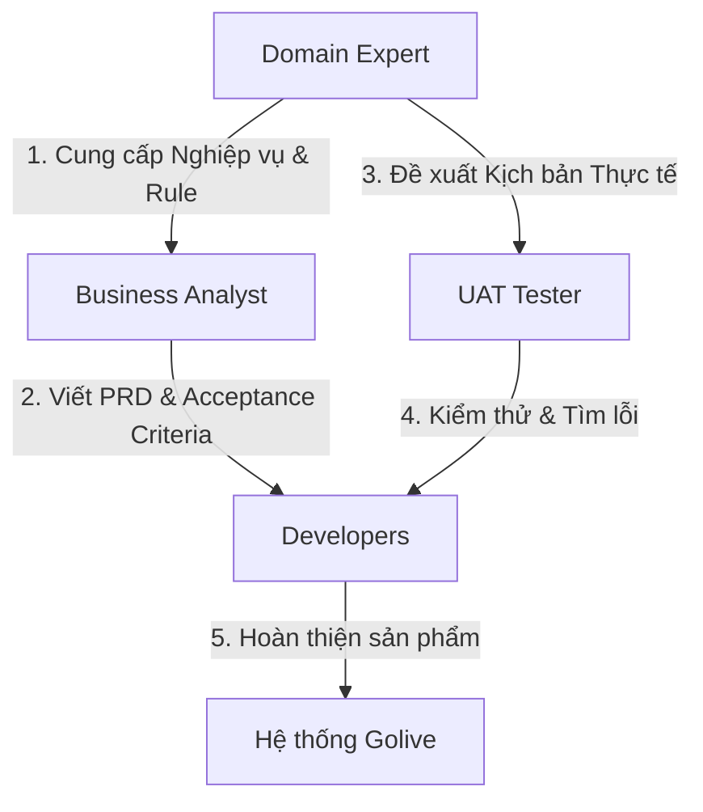

# Domain Reports (Báo cáo Nghiệp vụ Lưu trú)

Thư mục này chứa các báo cáo, đánh giá nghiệp vụ và đề xuất từ góc nhìn chuyên gia ngành Dịch vụ Lưu trú & Khách sạn (Hospitality & Accommodation Domain Expert).

## Mục tiêu
Đảm bảo các tính năng được phát triển trên hệ thống `bks-system` hoạt động đúng chuẩn nghiệp vụ thực tế của ngành khách sạn, mang lại trải nghiệm tối ưu cho khách lưu trú (guest) và đối tác vận hành (host/property manager), đồng thời phòng ngừa các rủi ro vận hành (overbooking, lỗi tính giá, mâu thuẫn chính sách hủy phòng).

## Quy trình phối hợp (Collaboration Workflow)

1. **Phối hợp với BA (Business Analyst)**:
   - Chuyên gia Nghiệp vụ cung cấp các quy tắc ngành (Business Rules) như: khung giờ check-in/check-out tiêu chuẩn, quy định Night Audit, quy trình đồng bộ phòng (OTA Channel Sync), cơ chế phân bổ phòng vật lý.
   - BA chuyển hóa các quy tắc này thành tài liệu PRD chi tiết với User Stories và Acceptance Criteria cụ thể.
   - Chuyên gia Nghiệp vụ review lại PRD để đảm bảo không sai lệch thực tế trước khi Dev bắt đầu lập trình.

2. **Phối hợp với UAT Tester (Kiểm thử chấp nhận người dùng)**:
   - Chuyên gia Nghiệp vụ định hình các luồng trải nghiệm khách hàng thực tế và đề xuất bộ dữ liệu kiểm thử thực tế (ví dụ: giá phòng thay đổi theo mùa, đặt phòng sát giờ, phòng ghép/phòng phụ).
   - UAT Tester thực hiện kiểm thử hệ thống dựa trên kịch bản này để phát hiện lỗi giao diện, trải nghiệm (UX) và nghiệp vụ chưa đồng bộ.
   - Chuyên gia Nghiệp vụ cùng UAT Tester phân loại mức độ nghiêm trọng của lỗi ảnh hưởng tới kinh doanh để quyết định Go/No-Go.

## Báo cáo đã phát hành

| Tài liệu | Mô tả |
|----------|--------|
| [domain_review_admin_revenue_reconciliation.md](./domain_review_admin_revenue_reconciliation.md) | Luồng đối soát doanh thu Admin — phân tích DB, Model A (Partner nộp phí 5% theo kỳ), edge cases & giải pháp |
| [domain_review_online_deposit.md](./domain_review_online_deposit.md) | Nghiệp vụ đặt cọc online — phân tích luồng đặt cọc qua hệ thống (escrow) vs ngoài hệ thống (direct), sơ đồ trạng thái cọc, schema DB đề xuất & xử lý tranh chấp |

## Định dạng tài liệu báo cáo
Các tài liệu đánh giá nghiệp vụ lưu trú được lưu dưới định dạng: `domain_review_[tên_tính_năng].md`.

Nội dung báo cáo tuân thủ cấu trúc:
1. **Tóm tắt Nghiệp vụ (Executive Summary)**: Khuyến nghị sẵn sàng vận hành (Approved / Conditionally Approved / Rejected).
2. **Quy tắc Nghiệp vụ áp dụng (Hospitality Business Rules & Standards)**: Chi tiết chính sách đặt/hủy phòng, giá, trạng thái phòng, liên kết danh lam thắng cảnh.
3. **Phân tích Khoảng trống Nghiệp vụ (Gap Analysis)**: Các rủi ro vận hành hoặc điểm nghẽn nghiệp vụ và giải pháp xử lý.
4. **Hành động phối hợp tiếp theo (Collaboration Action Items)**: Giao việc bổ sung spec cho BA và kịch bản test cụ thể cho UAT.
