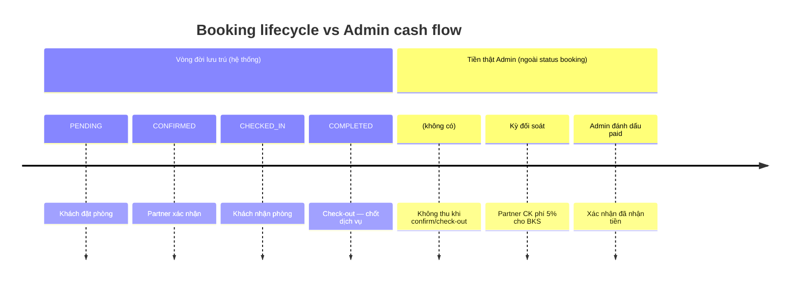
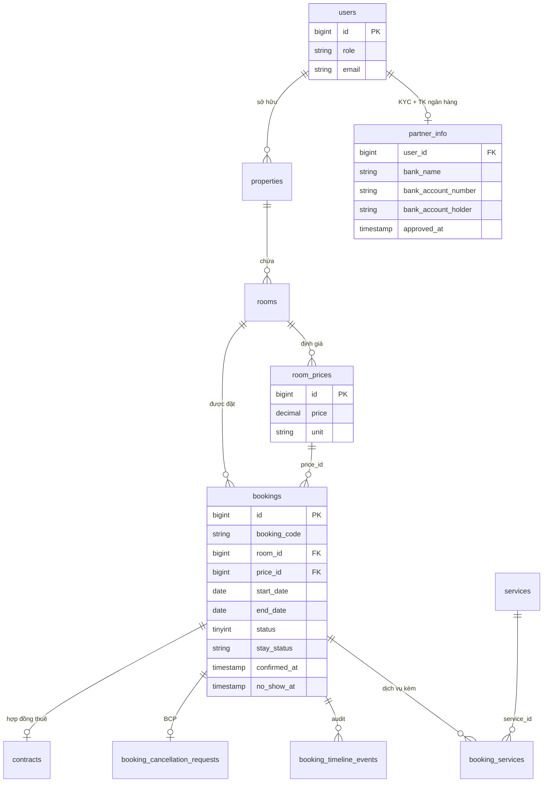
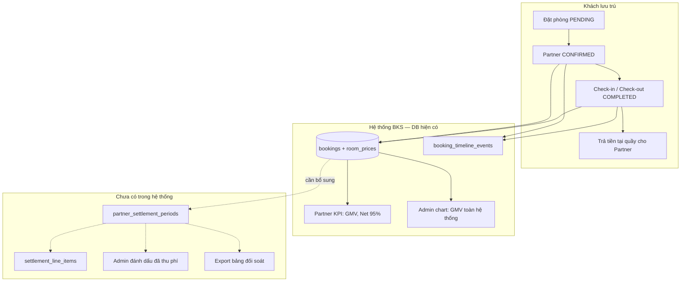
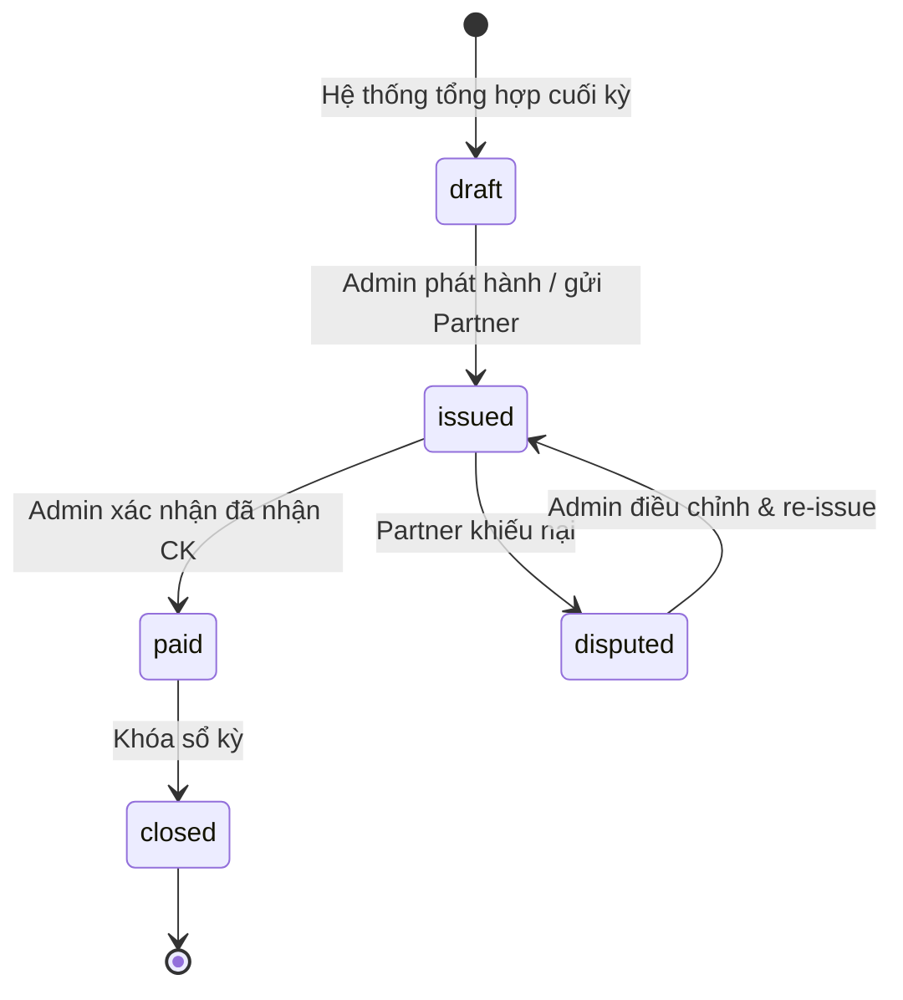
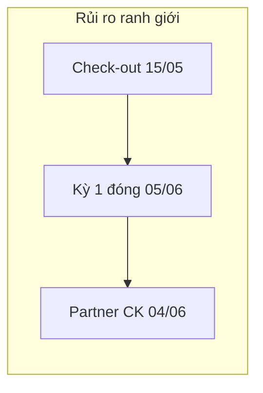

# Domain Review: Luồng Đối Soát Doanh Thu Admin

## Mục lục

1. [Executive Summary](#executive-summary)
2. [Bối cảnh nghiệp vụ lưu trú](#1-bối-cảnh-nghiệp-vụ-lưu-trú)
   - [1.1 Mô hình kinh doanh đã chốt](#11-mô-hình-kinh-doanh-đã-chốt)
   - [1.2 Ba dòng thời gian cần tách bạch](#12-ba-dòng-thời-gian-cần-tách-bạch)
3. [Phân tích luồng đối soát dựa trên database hiện tại](#2-phân-tích-luồng-đối-soát-dựa-trên-database-hiện-tại)
   - [2.1 Sơ đồ quan hệ dữ liệu](#21-sơ-đồ-quan-hệ-dữ-liệu-liên-quan-doanh-thu)
   - [2.2 Bảng lõi và vai trò trong đối soát](#22-bảng-lõi-và-vai-trò-trong-đối-soát)
   - [2.3 Công thức GMV đang chạy trên code](#23-công-thức-gmv-đang-chạy-trên-code)
   - [2.4 Luồng đối soát Admin — hiện trạng](#24-luồng-đối-soát-admin--hiện-trạng-thực-tế)
   - [2.5 Mâu thuẫn copy/UI](#25-mâu-thuẫn-copyui-cần-xử-lý-rủi-ro-tranh-chấp-partner)
4. [Quyết định mô hình tối ưu](#3-quyết-định-mô-hình-tối-ưu)
   - [3.1 So sánh ba mô hình thu phí](#31-so-sánh-ba-mô-hình-thu-phí)
   - [3.2 Model A — Periodic Partner Remittance](#32-mô-hình-được-chốt-model-a--periodic-partner-remittance)
   - [3.3 Thiết kế nghiệp vụ Model A](#33-thiết-kế-nghiệp-vụ-model-a-chi-tiết-vận-hành)
5. [Schema đề xuất bổ sung](#4-schema-đề-xuất-bổ-sung-căn-chỉnh-db-hiện-tại)
6. [Hospitality Business Rules & Standards](#5-hospitality-business-rules--standards)
7. [Gap Analysis](#6-gap-analysis-domain-perspective)
8. [Collaboration Action Items](#7-collaboration-action-items)
9. [Edge Cases & Giải pháp](#8-edge-cases--giải-pháp)
   - [8.1 Tiêu cực — vận hành / dữ liệu](#81-tiêu-cực--vận-hành--dữ-liệu)
   - [8.2 Nhầm lẫn — con người / UI / KPI](#82-nhầm-lẫn--con-người--ui--kpi)
   - [8.3 Cố tính — gian lận Partner](#83-cố-tính--gian-lận-partner)
   - [8.4 Cố tính / lỗi phía Admin](#84-cố-tính--lỗi-phía-admin)
   - [8.5 Ranh giới thời gian & đồng thời](#85-ranh-giới-thời-gian--đồng-thời)
   - [8.6 Rule chốt hàng](#86-rule-chốt-hàng-đề-xuất)
   - [8.7 Ma trận ưu tiên triển khai](#87-ma-trận-ưu-tiên-triển-khai-giải-pháp)
10. [Tóm tắt quyết định](#9-tóm-tắt-quyết-định)

---

## Executive Summary

- **Domain Recommendation**: **CONDITIONALLY APPROVED (Needs Business Rule Updates)**
- **Summary**: Hệ thống BKS đã có nền tảng dữ liệu đủ để tính GMV và hoa hồng 5% theo mô hình **commission-only** (khách trả tại quầy, Partner giữ tiền phòng, BKS thu phí nền tảng). Tuy nhiên, **chưa có luồng đối soát tài chính thực sự** — Admin chỉ xem biểu đồ GMV toàn hệ thống, không có kỳ quyết toán, không có sổ công nợ Partner, không có trạng thái “đã thu phí”. Mô hình tối ưu cho giai đoạn hiện tại là **Đối soát định kỳ — Partner nộp phí (Model A)**, chu kỳ **ngày 05 và 20 hàng tháng**, căn cứ booking **`COMPLETED`** (loại no-show/cancel), bổ sung bảng ledger đối soát. Cần chốt rule nghiệp vụ trước khi triển khai module Admin “Đối soát Partner”.

---

## 1. Bối cảnh nghiệp vụ lưu trú

### 1.1 Mô hình kinh doanh đã chốt

| Hạng mục | Quyết định |
|----------|------------|
| Vai trò BKS (Admin) | Nền tảng môi giới — **không** bán phòng, **không** giữ tiền khách |
| Vai trò Partner | Chủ/vận hành cơ sở — **nhận tiền phòng trực tiếp** từ khách tại quầy |
| Doanh thu Admin | **Hoa hồng 5%** trên GMV booking đủ điều kiện |
| Phương thức thu phí | Partner **chuyển khoản phí** cho BKS theo **kỳ đối soát** |
| Thanh toán online khách | **Out of scope** — chưa có payment gateway |

Đây là mô hình phổ biến của các OTA giai đoạn đầu tại Việt Nam (tương tự Agoda/Traveloka trước khi bật thu hộ), phù hợp khi khách quen **trả tại quầy** và Partner muốn giữ dòng tiền trực tiếp.

### 1.2 Ba dòng thời gian cần tách bạch



**Quy tắc vàng:** `COMPLETED` = chốt nghiệp vụ lưu trú, **không phải** “Admin nhận tiền”. Tiền phí nền tảng là **khoản Partner nợ BKS**, thu tại **kỳ đối soát**.

---

## 2. Phân tích luồng đối soát dựa trên database hiện tại

### 2.1 Sơ đồ quan hệ dữ liệu liên quan doanh thu



### 2.2 Bảng lõi và vai trò trong đối soát

| Bảng | Vai trò trong đối soát | Trạng thái hiện tại |
|------|------------------------|---------------------|
| **`bookings`** | Nguồn sự thật GMV — `status`, `stay_status`, `start_date`, `price_id` | ✅ Có đủ cột vận hành |
| **`room_prices`** | Tính tiền phòng theo `unit` (day/month) × số đêm | ✅ Đang dùng trong KPI |
| **`rooms` → `properties` → `users`** | Chuỗi ownership: xác định Partner sở hữu booking | ✅ Index đủ cho aggregate theo Partner |
| **`booking_services` + `services`** | Doanh thu dịch vụ đính kèm (minibar, đưa đón…) | ⚠️ Có bảng nhưng **chưa** cộng vào GMV KPI/Admin chart |
| **`partner_info`** | TK ngân hàng Partner (thụ hưởng payout — phase sau) | ✅ Thu thập lúc onboarding |
| **`booking_timeline_events`** | Audit: confirm, check-in/out, no-show, cancel | ✅ Phục vụ tra soát tranh chấp |
| **`booking_cancellation_requests`** | Yêu cầu hủy — ảnh hưởng eligibility | ✅ BCP đã ship |
| **`payments` / `partner_settlement_periods`** | Ledger tài chính, kỳ đối soát | ❌ **Chưa có** |

### 2.3 Công thức GMV đang chạy trên code

Hệ thống tính GMV từ `bookings` JOIN `room_prices`:

```
GMV_booking = room_prices.price × số_đêm   (unit = 'day')
            = room_prices.price × số_đêm/30 (unit = 'month')

Commission = GMV × 5%
Net_Revenue (Partner) = GMV × 95%
```

**Nguồn code:** `BookingRepository::getRevenueByMonth`, `getRevenueByMonthForPartner`, `PartnerKpiService::COMMISSION_RATE = 0.05`.

**Điều kiện status hiện tại (code):**

| `bookings.status` | Mã | Tính GMV/KPI? |
|-------------------|-----|---------------|
| PENDING | 0 | Không |
| CONFIRMED | 1 | **Có** |
| CANCELLED | 2 | Không |
| COMPLETED | 3 | **Có** |
| PENDING_CANCELLATION | 4 | Không (KPI revenue); **Có** (occupancy chart) |

**Lưu ý nghiệp vụ:** Với mô hình “trả tại quầy”, tính commission khi `CONFIRMED` (trước khi khách thực sự trả tiền) tạo **rủi ro công nợ ảo** — Partner có thể no-show hoặc khách không trả quầy nhưng dashboard đã hiển thị Net Revenue.

### 2.4 Luồng đối soát Admin — hiện trạng thực tế



**Kết luận phân tích:** Admin **không có** luồng đối soát end-to-end. Chỉ có:
- Biểu đồ `GET /admin/dashboard/revenue-per-month` — thực chất là **GMV**, không phải Platform Commission.
- Partner Approval thẩm định TK ngân hàng — phục vụ **chuẩn bị** đối soát, chưa kích hoạt quy trình.
- Partner Finance hiển thị commission/net từ analytics API — **chưa** có lịch sử kỳ đối soát hay trạng thái nộp phí.

### 2.5 Mâu thuẫn copy/UI cần xử lý (rủi ro tranh chấp Partner)

| Vị trí | Nội dung UI | Tỷ lệ chính thức |
|--------|-------------|------------------|
| `PartnerKpiService` / docs | Hoa hồng nền tảng | **5%** |
| `BecomeAPartner/index.tsx` | FAQ “trừ 10%” | 10% ❌ |
| `PartnerOnboardingWizard.tsx` | Hợp đồng “chiết khấu 12%” | 12% ❌ |
| Hợp đồng mẫu | Quyết toán ngày **05** và **20** | ✅ Khớp chuẩn ngành |

---

## 3. Quyết định mô hình tối ưu

### 3.1 So sánh ba mô hình thu phí

| Mô hình | Mô tả | Payment gateway | Phù hợp BKS hiện tại |
|---------|--------|-----------------|----------------------|
| **A. Đối soát định kỳ — Partner nộp phí** | BKS xuất bảng kỳ; Partner CK 5% | Không cần | ✅ **Chọn** |
| B. Khấu trừ khi thu hộ | BKS giữ GMV, trả 95% Partner | Bắt buộc | Phase sau |
| C. Ví nội bộ Partner | Trừ tự động từ ví | Cần ledger + nạp ví | Không phù hợp giai đoạn MVP |

### 3.2 Mô hình được chốt: **Model A — Periodic Partner Remittance**

**Lý do chọn (góc nhìn chuyên gia lưu trú):**

1. **Khớp dòng tiền thực tế:** Khách trả Partner tại quầy — tiền không đi qua BKS; BKS không thể khấu trừ trực tiếp.
2. **Chuẩn ngành cho homestay/apartment VN:** Host quen giữ 100% tiền phòng, nộp phí nền tảng theo kỳ (tương tự Airbnb Host Service Fee invoicing ở một số thị trường, hoặc Booking.com invoice model cho property chưa kết nối payment).
3. **Rủi ro triển khai thấp:** Không cần payment gateway, webhook, escrow — phù hợp scope đồ án hiện tại.
4. **Khớp hợp đồng onboarding:** Chu kỳ ngày 05 và 20 đã có trong UI hợp đồng điện tử.

### 3.3 Thiết kế nghiệp vụ Model A (chi tiết vận hành)

#### Chu kỳ đối soát

| Kỳ | Phạm vi booking | Ngày phát hành bảng kê | Hạn Partner nộp phí |
|----|-----------------|------------------------|---------------------|
| Kỳ 1 | Ngày 01–15 tháng T | Ngày **05** tháng T+1 | +7 ngày làm việc |
| Kỳ 2 | Ngày 16–cuối tháng T | Ngày **20** tháng T+1 | +7 ngày làm việc |

*Ví dụ:* Booking check-out 12/05/2026 → vào kỳ 01–15/05, phát hành 05/06/2026.

#### Điều kiện đưa booking vào kỳ đối soát (rule chặt — khuyến nghị)

| Điều kiện | Rule |
|-----------|------|
| `bookings.status` | **`COMPLETED` (3)** only |
| `stay_status` | **`checked_out`** — loại `no_show` |
| `no_show_at` | **NULL** |
| Thời điểm ghi nhận | **`end_date`** (ngày check-out) nằm trong `[period_start, period_end]` |
| Cancel / pending cancel | **Loại** |
| GMV | Phòng (`room_prices`) + dịch vụ (`booking_services` × `services.price`) |
| Commission | `GMV × 5%` (config `billing.commission_rate`) |

**Khác biệt so code hiện tại:** KPI/dashboard đang tính từ `CONFIRMED` — **đối soát phải chặt hơn KPI vận hành** để tránh tranh chấp công nợ.

#### Trạng thái kỳ đối soát



#### Vai trò Admin trong luồng

| Bước | Hành động Admin | Dữ liệu căn cứ |
|------|-----------------|----------------|
| 1 | Xem dashboard **Platform Commission MTD** (GMV × 5%) | Aggregate `bookings` |
| 2 | Mở màn **Đối soát Partner** — danh sách kỳ `draft/issued/paid` | `partner_settlement_periods` |
| 3 | Review line items — drill-down `booking_code`, GMV, commission | `settlement_line_items` |
| 4 | Phát hành bảng kê (`issued`) — export PDF/Excel gửi Partner | + email notification |
| 5 | Đối chiếu sao kê ngân hàng BKS | Ngoài hệ thống |
| 6 | Đánh dấu **`paid`** + `paid_at`, `payment_reference` | Cập nhật settlement |
| 7 | Xử lý `disputed` — tra `booking_timeline_events` | Audit trail |

---

## 4. Schema đề xuất bổ sung (căn chỉnh DB hiện tại)

### 4.1 Bảng `partner_settlement_periods`

| Cột | Kiểu | Mô tả nghiệp vụ |
|-----|------|-----------------|
| `id` | bigint PK | |
| `partner_id` | FK → `users.id` | Partner được đối soát |
| `period_start` / `period_end` | date | Biên kỳ (vd. 2026-05-01 → 2026-05-15) |
| `issue_date` | date | Ngày phát hành (05 hoặc 20) |
| `total_gmv` | decimal(15,2) | Tổng GMV line items |
| `total_commission` | decimal(15,2) | `total_gmv × rate` |
| `commission_rate` | decimal(5,4) | Snapshot 0.0500 tại thời điểm issue |
| `status` | enum | `draft`, `issued`, `paid`, `disputed`, `closed` |
| `issued_at` | timestamp nullable | |
| `paid_at` | timestamp nullable | Ngày Admin xác nhận nhận tiền |
| `payment_reference` | varchar(100) nullable | Mã giao dịch CK Partner |
| `issued_by` / `confirmed_by` | FK → users.id | Admin thao tác |
| `note` | text nullable | Ghi chú điều chỉnh |

**Unique:** `(partner_id, period_start, period_end)`.

### 4.2 Bảng `settlement_line_items`

| Cột | Kiểu | Mô tả |
|-----|------|-------|
| `id` | bigint PK | |
| `settlement_period_id` | FK | |
| `booking_id` | FK → bookings.id | |
| `booking_code` | varchar(32) | Denormalize tra cứu |
| `checkout_date` | date | = `bookings.end_date` |
| `room_gmv` | decimal(15,2) | Tiền phòng |
| `services_gmv` | decimal(15,2) | Dịch vụ kèm |
| `total_gmv` | decimal(15,2) | |
| `commission_amount` | decimal(15,2) | |
| `snapshot_status` | tinyint | Status tại thời điểm chốt kỳ |

### 4.3 Cột tuỳ chọn trên `bookings` (P2)

| Cột | Mục đích |
|-----|----------|
| `payment_collected_at` | Partner xác nhận “đã thu tiền khách tại quầy” — tăng độ tin cậy trước khi vào kỳ |
| `settlement_period_id` | Gắn booking đã chốt kỳ — tránh double-count |

### 4.4 Config

```php
// config/billing.php (đề xuất)
'commission_rate' => 0.05,
'settlement_issue_days' => [5, 20],
'settlement_payment_due_days' => 7,
'eligible_booking_statuses' => ['completed'],
'exclude_stay_statuses' => ['no_show'],
```

---

## 5. Hospitality Business Rules & Standards

### 5.1 Booking & Reservation Logic

- **Night Audit alignment:** Booking chỉ vào kỳ đối soát khi **check-out hoàn tất** (`COMPLETED` + `stay_status = checked_out`) — tương đương chốt doanh thu phòng trong Night Audit khách sạn.
- **No-show:** Partner đánh dấu no-show → **không** tính GMV/commission (khách không ở, thường không trả hoặc chỉ trả phí phạt ngoài hệ thống).
- **Pending cancellation:** Giữ phòng nhưng **chưa chốt** — không đưa vào kỳ cho đến khi approve hủy (loại) hoặc complete (tính).
- **Tra soát tranh chấp:** Mọi điều chỉnh phải tham chiếu `booking_timeline_events` và `booking_code`.

### 5.2 Pricing & Revenue Management

- **GMV đầy đủ:** Phòng + dịch vụ đính kèm — tránh thiếu ADR thực tế khi Partner bán add-on tại quầy qua hệ thống.
- **Đơn thuê tháng (`unit = month`):** Giữ công thức prorate theo số ngày/30 như code hiện tại; ghi chú trên bảng kê để Partner hiểu.
- **ADR / RevPAR trên Admin:** Dùng cho insight, **không** thay thế commission ledger.

### 5.3 Property & Partner Operations

- **KYC trước đối soát:** Chỉ Partner có `partner_info.approved_at IS NOT NULL` mới phát hành kỳ `issued`.
- **TK ngân hàng:** `partner_info.bank_*` dùng cho **payout phase sau**; hiện tại Partner **chuyển vào** TK công ty BKS (cấu hình Admin, không lưu trong `partner_info`).
- **Hợp đồng:** Tỷ lệ 5% phải đồng bộ trên toàn bộ touchpoint (onboarding, FAQ, PDF).

### 5.4 Lộ trình chuyển sang Model B (khi có payment online)

Khi triển khai Stripe/VNPay:
- Tiền khách → BKS trước → khấu trừ 5% → payout 95% Partner.
- Bảng `partner_settlement_periods` **vẫn dùng được** — đổi nguồn `paid` từ “Partner nộp phí” sang “BKS payout net”.
- Thêm bảng `payments` + webhook idempotency.

---

## 6. Gap Analysis (Domain Perspective)

### 6.1 Không có ledger đối soát — Admin vận hành “mù” tiền thu lời

- **Business Risk:** Admin không biết Partner nào đã nộp phí 5%, dễ mất doanh thu nền tảng, khó thu hồi công nợ.
- **Domain Recommendation:** Triển khai `partner_settlement_periods` + màn Admin Đối soát theo Model A.

### 6.2 Admin dashboard nhầm GMV với doanh thu BKS

- **Business Risk:** Ban lãnh đạo đọc sai KPI — tưởng toàn bộ cột “Doanh thu theo tháng” là tiền vào BKS.
- **Domain Recommendation:** Tách metric **Platform Commission** (= GMV × 5%) trên Admin Dashboard; đổi label GMV chart thành “GMV hệ thống”.

### 6.3 Rule tính commission lệch giữa KPI và đối soát

- **Business Risk:** Partner thấy Net Revenue MTD cao (tính từ CONFIRMED) nhưng bảng đối soát thấp hơn (chỉ COMPLETED) → mất niềm tin.
- **Domain Recommendation:** KPI vận hành có thể giữ CONFIRMED cho “dự báo”; **Finance/Đối soát** bắt buộc COMPLETED-only; UI ghi rõ “Ước tính” vs “Đã chốt kỳ”.

### 6.4 GMV thiếu dịch vụ đính kèm

- **Business Risk:** Partner bán dịch vụ qua app nhưng commission không tính → thất thu phí nền tảng.
- **Domain Recommendation:** Cộng `booking_services` vào công thức GMV cho cả KPI và settlement.

### 6.5 Copy hợp đồng lệch 5% / 10% / 12%

- **Business Risk:** Tranh chấp pháp lý với Partner; UAT/onboarding fail acceptance.
- **Domain Recommendation:** P0 — đồng bộ toàn bộ copy về **5%** trước khi mở module đối soát.

### 6.6 Không có cờ “đã thu tiền tại quầy”

- **Business Risk:** Commission trên đơn khách không trả quầy (no-show im lặng).
- **Domain Recommendation:** P2 — `payment_collected_at` do Partner xác nhận khi check-in/check-out; optional gate trước settlement.

---

## 7. Collaboration Action Items

### 7.1 For Business Analyst (BA)

1. Viết SRS **Admin Revenue Reconciliation** với user stories:
   - Admin xem Platform Commission MTD/YTD
   - Admin tạo/phát hành/đóng kỳ đối soát theo Partner
   - Admin drill-down line item theo `booking_code`
   - Admin đánh dấu `paid` + mã tham chiếu CK
2. Chốt acceptance criteria rule **COMPLETED-only** cho settlement (khác KPI forecast).
3. Cập nhật `docs/features/admin-partner-revenue-and-commission.md` khi schema settlement được approve.
4. Đồng bộ copy 5% trên onboarding/FAQ/hợp đồng — acceptance: không còn 10%/12% trên UI Partner.

### 7.2 For UAT Tester

| # | Kịch bản thực tế | Kết quả mong đợi |
|---|------------------|------------------|
| UAT-REC-01 | Partner A: 3 booking COMPLETED check-out 10–14/05; 1 CONFIRMED chưa check-out; 1 no-show | Kỳ 01–15/05 chỉ có **3 line items** |
| UAT-REC-02 | Booking COMPLETED 16/05; phát hành kỳ 16–31/05 ngày 20/06 | Line item checkout_date = 16/05 |
| UAT-REC-03 | Booking có `booking_services` (giặt ủi 200k) | GMV = phòng + 200k; commission 5% trên tổng |
| UAT-REC-04 | Partner khiếu nại sai GMV — Admin mở timeline | `booking_timeline_events` khớp trạng thái check-out |
| UAT-REC-05 | Admin đánh dấu `paid` với `payment_reference` | Kỳ chuyển `paid`, không double-count kỳ sau |
| UAT-REC-06 | So sánh Admin Platform Commission vs tổng `settlement_line_items.commission` | Khớp ± làm tròn |
| UAT-REC-07 | Partner chưa `approved_at` | Không phát hành kỳ `issued` |

### 7.3 For Technical Lead / Dev (tham chiếu, không thay SRS)

- Migration P1: `partner_settlement_periods`, `settlement_line_items`
- Job scheduler: auto-generate `draft` sau ngày 05/20
- API Admin: list/issue/confirm-paid/export
- Tách query settlement khỏi `getRevenueByMonth` — không tái sử dụng filter CONFIRMED

---

## 8. Edge Cases & Giải pháp

Phần này liệt kê các tình huống **tiêu cực**, **nhầm lẫn** và **cố tính** có thể phát sinh trong luồng đối soát Model A, kèm giải pháp nghiệp vụ và gợi ý kỹ thuật căn chỉnh schema đã đề xuất ở [mục 4](#4-schema-đề-xuất-bổ-sung-căn-chỉnh-db-hiện-tại).

### 8.1 Tiêu cực — vận hành / dữ liệu

| # | Edge case | Hậu quả | Giải pháp |
|---|-----------|---------|-----------|
| A1 | **No-show nhưng Partner vẫn check-out COMPLETED** (quên đánh dấu no-show) | Tính commission trên đơn khách không ở / không trả quầy | Rule settlement: loại `no_show_at IS NOT NULL` hoặc `stay_status = no_show`. Bắt buộc check-in trước check-out; cảnh báo nếu check-out mà chưa `checked_in`. Audit `booking_timeline_events`. |
| A2 | **Khách trả quầy nhưng Partner không check-out** (đơn kẹt CONFIRMED qua kỳ) | Không vào bảng đối soát → BKS mất phí; Partner trì hoãn nợ | Job nhắc auto: booking `end_date + N ngày` vẫn CONFIRMED → alert Admin + Partner. Cho phép Admin **force close** kỳ với line item “late checkout” nếu có bằng chứng. |
| A3 | **Check-out muộn / early departure** — thời gian ở thực tế khác `end_date` | GMV sai (tính full stay vs thực thu) | Cho Partner ghi **actual checkout date** + lý do khi check-out; GMV settlement = min(theoretical, adjusted). Timeline ghi `metadata.adjusted_nights`. |
| A4 | **Booking COMPLETED rồi bị hủy ngược** (sửa tay / bug) | Double-count hoặc commission trên đơn đã hủy | Line item **snapshot** `snapshot_status` + gắn `settlement_period_id` trên booking khi chốt kỳ. Kỳ `closed` không sửa booking trừ qua **adjustment entry** (dòng điều chỉnh âm kỳ sau). |
| A5 | **Khách hủy sau khi đã ở (dispute)** — BCP approve hủy muộn | Đã COMPLETED nhưng hoàn một phần ngoài app | Settlement chỉ dựa status tại **cutoff chốt kỳ**. Refund thật out-of-scope → cột `refund_adjustment` trên line item (manual Admin). |
| A6 | **Partner chưa KYC** (`approved_at` null) nhưng vẫn có booking | Phát hành đối soát cho Partner chưa hợp lệ | Gate: chỉ `issued` khi `partner_info.approved_at IS NOT NULL`. Booking tích lũy ở trạng thái `held` cho đến khi duyệt. |
| A7 | **Partner bị block / terminate hợp đồng** giữa kỳ | Công nợ tồn đọng, khó thu | Khi `contracts.terminated_at` set → auto **issue final settlement** toàn bộ booking COMPLETED chưa chốt; khóa tạo booking mới. |
| A8 | **Giá phòng đổi sau khi booking tạo** (`room_prices` update) | GMV settlement ≠ giá lúc đặt | Luôn join qua `bookings.price_id` (snapshot gói giá), **không** lấy giá hiện tại. Denormalize `room_gmv` vào line item lúc chốt. |
| A9 | **Đơn thuê tháng (`unit=month`) — công thức `/30`** gây lệch | Partner tranh cãi số tiền | Hiển thị công thức trên bảng kê: `price × nights/30`. Cho Admin override `room_gmv` + bắt buộc `note` + audit. |
| A10 | **Dịch vụ kèm thêm sau check-in** (giặt ủi tại quầy) | GMV thiếu nếu không ghi `booking_services` | Bắt Partner thêm dịch vụ trước check-out; settlement = phòng + SUM(`booking_services`). Cảnh báo nếu COMPLETED mà `services_gmv = 0` trên đơn dài ngày (heuristic). |

### 8.2 Nhầm lẫn — con người / UI / KPI

| # | Edge case | Hậu quả | Giải pháp |
|---|-----------|---------|-----------|
| B1 | **Admin đọc chart “Doanh thu theo tháng” = tiền BKS** | Quyết định kinh doanh sai | Tách label: **“GMV hệ thống”** vs **“Platform Commission (5%)”**. Tooltip: *“GMV ≠ tiền vào TK BKS”*. |
| B2 | **Partner thấy Net Revenue MTD (CONFIRMED) ≠ bảng đối soát (COMPLETED)** | Mất tin, khiếu nại | Dashboard Partner: 2 số — **“Ước tính”** (CONFIRMED+) và **“Đã chốt kỳ”** (settlement). FAQ giải thích timeline [mục 1.2](#12-ba-dòng-thời-gian-cần-tách-bạch). |
| B3 | **Nghĩ check-out = Admin đã nhận tiền** | Partner không CK phí; Admin không đối soát | Copy rõ trên màn check-out: *“Hoàn tất lưu trú — phí 5% sẽ vào kỳ đối soát ngày 05/20”*. Email kỳ `issued` kèm hạn nộp. |
| B4 | **Nhầm kỳ** — Partner CK đúng số tiền nhưng **kỳ trước** | Admin khó match sao kê | Bảng kê có **`period_code`** (vd. `2026-05-P1`); nội dung CK bắt buộc: `BKS-SETTLE-{partner_id}-{period_code}`. |
| B5 | **Copy hợp đồng 12% / FAQ 10% vs thực tế 5%** | Tranh chấp pháp lý khi đối soát | P0: đồng bộ toàn bộ copy về **5%** trước khi bật settlement. `commission_rate` snapshot trên mỗi kỳ. |
| B6 | **Admin đánh dấu `paid` nhầm Partner / nhầm số tiền** | Sổ sai, khó audit | `paid` bắt buộc: `payment_reference`, `confirmed_by`, `paid_at`. Cho phép **revert** trong 24h (role finance admin) + log timeline settlement. |
| B7 | **Booking nằm ranh giới kỳ** (check-out đúng 15/05) | Vào kỳ 1 hay kỳ 2? | Rule cố định: theo **`end_date` (date)**, timezone `Asia/Ho_Chi_Minh`. Document + test UAT ranh giới. |
| B8 | **PENDING_CANCELLATION** — Partner nghĩ “chưa tính” nhưng vẫn giữ phòng | Hiểu nhầm trách nhiệm phí | Settlement **không** tính status 4. UI Partner Finance: *“Đang chờ xử lý hủy — chưa chốt phí”*. |

### 8.3 Cố tính — gian lận Partner

| # | Edge case | Hậu quả | Giải pháp |
|---|-----------|---------|-----------|
| C1 | **Giao dịch ngoài sàn** — book qua BKS rồi hủy, thu tiền trực tiếp | GMV = 0, BKS mất commission | Không chặn hoàn toàn. Giảm thiểu: COMPLETED-only + random audit. Điều khoản hợp đồng: phí trên mọi booking phát sinh từ nền tảng. |
| C2 | **Hạ giá trên hệ thống, thu thêm tiền mặt tại quầy** | Commission 5% trên GMV thấp | Giá min trên platform; audit ADR bất thường (ADR << thị trường). `payment_collected_at` + optional upload biên lai (P2). |
| C3 | **Cố tình không check-out** để trì hoãn commission | Công nợ kéo dài | Auto-escalation sau `end_date + 3 ngày`; kỳ sau vẫn **backfill** booking quá hạn. Penalty trong hợp đồng (lãi trễ %/ngày). |
| C4 | **CK thiếu phí** (CK 95% thay vì 5%) | Admin mark paid nhầm | Validate: `amount_received >= total_commission` hoặc trạng thái `partial_paid` + công nợ dư. Không cho `closed` khi còn thiếu. |
| C5 | **Khiếu nại giả (`disputed`)** để kéo dài không trả | Kỳ treo mãi | SLA xử lý dispute: 5 ngày làm việc. Hết SLA → Admin quyết định + có thể **suspend listing** Partner. |
| C6 | **Tạo nhiều tài khoản Partner** cho cùng cơ sở | Chia nhỏ công nợ, trốn phí | KYC: `tax_code`, CCCD, `bank_account_number` unique (soft). Admin merge Partner hoặc block duplicate. |
| C7 | **Bulk confirm rồi bulk cancel/no-show** thao túng KPI | Làm bẩn dữ liệu đối soát | Rate limit bulk action (max 20). Log timeline mọi bulk; flag Partner có tỷ lệ cancel/no-show > ngưỡng. |
| C8 | **Sửa `booking_services` sau khi kỳ đã `issued`** | GMV kỳ cũ sai | Booking đã có `settlement_period_id` → **lock** sửa GMV; mọi thay đổi qua adjustment kỳ mới. |

### 8.4 Cố tính / lỗi phía Admin

| # | Edge case | Hậu quả | Giải pháp |
|---|-----------|---------|-----------|
| D1 | **Phát hành kỳ trùng** (double issue cùng partner + period) | Partner bị tính 2 lần | UNIQUE `(partner_id, period_start, period_end)`. Idempotent job generate draft. |
| D2 | **Chốt kỳ rồi phát hiện booking COMPLETED bị sót** | Thiếu thu phí | Cho phép **supplementary line** vào kỳ `issued` (chưa `paid`) hoặc kỳ bổ sung `P1-supplement`. |
| D3 | **Admin mark `paid` không đối chiếu sao kê** | Gian lận nội bộ / sổ ảo | 4-eyes: role Finance confirm; export đối chiếu ngân hàng. |
| D4 | **Regenerate draft ghi đè kỳ đang disputed** | Mất bằng chứng tranh chấp | Không regenerate khi `status IN (disputed, paid, closed)`; version snapshot PDF khi `issued`. |

### 8.5 Ranh giới thời gian & đồng thời



| # | Edge case | Giải pháp |
|---|-----------|-----------|
| E1 | Booking COMPLETED **sau** job chốt draft nhưng **trước** `issued` | Draft **mutable**; freeze chỉ khi `issued`. Re-run aggregate trước issue. |
| E2 | Partner CK **trước** khi nhận bảng kê | Ghi `unallocated_payment` — Admin map vào kỳ (như prepayment). |
| E3 | **Hai Admin** cùng mark `paid` | Optimistic lock / transition guard (`issued → paid` once). |
| E4 | **Timezone** — server UTC vs VN | Mọi cutoff kỳ dùng `Asia/Ho_Chi_Minh`; hiển thị timezone trên PDF. |

### 8.6 Rule chốt hàng đề xuất

Một booking **chỉ vào settlement** khi **đủ tất cả** điều kiện:

```
status = COMPLETED (3)
AND stay_status = checked_out
AND no_show_at IS NULL
AND settlement_period_id IS NULL
AND end_date ∈ [period_start, period_end]
AND partner_info.approved_at IS NOT NULL
```

*(Tuỳ chọn P2: thêm `payment_collected_at IS NOT NULL`)*

Rule này giảm ~80% tranh chấp công nợ so với tính commission từ `CONFIRMED` như KPI hiện tại ([mục 2.3](#23-công-thức-gmv-đang-chạy-trên-code)).

### 8.7 Ma trận ưu tiên triển khai giải pháp

| Mức | Edge case | Giải pháp nhanh |
|-----|-----------|-----------------|
| **P0** | B1, B2, B5, C4, D1 | Label KPI, copy 5%, UNIQUE kỳ, validate số tiền CK |
| **P1** | A1, A2, A8, B7, C3, E1 | Rule COMPLETED-only, snapshot line item, job nhắc, freeze at issued |
| **P2** | A3, A10, C2, B4 | Adjusted checkout, `payment_collected_at`, mã CK chuẩn |
| **P3** | C1, C5, C6 | Audit ADR, SLA dispute, KYC dedupe |

**Bổ sung UAT (tham chiếu [mục 7.2](#72-for-uat-tester)):**

| # | Kịch bản edge case | Kết quả mong đợi |
|---|-------------------|------------------|
| UAT-REC-08 | Partner CK thiếu 50% commission | Trạng thái `partial_paid`, không `closed` |
| UAT-REC-09 | Booking check-out 15/05 23:59 | Vào đúng kỳ 01–15/05 (timezone VN) |
| UAT-REC-10 | Sửa giá `room_prices` sau khi booking tạo | Line item GMV = giá lúc đặt (`price_id`) |
| UAT-REC-11 | Partner disputed quá 5 ngày làm việc | Escalation + có thể suspend listing |

---

## 9. Tóm tắt quyết định

| Câu hỏi | Quyết định |
|---------|------------|
| Mô hình tối ưu giai đoạn hiện tại? | **Model A — Đối soát định kỳ, Partner nộp phí 5%** |
| Chu kỳ? | Ngày **05** và **20** hàng tháng (2 kỳ/tháng) |
| Booking nào tính commission? | **`COMPLETED`**, loại no-show/cancel |
| Nguồn GMV? | `bookings` + `room_prices` + `booking_services` |
| Admin thu tiền khi nào? | Khi Partner CK phí — Admin đánh dấu `paid` trên settlement |
| Cần payment gateway? | **Không** cho Model A |
| Ưu tiên triển khai? | P0: metric Platform Commission + copy 5%; P1: settlement tables + Admin UI |

---

**Sign-off Signature:** Senior Hospitality & Accommodation Domain Expert  
**Date:** 2026-05-31
