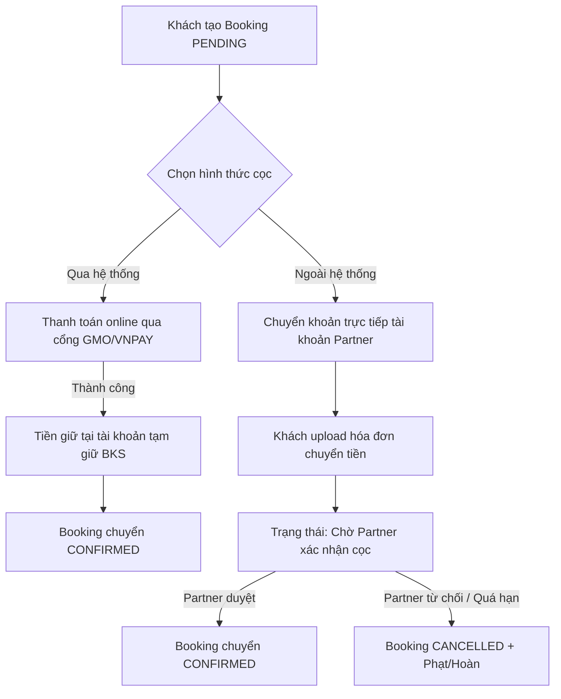
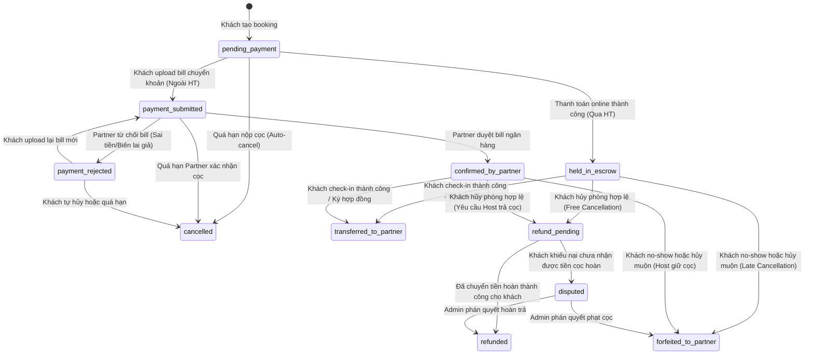

# Domain Review: Thiết kế Nghiệp vụ Đặt cọc Online (Qua hệ thống & Ngoài hệ thống)

> [!NOTE]  
> **TẬP TRUNG VÀO TRẢI NGHIỆM ĐỌC (Behavioral Psychology Optimization)**:
> - **Đọc lướt (Skimming - Tiết kiệm năng lượng):** Sử dụng các khung tóm tắt, bảng so sánh và sơ đồ quy trình trực quan để nắm thông tin trong 30 giây.
> - **Đọc sâu (Deep Dive - Tập trung chi tiết):** Sử dụng các khối thu gọn `
` giúp giấu đi chi tiết kỹ thuật phức tạp (Database Schema, Edge Cases, Code logic). Chỉ click mở khi cần tìm hiểu sâu, giảm quá tải nhận thức (Cognitive Overload).

---

## ⚡ 1. BẢNG ĐIỀU KHIỂN NHANH (EXECUTIVE SUMMARY)

| Chỉ số / Tiêu chí | Thông tin tổng quan (TL;DR) |
| :--- | :--- |
| **Khuyến nghị Domain** | 🟢 **ĐÃ DUYỆT CÓ ĐIỀU KIỆN** (Yêu cầu bổ sung các Business Rules thiết yếu bên dưới) |
| **Mục tiêu cốt lõi** | Chuẩn hóa luồng đặt cọc cho mô hình thuê trung - dài hạn (Căn hộ dịch vụ, homestay tháng) nhằm giảm tỷ lệ hủy phòng ảo và đảm bảo dòng tiền. |
| **Mô hình đề xuất** | Hỗ trợ song song: **Qua hệ thống** (Escrow - Tự động) & **Ngoài hệ thống** (Direct Transfer - Thủ công). |
| **Trạng thái thiết kế** | Tách biệt hoàn toàn trạng thái khoản cọc khỏi trạng thái Booking để tránh tranh chấp tài chính. |

---

## 2. BỐI CẢNH NGHIỆP VỤ ĐẶT CỌC

### 📌 Khái quát nhanh (Skim)
*   **Mục đích kép của cọc:** Giữ phòng tránh No-show + Bảo đảm hư hại tài sản/chi phí phát sinh lúc check-out.
*   **Khoảng trống hệ thống:** BKS đã có trường tiền cọc (`deposit_amount` trong `room_prices`) nhưng chưa có luồng thanh toán, vận hành và quản lý trạng thái thực tế.

<b>🔍 Xem chi tiết: Tầm quan trọng & Hiện trạng hệ thống</b>

#### 1. Vai trò của khoản cọc (Security Deposit)
Trong vận hành lưu trú ngắn hạn và trung-dài hạn (short & mid-term stay), khoản đặt cọc đóng vai trò kép:
1. **Đặt cọc giữ phòng (Booking Deposit/Guarantee):** Đảm bảo khách hàng sẽ thực sự check-in đúng hẹn, bù đắp chi phí cơ hội giữ phòng cho Host nếu khách no-show.
2. **Đặt cọc đảm bảo tài sản (Security Deposit):** Khoản tiền thế chấp phòng ngừa rủi ro hư hỏng trang thiết bị trong phòng, chi phí tiền điện nước phát sinh vượt định mức hoặc các dịch vụ phụ trợ chưa thanh toán lúc check-out.

#### 2. Sự cần thiết của mô hình đặt cọc online
Hiện tại, DB của BKS đã có trường `room_prices.deposit_amount` (số tiền cọc cấu hình theo từng gói giá phòng) và trường `rooms.deposit`. Tuy nhiên, luồng thanh toán và quản lý dòng tiền cọc này hoàn toàn trống:
- Khách đặt phòng trung hạn (Ví dụ: thuê căn hộ dịch vụ 3 tháng) thấy thông tin tiền cọc nhưng hệ thống không cung cấp cách thanh toán cọc.
- Chưa có trạng thái xác nhận "Đã nhận cọc", dẫn đến Partner không dám giữ chỗ (rủi ro booking ảo) hoặc Guest không yên tâm chuyển khoản trực tiếp bên ngoài hệ thống.

Để giải quyết triệt để, hệ thống cần hỗ trợ hai phương thức thanh toán cọc: **Qua hệ thống** (Platform Escrow) và **Ngoài hệ thống** (Direct Partner Transfer).

---

## 3. CHI TIẾT THIẾT KẾ HAI MÔ HÌNH ĐẶT CỌC

### 📌 Khái quát nhanh (Skim)
Hệ thống vận hành song song 2 luồng:
1. **Qua hệ thống (Escrow):** Tự động 100%, an tâm tuyệt đối cho khách, tiền nằm ở tài khoản tạm giữ của BKS.
2. **Ngoài hệ thống (Direct Transfer):** Partner nhận tiền trực tiếp, miễn phí giao dịch nhưng vận hành thủ công (upload bill và duyệt tay).

#### 📊 Bảng so sánh nhanh 2 mô hình

| Tiêu chí | Qua hệ thống (Online Escrow) | Ngoài hệ thống (Direct Partner Transfer) |
| :--- | :--- | :--- |
| **Bên nắm giữ tiền** | BKS Platform (Tài khoản tạm giữ) | Partner (Tài khoản cá nhân của Host) |
| **Phí giao dịch** | ~1.5% - 3% (Cổng thanh toán thu) | **Miễn phí** (Chuyển khoản Napas 24/7) |
| **Độ tin cậy (Guest)** | **Rất cao** (Không sợ bị Host giam cọc trái phép) | **Trung bình - Thấp** (Rủi ro bị lừa đảo/giam cọc) |
| **Khối lượng vận hành** | Tự động hóa 100% | Thủ công (Host check số dư, Guest chụp bill) |
| **Dòng tiền của Host** | Nhận sau khi đối soát kỳ (Chậm hơn) | Nhận ngay lập tức (Tối ưu vốn lưu động) |

<b>🔍 Xem chi tiết: Luồng nghiệp vụ cụ thể từng mô hình</b>

#### A. Đặt cọc Qua hệ thống (Escrow/Platform-held Model)
Mô hình này hoạt động như một bên trung gian bảo đảm (Escrow Agent), tiền của Guest được cổng thanh toán tự động thu giữ và nằm tại tài khoản ngân hàng của BKS Platform.

*   **Quy trình thanh toán (Payment flow):**
    1. Guest thực hiện đặt phòng thành công → Hệ thống redirect sang Cổng thanh toán (như GMO Credit Card, VNPay, Momo) để thực hiện thanh toán đúng số tiền cọc `deposit_amount` của gói giá đó.
    2. Cổng thanh toán trả về callback thành công → Hệ thống tự động chuyển trạng thái cọc thành `held_in_escrow` (Đã thu cọc tạm giữ) và chuyển trạng thái booking sang `CONFIRMED`.
*   **Giải ngân cho Partner (Payout flow):**
    *   Tiền cọc sẽ **tiếp tục được giữ** bởi hệ thống BKS trong suốt thời gian lưu trú để bảo vệ Guest chống lại các Host lừa đảo.
    *   Sau khi check-out hoàn tất (`bookings.status = COMPLETED` và `stay_status = checked_out`) + **Hợp đồng kết thúc không tranh chấp**, hệ thống sẽ cộng khoản cọc này vào bảng kê đối soát định kỳ (`partner_settlement_periods`) để chuyển khoản trả cho Partner cùng với doanh thu phòng (hoặc hoàn trả lại Guest nếu hợp đồng quy định cọc trả lại cho Guest thông qua hệ thống).
*   **Xử lý hủy phòng & Hoàn cọc (Refund flow):**
    *   Nếu Guest hủy phòng hợp lệ (nằm trong khung hủy miễn phí của Cancellation Policy): Hệ thống tự động ra lệnh cho cổng thanh toán hoàn trả cọc 100% về tài khoản/thẻ của Guest.
    *   Nếu Guest hủy muộn hoặc no-show: Tiền cọc tạm giữ chuyển sang trạng thái `forfeited_to_partner` (Bị phạt cọc). Số tiền này sẽ được chuyển cho Partner trong kỳ đối soát gần nhất sau khi đã trừ đi phí hoa hồng 5% nền tảng.

#### B. Đặt cọc Ngoài hệ thống (Direct-to-Partner Model)
Mô hình này dành cho các Partner tự vận hành và muốn nhận dòng tiền trực tiếp mà không thông qua cổng thanh toán trung gian, giúp giảm thiểu phí giao dịch ngân hàng.

*   **Quy trình thanh toán (Payment flow):**
    1. Khi đặt phòng, Guest chọn "Chuyển khoản trực tiếp cho Host". Hệ thống sẽ hiển thị thông tin tài khoản ngân hàng của Host (lấy từ bảng `partner_info` của chủ phòng hoặc thông tin tài khoản cấu hình riêng cho Property).
    2. Guest chuyển khoản bằng ứng dụng ngân hàng ngoài đời thực (thông qua mã QR động chứa số tài khoản, số tiền cọc, và nội dung CK chuẩn hóa: `BKS-DEPOSIT-{booking_code}`).
    3. Guest chụp ảnh giao dịch thành công (biên lai/bill chuyển tiền) và upload lên hệ thống BKS Stay. Trạng thái cọc chuyển sang `payment_submitted` (Đã nộp biên lai), trạng thái booking chuyển sang `PENDING_DEPOSIT_VERIFICATION`.
*   **Xác nhận cọc (Verification flow):**
    *   Partner nhận được thông báo biến động số dư tài khoản của mình + notification trên Partner Portal.
    *   Partner kiểm tra ảnh biên lai Guest gửi và số dư thực tế, sau đó click nút "Xác nhận đã nhận tiền" trên Portal.
    *   Sau khi xác nhận, trạng thái cọc chuyển sang `confirmed_by_partner` và booking tự động chuyển sang `CONFIRMED`.
    *   Host có quyền "Từ chối xác nhận" (nếu tiền chưa vào, sai số tiền hoặc biên lai giả). Booking sẽ được đưa về trạng thái chờ xử lý hoặc hủy bỏ.
*   **Xử lý hủy phòng & Hoàn cọc (Refund flow):**
    *   BKS **không giữ tiền**, do đó không thể hoàn tiền tự động.
    *   Khi có yêu cầu hủy phòng hợp lệ, hệ thống hiển thị thông báo yêu cầu Host chuyển khoản hoàn trả tiền cọc cho Guest ngoài hệ thống trong vòng 3 ngày làm việc.
    *   Sau khi Host chuyển khoản hoàn cọc ngoài hệ thống, Host phải upload ảnh biên lai hoàn cọc để Admin/Guest xác nhận và đóng booking. Nếu Host cố tình không hoàn, Guest có quyền nhấn nút "Khiếu nại/Dispute" để Admin can thiệp hạ listing của Host hoặc khóa tài khoản.

---

## 4. THIẾT KẾ TRẠNG THÁI KHOẢN CỌC (DEPOSIT STATE MACHINE)

### 📌 Khái quát nhanh (Skim)
Quản lý trạng thái cọc song hành với trạng thái Booking. Khởi đầu từ `pending_payment` chuyển dịch qua các pha thanh toán, kiểm tra, hoàn trả hoặc chuyển giao.

<b>🔍 Xem chi tiết: Giải nghĩa 10 trạng thái cốt lõi</b>

1.  `pending_payment`: Mặc định khi khởi tạo, khách chưa thanh toán cọc.
2.  `payment_submitted`: Khách đã tải lên biên lai chuyển khoản (áp dụng cho ngoài hệ thống).
3.  `held_in_escrow`: Tiền đã thanh toán online thành công và đang được giữ an toàn bởi hệ thống BKS.
4.  `confirmed_by_partner`: Host đã xác nhận nhận đủ tiền chuyển khoản ngoài hệ thống.
5.  `payment_rejected`: Hóa đơn bị Host từ chối do sai lệch thông tin hoặc giả mạo.
6.  `transferred_to_partner`: Tiền cọc được giải ngân cho Host khi hoàn tất check-in và ký hợp đồng.
7.  `refund_pending`: Đang chờ hoàn trả tiền cọc về cho khách (do hủy phòng đúng chính sách).
8.  `refunded`: Giao dịch hoàn trả cọc đã hoàn thành.
9.  `forfeited_to_partner`: Khách bị phạt cọc (do hủy muộn hoặc no-show) và chuyển tiền cho Host.
10. `disputed`: Tranh chấp xảy ra liên quan đến việc hoàn trả hoặc khấu trừ cọc (cần Admin giải quyết).

---

## 5. DATABASE SCHEMA ĐỀ XUẤT BỔ SUNG

### 📌 Khái quát nhanh (Skim)
Bổ sung 2 bảng dữ liệu để kiểm soát dòng tiền:
1.  `booking_deposits`: Quản lý thực thể đặt cọc liên kết trực tiếp với booking.
2.  `booking_deposit_receipts`: Lưu vết và lịch sử các biên lai chuyển tiền (tránh mất vết khi khách tải lên lại).

<b>🔍 Xem chi tiết: Đặc tả Schema chi tiết</b>

#### A. Bảng `booking_deposits` (Quản lý trạng thái & dòng tiền cọc)
*Ràng buộc Unique:* `booking_id` (Mỗi booking chỉ có duy nhất 1 bản ghi cọc).

| Tên cột | Kiểu dữ liệu | Ràng buộc | Mô tả nghiệp vụ |
| :--- | :--- | :--- | :--- |
| `id` | bigint | Primary Key | ID tự tăng |
| `booking_id` | bigint | FK -> `bookings.id` | Liên kết đến đơn đặt phòng |
| `amount` | decimal(15,2) | Not Null | Số tiền cọc cần thu (từ `room_prices.deposit_amount` lúc đặt) |
| `payment_model` | enum | Not Null | Hình thức cọc: `system` (Qua hệ thống), `direct` (Ngoài hệ thống) |
| `status` | string(30) | Not Null | Trạng thái cọc (xem chi tiết ở máy trạng thái) |
| `gateway_transaction_id` | string(100) | Nullable | Mã giao dịch từ GMO/VNPAY (nếu qua hệ thống) |
| `gateway_response` | text | Nullable | Lưu JSON log phản hồi từ cổng thanh toán để tra soát |
| `partner_verified_at` | timestamp | Nullable | Thời gian Host xác nhận đã nhận cọc (nếu ngoài hệ thống) |
| `partner_verified_by` | bigint | FK -> `users.id` | Host xác nhận duyệt cọc |
| `refunded_amount` | decimal(15,2) | Default: 0 | Số tiền thực tế hoàn trả cho khách (nếu hủy/trả phòng) |
| `refunded_at` | timestamp | Nullable | Thời điểm thực hiện hoàn tiền cọc |
| `forfeited_amount` | decimal(15,2) | Default: 0 | Số tiền phạt cọc giữ lại |
| `created_at` | timestamp | | |
| `updated_at` | timestamp | | |

#### B. Bảng `booking_deposit_receipts` (Minh chứng chuyển khoản ngoài hệ thống)

| Tên cột | Kiểu dữ liệu | Ràng buộc | Mô tả nghiệp vụ |
| :--- | :--- | :--- | :--- |
| `id` | bigint | Primary Key | ID tự tăng |
| `deposit_id` | bigint | FK -> `booking_deposits.id` | Liên kết đến bản ghi đặt cọc |
| `receipt_image_path` | string(255) | Not Null | Đường dẫn ảnh biên lai chuyển tiền (Cloudinary/S3) |
| `sender_name` | string(100) | Nullable | Tên người chuyển khoản (khách nhập để đối chiếu) |
| `sender_bank_name` | string(100) | Nullable | Ngân hàng chuyển đi |
| `transaction_time` | datetime | Nullable | Thời gian giao dịch trên biên lai |
| `rejection_reason` | string(255) | Nullable | Lý do từ chối duyệt biên lai của Partner (nếu có) |
| `created_at` | timestamp | | |

---

## 6. HOSPITALITY BUSINESS RULES & STANDARDS (QUY TẮC NGÀNH)

### 📌 Khái quát nhanh (Skim)
> [!IMPORTANT]  
> Các quy tắc mang tính sống còn đối với tỷ lệ lấp phòng và an toàn vận hành:
> 1.  **Thỏa thuận Đặt cọc Nhất quán (Consistent Agreement):** Thiết lập 3 cấp độ ràng buộc (ToS Platform -> Click-wrap tại tin đăng -> Hợp đồng thuê dài hạn) để hợp pháp hóa việc thu cọc, cấm Host đòi cọc tự phát ngoài hệ thống.
> 2.  **Thời gian gia hạn (Grace Period):** Qua hệ thống: **30 phút** thanh toán | Ngoài hệ thống: **2 giờ** nộp bill (Buffer đêm: kéo dài đến 9h sáng hôm sau).
> 3.  **Khóa check-in:** Không cho phép check-in vật lý nếu chưa xác nhận cọc **VÀ** chưa ký hợp đồng thuê nhà điện tử.
> 4.  **Hoàn cọc/Phạt cọc:** Tự động hoàn qua hệ thống; yêu cầu hoàn trong 3 ngày làm việc đối với ngoài hệ thống.
> 5.  **Khấu trừ tài sản (Check-out):** Yêu cầu minh chứng hình ảnh/video; giải phóng cọc tự động sau 48h nếu Host không khiếu nại hao tổn.

<b>🔍 Xem chi tiết: Nội dung & Lý giải quy tắc nghiệp vụ</b>

#### 1. Chính sách Thỏa thuận Đặt cọc Nhất quán (Consistent Deposit Agreement Framework)
Để đảm bảo tính pháp lý và tránh các tranh chấp tự phát (Host tự đòi thêm cọc, Guest đòi hoàn cọc vô lý), hệ thống áp dụng cơ chế thỏa thuận 3 cấp độ:
*   **Cấp độ 1: Điều khoản dịch vụ nền tảng (ToS - Platform Level):** 
    Khi đăng ký tài khoản, cả Guest và Partner phải đồng ý với ToS của BKS. Trong đó quy định: BKS là bên trung gian cung cấp công nghệ; tiền cọc qua hệ thống được tạm giữ (Escrow) theo quy tắc của sàn; các giao dịch ngoài hệ thống do hai bên tự chịu trách nhiệm nhưng phải tuân thủ chính sách hủy của sàn.
*   **Cấp độ 2: Thỏa thuận Click-wrap (Click-wrap Agreement - Property Level):**
    *   Partner cấu hình chính sách cọc (số tiền, điều kiện hoàn/phạt) trực tiếp trên trang quản lý phòng.
    *   Khi Guest đặt phòng, UI hiển thị rõ ràng: *"Bằng việc bấm đặt phòng, bạn đồng ý với Chính sách đặt cọc [Số tiền cọc] và Điều khoản hủy phòng của Host"*. Việc Guest bấm nút xác nhận tạo thành một thỏa thuận điện tử có hiệu lực ngay lập tức.
    *   **Quy tắc nhất quán:** Cấm Partner tự ý thay đổi số tiền cọc hoặc đòi thêm cọc khác với cấu hình hiển thị trên hệ thống. Mọi thay đổi về tiền cọc phải được phản ánh trên hệ thống (thông qua chức năng Điều chỉnh đặt phòng - Booking Modification) dưới sự đồng thuận của cả 2 bên. Nếu Partner tự ý thu cọc sai lệch ngoài hệ thống mà không khai báo, Guest có quyền báo cáo và BKS sẽ chế tài Partner (hạ tin đăng, khóa tài khoản).
*   **Cấp độ 3: Hợp đồng Thuê nhà Điện tử (Formal Lease Contract - Booking Level):**
    *   Đối với lưu trú trung-dài hạn (thời gian thuê >= 28 ngày), sau khi đóng cọc thành công, hệ thống tự động sinh Hợp đồng thuê nhà điện tử dựa trên dữ liệu Booking.
    *   Hợp đồng này là văn bản pháp lý chính thức quy định chi tiết: Mục đích cọc (bảo đảm tài sản, không phải tiền thuê), điều kiện khấu trừ khi check-out, và thời hạn hoàn cọc. Hai bên ký số trước khi Check-in.

#### 2. Quy định thời hạn nộp cọc (Deposit Grace Period)
*   **Nguyên lý vận hành:** Để tránh tình trạng khách hàng ảo giữ phòng quá lâu mà không đóng cọc làm giảm công suất buồng (occupancy rate) của cơ sở, hệ thống bắt buộc quy định thời gian tối đa để hoàn tất đóng cọc.
*   **Quy tắc hệ thống:**
    *   **Đặt cọc qua hệ thống:** Khách hàng có **30 phút** kể từ lúc tạo đơn `PENDING` để hoàn tất thanh toán online. Quá 30 phút cổng thanh toán chưa phản hồi thành công → Hệ thống tự động chuyển trạng thái booking sang `CANCELLED` với lý do "Quá hạn thanh toán đặt cọc".
    *   **Đặt cọc ngoài hệ thống:** Khách hàng có **2 giờ** để chuyển khoản và upload ảnh biên lai giao dịch. Quá 2 giờ chưa upload biên lai → Hệ thống tự động cancel đơn.
    *   **Khung giờ ban đêm (Night Audit buffer):** Nếu booking được tạo trong khoảng 23:00 - 06:00 sáng hôm sau, thời gian chờ nộp biên lai ngoài hệ thống được kéo dài đến **09:00 sáng** cùng ngày để tránh phiền toái cho khách.

#### 3. Khớp nối với Hợp đồng điện tử (Contract Signing)
Trong quy trình thuê trung và dài hạn, việc ký hợp đồng thuê nhà (`contracts` table) và đóng tiền cọc là 2 bước ràng buộc pháp lý chặt chẽ:
*   **Trình tự chuẩn nghiệp vụ:**
    1. Guest đặt phòng → Trạng thái booking: `PENDING`.
    2. Guest đóng tiền cọc thành công (Qua/Ngoài hệ thống) → Tiền cọc chuyển sang `held_in_escrow` hoặc `confirmed_by_partner`. Booking chuyển thành `CONFIRMED`.
    3. Hệ thống sinh Hợp đồng điện tử (`contracts.status = 0 - Pending`).
    4. Guest & Partner thực hiện ký hợp đồng điện tử → Hợp đồng chuyển thành `Signed` (1).
    5. Tại ngày bắt đầu thuê (`start_date`), khách đến nhận phòng vật lý và Host thực hiện check-in trên Portal → Trạng thái booking chuyển sang `stay_status = checked_in`. Tiền cọc được khóa lại phục vụ bảo đảm tài sản.
    6. **Ràng buộc cứng:** Không cho phép Host thực hiện check-in (`handleCheckIn`) nếu trạng thái hợp đồng chưa đạt `Signed` (1) **VÀ** trạng thái cọc chưa đạt `held_in_escrow` hoặc `confirmed_by_partner`.

#### 4. Chính sách hoàn trả & phạt cọc (Refund & Forfeiture Policies)
*   **Hủy phòng trước ngày check-in (Cancellation before stay):**
    *   Tham chiếu chính sách hủy phòng (`cancellation_policy_tiers`) gắn liền với booking.
    *   *Ví dụ:* Chính sách quy định "Hủy trước 7 ngày miễn phí hoàn 100% cọc".
    *   Nếu hủy hợp lệ (Miễn phí): Tiền cọc tạm giữ qua hệ thống được hoàn tự động cho Guest. Đối với cọc ngoài hệ thống, Partner bắt buộc phải hoàn trong vòng 3 ngày làm việc.
    *   Nếu hủy muộn (Tính phí phạt): Khấu trừ tiền phạt hủy tương ứng từ khoản cọc. Nếu phạt 100% cọc, tiền cọc chuyển sang `forfeited_to_partner`.
*   **Tranh chấp cọc ngoài hệ thống (Direct Payment Dispute Handling):**
    *   Nếu Host từ chối hoàn cọc ngoài hệ thống cho khách dù khách hủy phòng đúng chính sách hợp lệ: Guest có quyền gửi yêu cầu giải quyết tranh chấp (Dispute) lên BKS.
    *   Admin BKS sẽ kiểm tra lịch sử hủy, nếu Host sai phạm, Admin có quyền trừ tiền trong kỳ đối soát doanh thu phòng tiếp theo của Host đó để trả lại cho Guest, hoặc khóa tài khoản Host nếu tái diễn.

#### 5. Khấu trừ cọc khi check-out (Deduction Audit)
*   Tại ngày check-out (`end_date`), Host kiểm tra phòng vật lý (Room Inspection).
*   Nếu có hao tổn tài sản (ví dụ: làm hỏng tivi, vỡ cửa kính) hoặc phát sinh tiền điện nước vượt định mức:
    *   Host tạo một phiếu **"Yêu cầu khấu trừ cọc"** trên Partner Portal, nhập số tiền khấu trừ và upload ảnh chụp hiện trạng hỏng hóc làm bằng chứng.
    *   *Trường hợp cọc Qua hệ thống:* Hệ thống sẽ gửi yêu cầu duyệt cho Guest. Nếu Guest đồng ý hoặc quá 48h không phản hồi, hệ thống giải ngân tiền cọc đã trừ hao tổn cho Host, số còn lại hoàn trả vào thẻ của Guest. Nếu Guest từ chối, vụ việc chuyển cho Admin phân xử.
    *   *Trường hợp cọc Ngoài hệ thống:* Host tự thực hiện chuyển khoản trả lại Guest số tiền sau khi trừ hao tổn, kèm theo bảng kê chi tiết gửi qua hệ thống.

---

## 7. GAP ANALYSIS (DOMAIN PERSPECTIVE)

### 📌 Khái quát nhanh (Skim)
*   **Lỗ hổng 1:** Không có sổ cái đặt cọc (Deposit Ledger Gap) -> Khắc phục: Thêm bảng `booking_deposits`.
*   **Lỗ hổng 2:** Cho phép Check-in khi chưa đóng cọc -> Khắc phục: Gate check trong API check-in.
*   **Lỗ hổng 3:** Không có cơ chế tự động giải phóng cọc -> Khắc phục: Auto-release cọc sau 48 giờ check-out.

<b>🔍 Xem chi tiết: Phân tích rủi ro & Khuyến nghị kỹ thuật</b>

#### A. Sự thiếu hụt bảng quản lý thực thể Đặt cọc (Deposit Ledger Gap)
*   **Rủi ro kinh doanh:** Hiện tại hệ thống coi tiền cọc chỉ là một thông số giá phòng hiển thị trên UI. Nếu không có bảng `booking_deposits` riêng, hệ thống không thể lưu trữ thông tin giao dịch ngân hàng, ảnh hóa đơn, trạng thái hoàn cọc, dẫn đến kế toán Admin hoàn toàn "mù" về dòng tiền cọc đang nắm giữ hoặc dòng tiền cọc Host đang nhận trực tiếp.
*   **Khuyến nghị:** Tạo ngay bảng `booking_deposits` và `booking_deposit_receipts` như thiết kế ở [mục 5](#5-database-schema-đề-xuất-bổ-sung).

#### B. Lỗi thiết kế check-in khi chưa đóng cọc
*   **Rủi ro kinh doanh:** Code `handleCheckIn` hiện tại trong `BookingService.php` chỉ kiểm tra booking có trạng thái `CONFIRMED` hay không, mà không quan tâm cọc đã thanh toán thực tế chưa. Host có thể vô tình hoặc cố ý check-in cho khách khi chưa có dòng tiền cọc đảm bảo, dẫn đến nguy cơ mất cọc giữ phòng và cọc tài sản khi có sự cố hư hỏng.
*   **Khuyến nghị:** Thêm bước kiểm tra nghiêm ngặt (gate check) trong `handleCheckIn`: `booking_deposits.status` bắt buộc phải là `held_in_escrow` hoặc `confirmed_by_partner`.

#### C. Thiếu cơ chế tự động giải phóng cọc khi check-out (Auto-release Escrow Gap)
*   **Rủi ro kinh doanh:** Tiền cọc Qua hệ thống bị giữ trong tài khoản BKS vô thời hạn nếu Host quên không bấm check-out hoặc không hoàn cọc trên hệ thống. Guest bị giam tiền lâu sẽ khiếu nại làm giảm uy tín nền tảng.
*   **Khuyến nghị:** Cài đặt lệnh tự động giải phóng cọc (Auto-release) sau `end_date + 48 giờ` nếu Host không tạo phiếu yêu cầu khấu trừ tài sản. Tiền cọc sẽ tự động hoàn trả cho Guest 100%.

---

## 8. PHÂN CÔNG PHỐI HỢP & KỊCH BẢN UAT

### 📌 Khái quát nhanh (Skim)
*   **BA:** Định nghĩa PRD màn hình tải/duyệt hóa đơn, cấu hình email/notification.
*   **Tester:** Thực thi bộ kịch bản UAT (được thu gọn bên dưới).
*   **Developer:** Viết Migration DB, cài đặt Job tự động quét thời gian gia hạn, tích hợp API thanh toán.

<b>🔍 Xem chi tiết: Bản phân công công việc & Kịch bản kiểm thử</b>

#### A. Phân công hành động (Collaboration Action Items)
*   **For Business Analyst (BA):**
    1.  **Cập nhật PRD & User Stories:** Đặc tả chi tiết màn hình tải biên lai cọc của Guest và màn hình duyệt biên lai của Host.
    2.  **Thông tin thông báo:** Cấu hình push-notification/email khi có sự thay đổi trạng thái khoản cọc.
    3.  **Tích hợp hợp đồng:** Đưa các điều khoản cọc vào mẫu Hợp đồng điện tử.
*   **For Developers:**
    1.  **Database Migrations:** Viết mã tạo bảng `booking_deposits` và `booking_deposit_receipts`.
    2.  **Job Schedulers (Cron Jobs):** Job quét hủy booking quá hạn (30 phút online / 2 giờ offline); Job auto-release cọc sau 48h check-out.
    3.  **Refactor Booking Flow:** Chỉnh sửa api tạo booking để tự động sinh bản ghi trong `booking_deposits`.
    4.  **Payment Gateway integration:** Tích hợp webhook xử lý dòng tiền cọc online (GMO/VNPAY).

#### B. Kịch bản kiểm thử (UAT Test Cases)

| Mã UAT | Kịch bản kiểm thử | Kết quả mong đợi |
| :--- | :--- | :--- |
| **UAT-DEP-01** | Chọn cọc online nhưng tắt trình duyệt giữa chừng | Trạng thái cọc giữ nguyên `pending_payment`. Quá 30 phút hệ thống tự động hủy booking (`CANCELLED`). |
| **UAT-DEP-02** | Chọn cọc trực tiếp, upload ảnh chuyển khoản thành công | Cọc sang `payment_submitted`. Booking sang `PENDING_DEPOSIT_VERIFICATION`. Host nhận tin nhắn báo duyệt. |
| **UAT-DEP-03** | Host từ chối hóa đơn cọc của Guest do sai số tiền chuyển | Cọc sang `payment_rejected`. Hệ thống thông báo yêu cầu Guest nộp lại bill chính xác. |
| **UAT-DEP-04** | Host bấm "Xác nhận nhận cọc" (Ngoài hệ thống) | Cọc sang `confirmed_by_partner`. Booking chuyển sang `CONFIRMED`. Cho phép kích hoạt tạo hợp đồng thuê. |
| **UAT-DEP-05** | Hủy phòng đúng hạn miễn phí hủy (Đơn cọc online) | Hệ thống tự động hoàn cọc 100% về ví/thẻ của Guest. Trạng thái cọc chuyển thành `refunded`. |
| **UAT-DEP-06** | Host cố gắng bấm Check-in khi cọc vẫn là `pending_payment` | Hệ thống báo lỗi, chặn hành động check-in. |

---

## 9. EDGE CASES & GIẢI PHÁP NGHIỆP VỤ (CÁC TÌNH HUỐNG BIÊN)

### 📌 Khái quát nhanh (Skim)
> [!WARNING]  
> Các tình huống đặc biệt cần giải quyết triệt để trên ứng dụng thực tế để tránh tranh chấp:
> - **Host cố tình gian lận cọc trực tiếp:** Cho phép khách hàng gửi tranh chấp (Dispute) lên BKS.
> - **Trừ tiền check-out vô lý:** Yêu cầu Host cung cấp hình ảnh/video bằng chứng làm trọng tài phân xử.
> - **Khách chuyển khoản sai số tiền:** Cho phép Host duyệt "Nhận một phần cọc" và đóng nốt khi check-in.
> - **Nghẽn cổng thanh toán:** Chuyển trạng thái tạm giữ và tự động xử lý/hoàn tiền lại nếu phòng đã bị đặt mất.

<b>🔍 Xem chi tiết: 5 kịch bản xử lý lỗi biên</b>

#### A. Tiêu cực & Gian lận phía Partner
*   **Tình huống A1: Host nhận tiền ngoài hệ thống nhưng bấm "Từ chối xác nhận"**
    *   *Hậu quả:* Chiếm đoạt tiền cọc của khách hàng.
    *   *Giải pháp:* Hệ thống không hủy booking ngay mà chuyển sang trạng thái chờ xử lý tranh chấp. Khách hàng bấm "Yêu cầu Admin phân xử", gửi minh chứng hóa đơn cho CSKH Admin để can thiệp duyệt tay hoặc phạt Host.
*   **Tình huống A2: Host tự ý khấu trừ 100% tiền cọc tài sản với lý do hỏng hóc vô căn cứ khi check-out**
    *   *Hậu quả:* Gây thiệt hại và bức xúc cho khách hàng.
    *   *Giải pháp:* Bắt buộc Host phải upload ảnh chụp hiện trạng hỏng hóc + biên bản lúc bàn giao. Khách hàng có 48h để duyệt hoặc từ chối khấu trừ. Nếu từ chối, khoản cọc chuyển sang trạng thái `disputed` để Admin vào làm trọng tài phân xử.

#### B. Nhầm lẫn & Lỗi vận hành phía Guest/Partner
*   **Tình huống B1: Khách hàng chuyển khoản sai số tiền cọc quy định (Thiếu tiền)**
    *   *Hậu quả:* Thiếu bảo đảm tài sản cho phòng.
    *   *Giải pháp:* Khi duyệt bill, Host nhập số tiền thực tế nhận được. Nếu thiếu, Host chọn "Xác nhận nhận một phần cọc". Đơn chuyển sang `CONFIRMED_PARTIAL_DEPOSIT`, yêu cầu khách nộp nốt tiền mặt khi check-in.
*   **Tình huống B2: Khách hàng chuyển khoản ngoài hệ thống nhưng quên không chụp/mất hóa đơn**
    *   *Hậu quả:* Đơn bị tự động hủy sau 2 giờ do thiếu bill.
    *   *Giải pháp:* Cung cấp tính năng "Tra cứu giao dịch thủ công". Guest nhập Mã tham chiếu giao dịch (Transaction ID) và tên người chuyển. Host nhận thông tin và tự kiểm tra sao kê để bấm duyệt thủ công mà không cần ảnh chụp bill.

#### C. Ranh giới thời gian & Kỹ thuật thanh toán
*   **Tình huống C1: Chuyển khoản thường qua đêm bị trễ (Liên ngân hàng chậm)**
    *   *Hậu quả:* Khách đã chuyển nhưng Host chưa thấy tiền, dẫn đến hủy đơn oan.
    *   *Giải pháp:* Tích hợp mã VietQR Napas 247 để chuyển tiền tức thì. Nếu dùng chuyển thường, khách tick vào ô "Chuyển khoản thường". Hệ thống sẽ kéo dài thời gian chờ xác nhận cọc lên **24 giờ** thay vì 2 giờ.
*   **Tình huống C2: Cổng thanh toán phản hồi thành công muộn (Gateway callback delay)**
    *   *Hậu quả:* Hệ thống đã tự động hủy phòng sau 30 phút, sau đó mới nhận được tiền cọc.
    *   *Giải pháp:* Nếu nhận được callback thành công cho đơn đã hủy: Tự động chuyển cọc sang `held_in_escrow`, tự động tạo lại đơn phòng tương tự cho khách (nếu phòng trống) hoặc tự động hoàn trả 100% cọc (nếu phòng đã có người khác thuê) kèm email xin lỗi.

---

**Sign-off Signature:** Senior Hospitality & Accommodation Domain Expert  
**Date:** 2026-05-31
